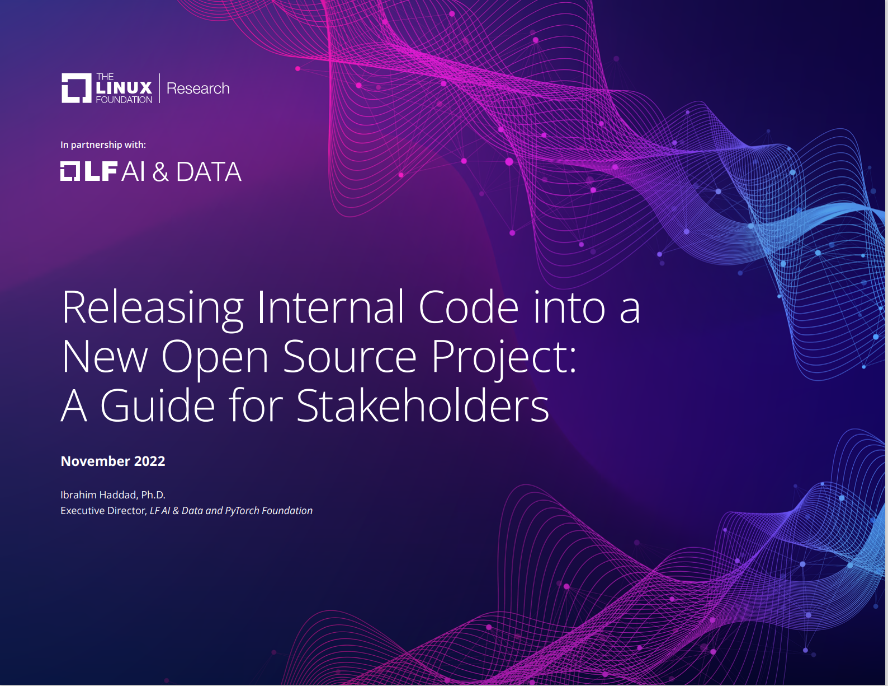
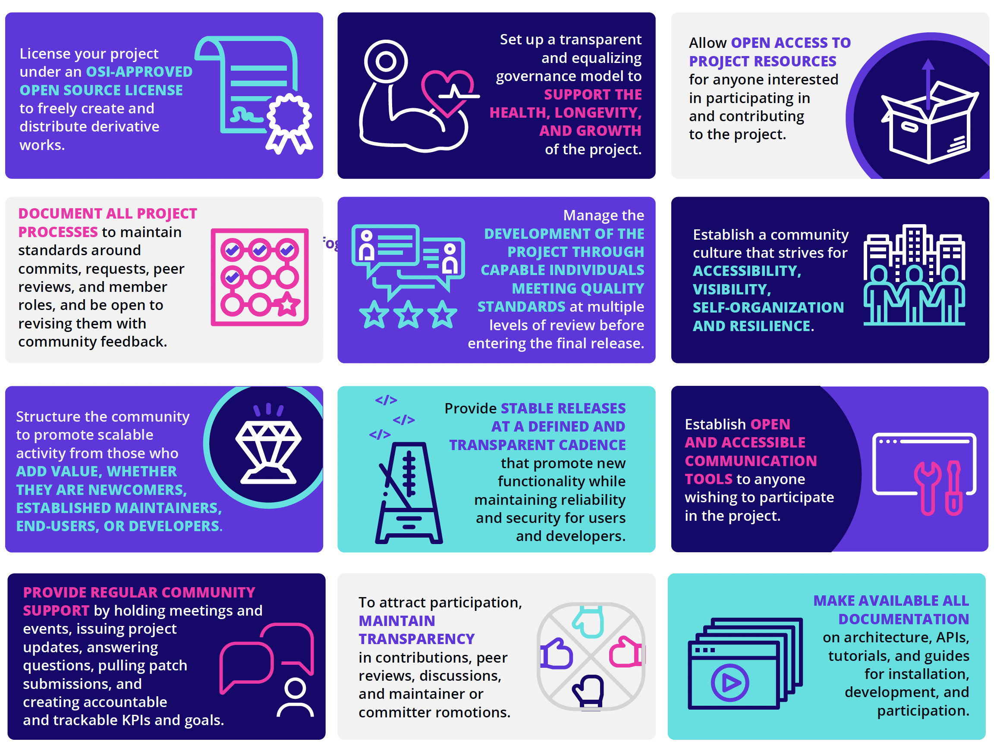

**In partnership with:**
**联合：**

Releasing Internal Code into a New Open Source Project:

A Guide for Stakeholders

将内部代码发布为一个新的开源项目：

干系人指南

**November 2022**
**2022年11月**

Ibrahim Haddad, Ph.D.

Executive Director, *LF AI & Data and PyTorch Foundation*

Ibrahim Haddad 博士

*LF AI & Ddata 和 PyTorch 基金会*  执行董事

**Contents**
**内容目录**

[Infographic 4](#document-all-project)

[Abstract 5](#abstract)

[Introduction 6](#introduction)

[Initial investigations 8](#initial-investigations)

[Make the business case to open source 8](#initial-investigations)

[Evaluate possible ways to open source 8](#initial-investigations)

[Project funding 9](#project-funding)

[Legal considerations 9](#project-funding)

[Confirm ownership of all the code 9](#project-funding)

[Conduct intellectual property review
10](#conduct-intellectual-property-review)

[Choose the open source license
10](#conduct-intellectual-property-review)

[Apply license terms to the code 11](#dco)

[Code clean-up 11](#dco)

[Project branding 12](#project-branding)

[Develop a trademark strategy and policy 12](#project-branding)

[Domain names 12](#project-branding)

[Creative assets 12](#project-branding)

[Register external accounts 12](#project-branding)

[Develop a certification/compliance strategy 12](#project-branding)

[Recruit business partners 12](#project-branding)

[Establish project governance 13](#establish-project-governance)

[Set up project infrastructure 14](#set-up-project-infrastructure)

[Apply recommended practices for your GitHub repo
14](#set-up-project-infrastructure)

[Project launch 15](#project-launch)

[Prepare the announcement 15](#project-launch)

[Press and analyst relations 15](#project-launch)

[Announce and launch the project 15](#project-launch)

[Summary of recommended practices for running an open source project
16](#summary-of-recommended-practices-for-running-an-open-source-project)

[License
16](#summary-of-recommended-practices-for-running-an-open-source-project)

[Governance
16](#summary-of-recommended-practices-for-running-an-open-source-project)

[Access
16](#summary-of-recommended-practices-for-running-an-open-source-project)

[Processes
16](#summary-of-recommended-practices-for-running-an-open-source-project)

[Development
16](#summary-of-recommended-practices-for-running-an-open-source-project)

[Community
16](#summary-of-recommended-practices-for-running-an-open-source-project)

[Community structure
16](#summary-of-recommended-practices-for-running-an-open-source-project)

[Releases 17](#_bookmark12)

[Communication tools 17](#_bookmark12)

[Transparency 17](#_bookmark12)

[Documentation 17](#_bookmark12)

[Ongoing support 18](#ongoing-support)

[Support the community 18](#ongoing-support)

[Support project infrastructure 18](#ongoing-support)

[Endnotes 18](#ongoing-support)

[信息图 4](#document-all-project)

[摘要 5](#abstract)

[概述 6](#introduction)

[前期调查 8](#initial-investigations)

[开源商业方案 8](#initial-investigations)

[评估可能的开源方式 8](#initial-investigations)

[项目资金 9](#project-funding)

[法律考虑 9](#project-funding)

[确认代码所有权 9](#project-funding)

[进行知识产权审查 10](#conduct-intellectual-property-review)

[选择开源许可证 10](#conduct-intellectual-property-review)

[应用许可证条款到代码 11](#dco)

[清理代码 11](#dco)

[项目品牌 12](#project-branding)

[制定商标战略和政策 12](#project-branding)

[域名 12](#project-branding)

[创意资产 12](#project-branding)

[注册外部账户 12](#project-branding)

[制定认证/合规策略 12](#project-branding)

[招募商业伙伴 12](#project-branding)

[建立项目治理制度 13](#establish-project-governance)

[建立项目基础设施 14](#set-up-project-infrastructure)

[为你的 GitHub 仓库应用推荐做法 14](#set-up-project-infrastructure)

[项目启动 15](#project-launch)

[准备公告 15](#project-launch)

[媒体和分析师关系 15](#project-launch)

[宣布并启动项目 15](#project-launch)

[运营一个开源项目的实践经验 16](#summary-of-recommended-practices-for-running-an-open-source-project)

[开源协议使用 16](#summary-of-recommended-practices-for-running-an-open-source-project)

[治理模型 16](#summary-of-recommended-practices-for-running-an-open-source-project)

[使用权 16](#summary-of-recommended-practices-for-running-an-open-source-project)

[流程 16](#summary-of-recommended-practices-for-running-an-open-source-project)

[项目发展 16](#summary-of-recommended-practices-for-running-an-open-source-project)

[社区运营 16](#summary-of-recommended-practices-for-running-an-open-source-project)

[社区结构 16](#summary-of-recommended-practices-for-running-an-open-source-project)

[版本发布 17](#_bookmark12)

[沟通工具 17](#_bookmark12)

[透明度 17](#_bookmark12)

[文档工作 17](#_bookmark12)

[持续支持 18](#ongoing-support)

[支持社区 18](#ongoing-support)

[支持项目基础设施 18](#ongoing-support)

[尾注 18](#ongoing-support)

|   |   |   |
| ---- | ---- | ---- |
| License your project under an OSI-APPROVED OPEN SOURCE LICENSE to freely create and distribute derivative works.  根据**OSI批准的开放源代码许可证**来许可你的项目以自由创建和分发衍生品。 |  Set up a transparent and equalizing governance model to SUPPORT THE HEALTH, LONGEVITY, AND GROWTH of the project.  建立一个透明平等的治理模式，以**支持项目健康、长期发展和增长**。 |  Allow OPEN ACCESS TO PROJECT RESOURCES for anyone interested in participating in and contributing to the project. 允许任何有兴趣参与项目且做出贡献的人**公开访问项目资源**。 |
| DOCUMENT ALL PROJECT PROCESSES to maintain standards around commits, requests, peer reviews, and member roles, and be open to revising them with community feedback.    **记录所有项目过程**，以维护有关提交、请求、同行评审和成员角色的相关标准，并对基于社区反馈的修订保持开放。 | Manage the DEVELOPMENT OF THE PROJECT THROUGH CAPABLE INDIVIDUALS MEETING QUALITY STANDARDS at multiple levels of review before entering the final release.    在进入最终版本前，通过满足质量标准的合格人员进行多级审校来管理项目开发。 | Establish a community culture that strives for ACCESSIBILITY, VISIBILITY, SELF-ORGANIZATION AND RESILIENCE.   建设社区文化，努力实现**可访问性、可见性、自组织性和弹性**。 |
| Structure the community to promote scalable activity from those who ADD VALUE, WHETHER THEY ARE NEWCOMERS, ESTABLISHED MAINTAINERS, END-USERS, OR DEVELOPERS.   构建社区来为**贡献价值的人**推广扩展活动，**无论他们是新人、固定维护人员、最终用户还是开发者**。 | Provide STABLE RELEASES AT A DEFINED AND TRANSPARENT CADENCE that promote new functionality while maintaining reliability and security for users and developers.    **以明确和透明的节奏稳定发布**，以推广新功能，同时为用户和开发人员维持可靠性和安全性。 | Establish OPEN AND ACCESSIBLE COMMUNICATION TOOLS to anyone wishing to participate in the project.    为任何希望参与项目的人提供**开放和可访问的沟通工具**。 |
| PROVIDE REGULAR COMMUNITY SUPPORT by holding meetings and events, issuing project updates, answering questions, pulling patch submissions, and creating accountable and trackable KPIs and goals.    通过召开会议和活动、发布项目更新、回答问题、提交补丁以及创建可度量可追踪的KPI目标，**定期提供社区支持**。 | To attract participation, MAINTAIN TRANSPARENCY in contributions, peer reviews, discussions, and maintainer or committer romotions.   为了吸引参与者，在贡献、同行评审、讨论和维护者或提交者宣传中**保持透明度**。| MAKE AVAILABLE ALL DOCUMENTATION on architecture, APIs, tutorials, and guides for installation, development, and participation.    **公开所有文档**，包括架构、API、教程以及安装、开发和参与指南。 |
