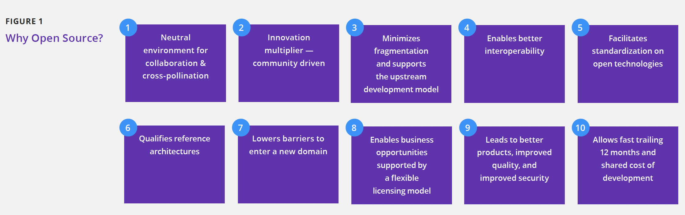
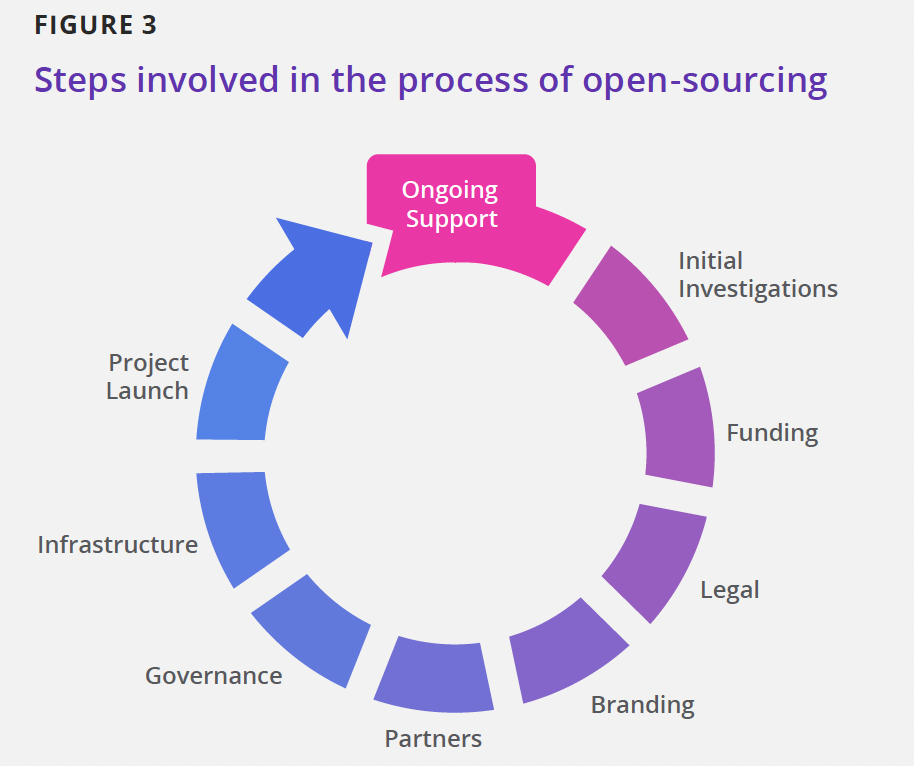

Introduction 概述
============

Open source software (OSS) has been shifting the software industry
into a new paradigm, moving from developing propri- etary code behind
closed doors to developing code that parties can share, modify, and
redistribute openly. The key benefits

of this shift include reducing development costs and software
component complexity, developing reusable, common, off-the- shelf
software assets, increasing flexibility, and benefiting from the
innovation multiplier factor of community-driven development projects.
Organizations that embrace the open source model as

a positive means of building software will increase their chances of
retaining their competitive advantage. Figure 1 illustrates the

various strategic advantages that OSS offers to organizations adopting
it and contributing to it.

开源软件（OSS）一直在并将持续推动软件行业发展到一种新范式，从闭门开发专有代码，转向为开发各方可以公开共享、修改和重新分发的代码。这种转变的主要好处在于降低开发成本和软件组件复杂性，开发可复用的通用标准软件资产，提高灵活性，并受益于社区驱动开发项目带来的多重创新。组织将开源模式作为构建软件的积极手段，可以增加其保持竞争优势的机会。图 1 说明了开源软件为采纳和促进开源软件的组织所提供的各种战略优势。

During the previous two decades, organizations have realized the
benefits of using and contributing to open source projects in their
products and services. This has created a trend of organiza-

tions setting up Open Source Program Offices (OSPOs) to manage all
aspects of OSS, including the use of and compliance with OSS licenses,
contribution to OSS projects, and community-building around key OSS
technologies.

在过去的二十年中，企业组织已经意识到在其产品和服务中采纳和贡献开源项目的好处。这导致设立开源项目办公室（OSPO）成为一种趋势，组织通过它来管理开源软件的各个方面，包括开源软件许可证的使用和遵守、对开源软件项目的贡献以及围绕开源软件关键技术的社区建设。

**FIGURE 2**
** 图 2**

#### **Enterprise open source ladder**
#### **企业开源阶梯**

**CONTRIBUTOR**
**贡献者**

**PARTICIPANT**
**参与者**

**CONSUMER**
**消费者**

**FIGURE 3**
**图 3**

**LEADER**
**领导者**

Figure 2 illustrates four primary OSS enterprise strategies:
consumption of OSS, participa- tion, contribution, and leadership.
Each strategy requires an enterprise to succeed at the previous
strategy, and how far an organization advances depends entirely on the
enter- prise. Engineering drives the early strategies of consumption
and participation. Engineers use

various open source components for their technical merits to speed up
development, but they participate little in the projects that maintain
these components. Over time, higher levels of the organization learn
about the value of this OSS usage. As OSS gains traction, business
needs begin to drive such OSS involvement, and OSS efforts contribute
to a determined business strategy. Some companies achieve their goals
as consumers. Other companies see strategic advantages in other stages
of involvement and in most cases they set up an OSPO to oversee
strategic planning and execution through these stages.

图 2 说明了四种主要的OSS企业战略：OSS 消费、参与、贡献和领导。每一项战略都要求企业在前一项战略中取得成功，而组织的进步程度完全取决于企业。工程推动了消费和参与的早期战略。工程师使用各种开源组件以提高开发速度，但他们很少参与维护这些组件的项目。随着时间的推移，组织的高层了解到 OSS 使用的价值。随着 OSS 的发展，业务需求开始推动 OSS 的参与，OSS 的努力有助于确定业务战略。一些公司实现了作为消费者的目标。其他公司在参与的其他阶段看到了战略优势，在大多数情况下，他们设立了一个 OSPO 来监督这些阶段的战略规划和执行。

As part of the third stage---contributing to open
source---organizations often choose to contribute key proprietary
technologies to open source with various motivations, such as the
following:

作为第三阶段——贡献开源——的一部分，组织通常会以各种动机为开源贡献关键专有技术，例如：

-   Providing a reference implementation to a standard

-   Ensuring that critical software remains viable

-  为某个标准提供参考实现

- 确保关键软件持续可用

#### **Steps involved in the process of open-sourcing**
#### **开源过程的相关步骤**

**Ongoing Support**
**持续支持**

-   Undercutting the competition

-   Commoditizing a market

-   Partnering with others and promoting goodwill in the developer
    community
    
- 减少竞争

- 开辟商业化市场

- 与他人合作并提升在开发者社区的信誉

**Project Launch**
**项目发布**

**Infrastructure**
**基础设施**

**Governance**
**治理**

**Partners**
**合作伙伴**

**Initial Investigations**
**前期调查**

**Funding**
**资金支持**

**Legal**
**法务**

**Branding**
**品牌建设**

-   Driving market demand by building an ecosystem

-   Offering customers the ability to support themselves and add custom
    features
    
- 准确把握市场需求，构建上下游生态

- 支持客户自助服务及增加自定义功能

Open sourcing with the wrong motivation will often have a negative
effect on achieving the desired outcome and can disrupt the relation
of the enterprise with the communities of specific open source
projects.

带有错误动机的开源通常会对实现预期结果产生负面影响，并可能破坏企业与特定开源项目社区的关系。

This paper identifies questions to ask, practices to consider, and
steps to take when making a proprietary technology open source. Figure
3 illustrates the various steps involved in the process of open
sourcing internal code and launching it as an open source project.
These

{width="0.4586165791776028in"
height="8.522747156605424e-2in"}steps are not necessarily executed in
a linear order and several of them can be taking place in parallel.
Our goal with this paper is to provide a basic template that
organizations can adjust to accommodate their own policies and
strategies.

本文确定了在开源专有技术时要明确的问题、要考虑的实践以及要采取的具体步骤。图 3 说明了将内部代码发布为一个开源项目过程中涉及的各个步骤。

{width="0.4586165791776028in"
height="8.522747156605424e-2in"}这些步骤不一定按顺序逐个执行，其中一些步骤可以并行进行。本文的目标是提供一个基本模板，组织可以根据自己的政策和战略按需调整。

