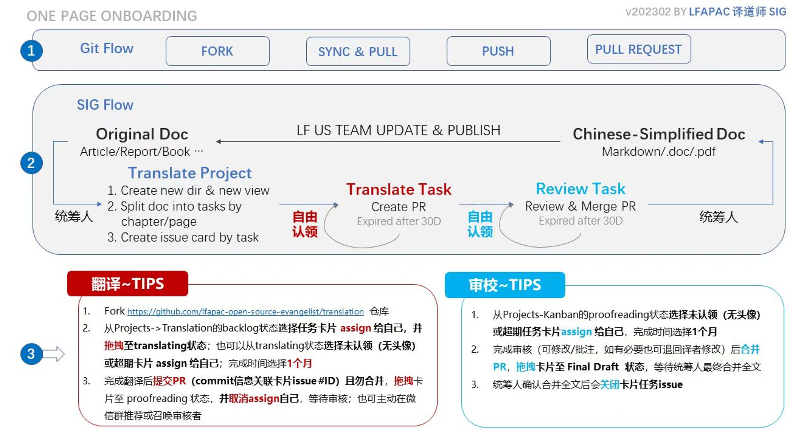

# 译道师 SIG

该仓库是记录LFAPAC 开源布道者译道师 SIG相关内容。

## 贡献者

## 2025 运营小组名单

1. 李明康 （小明） @nliver
2. 赵振华 @zRich
3. 赵梅 @terizhao
4. 杨振涛 @node 
5. 周冉 @JuliaZhou2022
6. 张立秋 @Francis-LQ

## Review 小组名单

1. 李明康 （小明） @nliver
2. 赵振华 @zRich
3. 赵梅 @terizhao
4. 杨振涛 @node 
5. 周冉 @JuliaZhou2022
6. 张立秋 @Francis-LQ
7. 滕召智 @freet15
8. 陈泳 @gzchenyong

## 2024 运营小组名单

1. 赵振华 @zRich
2. 赵梅 @terizhao
3. 杨振涛 @node 
5. 周冉 @JuliaZhou2022
6. 皮冰峰 @winterpi

## Review 小组名单

1. 赵振华 @zRich
2. 赵梅 @terizhao
3. 杨振涛 @node 
5. 周冉 @JuliaZhou2022
6. 皮冰峰 @winterpi

## 译道师SIG背景

LFAPAC 开源布道者译道师 SIG 英文LFAPAC Open Source Evangelist Translation SIG，是LFAPAC布道师团队下的翻译小组。本小组主要翻译开源相关的书籍、文章、报告等。

## 活跃志愿者

| 姓名    | English      | github           | 微信ID           | 微信昵称  | 擅长与兴趣                           | 单位         | email                    |
| ------ | ----------- | --------------- | --------------- | -------- | -------------------------------- | ------------ | ----------------------- |
| 赵振华 | Rich Zhao   | zRich           | richzhao        | 锐旗     | 区块链，开源合规与安全，项目运营 |              | zhao.zhenhua@gmail.com  |
| 皮冰锋 | Winter Pi   | winterpi        | 19688624        | bingfeng | 区块链，数字身份DID，隐私计算    |              | pi.bingfeng@gmail.com   |
| 阎书利 | Shuli Yan   | T1YSL           | ysl201602430923 | 小怪兽   | 数据安全，开源数据库源码分析，信创|              | 13624113201@163.com     |
| 周冉   | Julia Zhou  | JuliaZhou2022   | JuliaZhou1816   | 如梦     |                                  |              | juliazhou2022@gmail.com |
| 徐斌   | Bruce Xu    | voidxb          | xb3150102384    | Bruce    |                                  |              | 2016165068@qq.com       |
| 马景贺 | Mike        | majinghe        | majinghe11      | 小马哥   |                                  | 极狐(GitLab) | devops008@sina.com      |
| 王玉茂 | Amelia      | Ameliawangyumao | amelia\_2020    | Amelia   |                                  | 华为         | ameliawang375@gmail.com |
| 王永雷 | Leo Wang    | wangleo61       | 15900935447     | 永雷     | 软件安全，开源治理                   | Synopsys      | wangleo61@outlook.com   |
| 全继安 | Paul Quan   |                 | 13570988065     | paul安   |                                  |              | 706309392@qq.com        |
| 滕召智 | Ben Teng    | freet15         | freet15         | Ben      |                                  |              | freet15@gmail.com       |
| 孙振华 | Zhenhua Sun | sunzhh02        | zhenhua-sun     | 振华     |                                  |              | zhenhua.alan@icloud.com |
| 刘洁   | Jie Liu     | arnuojo         | arnuojo         | arnuojo  |                                  |              | arnuojo@163.com         |
| 周黎   | ZHOU Li     | coolzhouly      | zhuiyue415      | 狸叔     | 信息安全，新基建，项目管理       |              | coolzhoulyAT163.com     |
| 刘晓斌 | Xiaobin Liu | lxbwolf         |                 |          |                                  |              | me@liuxb.email          |
|  赵梅   | Teri Zhao    |   terizhao   |    teri_zhao     |   小梅子   |    虚拟化，存储，项目管理，社区运营   |      VMware        |  terizhao@gmail.com                 |
| 杨振涛 | Chris Yang | node | nodexy | Chris杨子江 | DevOps,Search engine,OSPO| vivo | nodexy@gmail.com |
| 李明康 | Bright Li | nliver | Github_Li | 明说 | DevRel，开源运营，DevOps,OSPO | 开源社 | slibre@163.com |
| 琚攀攀 | Panpan Ju | cherrysx | fgnxpp | PPJ | HPC |  | 280056663@qq.com |
| 张晓辉 | Addo Zhang | addozhang | addo_zhang | 大头² Addo | 云原生、Kubernetes、微服务、DevOps| Flomesh | duwasai@gmail.com |
| 周琦 | Zoom Quiet | zoomquiet | zoomquiet | 大妈 | Pythonic/开发者关系/社区运营 | 101.camp | zoomquiet+lf@gmail.com |

## SIG例会

例会采用双周例会形式，在每隔一周的周四晚上8点，例如2023年1月19日。会议采用zoom线上形式，会议信息如下。

Topic: LFAPAC Open Source Evangelist - Translation SIG Meeting
Time: This is a recurring meeting Meet anytime

Join Zoom Meeting
<https://zoom.us/j/96925638178>

Meeting ID: 969 2563 8178
One tap mobile
+861053876330,,96925638178# China
+861087833177,,96925638178# China

你也可以将Google Calendar的[邀请 Invite.ics](attachments/invite.ics)导入自己的Google日历。

会议记录：

- 2023年[LF APAC 译道师会议记录](https://docs.qq.com/doc/DVVRMVklrWU9LUElV)

- 2022年[LFAPAC 开源布道者译道师会议记录](https://docs.qq.com/doc/DVWtzWE9vakxTYUdj)

## 志愿者招募

本SIG长期招募志愿者，有意参与的朋友可联系我们报名参加。
联系人：赵振华 微信ID：richzhao

## 待认领翻译任务
- [The State of Global Open Source 2025](https://www.linuxfoundation.org/hubfs/Research%20Reports/2025GlobalSpotlight_Oct-27-2025%20V4.pdf)
- [我要认领](https://github.com/lfapac-open-source-evangelist/translation/issues/434)

- [GNU General Public License: A Comprehensive Tutorial and Guide](attachments/Practical_GPL_Compliance_Digital.pdf)

[我要认领](gpl-compliance/practical_gpl_compliance/role_responsibilities.md)

- [Mentorship in Open Source](attachments/Mentorship-in-Open-Source.pdf)

[我要认领](Mentorship-in-open-source/role_responsibilities.md)

- [Managing OS Projects on Github](attachments/Managing-OS-Projects-on-Github.pdf)

[我要认领](https://github.com/orgs/lfapac-open-source-evangelist/projects/2)

- [State of Tech Talent Report 2023](attachments/Training-State-of-Tech-Talent-2023-Report.pdf)

[我要认领](https://github.com/orgs/lfapac-open-source-evangelist/projects/2)

## [译道师成就](SIG-Achievements-译道师成就.md)

## 术语

遇到不确定如何翻译的术语及时在群里和SIG会议上讨论。常见术语请参考[Glossary](glossary.md)

## 项目流程

## 要求

## 视频版

[视频版介绍](https://www.bilibili.com/video/BV16L411R72u/)

[赵振华公众号](https://mp.weixin.qq.com/s/cbWFXtfAYzXOGKaAvaR0aQ)

### 1. 完整

翻译时，必须把**全部**英文内容翻译成中文。对于正文来说，这很容易做到。但是，正文之外的内容很容易被忽视。

#### 1.1 图片

图片上的文字除了主体之外，有时还有标题、小标题、图示（Legend）、坐标轴等等上面的文字，除了文字有些图片还包含数字，这些是容易忽略翻译的部分。

#### 1.2 注

有的书籍采用脚注，把本页的注释放在页脚；有的采用尾注，将注释放在本章或书的末尾，不管采用哪种方式，注释的内容都需要翻译。

### 2. 中英文对照

我们采用中英文对照的方式翻译。原文在上，对应的译文在其后。对于一段一段的内容，按段对照翻译，即一段原文、一段译文。图片、表格等上面出现的文字，通常一句话表达一个完整的意思，这时按照句子对照翻译，一句原文，一句译文。

#### 列表

列表在Word排版时会自动跟随上一个列表项，这是如果中文紧跟英文序号很容易混乱。例如第1项为英文，跟着后面的译文会自动变成第2项。因此，对于列表，应该全部选项在前，翻译在后。

#### 2.1 排版

中英文对照排版，采用原文在上、译文在下。对于正文来说很容易理解、也很容易处理。对于图片、表格等，也要采用一上一下对照排版。原文在上、译文在下，并且原文与译文在一个单元格内。

### 3. 格式

格式的翻译常常被忽视。译文中应该采用与原文相同的格式，例如标题、加粗、颜色等。

## 工具

目前翻译项目使用github作为主要协助工具。你可以通过[github官方文档](https://docs.github.com/en)学习如何使用github。

### Fork

参与翻译项目，你需要首先将翻译仓库[translation](https://github.com/lfapac-open-source-evangelist/translation) **fork**到自己的仓库。Fork之后你可以一直保留该仓库，以方便及时了解相关项目进展。

### Sync & Pull

在你每次进行翻译前，应该及时进行同步Github仓库，以获得最新的进展，并pull到本地，然后进行翻译、编辑。

### Push

在你完成一次编辑之后，及时commit，并push到你自己的仓库。

## Pull Request

接下来，你需要新建一下新的PR（Pull Request），并且待定其他人对其Review和Merge。

## 大事记

[History](history.md)

## 参考资料

[CY T154—2017 中文出版物夹用英文的编辑标准](reference/CY-T154—2017-中文出版物夹用英文的编辑标准.pdf)
