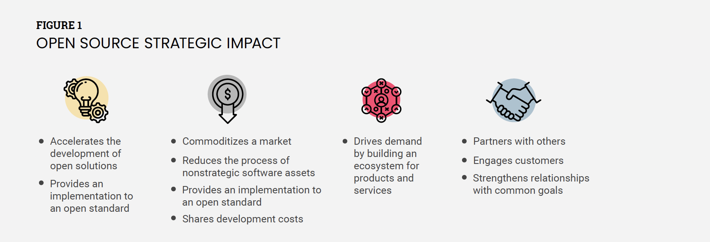
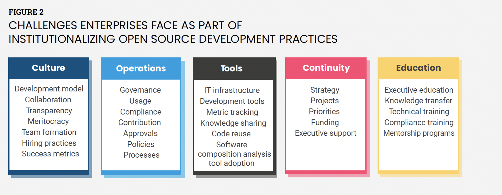

Introduction
============

介绍
============

Corporate participation in open source has reached an all-time high
and continues to grow as organizations realize the value of consuming
and contributing to open source projects (**FIGURE 1**). In addition, the nature of corporate (also called
enterprise) participation continues to evolve as organizations
increasingly discover that open sourcing proprietary technologies can
create new sources of value and more robust product ecosystems.

企业对开源的参与度创历史新高并随着组织意识到消费的价值而继续增长并为开源项目做出贡献
（**图1**）。此外，公司的性质（也称为企业）的参与随着组织的发展而不断发展越来越多的发现开源专有技术可以创造新的价值来源和更强大的产品生态系统。

Enterprise open source development has challenges, which we discussed
in detail in "[[A Deep Dive into Open Source
Program]](https://www.linuxfoundation.org/research/a-deep-dive-into-open-source-program-offices)
[[Offices: Structure, Roles, Responsibilities, and
Challenges]](https://www.linuxfoundation.org/research/a-deep-dive-into-open-source-program-offices)."

企业开源开发存在挑战，我们在 “[[深入了解开源程序]](https://www.linuxfoundation.org/research/a-deep-dive-into-open-source-program-offices)” 和 “[[办公室：结构、角色、职责和挑战]](https://www.linuxfoundation.org/research/a-deep-dive-into-open-source-program-offices)” 有详细的讨论。

The enterprise open source journey is challenging (**FIGURE 2**), and
an organization needs to address this to build its open source
leadership. If the organization has a clear plan to implement internal practices and address those known challenges, the journey
becomes easier. For instance, the Linux Kernel is the largest collaborative software project in the world, and getting involved in
the development process can be overwhelming.

企业开源之旅充满挑战（**图 2**），并且组织需要解决这个问题来构建其开源
领导。如果组织有明确的实施计划内部实践和解决那些已知的挑战，开源之旅变得更容易。
例如，Linux内核是最大的全球协作软件项目，并参与其中开发过程可能会让人不知所措。

If you are one of the organizations that rely on the Linux Kernel for
their products and services, investing time and resources into
improving your internal development abilities, contributions process,
and syncing your development with the upstream project can pay off
immensely in the long run.

如果您是依赖 Linux 内核的组织之一他们的产品和服务，投入时间和资源提高您的内部发展能力，贡献过程，
将您的开发与上游项目同步可以带来回报从长远来看，这是非常巨大的。

Fortunately, since so many organizations and individuals have been
successful at contributing to the Linux Kernel, there is a clear path
to improve your own Linux Kernel contributions and aim for a
leadership role.

幸运的是，由于如此多的组织和个人成功为 Linux 内核做出贡献，有一条清晰的路径改进您自己的 Linux 内核贡献，并致力于起到领导作用。

**FIGURE 1**
**图1**

OPEN SOURCE STRATEGIC IMPACT

----------------------------
开源战略影响

----------------------------

- Accelerates the development of open solutions
- Provides an implementation to an open standard

- 加速开发开放解决方案
- 提供开放标准的实现
  
- Commoditizes a market
- Reduces the process of nonstrategic software assets
- Provides an implementation to an open standard
- Shares development costs
  
- 使市场商品化
- 减少非战略软件资产的流程
- 提供开放标准的实现
- 分摊开发成本

- Drives demand by building an ecosystem for products and services

- 通过构建产品和服务生态系统来驱动需求

- Partners with others
- Engages customers
- Strengthens relationships with common goals

- 与他人合作
- 吸引客户
- 通过共同目标加强关系

Several factors drive and motivate participation in open source
projects:

- Reducing the amount of work needed from product teams

- Minimizing the cost to maintain source code and internal software
    branches

- Improving code quality

- Supporting faster development cycles

- Producing more stable code to serve as the base for products

- Improving the organization's reputation in critical open source
    communities

推动和激励参与开源项目的几个因素：

- 减少产品团队所需的工作量

- 最大限度地降低维护源代码和内部软件的成本分支

- 提高代码质量

- 支持更快的开发周期

- 生成更稳定的代码作为产品的基础

- 提高组织在关键开源中的声誉社区

Organizations often upstream modifications to open source projects,
which is a fundamental aspect of the open source methodology.
Following this approach, enterprise developers submit internal changes
to the open source project for evaluation for acceptance into the main
development tree. This process achieves several technical and
nontechnical benefits for the enterprise due to such contributions
(see **FIGURE 3**).

组织经常上游修改开源项目，这是开源方法的一个基本方面。
遵循此方法，企业开发人员提交内部更改对开源项目进行评估，以便接受进入主开发树。
这个过程实现了几个技术和由于这种贡献而给企业带来的非技术利益
（请参阅图 3**）。

This report covers several practices enterprises can adopt to help
grow their footprint in open source projects.

本报告涵盖了企业可以采用的几种做法，以帮助扩大他们在开源项目中的足迹。

FIGURE 2
CHALLENGES ENTERPRISES FACE AS PART OF
INSTITUTIONALIZING OPEN SOURCE DEVELOPMENT PRACTICES

图2
企业在推行开源开发实践时面临的挑战

Culture

Development model
Collaboration
Transparency
Meritocracy
Team formation
Hiring practices
Success metrics

文化

开发模型
协作
透明度
精英主义
团队组建
招聘实践
成功指标

Operations

Governance
Usage
Compliance
Contribution
Approvals
Policies
Processes

运营

治理
使用
合规性
贡献
批准
政策
流程

Tools

IT infrastructure
Development tools
Metric tracking
Knowledge sharing
Code reuse
Software
composition analysis
tool adoption

工具

IT基础设施
开发工具
度量跟踪
知识共享
代码重用
软件
组合分析
工具采用

Continuity

Strategy
Projects
Priorities
Funding
Executive support

连续性

战略
项目
优先事项
资金
高管支持

Education

Executive education
Knowledge transfer
Technical training
Compliance training
Mentorship programs

教育

高管教育
知识转移
技术培训
合规培训
导师计划
