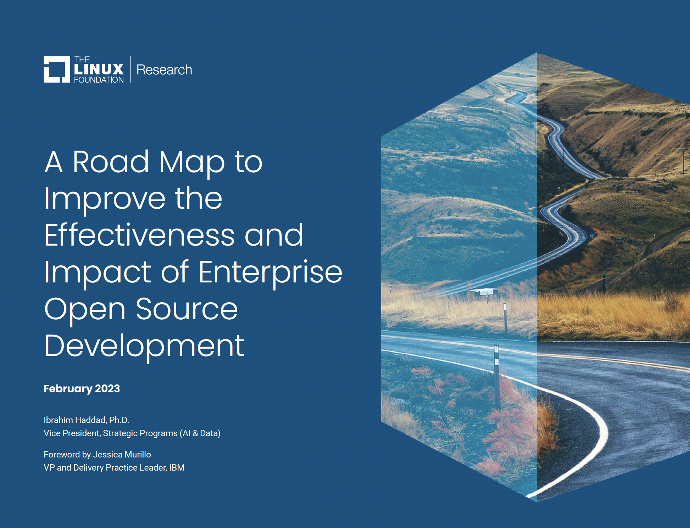
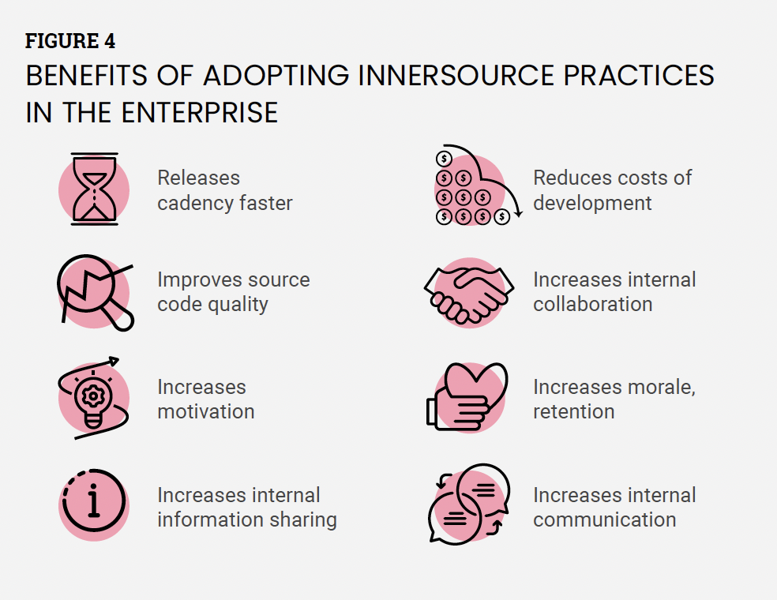
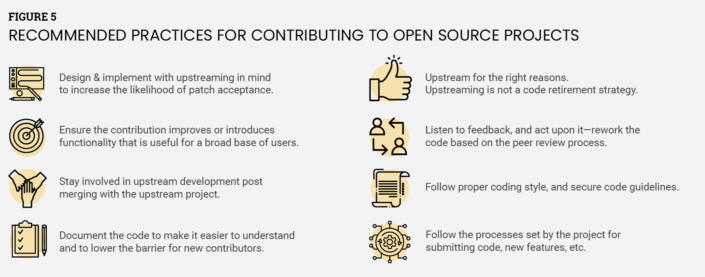
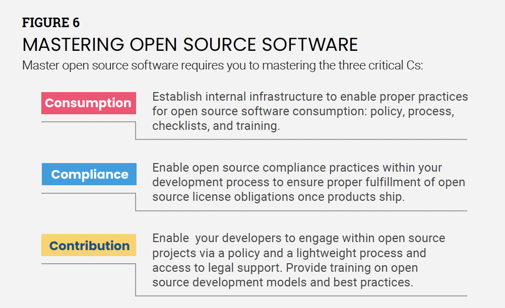
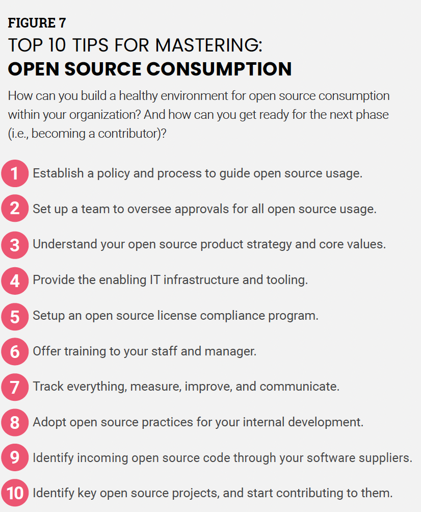
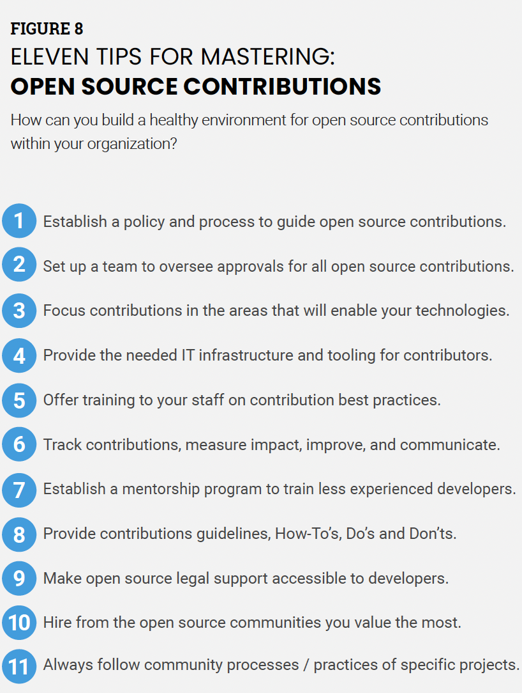

提升企业开源开发有效性和影响力的路线图

**2023 2月**

Ibrahim Haddad 博士

战略计划副总裁（AI 和数据）

序言：Jessica Murillo，IBM 副总裁兼交付实践负责人

Contents
==========
```text
Foreword..................................3
Introduction................................5
Hire developers from the project’s community........................... 7
Support and allocate time for upstream contributions........... 7
Create a mentorship program..........................................................8
Offer training.........................................................................9
Participate in and host open source events.................................9
Provide a flexible IT infrastructure .................................................9
Track developer code contributions ............................................. 10
Identify focus areas with a broad impact................................... 10
Foster internal collaboration.............................................. 10
Implement inner sourcing practices ..............................................11
Recommendations and lessons learned......................................12
Be patient.............................................................................12
Embrace a flexible IT infrastructure ..................................................12
Adopt proper success metrics...........................................................12
Use a lightweight approval process ....................................................12
Share information........................................................12
Make strategic contributions .......................................................13
Partner with product teams..........................................................13
Grow open source talent....................................................14
Conclusion.............................................................. 15
Acknowledgments.........................................................17
Feedback........................................................................17
Linux Foundation resources .............................................17
About the author.................................................... 18
```
目录
========

[**序言 3**](#foreword)

[**介绍 5**](#introduction)

[**从项目社区雇用开发人员 7**](#hire-developers-from-the-projects-community)

[**支持并为上游贡献分配时间 7**](#hire-developers-from-the-projects-community)

[**建立指导计划 8**](#_bookmark3)

[**提供培训 9**](#offer-training)

[**参与并主持开源活动 9**](#offer-training)

[**提供灵活的 IT 基础设施 9**](#offer-training)

[**跟踪开发人员的代码贡献 10**](#_bookmark5)

[**确定具有广泛影响的重点领域 10**](#_bookmark5)

[**促进内部协作 10**](#_bookmark5)

[**落地内源实践 11**](#implement-inner-sourcing-practices)

[**建议和经验教训 12**](#recommendations-and-lessons-learned)

[保持耐心 12](#recommendations-and-lessons-learned)

[拥抱灵活的 IT 基础设施 12](#recommendations-and-lessons-learned)

[采用适当的成功指标 12](#recommendations-and-lessons-learned)

[使用轻量级审批流程 12](#recommendations-and-lessons-learned)

[分享资讯 12](#recommendations-and-lessons-learned)

[做出战略贡献 13](#make-strategic-contributions)

[与产品团队合作 13](#make-strategic-contributions)

[培养开源人才 14](#grow-open-source-talent)

[**总结 15**](#conclusion)

[**致谢 17**](#acknowledgments)

[**反馈 17**](#acknowledgments)

[**Linux 基金会资源 17**](#acknowledgments)

[**关于作者 18**](#_bookmark12)

Foreword
========

引言
========

“In real open source, you have the right to control your own destiny.”
**– LINUS TORVALDS, CREATOR OF THE LINUX KERNEL**

“在真正的开源中，你有权掌握自己的命运。”

**-- LINUS TORVALDS，Linux 内核的创始人**

A lot has changed in the past 20 years since technology
companies, like IBM, began their open source journey. In the
first 10 years, enterprises started by contributing to open source
projects to help fill their needs; they made strategic investments
in technology, collaboration and communities and built an entirely
new ecosystem. In the next 10 years, we saw the emergence
of hyperscale cloud providers and Fortune 500 companies that
shifted from being passive consumers to proactive participants in
open source communities. This heightened collaboration spurred
even faster innovation.

过去 20 年间，自 IBM 等科技公司开启开源之旅后，发生了许多变化。在最初的 10 年里，企业开始通过贡献开源项目来满足自身需求；他们对技术、协作和社区进行战略性投资，建立了全新的生态系统。接下来的 10 年，我们看到了超大规模云提供商和财富 500 强公司的出现，它们从被动的消费者转变为开源社区积极的参与者。这种加强的合作推动了更快的创新。

We have learned that companies who only participate in open
source on an ad-hoc basis cannot achieve long-term success.
The key is for companies to take a more structured, enterprise
approach, putting open source at the core of their technology
strategy. To truly benefit from the open source community
model, each contributor is responsible for making the necessary
investments in those communities. This includes providing
open source developers from your company with the proper
tooling, training, and mentoring to become strong community
contributors and grow into leaders. It means we need to work
together to solve not only the problems that scratch our own
itch, but by broadening the scope of influence and focusing our
time and talent to improve the code base and remediate issues in
open source software if they arise. That is what it means to be a
good member of an open source community.

我们已经深刻意识到，仅仅偶尔参与开源项目的企业无法获得长期成功。关键在于企业采用更具结构化、更具企业化的方法，将开源置于其技术战略的核心。为了真正从开源社区模式中获益，每个贡献者都应该对这些社区进行必要的投资。这包括为来自贵公司的开源开发人员提供合适的工具、培训和指导，帮助他们成为强大社区贡献者并成长为领导者。这意味着我们需要齐心协力，不仅要解决自己迫切的问题，还要拓宽影响范围，将我们的时间和才能投入到改善开源软件代码库和修复出现的漏洞上。这才是成为一个优秀开源社区成员的真正含义。

This document provides an overview and step by step guide for
companies to engage in open source development, no matter
where you are on your journey.

本文档为企业参与开源开发提供了概述和分步指南，无论你在开源的哪个阶段。

**JESSICA MURILLO**

**IBM 副总裁兼交付实践负责人**

|      |      |      |
|---------------- | --------------- | --------------- |
| Be patient and seek out influential peers when growing your domain expertise, open source methodology, and working practices. | Practice and encourage an open and collaborative mindset when implementing open source infrastructure. | Adopt IT infrastructure that is flexible and supportive of open source development. |
| 在发展领域专业知识、开源方法和工作实践的同时，要有耐心并寻找有影响力的同行。 | 在实施开源基础架构的过程中，实践并鼓励开放和协作的思维模式。 | 采用灵活且支持开源开发的 IT 基础设施。 |
| Track success through specifically designed metrics for an open source environment.   | Follow a lightweight and tailored approach to source code contribution approvals.   | Share information across divisions and foster internal collaborations for successful implementation of innersource practices.    |
| 通过专门为开源环境设计的指标来跟踪成功。 | 遵循轻量级和量身定制的方法来批准源代码贡献。 | 跨部门共享信息并促进内部协作以成功实施内部资源实践。 |
| Contribute strategically to projects that are commonly used across products and services to remain essential, justifiable, and fundable.    |  Allocate time for open source developers to meet upstream responsibilities, especially if they are maintainers.  | Partner with product teams on upstream code development that helps reduce their technical debt.   |
| 战略性地为产品和服务中常用的项目做出贡献，以保持其必要性、合理性和可资助性。 | 为开源开发人员（尤其是维护人员）分配时间来履行上游职责。 | 与产品团队合作进行上游代码开发，帮助减少他们的技术债务。 |
| Develop open source talent internally, and encourage involvement in open source from developers across the organization.  | Create a mentorship program to support the growth of junior developers and increase the quality and quantity of code accepted in open source projects.  | Participate in and host open source events to build developer networks, participate in technical discussions, and increase visibility. |
| 在内部培养开源人才，并鼓励整个组织的开发人员参与开源。 | 创建指导计划以支持初级开发人员的成长，并提高开源项目中接受的代码的质量和数量。 | 参与和主持开源活动以建立开发者网络、参与技术讨论并提高知名度。 |

Introduction
============

介绍
============

Corporate participation in open source has reached an all-time high
and continues to grow as organizations realize the value of consuming and contributing to open source projects (**FIGURE 1**). In addition, the nature of corporate (also called enterprise) participation continues to evolve as organizations increasingly discover that open sourcing proprietary technologies can create new sources of value and more robust product ecosystems.

企业对开源的参与度创历史新高并随着组织意识到消费的价值而继续增长并为开源项目做出贡献
（**图1**）。此外，公司的性质（也称为企业）的参与随着组织的发展而不断发展越来越多的发现开源专有技术可以创造新的价值来源和更强大的产品生态系统。

Enterprise open source development has challenges, which we discussed
in detail in "[[A Deep Dive into Open Source
Program]](https://www.linuxfoundation.org/research/a-deep-dive-into-open-source-program-offices)
[[Offices: Structure, Roles, Responsibilities, and
Challenges]](https://www.linuxfoundation.org/research/a-deep-dive-into-open-source-program-offices)."

企业开源开发存在挑战，我们在 “[[深入了解开源程序]](https://www.linuxfoundation.org/research/a-deep-dive-into-open-source-program-offices)” 和 “[[办公室：结构、角色、职责和挑战]](https://www.linuxfoundation.org/research/a-deep-dive-into-open-source-program-offices)” 有详细的讨论。

The enterprise open source journey is challenging (**FIGURE 2**), and
an organization needs to address this to build its open source
leadership. If the organization has a clear plan to implement internal practices and address those known challenges, the journey
becomes easier. For instance, the Linux Kernel is the largest collaborative software project in the world, and getting involved in
the development process can be overwhelming.

企业开源之旅充满挑战（**图 2**），并且组织需要解决这个问题来构建其开源
领导。如果组织有明确的实施计划内部实践和解决那些已知的挑战，开源之旅变得更容易。
例如，Linux内核是最大的全球协作软件项目，并参与其中开发过程可能会让人不知所措。

If you are one of the organizations that rely on the Linux Kernel for
their products and services, investing time and resources into
improving your internal development abilities, contributions process,
and syncing your development with the upstream project can pay off
immensely in the long run.

如果您的公司是一家依赖 Linux 内核的组织自己的产品和服务的公司，投入时间和资源提高您的内部发展能力，贡献过程，将您的开发与上游项目同步可以带来回报，从长远来看，这是非常巨大的。

Fortunately, since so many organizations and individuals have been
successful at contributing to the Linux Kernel, there is a clear path
to improve your own Linux Kernel contributions and aim for a
leadership role.

幸运的是，由于如此多的组织和个人成功为 Linux 内核做出贡献，有一条清晰的路径改进您自己的 Linux 内核贡献，并致力于起到领导作用。

**FIGURE 1**

**图1**


OPEN SOURCE STRATEGIC IMPACT

----------------------------
开源战略影响

----------------------------

- Accelerates the development of open solutions
- Provides an implementation to an open standard

- 加速开发开放解决方案
- 提供开放标准的实现
  
- Commoditizes a market
- Reduces the process of nonstrategic software assets
- Provides an implementation to an open standard
- Shares development costs
  
- 使市场商品化
- 减少非战略软件资产的流程
- 提供开放标准的实现
- 分摊开发成本


- Drives demand by building an ecosystem for products and services

- 通过构建产品和服务生态系统来驱动需求

- Partners with others
- Engages customers
- Strengthens relationships with common goals

- 与他人合作
- 吸引客户
- 通过共同目标加强关系

Several factors drive and motivate participation in open source
projects:

- Reducing the amount of work needed from product teams

- Minimizing the cost to maintain source code and internal software branches

- Improving code quality

- Supporting faster development cycles

- Producing more stable code to serve as the base for products

- Improving the organization's reputation in critical open source
    communities

推动和激励参与开源项目的几个因素：

- 减少产品团队所需的工作量

- 最大限度地降低维护源代码和内部软件的成本分支

- 提高代码质量

- 支持更快的开发周期

- 生成更稳定的代码作为产品的基础

- 提高组织在关键开源中的声誉社区

Organizations often upstream modifications to open source projects,
which is a fundamental aspect of the open source methodology.
Following this approach, enterprise developers submit internal changes
to the open source project for evaluation for acceptance into the main
development tree. This process achieves several technical and
nontechnical benefits for the enterprise due to such contributions
(see **FIGURE 3**).

组织经常上游修改开源项目，这是开源方法的一个基本方面。
遵循此方法，企业开发人员提交内部更改对开源项目进行评估，以便接受进入主开发树。
这个过程实现了几个技术和由于这种贡献而给企业带来的非技术利益
（请参阅图 3**）。

This report covers several practices enterprises can adopt to help
grow their footprint in open source projects.

本报告涵盖了企业可以采用的几种做法，以帮助扩大他们在开源项目中的足迹。


FIGURE 2

CHALLENGES ENTERPRISES FACE AS PART OF
INSTITUTIONALIZING OPEN SOURCE DEVELOPMENT PRACTICES

图2

企业在推行开源开发实践时面临的挑战

Culture

Development model
Collaboration
Transparency
Meritocracy
Team formation
Hiring practices
Success metrics

文化

开发模型
协作
透明度
精英主义
团队组建
招聘实践
成功指标

Operations

Governance
Usage
Compliance
Contribution
Approvals
Policies
Processes

运营

治理
使用
合规性
贡献
批准
政策
流程

Tools

IT infrastructure
Development tools
Metric tracking
Knowledge sharing
Code reuse
Software
composition analysis
tool adoption

工具

IT基础设施
开发工具
度量跟踪
知识共享
代码重用
软件
组合分析
工具采用

Continuity

Strategy
Projects
Priorities
Funding
Executive support

连续性

战略
项目
优先事项
资金
高管支持

Education

Executive education
Knowledge transfer
Technical training
Compliance training
Mentorship programs

教育

高管教育
知识转移
技术培训
合规培训
导师计划

Hire developers from the project's community

============================================

从项目社区雇佣开发人员

=====================

This critical step allows your organization to gain skills and
recognition immediately. Hiring two or three people is a great start
toward making a noticeable impact on a large project, such as the
Linux Kernel, attracting further hires and allowing enough resources
to mentor existing junior developers.

这是可以让你的组织立即获得技能和认可的关键步骤。想对一个大型项目（例如Linux
内核）产生明显的影响，雇佣两三个人是一个很好的开始，这样可以吸引更多的员工，
并有足够的资源来指导已有的初级开发人员。

It is crucial to align corporate interests with individual interests.
It will be hard to motivate a senior open source developer to work on
a given project when their interests do not match those of their
employers. For instance, a memory management expert may
not be interested in working on file systems; therefore, finding a
match in interests is critical.

让个人兴趣与公司利益保持一致非常重要。当高级开源开发人员的兴趣与雇主的不匹配时，会很难激励他们在被指定的项目上工作。
例如一位内存管理专家可能对在文件系统工作根本不感兴趣；因此，找兴趣的匹配点是
至关重要的。

Support and allocate time for upstream contributions

====================================================

支持并分配时间用于上游贡献

========================

The core principle for hiring open source developers is to support an
organization's open source strategy, development, and upstream
activities; however, in most cases, there is the expectation that open
source developers will need to be available to support product teams
due to their expertise and influence
in their respective open source projects. It is also common for
product teams to exercise their influence in an attempt to hijack the
time of the open source developers by having them work on product
development as much as possible. If this happens,
many open source developers will head to the door, seeking new
opportunities that allows them to work on their upstream project
before an organization realizes what just happened.

雇用开源开发人员的核心目的是支持该组织的开源战略、开发和上游活动；然而，在大
多数情况下，由于开源开发人员的专业知识和影响力，他们也需要在对应的开源项目中
为产品团队提供支持。同样常见的是产品团队行使他们的影响力来试图来抢夺开源开发
人员的时间、让其尽可能多地参与产品开发。如果发生这种情况，许多开源开发人员会
直奔门口离开，去寻求容许他们在上游项目上工作的新机会，甚至是在这个组织意识到
发生了什么之前。


**FIGURE 3**

**图3**

BENEFITS OF UPSTREAMING CODE
----------------------------

上游代码的好处
-------------

Lower maintenance efforts for internally managed
code, i.e., minimizes technical debt.

减少内部托管代码的维护工作量，例如最大限度地减少了技术债。

Upstreamed code becomes visible to others and receives peer review and
feedback, leading to improvements.

上游的代码对其他人可见，接收同行评审和反馈，进而可以优化改进。

Upstream contributions provide stability to the project. They send a
signal that the project is useful and important, which helps attract
new contributors.

上游贡献为项目提供了稳定性。它们发出了该项目是有用的和重要的信号，这有
助于吸引新的贡献者。

Builds a positive relationship between the contributing organization
and the project community.

在贡献组织和项目社区之间建立积极正向的关系。

Upstreaming code is an effective way to provide technical leadership
and influence the project.

上游代码是构建技术领导力和影响项目的有效方法。

Upstreaming contributes to easier compliance and improved security due
to centralizing code in upstream repos.

由于将代码集中在上游项目仓库中，上游贡献有助于更容易地实现合规遵从和提高
安全性。

Upstream contributions are an effective means of ensuring stability in
a company's software supply chain.

上游贡献是保护公司软件供应链稳定的有效手段。

Helps organizations recruit talent from projects and retain their own
developers by engaging them with the open source innovation engine.

帮助组织从项目中招募人才，同时通过让组织现有的开放人员参与开源创新引擎来吸
引留住他们。

Therefore, creating and maintaining a
separation of upstream work and product work is essential. In other
words, a followed practice is to provide open source developers with
guaranteed time to meet their upstream aspirations and
responsibilities, especially if they are maintainers. For junior
developers, or other internal developers using open source in product
components, such interactions with the upstream community will
increase their language, communication, and technical skills. In the
absence of such an upstream time guarantee, it is easy for these team
members to become an extension of product teams, resulting in their
upstream focus drying up in favor of product development.

因此，创建和维护上游工作和产品工作之间的隔离是必不可少的。换句话说，一个可
遵循的实践是为开源开发人员提供有保证的时间来满足他们的上游意愿和责任，特别
是如果他们担任项目维护者。对于初级开发人员，或者其他在产品组件中使用开源的
内部开发人员，与上游社区的这种互动将提高他们的语言、沟通和技术能力。在缺乏
这样的上游时间保证的情况下，这些团队成员很容易成为产品团队的延伸，导致他们
的上游投入枯竭转而支持产品开发。

Create a mentorship program
===========================

创建导师计划
===========

Set up a mentorship program where senior, experienced open source
developers mentor junior, less experienced developers. Typically, a
mentorship program runs for three to six months, during which the
mentor supervises the mentee's work, assigns tasks, and ensures proper
results. The mentor also conducts code reviews and provides feedback
on anything the mentee produces before the mentee pushes the code to
the upstream project.

建立一个导师计划，让资深的、有经验的开源开发人员来引导初级的、经验较少的开发
人员。通常情况下，导师计划持续3至6个月，在此期间，导师将监督学员的工作，分配
任务，并确保适当的结果。在学员将代码推送到上游项目之前，导师也会进行代码审查
并对学员的产出内容提供反馈。

This exercise aims to increase the number of developers contributing
code to the upstream project and improve individual effectiveness by
increasing the quality of code and the percentage of code accepted
into the upstream project. In general, four to five mentees should
work with a given mentor, and, ideally, they should work in the same
area as the mentor to make code reviews more efficient.

这种练习的目的是通过提高代码质量和上游项目接受代码的比例来提升为上游项目贡献
代码的开发人员数量和个人效率。一般来说，4到5名学员与一位指定的导师一起工作，
理想情况下，他们应该与导师在同一领域工作从而可以让代码审查更高效。

Formalize open source human resources tracking & performance metrics
====================================================================

正式制定开源人力资源跟踪和绩效指标
================================

Mature open source organizations almost always have an open source
developer track in their HR system. So, individuals hired as open
source developers have a good sense of how their careers will progress
within the organization. Additionally, organizations often need to
adjust their performance-based bonuses and metrics to include goals
related to open source development work. Closed source developers'
performance metrics are often different from those of open source
developers. For example, if an open source developer advocates for the
implementation of
a given feature, successfully gathers interest, and volunteers to
write the code, how would they be rated, especially if they may not
have written a single line of code?

成熟的开源组织几乎总是在他们的HR系统中拥有一个开源开发人员赛道，这样被雇用为
开源开发人员的个人对他们在组织内的职业发展有很好的了解。此外，组织往往需要调
整其基于绩效的奖金和指标来包括与开源开发工作相关的目标。闭源开发人员的性能指
标通常与开源开发人员的性能指标不同。例如，如果一个开源开发人员倡导实现一个特
定的功能，成功地吸引到社区兴趣并有志愿者们自愿编写代码，那么他们将如何被评价，
特别是如果他们自己可能没有编写一行代码的话？

Finally, organizations should allow a work-from-home (WFH) policy for
open source developers regardless of the general corporate policy.
During COVID-19, we witnessed organizations institute WFH policies to
allow employees to be productive while under quarantine. It was a
fascinating experiment for WFH policies, as organizations continued to
operate, innovate, and produce, even though most of their employees
worked from home. A WFH policy is almost mandatory in the open source
world because open source developers are located worldwide, making
hiring and retaining them easier.

最后，组织应该忽略常规的公司政策，允许开源开发人员远程办公。在COVID-19期间，
我们目睹组织制定了远程办公政策，以允许员工在隔离期间保持高效产出。对于远程办
公政策来说，这是一次引人入胜的实验，因为组织继续运营、创新和生产，尽管他们的
大多数员工都在家远程办公。远程办公政策在开源世界几乎是强制性的，因为开源开发
人员分布在世界各地，使得招聘和留住他们变得更加容易。

Offer training
==============

培训支持
==============

It is only possible for organizations to hire some of the senior and
most expert developers. They are always looking for ways to increase
the competence of their developers in a given technical domain;
therefore, in addition to specialized training, organizations need to offer training on the open source
development model and the basic concepts of open source legal
compliance.

组织只可能聘任一些高级的、专家级的开发人员。他们总是在寻找方法来提升开发者在特定领域的能力。因此，在专业化培训之外，组织还需要开展关于开源开发模型和开源合规基本概念的培训。

Sample training courses include:

举例来说，培训课程包括：

- An open source development methodology course that teaches staff new
    to open source how open source development works and how to get best
    engaged with the project community

- 开放源码开发方法论课程：指导员工开源项目如何进行初始开发，以及如何最好的参与到项目社区中；

- An open source compliance course that teaches staff the basics of
    compliance principles and open source licensing. The course often
    includes modules covering the organization's policy and process.

- 开放源码合规课程，教导员工遵循开源原则和开源许可的基础知识。该课程通常涵盖了组织政策和流程的内容。

The Linux Foundation offers several technical training courses
specific to open source technologies and several
[[nontechnical]](https://training.linuxfoundation.org/full-catalog)
[[courses]](https://training.linuxfoundation.org/full-catalog),
such as this free online open source compliance training for
developers.

Linux基金会提供了一些针对开放源码的技术培训课程和非技术课程，例如上述面向开发人员的开源合规免费在线课程[[nontechnical]](https://training.linuxfoundation.org/full-catalog)
[[courses]](https://training.linuxfoundation.org/full-catalog)。

 Participate in and host open source events
==========================================

 参与并主持开源活动
==========================================

Mature open source organizations support and encourage their
developers to host, attend, and participate in open source conferences
and events, including local community meetups, hackathons, and
summits. Such participation helps open source developers connect
personally with their peers, build relationships, and participate in
technical discussions that guide the direction of the respective open
source projects.

成熟的开源组织会对支持并鼓励自己的开发人员主持、参加和参与开源会议和活动，包括本地社区聚会、黑客马拉松和峰会。这种参与有助于开源开发人员与他们的同行建立个人联系，打造关系圈，参与并指导与各自开源项目有关的技术讨论。

As an organization that uses and adopts open source software, it is
highly recommended to facilitate for your open source developers the
process of attending and presenting at open source events. You can
also sponsor big and small events to increase external visibility within the open source global
community or simply target events tailored for specific open source
projects. As a bonus benefit, such events are also great venues to
look for talent.

作为开源软件使用者，强烈建议组织为其开源开发人员到开源活动中参加和展示提供支持。也可以赞助大大小小的活动
以提升在全球化开源社区中的知名度，亦或者针对特定开源项目量身定制活动。作为额外的惊喜，此类活动也是发现人才的好去处。

Provide a flexible IT infrastructure
====================================

提供灵活的IT基础设施
====================================

Provide a flexible IT infrastructure that allows open source
developers to communicate and work with the open source and Linux
Kernel communities without any challenges. Additionally, set up an
internal IT infrastructure that matches the tools used externally to
help bridge the gap between internal teams and the Kernel community or
any other open source project community for that purpose.

提供灵活的IT基础设施，使开源开发人员能够毫无阻碍地与开源社区和Linux内核社区进行联系和工作。此外，建立一个与外部使用的工具相匹配的内部IT基础设施，以减少内部团队与内核社区或任何其他开源项目社区之间的距离感。

[]{#_bookmark5 .anchor}Open source development uses three primary
domains of IT services: knowledge sharing (wikis, collaborative
editing platforms, and public websites), communication and problem solving
(mailing lists, forums, and real-time chat), and code development and
distribution (code repositories and bug tracking). Making some or all
of these tools available internally properly supports open source
development. However, this might conflict with existing
organization-wide IT policies. If so, it is vital to resolve these
conflicts and allow open source developers to use familiar tools.

开源开发所使用的三个主要IT服务领域:知识共享(wiki、协作编辑平台和公共网站)，沟通和解决问题(邮件列表、论坛和实时聊天)，以及代码开发和分发(代码存储库和bug跟踪)。在内部提供这些工具的部分或者全部，能为开源开发提供适当的支持。然而，这可能与组织现行的整体IT策略相冲突。如果出现这种情况，应重点解决这些冲突，并允许开源开发人员使用熟悉的工具。

Track developer code contributions
==================================

跟踪开发人员的代码贡献
==================================

Create an internal system to keep track of developer contributions and
impact. Contributions can include upstream development, supporting
product teams, knowledge transfer (mentoring, training), visibility
(publications, talks), launching new open source projects, and
establishing internal collaboration projects with other teams or
groups.

搭建一个内部系统来跟踪开发人员的贡献和影响。贡献可以包括上游开发、支持产品团队、知识转移(指导、培训)、知名度(出版物、演讲)、启动新的开源项目，以及与其他团队或小组建立内部协作项目。

With this data, you can compare contributions from various internal
development teams to identify where source code contributions are
coming from.

根据这些数据，我们就可以把来自不同内部开发团队的贡献进行比较，以确定源代码贡献的来源。

For instance, you can use these metrics to compare your performance to
other organizations involved in the Kernel ecosystem. This approach
helps better inform you about the overall developer ecosystem for the
project. In addition, these metrics provide a much better idea of your
strengths and weaknesses and can help inform your overall development
strategy.

例如，我们可以利用这些参数，与Kernel生态系统中的其他组织进行性能方面的比较。这种方法可以帮助我们更好地了解项目开发人员的整体生态系统。还可以更好地了解自身的优势和不足，从而影响整体开发策略。

Identify focus areas with a broad impact
========================================

确定具有广泛影响的重点领域
========================================

Contribute to and focus on areas that benefit more than one business
unit or more than one product. This contribution model, driven by the
criticality of software components, allows you to provide value and
show return on investment  across multiple business units, increasing your chances for more
funding and support.

致力并专注于能让多个业务单元或多个产品受益的领域。这个基于软件重要性驱动的贡献模型可以帮助我们提供价值并掌握横跨数个业务单元的投资回报，从而有机会获得更多资金和支持。

Foster internal collaboration
=============================

提供内部协作
=============================

Create collaboration projects with other business units that use the
specific open source projects in their products. These collaborations
can take one or more of many forms:

与其他在产品中使用特定开源项目的业务单元创建协作项目。这些合作可以采取一种或多种形式:

- Deliver training to their developers.

- 为开发人员提供培训。

- Run a workshop on a specific topic or problem.

- 举办针对特定主题或问题的研讨会。

- Develop new functionality.

- 开发新功能。

- Troubleshoot and resolve issues and bugs.

- 排除以及解决问题和 bug 。

- Upstream existing code for which they lack resources.

- 对缺乏资源的代码向上溯源。

- Help get them off an old fork and onto a mainline version.

- 帮助他们从一个旧的分支到一个主线版本。

These collaborations aim to help the product teams understand their
needs and fulfill their product goals via open source enablement.

这些协作旨在帮助产品团队理解他们的需求，并通过开放源代码实现其产品目标。

Implement inner sourcing practices
===========

落地内源实践
============

Inner sourcing is the application of open source methodologies
to development projects inside the organization. The goal is to
incubate the same capabilities within the enterprise as those
in the open source community and to foster new employee-toemployee
relationships that are cross-functional and touch on
multiple product domains.

内源是开源方法论在组织内部开发项目的实际应用。其目的是在企业内部孵化出与开源社区一样的能力，以此来促进跨职能并且涉及多产品领域之间员工与员工之间的关系。



**FIGURE 4**

**图4**

BENEFITS OF ADOPTING INNERSOURCE PRACTICES IN THE ENTERPRISE
在企业采用内部开源实践的好处

Releases cadency faster
Improves source code quality
Increases motivation
Increases internal information sharing

更快的发布周期
提高源代码质量
增加动力
增加内部信息共享

Reduces costs of development
Increases internal collaboration
Increases morale, retention
Increases internal communication

降低开发成本
增加内部协作
提高士气，提高员工保留率
增加内部沟通

Open source principles work well on large-scale projects
distributed across an enterprise. Many Fortune 500 organizations
have adopted them externally and internally for the same
reasons: faster releases, improved quality, increased innovation
and communications, information sharing, reduced costs, greater
and more effective collaboration, and increased employee morale
and retention.

开源原则适用于企业内部大规模分布式项目的研发。很多财富 500 强企业在内外部采用开源都是基于同一个原因：加快发布、提高质量、增强创新与交流、信息共享、降低成本、更好及更有效地协作以及提高员工士气和留存率。

Inner sourcing prepares organizations to work effectively with
external open source communities. It encourages employees to
interact with colleagues elsewhere and with external community
members without switching contexts. In addition, new employees
familiar with this development model may integrate more
quickly into established workflows. Finally, business partners are
probably already using many of these development practices, so
when an organization adopts inner sourcing practices, it is also
strengthening its integration with the commercial ecosystem.

内源能够让企业在和外部开源社区进行有效工作上做好准备。它鼓励员工和其他地方的同事以及外部社区成员在无需切换上下文的情况下就能够进行互动。除此之外，熟悉这种研发模式的新员工可以更快速的融入到已经建立起来的工作流中。最终，那些或许已经在使用这些众多研发实践的业务伙伴，在遇到企业在采用内源实践时，是能够加强它们与商业生态之间的整合的。


Recommendations and lessons learned
===================================

推荐和经验教训
===================================

保持耐心

### Be patient

### 保持耐心

It takes considerable time to grow internal open source expertise. The
goal from an enterprise perspective is to find people with enough peer
recognition to be influential in the community. There are typically
three pillars to this: domain expertise, open source methodology, and
working practices.

培养内部开源专业知识需要相当长的时间。从企业的角度来看，目标是找到在社区中具有足够同行认可的人，能够在其中产生影响力。通常有三个支柱：领域专业知识、开源方法论和工作实践。

### Shift to a more collaborative environment

Internal organization dynamics must be favorable to open source
efforts. Implementing these practices requires a shift from
traditional software development practices to a more open and
collaborative mindset. As an open source leader inside

your organization, you will face several challenges in funding
resources, justifying ROI, getting upstream focus, etc. These often
require a major shift in mindset and a lot of education up the command
chain.

### 转向更协作的环境

内部组织动态必须对开源努力持有积极态度。实施这些实践需要从传统的软件开发实践转向更加开放和协作的思维方式。作为组织内的开源领导者，您将面临一些挑战，如寻找资源、证明投资回报率、获得上游关注等。这通常需要在思维方式上进行重大转变，并在指挥链上进行大量教育。

### Embrace a flexible IT infrastructure

These open source practices require an IT infrastructure free from
many limiting IT policies and a computing environment that supports
open source development.

### 拥抱灵活的IT基础设施

这些开源实践要求有一个摆脱许多限制性IT政策的IT基础设施，以及支持开源开发的计算环境。

### Adopt proper success metrics

Proper open source metrics drive the desired development behavior.
Unfortunately, the traditional metrics often used in product
organizations only apply in the context of open source development.
For example, we have had multiple instances of the upstream
implementation of desired functionality because of OSG developers that
lobby for support from the community.

In this case, the number of changesets or lines of code does not
matter as much, as the technical leadership team members provide to
get code upstream and reduce our downstream maintenance efforts. The
metrics we track account for things like this.

### 采用适当的成功度量标准

适当的开源度量标准推动期望的开发行为。不幸的是，在产品组织中通常使用的传统度量标准只适用于开源开发的上下文。例如，由于 OSG 开发人员游说社区支持，我们曾多次看到期望功能的上游实现。

在这种情况下，变更集或代码行数并不那么重要，因为技术领导团队成员提供的是将代码上游并减少我们的下游维护工作。我们跟踪的度量标准涵盖了这些方面。

### Use a lightweight approval process

Organizations have transitioned from highly complex and cumbersome
policies to a more straightforward approach for receiving, reviewing,
and approving source code contributions. Dedicated open source teams
often receive blanket approval to contribute to open source projects.
This is not the case for other groups, which need different approval
levels depending on the nature of the contributed code (e.g., simple
bug fixes, code to improve existing functionality, code that offers
new functionality, or starting a new project). This is a function of
the balance between all parties involved: legal, engineering, and open
source.

### 使用轻量级的批准流程

组织已经从高度复杂和繁琐的政策过渡到了对源代码贡献的更为简单的方法，包括接收、审查和批准。专门的开源团队通常获得全面批准，可以为开源项目做出贡献。对其他团队来说，情况并非如此，它们需要根据贡献代码的性质（例如，简单的错误修复、改进现有功能的代码、提供新功能的代码或启动新项目的代码）获得不同的批准级别。这取决于所有涉及方之间的平衡：法务、工程和开源。

### Share information

The organization must share information and priorities across
different divisions. To illustrate this, assume you are on an open
source team and request to support the implementation of a driver, but
you cannot access the hardware manual and
instructions. This situation sounds a bit like playing darts with the
lights off; therefore, information sharing is critical to successful
internal collaborations between the open source teams and everyone
else.

### 共享信息

组织必须在不同部门之间分享信息和优先事项。为了说明这一点，假设您在一个开源团队中，并请求支持驱动程序的实现，但您无法访问硬件手册和说明。这种情况听起来有点像在灯光熄灭的情况下玩飞镖；因此，信息共享对于开源团队与其他人之间成功的内部协作至关重要。

### Make strategic contributions

Focus your contributions on upstream projects that would directly
benefit the organization's strategy and products. In open source
development, it is easy to get carried away by hopping between
different exciting projects. However, in an enterprise setting where
the open source group is a cost center, your driving force should be
to focus on open source projects that support product development.
Open source teams often perform a yearly review of the product
portfolio they support and focus their involvement on open source
projects commonly used across as many products as possible. Such a
methodology drives priorities and is a great way to remain focused on
what's essential, justifiable, and fundable.

### 进行战略性贡献

将您的贡献重点放在能够直接有利于组织战略和产品的上游项目上。在开源开发中，很容易被在不同激动人心的项目之间跳动所迷惑。然而，在一个企业环境中，开源团队是一个成本中心，您的驱动力应该是专注于支持产品开发的开源项目。开源团队通常会对其支持的产品组合进行年度审查，并将他们的参与重点放在尽可能多的产品中普遍使用的开源项目上。这种方法推动了优先事项，并是保持专注于重要、可证明和可资助的事物的一种有效方法。

###  Partner with product teams

Be the upstream partner for product teams; they often feel like they
are working inside a pressure cooker, especially in a consumer
electronics environment. They often seem

understaffed, need more critical resources to support parallel
upstream development, and are under constant pressure for feature
delivery within tight schedules. In such an environment, it is easy to
overlook the benefit of upstreaming in favor of short-term time
savings, which can, unfortunately, lead to technical debt that has a
higher cost in the long term.

Open source teams can help by being a partner that focuses on
delivering the necessary code upstream, reducing this technical debt.

### 与产品团队合作

成为产品团队的上游合作伙伴；他们经常感觉自己好像在压力锅中工作，尤其是在消费电子环境中。他们常常显得人手不足，需要更多的关键资源来支持并行上游开发，并在紧张的时间表内交付功能。在这种环境中，很容易忽视上游化的好处，以换取短期的时间节省，这很不幸可能导致长期更高成本的技术债务。

开源团队可以通过成为专注于将必要的代码上游提交的伙伴来提供帮助，从而减少这种技术债务。



**FIGURE 5**

**图5**

RECOMMENDED PRACTICES FOR CONTRIBUTING TO OPEN SOURCE PROJECTS
--------------------------------------------------------------

Design & implement with upstreaming in mind to increase the likelihood
of patch acceptance.

Ensure the contribution improves or introduces functionality that is
useful for a broad base of users.

Stay involved in upstream development post merging with the upstream
project.

Document the code to make it easier to understand and to lower the
barrier for new contributors.

Upstream for the right reasons.

Upstreaming is not a code retirement strategy.

Listen to feedback, and act upon it---rework the code based on the
peer review process.

Follow proper coding style, and secure code guidelines.

Follow the processes set by the project for submitting code, new
features, etc.

### 贡献给开源项目的推荐实践

设计并实现时考虑上游，以增加补丁被接受的可能性。

确保贡献改进或引入对广泛用户群有用的功能。

在与上游项目合并后，保持参与上游开发。

文档化代码以使其更容易理解，并降低新贡献者的门槛。

以正确的原因上游。

上游化不是一种代码退休策略。

倾听反馈，并根据同行评审过程重塑代码。

遵循适当的编码风格和安全代码指南。

遵循项目为提交代码、新功能等制定的流程。

### Grow open source talent

Grow open source talent in specific technology areas relevant to your
products. Hiring a few resources from outside the organization is
easy, but this approach has several limitations. The alternative
approach is to convert your existing developers into open source
contributors via training on the technical domain and open source
methodology. You can then pair these developers with a mentor to
further expand their skills.

Encourage developers outside the open source team to learn from and
contribute to the open source community. We provide as much help as we
can with upstream code contributions.

Still, we need more resources and sometimes need a deeper
understanding of products that might be necessary to identify where we
can adequately upstream code. Better involvement in the open source
community from teams outside our own allows us to get more critical
code upstream and improves our ability to interact with the community.

### 发展开源人才

在与产品相关的特定技术领域培养开源人才。从组织外部聘请一些资源很容易，但这种方法有一些限制。替代方法是通过在技术领域和开源方法论培训现有开发人员，将其转变为开源贡献者。然后，您可以将这些开发人员与导师配对，以进一步扩展他们的技能。

鼓励开源团队之外的开发人员向开源社区学习并做出贡献。我们尽力提供上游代码贡献方面的帮助。

但是，我们需要更多的资源，有时需要更深入地了解可能对识别我们可以充分上游代码的地方至关重要的产品。来自我们自己团队之外的对开源社区的更好参与允许我们更多地将关键代码上游，并提高我们与社区互动的能力。


Conclusion
==========

结论
=====

You must earn open source leadership, but you can lose it through a
lack of participation. Regular, ongoing participation and contribution
are the only ways to ensure your organization maintains open source
leadership.

你必须赢得开源领导力，但你可能会因为缺乏参与而失去它。定期、持续的参与和贡献
是确保组织保持开源领导力的唯一方法。

Hopefully, this paper makes the task of improving your enterprise's
open source practices more manageable. Following some of the
recommended practices will go a long way toward developing internal
open source expertise. You can leverage this expertise to improve your
products and services and reduce
the cost of code maintenance. Many organizations have had considerable
success through the use of these strategies.

希望本文能使提升您的企业开源实践的任务变得更加可控。遵循这些推荐的实践将对发
展内部开源专业技能大有裨益。您可以利用这些专业知识来改进您的产品和服务，并降
低代码维护成本。许多组织通过使用这些策略取得了相当大的成功。



**FIGURE 6**
**图6**

MASTERING OPEN SOURCE SOFTWARE
------------------------------

掌握开源软件
-----------

Master open source software requires you to mastering the three
critical Cs:

掌握开源软件需要你掌握三个关键C：

**Consumption**
**Compliance**
**Contribution**

**消费**
**合规**
**贡献**

Establish internal infrastructure to enable proper practices for open
source software consumption: policy, process, checklists, and
training.

建立内部基础设施以支持开源软件使用的正确做法：策略、流程、检查表和培训。

Enable open source compliance practices within your development
process to ensure proper fulfillment of open source license
obligations once products ship.

在您的开发过程中启用开源合规实践，以确保在产品发货后正确履行开源许可义务。

Enable your developers to engage within open source projects via a
policy and a lightweight process and access to legal support. Provide
training on open source development models and best practices.

使您的开发人员在参与开源项目的过程中能够有策略指引、轻量级的流程以及获得法律
支持的途径。提供关于开源开发模式和最佳实践的培训。


FIGURE 7

图7 
TOP 10 TIPS FOR MASTERING:
十大窍门掌握：

OPEN SOURCE CONSUMPTION
开源消费

How can you build a healthy environment for open source consumption
within your organization? And how can you get ready for the next phase
(i.e., becoming a contributor)?

您如何在组织内部建立一个健康的开源消费环境？您如何为下一阶段做好准备（即成为贡献者）？

1. Establish a policy and process to guide open source usage.
2. Set up a team to oversee approvals for all open source usage.
3. Understand your open source product strategy and core values.
4. Provide the enabling IT infrastructure and tooling.
5. Setup an open source license compliance program.
6. Offer training to your staff and manager.
7. Track everything, measure, improve, and communicate.
8. Adopt open source practices for your internal development.
9. Identify incoming open source code through your software suppliers.
10. Identify key open source projects, and start contributing to them.

1. 建立一个政策和流程来指导开源使用。
2. 建立一个团队来监督所有开源使用的批准。
3. 了解您的开源产品战略和核心价值观。
4. 提供支持的IT基础设施和工具。
5. 建立一个开源许可合规计划。
6. 为您的员工和经理提供培训。
7. 跟踪一切，衡量，改进和沟通。
8. 采用开源实践进行内部开发。
9. 通过软件供应商识别传入的开源代码。
10. 识别关键的开源项目，并开始为它们做贡献。


**FIGURE 8**

**图8**

ELEVEN TIPS FOR MASTERING:
11个需掌握的技巧：

--------------------------
**OPEN SOURCE CONTRIBUTIONS**

**开源贡献**

**OPEN SOURCE CONTRIBUTIONS**

How can you build a healthy environment for open source contributions
within your organization?

1. Establish a policy and process to guide open source contributions.

2. Set up a team to oversee approvals for all open source
    contributions.

3. Focus contributions in the areas that will enable your technologies.

4. Provide the needed IT infrastructure and tooling for contributors.

5. Offer training to your staff on contribution best practices.

6. Track contributions, measure impact, improve, and communicate.

7. Establish a mentorship program to train less experienced developers.

8. Provide contributions guidelines, How-To's, Do's and Don'ts.

9. Make open source legal support accessible to developers.

10. Hire from the open source communities you value the most.

11. Always follow community processes / practices of specific projects.

如何在组织内为开源贡献构建一个健康的环境？

 1. 建立指导开源贡献的策略和流程。

 2. 成立一个团队来管理所有开源贡献的审批。

 3. 将贡献集中在能够使能您的技术的领域。

 4. 为贡献者提供所需的IT基础设施和工具。

 5. 为您的员工提供关于开源贡献最佳实践的培训。

 6. 跟踪贡献、衡量影响、改进和沟通。

 7. 建立一个导师计划，培训经验不足的开发人员。

 8. 提供贡献指南，讲清楚如何做，可以做什么以及不可以做什么。
  
 9. 让开发者可以获得开源法律支持。
  
 10. 从你最看重的开源社区招聘。

 11. 始终遵循具体项目的社区流程/实践。

Acknowledgments
===

致谢
====

The author would like to express his sincere appreciation to his Linux
Foundation colleagues Hilary Carter, Jason Perlow, Melissa Schmidt,
Jessica Murillo and Barry Hall for their valuable reviews and
feedback. This report has benefited immensely from their experiences,
reviews, and contributions.

作者在此对他的Linux基金会同事Hilary Carter、Jason Perlow、Melissa Schmidt、
Jessica Murillo和Barry Hall的宝贵的评论和反馈表示衷心的感谢。本报告从他们的
经验、评审和贡献中受益匪浅。

Feedback
========

反馈
====

The author apologizes in advance for any spelling errors or possible
errors and is grateful to receive corrections and suggestions for
improvements.

作者对任何拼写错误或可能出现的错误提前道歉，并非常感激能收到更正和改进建议。

Linux Foundation resources
==========================

Linux基金会资源
===============

• E-book: A Deep Dive into Open Source Program Offices:
Structure, Roles, Responsibilities, and Challenges
• E-book: A Guide to Enterprise Open Source
• E-book: Open Source Compliance in the Enterprise
• E-book: Open Source Audits in Merger and Acquisition
Transactions
• Linux Foundation Open Source Best Practices for the
Enterprise Guides
• Linux Foundation Open Source Compliance Program
• TODO Group
• The Software Package Data Exchange®
• Linux Foundation Training & Certification
• Linux Foundation Events

- **电子书：** [[深入理解开源项目办公室]](https://www.linuxfoundation.org/tools/a-deep-dive-into-open-source-program-offices/)
    [[结构、角色、责任和挑战]](https://www.linuxfoundation.org/tools/a-deep-dive-into-open-source-program-offices/)

- **电子书：** [[企业开源指南]](https://linuxfoundation.org/tools/guide-to-enterprise-open-source/)

- **电子书：** [[企业中的开源合规性]](https://www.linuxfoundation.org/blog/blog/an-introduction-to-open-source-compliance-in-the-enterprise)

- **电子书：** [[并购中的开源审计]](https://www.linuxfoundation.org/resources/publications/assessment-of-open-source-practices-as-part-of-due-diligence-in-merger-and-acquisition-transactions)
    [[交易]](https://www.linuxfoundation.org/resources/publications/assessment-of-open-source-practices-as-part-of-due-diligence-in-merger-and-acquisition-transactions)

- [[Linux基金会企业开源最佳实践]](https://www.linuxfoundation.org/resources/open-source-guides/)

- [[Linux基金会开源合规计划]](https://compliance.linuxfoundation.org/)

- [[TODO工作组]](http://todogroup.org/)

- [[软件包数据交换SPDX]®](https://spdx.dev/)

- [[Linux基金会培训&认证]](https://training.linuxfoundation.org/)

- [[Linux基金会事件活动]](https://events.linuxfoundation.org/)

[]{#_bookmark12
.anchor}[[twitter.com/linuxfoundation]](https://twitter.com/linuxfoundation)
[facebook.com/TheLinuxFoundation]
[linkedin.com/company/the-linux-foundation](https://inkedin.com/)
[youtube.com/user/TheLinuxFoundation]

About the author
================

关于作者
========

Dr. Ibrahim Haddad is the vice president of strategic programs at the
Linux Foundation. He focuses on facilitating a vendor-neutral
environment for advancing the open source AI platform. Haddad leads
the Linux Foundation AI & Data Foundation and the PyTorch Foundation.
His work and the work of both foundations support
companies, developers, and the open source community in identifying
and contributing to the technological projects that address industry
and technology challenges for the benefit of all participants.
Throughout his career, Haddad held technology and portfolio management
roles at Ericsson Research, the Open Source Development Labs,
Motorola, Palm, Hewlett-Packard, Samsung Research, and the Linux
Foundation. He graduated with honors from Concordia University
(Montréal, Canada) with a Ph.D. in computer science. He is fluent in
Arabic, English, and French.

Ibrahim Haddad博士是Linux基金会战略项目副总裁。他致力于促进一个供应商中立的
环境来推进开源AI平台发展，他是LF AI& Data基金会和PyTorch基金会的执行总监，
他以及这两个基金会的工作是支撑企业、开发人员和开源社区识别和贡献能够解决产业
和技术挑战的技术项目，让所有参与者受益。在他的职业生涯中，他曾在爱立信研发、开
源开发实验室、摩托罗拉、Palm、惠普、三星和Linux基金会担任技术和项目组合管理职
位。他以优异成绩毕业于康考迪亚大学（加拿大蒙特利尔），获得计算机科学博士学位。
他精通阿拉伯语、英语和法语。

@ibrahimhaddad @IbrahimAtLinux
IbrahimAtLinux.com Latest fun project: Tux NFT Club

[[\@ibrahimhaddad]](https://www.linkedin.com/in/ibrahimhaddad/)
[[\@IbrahimAtLinux]](https://twitter.com/ibrahimatlinux?lang=en)
[[IbrahimAtLinux.com]](http://ibrahimatlinux.com/)
**最新的兴趣项目:** [Tux NFT俱乐部](https://tuxnft.club/)]

Founded in 2021, [[Linux Foundation
Research]{.underline}](https://www.linuxfoundation.org/research/)
explores the growing scale of open source collaboration and provides
insight into emerging technology trends, best practices, and the
global impact of open source projects. Through leveraging project
databases and networks and a commitment to best practices in
quantitative and qualitative methodologies, Linux Foundation Research
is creating the go-to library for open source insights for the benefit
of organizations the world over.

成立于2021年的 [[Linux基金会研究]](https://www.linuxfoundation.org/research/)
探索不断增长的开源协作规模，并提供对新兴技术趋势、最佳实践和开源项目的全球影响
的洞察。通过利用项目的数据库和网络，以及对最佳实践定量和定性分析的承诺，Linux
基金会研究正在创建造福于世界各组织的开源洞察基础库。

Copyright © 2023 [[The Linux
Foundation]{.underline}](https://linuxfoundation.org/)

版权所有 © 2023 [[Linux基金会]](https://linuxfoundation.org/)

This report is licensed under the Creative Commons Attribution-No
Derivatives 4.0 International Public License.

本报告采用CC BY-ND 4.0国际公共许可证授权。

To reference the work, please cite as follows: Ibrahim Haddad, Ph.D.,
"A Road Map to Improve the Effectiveness and Impact of Enterprise Open
Source Development," Foreword by Jessica Murillo, The Linux
Foundation, February 2023.

如需参考该文，请引用以下内容：Ibrahim Haddad博士， "提升企业开源开发有效性和
影响力的路线图“，前言：Jessica Murillo，Linux基金会，2023年2月。
