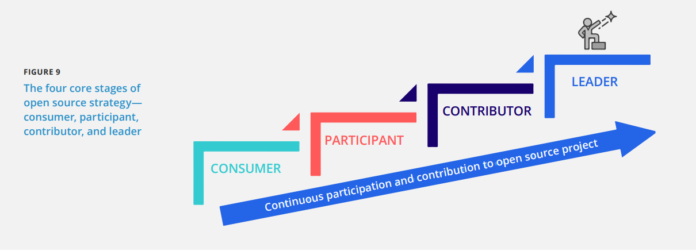
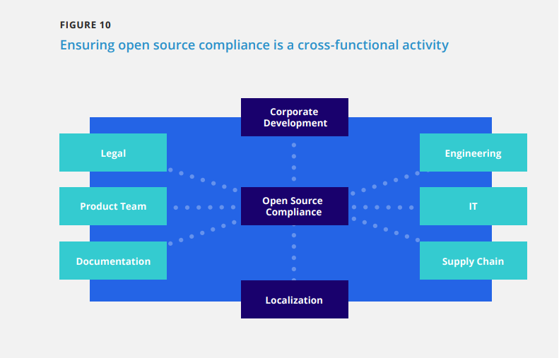
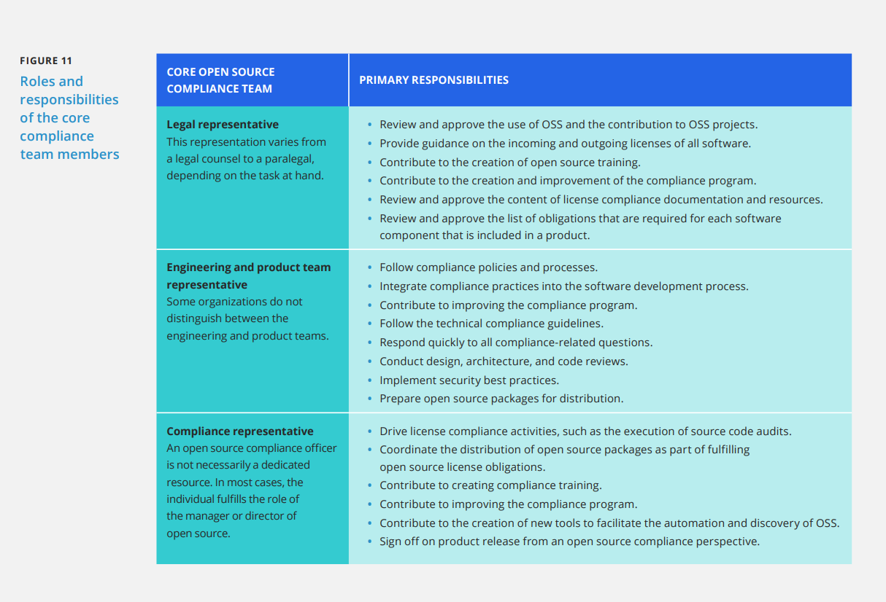
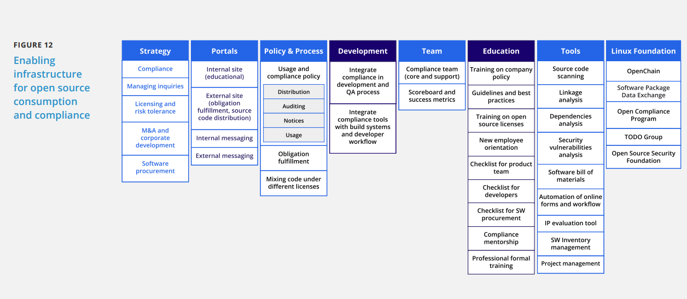
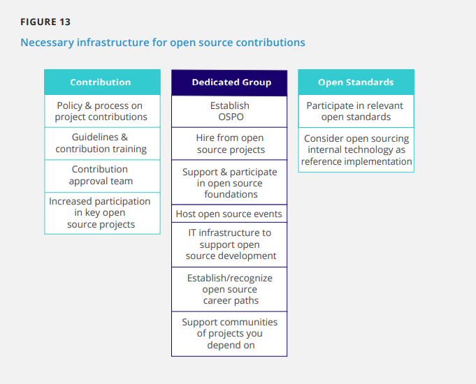

## **OSPO Responsibilities**
## **开源办公室(OSPO)的职责**
The OSPO assumes different responsibilities that change over time. In the following subsections, we explore these responsibilities and discuss them at length. You can also explore these responsibilities in [this interactive OSPO mind map](https://ospomindmap.todogroup.org/).
随着时间推移，OSPO在不同阶段职责会有所不同。在接下来的小节中，我们将对此进行详细的讨论。你也可以在[这个OSPO思维导图](https://ospomindmap.todogroup.org/)中找到这些职责的全景视图。
### **Develop and Execute an Open Source Strategy**
### **开源战略的规划和执行**
Since the beginning of the software industry, nearly every software organization has followed the same business model as follows: source code was developed by its employees or licensed from a third party, intellectual property was closely held, and software was delivered in a binary format to its clients. However, the availability of enterprise-grade OSS is changing how organizations develop and deliver products. With open access to source code and transparent development communities, software providers can reduce development costs while remaining active participants in the development process. In addition, end users of the software can also be active in the development process by contributing directly to upstream projects rather than be passive recipients of what the software vendor delivers to them. This development model enables organizations to think differently about how they procure, implement, test, deploy, and maintain software. In this report, we explore the following four basic strategies for organizations that utilize and integrate OSS in their products: consumer, participant, contributor, and leader.
软件产业有史以来，几乎每个软件组织都遵循如下的商业模式:源代码由其员工开发或从第三方获得许可，在严格的知识产权控制下，软件以二进制包的方式交付给客户。然而，企业级开源软件的可获得性正在改变组织开发和交付产品的方式。通过对开源代码开放访问和社区的公开透明的开发方式，软件供应商可以降低开发成本，同时保持在开发过程中的积极参与。此外，软件的最终用户也可以通过直接对上游项目的贡献在开发过程中发挥积极作用，而不再是被动地接受软件供应商的产品交付。这种开发模型使得组织开始重新思考如何更好的采购、实施、测试、部署和维护软件。在这份报告中，我们探讨了在产品中使用和集成开源软件（OSS）的组织的四种基本战略:消费者、参与者、贡献者和领导者。

<table>
    <tr>
        <td>FIGURE 9   The four core stages of open source strategy— consumer, participant, contributor, and leader  图表 9 开源战略的4个核心阶段-消费者、参与者、贡献者和领导者
        </td> 
   </tr>
    <tr>
        <td>    </td>
        <td>CONSUMER  消费者</td>
        <td>PARTICIPANT 参与者</td>  
        <td>CONTRIBUTOR 贡献者</td>  
        <td>LEADER 领导者</td>     
    </tr>
    <tr>
        <td>    </td>
        <td colspan="4">Continuous participation and contribution to open source project 持续的参与和贡献开源项目</td>   
    </tr>
</table>

FIGURE 9 illustrates the following four primary OSS strategies: consumption, participation, contribution, and leadership. Each strategy requires organizations to be successful at the previous strategy. How far your organization advances up this ladder is entirely dependent upon its objectives and overall open source strategy.
These four strategies overlap as organizations transition from one position into another. Typically, the early stages are engineering-driven due to engineers using open source components in product development. Initially, their participation in strategic projects may be limited to joining the conversation or making small contributions. Over time, this usage can grow within the organization and become part of the business strategy as it gains traction.
图9展示四个主要的OSS策略的阶梯状的发展阶段:消费者、参与者、贡献者和领导者。需要在前一种阶梯战略上取得成功后，组织才能进入到下一个战略阶段。您的组织在这个阶梯上的位置将完全取决于它的目标和总体开源战略。
当组织从一个阶段过渡到另一个阶段时，这四种策略会有交叠。通常，早期阶段是工程驱动的，因为工程师在产品开发中使用了开源组件。起步阶段，他们对战略项目的参与可能仅限于参与讨论或做出小的贡献。随着时间的推移，开源使用在组织不断增长从而发展成为商业战略的一部分。
Some organizations can achieve their goals simply by being consumers of open source code and are content to stay at that level while others have ambitions to attain certain leadership positions. As it is likely that your organization is already at one of these levels of the ladder, it is important to identify both your current position on the ladder and your target position.
一些组织可以通过成为开源代码的消费者来达成他们的商业目标，并且满足于停留在这个阶段，而另外一些组织则有强大的驱动力来获得领导地位。很可能你的组织已经处于这个阶梯中的一个阶段了，所以明确你的组织在阶梯中的当前位置和未来的目标位置非常重要。
### **Consumer Scenario**
### **消费者场景**
The common starting point is the adoption of OSS and integration of OSS in products and services. Voraciously consuming open source components will increase your ability to differentiate products and services and reduce your overall time and costs in delivering those products and services. The following action items are essential to this strategy:
这个场景的共同点是：选用开源软件并将开源软件集成到产品和服务中。积极主动的使用开源组件将会提升产品和服务的差异化竞争力并缩短产品和服务发布周期和降低上市/发布成本；在这种策略场景下，以下行为活动至关重要: 
- Set up an open source review board to serve as a clearinghouse for all open source activities, including license compliance.成立开源审查委员会，为组织内所有开源相关活动(包括许可证遵从)提供一个交流中心/能力平台。
- Use a strategic classification scheme to guide decisions on what OSS to consume.采用开源软件的分层分级的策略沙盘来指导开源软件的的使用决策；
- Create an inventory of all software that is used via SBOM to enable a more granular view of the licenses of the OSS in use to determine whether the enterprise is complying with all license obligations and identify any known security vulnerabilities.构建存量开源软件的SBOM的使用清单，以更细粒度（组件级/文件级/代码级粒度）地查看组织中使用的开源软件涉及的许可证清单，便于识别企业的许可证义务履行风险和已知安全漏洞的修复风险。
- Deploy automated workflow software for evaluating/approving open source usage.
部署软件工具链用以自动化评估和审批组织内开源软件的使用
- Create a plan for incremental investment in head count and infrastructure in engineering, product management, and legal to manage a complex mix of closed and open source software.
-规划新增投资，用于相关领域工程领域的能力建设（包括扩大人力，以及在工程、产品管理和法律基础设施的投资），便于管理复杂的专有软件和开源软件的组合场景下的合规问题。
>## Some organizations can achieve their goals simply by being consumers of open source code and are content to stay at that level, while others have ambitions to attain certain leadership positions.一些组织可以通过成为开源代码的消费者来达成他们的商业目标，并且满足于停留在这个阶段，而另外一些组织则有强大的驱动力来获得领导地位
When establishing a software strategy that encourages the use of OSS in commercial products, the following actions can be taken to ensure the successful adoption of OSS:
当在商业化的产品中制定一项拥抱开源、鼓励开源使用的策略时，可采取下列行动以确保开源软件的成功应用；
- Communicate the strategy for the use of OSS.
在组织内就开源软件的使用策略充分沟通，上下对齐达成一致
- Educate staff on open source compliance, license obligations, and the open source development model.
在开源规范遵从，开源义务履行，及开源开发模式上对组织成员进行培训赋能；
- Establish explicit criteria for determining which OSS is a candidate for inclusion in your products. Examples include the availability of new features, the maturity of the project’s source code, the size and composition of the project’s development community, and other factors that measure the state of the code and the people who maintain it.
建立清晰明确的开源软件选用评估规则，提供开源软件选型的实践样例包括开源软件新特性可用性评估，开源项目源码的成熟度评估，开源社区贡献者规模和组成的评估，及其他一些用来评估开源源码状态和维护人员状态的因素；
- Establish an open source compliance program to ensure that you have the processes in place to meet the license obligations of the OSS that you are using in your products.
建立开源软件合规程序，用于满足产品中使用的开源软件义务履行的流程需求；
- Encourage your developers to identify and adopt open source development tools that can enable better internal collaboration, increased and transparent team communication, and faster development cycles.鼓励组织内的开发人员选型使用开源开发工具，这些工具能够更好地实现内部协作，增加和透明的团队沟通，并加快开发周期。
- Encourage your staff to subscribe to open source mailing lists and
magazines, follow blogs, and participate in discussion forums.鼓励员工订阅开源邮件列表和杂志，关注博客，并参与论坛讨论。
- Encourage and fund staff’s attendance at open source conferences for learning and networking opportunities.
鼓励和赞助员工参加开源峰会，获得学习和建立关系网的机会。
- Join open source industry bodies and foundations, such as The Linux Foundation, for opportunities to share development and legal best practices with other leaders in the industry.
加入开源行业组织和基金会，例如Linux基金会，以便有机会与该行业的其他领导者分享开源开发和开源法务领域的最佳实践。
- Hire developers from the open source community.
雇佣开源社区的开发人员
- Host local open source user groups and encourage your staff to
get involved in local open source activities.
主办本地的开源用户组，并鼓励您的员工参与本地的开源活动。
- Invite community members to present to your development team on topics that are related to the project.邀请社区成员在开发团队内分享开源项目相关的主题。
### **Participant Scenario**
### **参与者场景**
Once your organization is successfully using OSS in products or services, you can expand your strategy to participate in the open source community. Unless you have already hired experienced developers, you may need to engage more closely with the community, increase your visibility, and begin attracting the talent that you need. The following action items are essential to participation:
一旦您的组织在产品或服务中成功地使用了开源软件，您就可以扩展您的策略来参与开源社区。除非你已经聘请了有经验的开发者，否则你可能需要与社区更密切地接触，提高知名度，并开始吸引你所需的人才。下列这些活动对于参与者策略场景下至关重要：
- Monitor community communication platforms, such as chat servers, mailing lists, forums, and websites, to keep on top of project developments.
动态获取社区交流平台的相关信息，如聊天服务器、邮件列表、论坛和网站的交互数据，以确保自己的组织在参与的社区项目开发中处于TOP参与的地位。
- Attend relevant conferences and meetups to establish relationships within the community.参加相关的峰会和meetup，在社区内建立关系。
- Sponsor project events and foundations to improve the enterprise’s visibility. 
以组织的名义赞助开源项目的活动和所在基金会，提升所在企业组织的知名度
>## Once your organization is successfully using OSS in products or services, you can expand your strategy to participate in the open source community.一旦您的组织在产品或服务中成功地使用了开源软件，您就可以扩展您的策略来参与开源社区。
### **Contributor Scenario 贡献者场景**
Once your enterprise realizes the benefits of participating regularly in the community, you can assess the advantages of contributing code to projects and communities. As code contributors help to shape future features, contributing source code to those open source projects that are critical to your business objectives is the best way to influence those projects and build a positive reputation. The following action items are essential to this scenario:
一旦您的企业认识到定期参与社区的好处，您就能够评估为项目和社区贡献代码的好处了。因为代码贡献者致力于塑造未来的特性，因此为那些对您的业务目标至关重要的开源项目贡献源代码是影响这些项目并建立积极声誉的最佳方式。以下活动对该策略场景至关重要:
- Educate your team on community development best practices.
用社区开发的最佳实践来培训赋能团队成员
- Actively participate and drive technical discussions on the mailing list, Slack, discussion forums, etc.
积极参与并推动相关技术讨论，包括邮件列表、Slack、论坛的讨论等等。
- Follow the open source community’s established working methods and processes.
遵循开源社区的工作方法和流程。
- File bug reports and contribute fixes to existing bugs.
提交BUG报告，修复已知BUG并贡献社区.
- Contribute code to improve or extend functionality.
贡献代码来优化或扩展开源社区项目的功能模块
- Contribute code to implement new features.
贡献代码实现新的特性
- Contribute bug fixes or other security measures
贡献BUG FIX或其他安全加固补丁
- Contribute to documentation efforts.
为社区项目文档做出贡献
- Contribute to testing and integration efforts (e.g., write test code, create test cases).
为社区项目的测试和集成做出贡献（比如，编写测试代码，构建测试用例）
- Listen to feedback on your contributions and act on it.
接纳别人对你的贡献的反馈并采取行动。
- Establish trust with the project maintainer and other project participants via your contributions and active participation. 
通过你的贡献和积极参与，与项目维护者和其他项目参与者建立信任。
- Hire a staff director to lead the open source strategy and manage the OSPO.
任命/雇佣一名主管来领导开源战略和管理开源管理办公室（OSPO）。
- Hire contributors and committers to open source communities that are vital to your products and services.
雇佣对你的产品和服务至关重要的开源社区的贡献者和提交者。
- Deploy open source collaboration tools to support open source usage and contributions.
部署开源协作工具以支撑开源的使用和贡献。
- Invest incrementally in engineering, product management, and legal resources to engage with external communities.
逐步投资于工程能力、产品管理和相关法律资源，以支撑与外部社区合规高效的交互。
### **Leadership Scenario**
### **领导者场景**
The highest form of open source strategy is leadership. Open source leaders earn their strategic positions by establishing trust with project members and maintaining a high level of continuous contribution. Leading organizations can capitalize on emerging trends in technology.开源战略的最高阶段是领导者场景。开源领导者通过与项目成员建立信任并保持高水平的持续贡献来赢得他们的战略地位。领先的组织可以利用新兴的技术趋势来为商业目标服务；

This scenario requires significant investment in targeted open source communities and consortia to establish a leadership agenda. In addition, it will require incremental investment primarily in engineering, product management, and legal to establish leadership in external communities and industry consortia. Below are some of the tactical steps that can help steer your organization toward a leadership role within a specific open source project:
这个场景需要对目标开源社区和联盟进行重大投资，以建立领导力行动规划。此外，需要在工程、产品管理和法律方面的做主要的增量投资，以建立外部社区和行业联盟的领导地位。以下是一些战术步骤，可以帮助您的组织在特定的开源项目中扮演领导角色:
Participate actively and openly within all aspects of the project, including
planning, development, testing, and release management, thereby demonstrating your capacity to act as a good steward of the project.
积极地、公开地参与开源项目的各个方面，包括项目的规划、开发、测试和发布管理，从而展示作为项目管理者的能力。
- Achieve a higher level of participation and contribution.
持续投入以取得更高水平的参与和贡献。
- Engage with the various project participants.
与不同的项目参与者保持交互。
- Contribute to patching bugs, adding new features, and extending functionality in existing open source projects using the best practices, which are outlined above
践行上述策略场景中列出的最佳实践，在现有的开源项目中贡献补丁、添加新特性和扩展功能
- Demonstrate good faith by contributing (when relevant) proprietary source code from internal development to open source projects under an appropriate open source license that makes it usable and useful to the community.
通过适当的开源许可证，将内部开发的专有源代码贡献给开源项目(如果相关的话)，以使其对社区生态发展有益，以此来展示诚意，
- Publicly acknowledge that the organization has achieved tangible benefits by working with open source communities for critical software product development
公开宣称，组织通过与开源社区合作在关键软件产品开发中已经获得了切实的利益
- Empower employees to seek maintainer status within the project.
使能员工在项目中寻求维护者的地位。
- Sponsor events, provide financial support for project infrastructure, and consider hiring recognized open source developers from within the project.
赞助活动，为项目基础设施提供资金支持，并在组织内考虑雇佣外部开源项目的知名的开发者。
- Increase participation in relevant open source organizations and foundations
加大相关开源组织和基金会投入力度；
- Lead architectural and requirement-gathering initiatives within the various communities and consortia to achieve commercial objectives.
在各类开源社区和联盟主导项目的架构和需求收集活动，以便于牵引商业目标的达成.
- Establish an open source architect role to proactively guide the use of and contributions to OSS.
任命一个开源架构师岗位，主动指导对开源软件的使用和贡献。
While there are numerous strategic objectives to choose from, the following objectives are common among organizations that use and develop OSS:
- Reduce development costs.
- Improve the quality and flexibility of products.
- Achieve a faster time to market for products.
- Increase engineering capacity through community engagement.
- Broaden and deepen developer community commitment to your open source efforts.
虽然有许多战略目标可供选择，但以下目标在使用和开发OSS的组织中是常见的:
- 降低开发成本。
- 提高产品的质量和灵活性。
- 加快产品上市时间。
- 通过社区参与提高工程能力。
- 撬动开源开发者深化和扩展在你所在的开源社区的贡献。
### **Oversee Open Source Compliance**
### **开源合规遵从的监管**
Open source initiatives provide organizations with a vehicle to accelerate innovation through collaboration with open source communities.开放源码促进会（OSI）为企业提供了工具/方法用于通过和开源社区的合作来加速创新
One core responsibility for organizations is their compliance with open source licenses. Open source compliance is the process by which users, integrators, and software developers observe copyright notices and satisfy the license obligations for their OSS components.企业拥抱开源的一个核心责任是开源许可证的遵从。开源义务履行是指用户、集成商和软件开发者遵守版权声明并履行其开源组件许可义务的过程。
Open source compliance helps to achieve the following four main objectives:
- Comply with open source licensing obligations.
- Facilitate effective use of OSS in commercial products and services.
- Comply with third-party software supplier contractual obligations.
- Protect commercial product differentiation.
开源义务履行有助于实现以下四个主要目标:
- 遵守开源许可义务。
- 促进开源软件在商业产品和服务中的有效使用。
- 遵守第三方软件供应商合同义务。
- 保护商业产品差异化竞争力。
OSPOs are generally involved in open source compliance in the following two ways:
1. They are responsible for implementing and running a complete end-to-open source compliance program, which includes the policy, process, tools, automation, education, and final fulfillment of obligations for OSS integrated into products, software, or services.
开源办公室（OSPOS）通常有以下两种方式参与开源遵从:
1、他们负责实施和运行一个端到到段完整的开源合规性计划，包括政策，流程，工具，自动化，赋能培训，并最终履行开源软件集成到产品，软件，或服务的义务。 
Or 或者 
2. They are responsible for establishing the organization’s general open source policies, and the execution and enforcement of these policies are pushed into the various divisions across the organization. For instance, ensuring open source compliance is a great example of a scenario where the OSPO is focused on policies and processes, and dedicated teams on the product side are more trusted than the actual implementation and execution of a compliance program. 2.他们负责建立组织内通用开源的政策，并在组织的各个团队或组织内实施落地和推行。例如，确保开源合规遵从是一个很好的例子，在这种情况下，OSPO（开源办公室）专注于政策和流程并在产品端的有专门团队来落地，比直接下发和推行合规计划更受信任。

The OSPO has a direct impact on the full scale of compliance responsibilities. Regardless of the specific role of an OSPO, it must have at least one individual who is very knowledgeable in open source licensing, compliance practices, and engineering.
开源办公室（OSPO）应该对组织内开源合规职责负有全面的直接影响。无论这个职责在开源办公室（OSPO）内对应什么具体的角色，他必须至少是一个熟知开源许可证规范、合规遵从实践和工程的人。

The minimum set of individuals that represent the core compliance team includes a legal representative, an engineering or product representative, and an open source compliance expert, who is often a member of the OSPO. In the following table, we briefly present the primary roles of these individuals who form the core open source compliance team. For a detailed discussion on the topic of open source compliance, please download the free e-book Open Source Compliance in the Enterprise, which was published by The Linux Foundation. The e-book is a practical guide for organizations on how best to use open source code in products and services and legally and responsibly participate in open source communities.开源合规团队核心代表的最小配置：包括一名法律代表、一名工程或产品代表，以及一名开源合规专家，后者通常是开源办公室（OSPO）的成员。在下表中，我们简要地介绍了这些开源合规团队的主要角色。关于开源合规的详细讨论，请下载由Linux基金会发布的免费电子书《企业中的开源合规》。这本电子书是一本实用指南，指导组织如何最好地在产品和服务中使用开源代码，以及如何合法、负责任地参与开源社区。

<table  style="text-align:center">
    <tr>
        <th colspan="3">FIGURE 10 Ensuring open source compliance is a cross-functional activity  图10 确保遵循开源是一项跨职能的活动</th> 
   </tr>
   <tr>
    <td colspan="3"> Corporate Development 公司发展 </td>
   </tr>
    <tr>
        <td>Legal  法务</td>
         <td>   </td>
        <td>Engineering 工程师</td>     
    </tr>
     <tr>
        <td>Product Team  产品团队</td>
         <td>Open Source Compliance  开源合规遵从</td>
        <td>IT IT团队</td>     
    </tr>
    <tr>
        <td>Documentation  资料团队</td>
         <td>   </td>
        <td>Supply Chain 供应链</td>     
    </tr>
    <tr>
        <td colspan="3">Localization 本地化</td>   
    </tr>
</table>

<table >
    <tr>
        <td rowspan="4"> FIGURE 11 Roles and responsibilities of the core compliance team members  图表11 开源合规团队核心代表的角色和职责 </td>
        <th >CORE OPEN SOURCE COMPLIANCE TEAM  开源合规团队的核心角色</th> 
        <th >PRIMARY RESPONSIBILITIES  主要职责</th> 
   </tr>
   <tr>
    <td > <b>Legal representative </b>  This representation varies from a legal counsel to a paralegal, depending on the task at hand. <b> 法务代表</b>  可以根据具体工作任务的情况由法律顾问或助理律师承担 </td>
    <td > 
    • Review and approve the use of OSS and the contribution to OSS projects. 
• Provide guidance on the incoming and outgoing licenses of all software. 
• Contribute to the creation of open source training. 
• Contribute to the creation and improvement of the compliance program. 
• Review and approve the content of license compliance documentation and resources. 
• Review and approve the list of obligations that are required for each software
component that is included in a product. •审查和批准开源使用和对上游开源项目的贡献 
•提供关于所有开源软件的引入和对外贡献中许可证的指导 
•参与开源培训的组建和贡献 
•协助建立和改进合规程序 
•审批license合规文档和资源的内容 
•审查和批准需要履行开源义务的产品软件清单</td>
   </tr>
   <tr>
    <td ><b> Engineering and product team representative</b> Some organizations do not distinguish between the engineering and product teams.  <b>工程代表或产品团队代表</b> 很多组织中工程代表和产品团队代表是一个角色没有区分</td>
    <td > • Follow compliance policies and processes. 
• Integrate compliance practices into the software development process. 
• Contribute to improving the compliance program. 
• Follow the technical compliance guidelines. 
• Respond quickly to all compliance-related questions. 
• Conduct design, architecture, and code reviews. 
• Implement security best practices. 
• Prepare open source packages for distribution. •遵循合规政策和流程

•将合规实践整合到软件开发过程中

•协助改进合规程序

•遵循技术规范

•快速回答所有与合规相关的问题

•负责设计、架构和代码评审

•实施安全最佳实践

•准备用于分发的开源包</td>
   </tr>
   <tr>
    <td > <b>Compliance representative</b> An open source compliance officer is not necessarily a dedicated resource. In most cases, the individual fulfills the role of the manager or director of open source. <b>合规代表</b> 开源合规官员不一定是专门岗位。在大多数情况下，这个岗位通常是开源经理或主管的角色.  </td>
    <td > • Drive license compliance activities, such as the execution of source code audits. 
• Coordinate the distribution of open source packages as part of fulfilling open source license obligations. 
• Contribute to creating compliance training. 
• Contribute to improving the compliance program. 
• Contribute to the creation of new tools to facilitate the automation and discovery of OSS. 
• Sign off on product release from an open source compliance perspective. •推动许可证合规活动，如执行源代码审计
•作为履行开源许可义务的一部分，协调开源包的分发

•协助创建合规培训

•协助改进合规程序

•帮助创建新的工具来促进OSS的自动化和发现

•从开源合规的角度签署产品发布</td>
   </tr>
 
</table>

Collectively, these three roles (legal, engineering, and compliance) are responsible for the following three main tasks:
总的来说，这三个角色(法律代表、工程产品代表和合规代表)主要负责以下三个任务:
1. Ensuring mutual compliance with third-party software and OSS licenses.1.确保第三方软件协议和开源软件的license相互兼容。
2. Facilitating the usage of and contributions to OSS.
2.促进OSS的使用和贡献。
3. Protecting proprietary intellectual property (and product differentiation) by ensuring that open source license obligations do not propagate to proprietary or third-party software. 3.确保开源许可义务履行不会感染或影响到专有或第三方软件的专有知识产权(和产品竞争力)。
### **Establish Open Source Policies and Processes**
### **构建开源策略和流程**
The policies and processes that the OSPO needs to create depend on the organization’s current and target position on the strategy ladder.
开源办公室（OSPO）需要根据战略阶梯上的当前和目标位置来制定开源策略并构建对应流程。
During the first stage (consumption), the OSPO needs to implement an open source infrastructure that can support the consumption and compliance aspects of OSS. FIGURE 12 illustrates infrastructure that goes beyond a simple policy to define the organization’s guidelines for using OSS. It extends to encompass a strategy that covers usage and compliance, incorporates compliance checkpoints in the development process, establishes a team to supervise the proper usage of open source, provides the necessary training, enables tooling, and facilitates relationships with relevant open source organizations. 
在第一阶段(消费阶段)，开源办公室（OSPO）需要完成一个开源基础设施的建设，它可以支撑开源软件的消费场景和开源合规遵从性方面。图12 展示了这个开源基础设施框架，它不仅是一个简单用于指导开源使用的策略。框架延展涵盖了各种场景下的开源策略服务，包含开源使用策略和遵从性规范，遵从规范在开发流程中的检查点，建立一个团队来监督指导开源的正确使用，提供必要的培训，使能工具流程，并促进团队与外部相关开源组织的关系。

### **Prioritize and Drive Upstream Open Source Development**
### **上游优先并驱动参与上游开源开发**
One of the primary responsibilities of an OSPO is to improve the organization’s engagement with the key open source projects that are used in products and services. The first step is to identify where the organization relies on OSS by surveying all products and reviewing the SBOM. 开源办公室（OSPO）的主要职责之一是提高组织中关键开源项目（在产品和服务中使用的）的上游参与度。第一步是通过SBOM工具来分析组织中的所有产品来确定组织那些部分最依赖开源组件。
The next step is to prioritize the OSS that is already in use and establis a contribution strategy. Such a focused approach allows the OSPO to show a return on investment across multiple products. In an enterprise setting, where the OSPO and open source engineering are cost centers, the driving force should be to focus on open source projects that directly support product development.
第二步是基于产品使用的开源软件建立上游贡献的优先级顺序。这种聚焦的方法允许开源办公室（OSPO）通过开源软件在跨产品使用上投资回报来作为衡量维度。在以开源办公室（OSPO）和开源工程为成本中心的企业环境中，投资的驱动力应该聚焦在直接支持产品开发的开源项目上。 
FIGURE 13 illustrates the additional elements that the OSPO needs to implement to support open source contributions.图13显示了为了支撑开源贡献，开源办公室（OSPO）还需要构建实施的其他要素。
### **Engage with Open Source Organizations**
### **参与开源组织**
Open source foundations are a great resource to extend your impact within the open source ecosystem. The best place to start is with foundations that host initiatives that are relevant to your products or technical interests. Many organizations find it worthwhile to get involved with well-known, established foundations, such as The Linux Foundation’s TODO Group, the Mozilla Foundation, or the Apache Foundation. If your organization is primarily concerned with legal dynamics, getting involved with organizations such as the Software Freedom Law Center or the Open Invention Network will prove valuable. The primary goal is to identify the opportunities within the ecosystem that your organization relies on. The OSPO is the entity that drives these relationships based on the organization’s open source strategy and product priorities.
开源基金会是扩展组织在开源生态系统中影响力的一个很好的资源。最好的起点是和基金会联合主办与产品或技术相关的活动。许多组织都认为与知名的基金会组织合作是有价值的，例如Linux基金会的TODO工作组、Mozilla基金会或Apache基金会。如果你的组织主要关注法律动态，那么加入诸如软件自由法律中心（SFLC）或开放发明网络（OIN）这样的团体被证明是有价值的。加入这些团体的主要目标是识别机会借以提升和发展你所在组织的生态位；开源办公室（OSPO）是基于开源战略和产品优先级驱动外部生态关系发展的实体。
### **Track Performance Metrics**
### **追踪绩效指标**
One of the more difficult tasks for an OSPO is decision-making on key performance indicators or metrics that the office should track to incentivize engineers toward the desired behavior. The traditional metrics, which are often used in product organizations, do not apply in the context of open source development. Therefore, new metrics are required. Many OSPOs use specialized tools to track their organization’s contributions to open source projects, analyze the type of contributions from their organization, identify contribution patterns, and provide recommendations to improve the development impact.
对于开源办公室（OSPO）来说，更有挑战的任务之一是基于关键绩效度量指标做出对应的决策，开源办公室需要跟踪这些度量指标，以牵引工程师按预期的方向前行。在产业或商业组织中经常采用的传统的度量标准并不适用在开源开发场景下。因此，需要拟定新的度量标准。开源办公室（OSPO）使用专业化的工具来跟踪其组织对开源项目的贡献，分析来自其组织的贡献类型，确定贡献模式，并提供建议以提高组织的开源开发对生态的影响力。

### **IMPLEMENT INNERSOURCE PRACTICES**
### **实施内部开源开发实践**
Innersource describes the process of applying the lessons that were learned from open source development methodology to internal projects.The goal is to incubate the same values in the enterprise as those that are common in the collaborative, open source development model.内源（Innersource）是指将外部开源社区中的开源方法论（包括经验教训）应用到内部项目的过程。目的是将开源开发和协作模型中通用的价值观和习惯在企业内部也培养孵化出来； 
A great method for OSPOs to expand the impact of open source is to foster internal collaboration using innersource practices. These internal collaborations present incredible visibility opportunities for the OSPO with other departments or teams within the organization. In addition, such interactions and collaborations position the OSPO staff as the internal experts on open source practices and create new opportunities to collaborate with R&D and product teams.
开源办公室（ospo）扩大开源影响的一个很好的方法是利用内源实践加强团队协作。这些内部协助为开源办公室（OSPO）提供了极大的被看见的机会，让在组织内的其他部门或团队发现和了解开源办公室（OSPO）的工作。除此之外，这种互动和合作也可以将开源办公室（OSPO）成员定位为开源实践的内部专家，并创造与研发和产品团队合作的新机会。
### **GROW OPEN SOURCE TALENT INSIDE THE ORGANIZATION**
### **在组织内部发掘和培养开源人才**
One of the core responsibilities of an OSPO is to grow the open source talent inside the organization. To do so, OSPOs can run various programs, including workshops,training, mentoring, and internal evangelizing. Education is an essential building block in an OSPO, and it falls into the following two categories: technical training to expand open source technical knowledge and compliance training to ensure that the employees possess a good understanding of the policies that govern the use of OSS. The goal of this training is to raise awareness of open source policies and strategies to build a common understanding of the issues and facts of open source licensing and the business and legal risks of incorporating OSS in products or software portfolios. The training also serves as a venue to publicize and promote compliance policies and processes within the organization and foster a culture of compliance.
开源办公室（OSPO）的核心职责之一是发掘和培养组织内部的开源人才。为此，开源办公室（OSPO）可以运作各类活动项目，包括研讨会、培训、指导和内部传道。培训赋能是开源办公室（OSPO）工作中必不可少的组成部分，它分成以下两类:开源技术培训以拓展员工的开源知识边界，开源合规遵从性培训以确保员工对开源使用管理策略有很好的理解。这类培训的目标是提升员工对开源政策和策略的认识，建立对开源许可证的问题和现象的共识，让员工了解集成开源软件的产品或软件组合中隐藏的商业和法律风险。赋能培训也为组织宣传推广开源合规政策流程及加强开源合规文化提供场所 
Moreover, OSPOs can create mentoring programs where senior open source developers mentor junior developers, review their code commits, provide feedback on code before it is submitted to the upstream projects, and generally act as an advisor. The goal is to accelerate learning and support junior developers to become more effective and influential in open source projects. 
此外，开源办公室（OSPO）可以创建导师孵化项目计划，资深的开源开发人员通常作为项目顾问指导初级开发人员，在代码提交给上游项目之前，审查他们提交的代码，并提供反馈和建议。这类计划的目标是促进学习使得低级别的开发者在上游开源开发项目中更有效率和影响力。
>## A great method for OSPOs to expand the impact of open source is to foster internal collaboration using innersource practices. These internal collaborations present incredible visibility opportunities for the OSPO with other departments or teams within the organization.开源办公室（ospo）扩大开源影响的一个很好的方法是利用内源实践加强团队协作。这些内部协助为开源办公室（OSPO）提供了极大的被看见的机会，让在组织内的其他部门或团队发现和了解开源办公室的工作（OSPO） 
### **OFFER ADVICE ON OPEN SOURCE**
### **提供开源建议**
OSPOs act as advisors on all matters related to OSS, whether they are internal issues to the organization or external issues relating to compliance, open source foundations, open standards, mergers and acquisitions, or other matters. Because of the importance of this advisory role, senior OSPO staff plays a critical role in shaping their organizations’ software strategy, as OSS is critical within the larger software ecosystem.
开源办公室（OSPO）在所有与开源相关的事务上都可以担任咨询顾问角色，无论这些事务是组织的内部问题，还是与开源合规、开源基金会、开放标准、合并和收购或其他事务相关的外部问题。由于开源软件在更大的软件生态中极其重要，再加上这个咨询顾问角色的重要地位，开源办公室（OSPO）的资深成员在组织软件战略的形成上会起到至关重要的作用；
### **MANAGE OPEN SOURCE IT INFRASTRUCTURE**
### **管理开源IT基础设施**
One of the OSPO’s challenges is to ensure that their organization provides an IT infrastructure that allows open source developers to communicate and work with the open source projects with minimal challenges. The following three primary domains of IT services are common in open source development:
开源办公室（OSPO）面临的挑战之一是确保他们的组织能为开发者提供一个IT基础设施平台，开源项目的开发者可以基于此平台无障碍的交流和工作。以下三个主要的IT服务在开源开发领域中是常见的:
1. Knowledge sharing: wikis, collaborative editing platforms, and public websites.知识分享型服务：维基、协作编辑平台和公共网站；
2. Communication and problem-solving: mailing lists, forums, and real-time chat.交流和问题解决型服务：邮件列表、论坛和实时交流平台。
3. Code development and distribution: code repositories and bug-tracking platforms.代码开发和发布服务（CICD服务）：代码仓和bug跟踪平台 

Some or all of these tools will need to be available internally to effectively support open source development. These open source practices typically require an IT infrastructure that is less restrictive than a typical corporate environment. If this situation conflicts with existing organization-wide IT policies, it is vital to resolve these conflicts and allow open source developers to use the tools that are most familiar to them.
It is worth noting that some OSPOs in large organizations create and manage their own IT infrastructure independently from their corporate IT departments. 
这些IT基础设施服务的部分和全部在组织的内部也需要无障碍的获得以便高效的支撑开源开发活动；在开源实践中，典型的需求就是开源基础设施服务要比组织内部的协作环境需要更少的的限制。如果这种情况与现有的组织范围内的IT策略冲突，那么解决这些冲突并允许开源开发人员使用他们最熟悉的工具是至关重要的。
值得注意的是，一些大型组织中的开源办公室（OSPO）是独立于企业It部门创建和管理自己的It基础设施的。

> ## Saying “no” is unequivocally the author’s favorite OSPO responsibility. OSPOs act as a gating function for all major contributions that leave the organization, including new projects or contributing major proprietary code. Saying “no” is the responsibility of OSPO leaders when proposals to release open source projects or contribute significant bodies of code do not meet the proper requirements for success. 说“不”无疑是作者最为赞赏的开源办公室（OSPO）的责任。开源办公室（OSPO）对组织中所有重大开源贡献或开源捐赠起到门禁作用，包括开源新项目或贡献重要的专有代码。当发布开源项目或贡献大量代码的提议不匹配成功的目标导向时，OSPO领导人有责任说“不”。
### **ELIMINATE FRICTION FROM USING AND CONTRIBUTING TO OPEN SOURCE**
### **消除使用和贡献开源的阻力**
OSPOs help organizations navigate internal politics or policies, maintain relationships with communities of strategic importance, and continuously improve processes and tools to scale and reduce the learning curve and manual effort that is required.
开源办公室（OSPO）牵引组织内部有合适的开源政策和策略，维护重要的战略社区的关系，并持续优化流程和工具，快速提升团队的学习能力降低人力成本。
### **SUPPORT CORPORATE DEVELOPMENT ACTIVITIES**
### **支撑企业发展活动 **
OSPOs should be involved with open source due diligence (technical and compliance) as a part of corporate development. The two major scenarios are merger and acquisition transactions and outsourced development.
作为公司发展的一部分，开源办公室（OSPO）应该参与开源相关业务的经营评估(技术和合规)。有两种主要的场景：并购交易和外包开发。
### **Mergers and Acquisitions**
### **并购评估**
If an organization is considering a merger or is the target of an acquisition, the OSPO is a great source of expertise for open source technology and compliance due diligence. OSPOs can help their organization to understand the open source code that is used by the target organization and its implications as part of the due diligence process.
如果一个组织正在考虑合并或被收购，开源办公室（OSPO）是开源技术和合规评估的一个重要专业意见的来源。作为经营评估过程的一部分，开源办公室（OSPO）可以参与到经营评估的工作中，去帮助组织梳理分析目标企业使用的开源代码及其隐藏的风险和影响。
### **Outsourced Development**
### **外包开发**
The OSPO can also support corporate development when negotiating the outsourced development of software, which will ensure that the proper compliance procedures are followed according to the organization’s policies and processes.
当洽谈软件外包开发业务时，开源办公室（OSPO）可以确保组织的政策和流程都遵循适当的开源合规程序，以此来支持企业业务发展；
### **COLLABORATE WITH UNIVERSITIES ON OPEN SOURCE PROJECTS**
### **与大学开展开源项目合作**
Many universities are eager to work with organizations that offer learning opportunities for their students and provide them with realworld development experience. Often, this relationship is also beneficial to the organizations that are involved because it can be a great way to develop new talent in existing open source communities and attract new development talent from a trusted source. This is particularly useful for projects that have a shortage of experienced developers and are typically more difficult to hire for. As the supply of talented programmers is limited, finding a way to tap into new knowledge and influence favorable outcomes in external projects, including academia, is vital.
许多大学都希望能与企业合作为他们的学生提供学习机会和真实业务的开发经验。通常情况下，这种关系对参与其中的组织也是有益的，因为这可能是从现有的开源社区中挖掘、吸引新的开发人才一个来源可信赖的好方法。这对于急需有经验的开发人员并且又很难雇佣到员工的项目特别有用。因为有天赋的程序员是稀缺的，找到一条途径能利用新的知识体系并对外部项目产生有影响力的价值产出（包括学术产出）是至关重要的。
### **KNOW WHEN TO SAY “NO”**
### **知道什么时候说“不”**
Saying “no” is unequivocally the author’s favorite OSPO responsibility. OSPOs act as a gating function for all major contributions that leave the organization, including new projects or contributing major proprietary code. Saying “no” is the responsibility of OSPO leaders when proposals to release open source projects or contribute significant bodies of code do not meet the proper requirements for success.
说“不”无疑是作者最为赞赏的开源办公室（OSPO）的责任。开源办公室（OSPO）对组织中所有重大开源贡献或开源捐赠起到门禁作用，包括开源新项目或贡献重要的专有代码。当发布开源项目或贡献大量代码的提议不匹配成功的目标导向时，OSPO领导人有责任说“不”。
