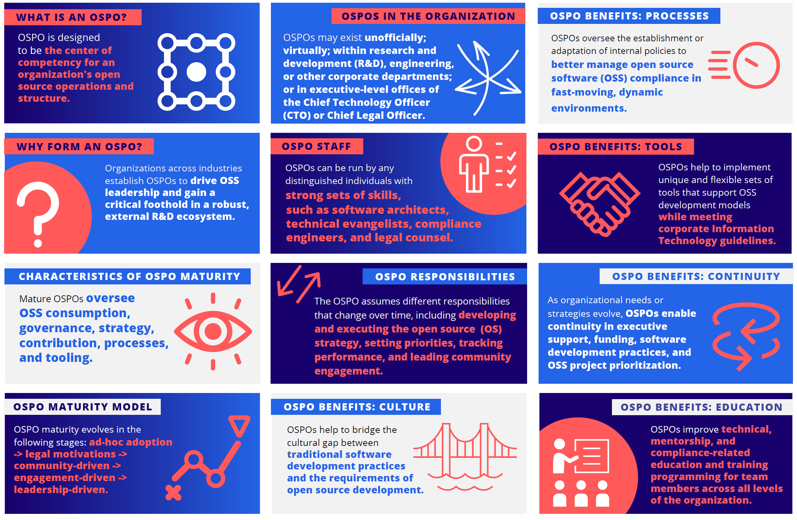
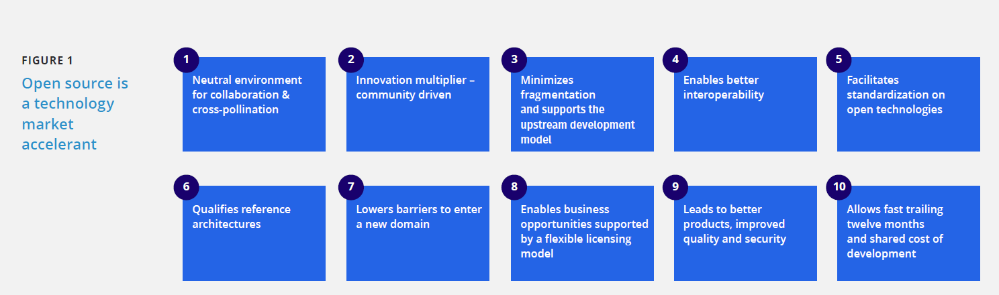
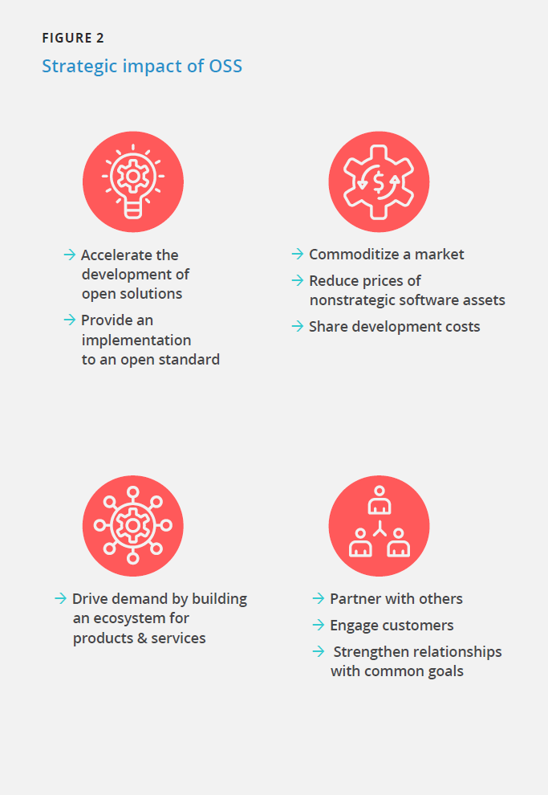
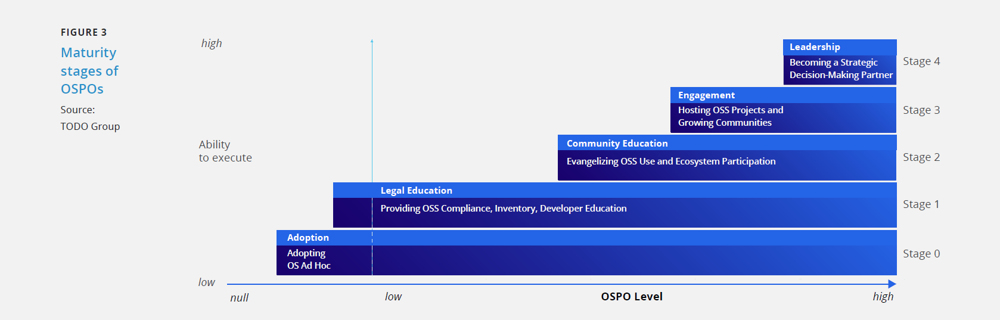
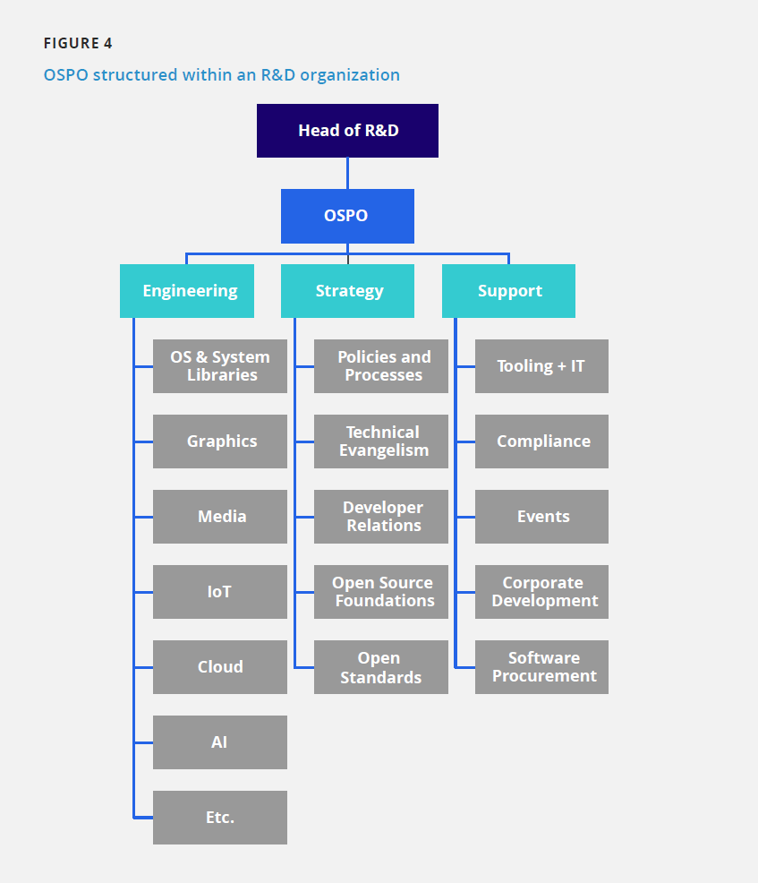

**A Deep Dive Into**

**Open Source Program Offices**

**Structure, Roles, Responsibilities, and Challenges**

**August 2022**

Ibrahim Haddad, Ph.D.

Vice President of Strategic Programs, _Linux Foundation_

and General Manager, _LF AI & Data_

With a foreword by Chris Aniszczyk,

Chief Technology Officer, _Linux Foundation_

and Co Founder, _TODO Group_

**In partnership with:**

# Contents

[Foreword 3](#foreword)

[Abstract 5](#abstract)

[Introduction 6](#introduction)

[OSPO Definition 7](#_bookmark3)

[OSPO Characteristics 7](#_bookmark3)

[OSPO Maturity Model 8](#ospo-maturity-model)

[Stage 0: Ad-Hoc Approach 9](#stage-0-ad-hoc-approach)

[Stage 1: Legal-Driven Adoption 9](#stage-0-ad-hoc-approach)

[Stage 2: Community-Driven Adoption 9](#stage-0-ad-hoc-approach)

[Stage 3: Engagement-Driven Adoption 10](#stage-3-engagement-driven-adoption)

[Stage 4: Leadership-Driven Adoption
10](#stage-3-engagement-driven-adoption)

[OSPO Structure 11](#ospo-structure)

[Example 1: OSPO Within an R&D Department 11](#ospo-structure)

[Example 2: Corporate-Level OSPO With Supporting Division-Level OSPOs
12](#example-2-corporate-level-ospo-with-supporting-division-level-ospos)
[Example 3: OSPO as Part of the CTO Office or Engineering Department
12](#example-2-corporate-level-ospo-with-supporting-division-level-ospos)

[Example 4: Virtual OSPO 13](#example-4-virtual-ospo)

[Example 5: No Official OSPO 13](#example-4-virtual-ospo)

[Staffing an OSPO 14](#staffing-an-ospo)

[Head of OSPO 14](#staffing-an-ospo)

[Software Architect 14](#staffing-an-ospo)

[Technical Evangelist 14](#staffing-an-ospo)

[Compliance Engineer 14](#staffing-an-ospo)

[Legal Counsel 14](#staffing-an-ospo)

[OSPO Responsibilities 15](#ospo-responsibilities)

[Develop and Execute an Open Source Strategy 15](#ospo-responsibilities)

[Oversee Open Source Compliance 19](#oversee-open-source-compliance)

[Establish Open Source Policies and Processes 21](#_bookmark15)

[Prioritize and Drive Upstream Open Source Development 22](#_bookmark16)

[Engage with Open Source Organizations 22](#_bookmark16)

[Track Performance Metrics 22](#_bookmark16)

[OSPOs and Eliminating Friction
From](#ospos-and-eliminating-friction-from-using-or-contributing-to-oss)

[Using or Contributing to OSS
25](#ospos-and-eliminating-friction-from-using-or-contributing-to-oss)

[Culture
25](#ospos-and-eliminating-friction-from-using-or-contributing-to-oss)

[Processes 26](#processes)

[Continuity 26](#processes)

[Education 27](#_bookmark19)

[The TODO Group 28](#the-todo-group)

[Conclusion 28](#the-todo-group)

[Acknowledgments 29](#acknowledgments-feedback)

[Linux Foundation Resources 29](#acknowledgments-feedback)

[Feedback 29](#acknowledgments-feedback)

[About the Author 30](#about-the-author)

[Disclaimer 30](#about-the-author)

# Foreword

前言

If you\'re like most corporate leaders, you\'re likely to be familiar
with open source and may even already have an open source program in
place. But what exactly is an [O[pen Source Program Office
(OSPO)](https://github.com/todogroup/ospodefinition.org)],
what roles and responsibilities does it have, and how can it
contribute to your organization\'s success?

如果你跟大多数企业领导一样，那么你可能已经对开源很熟悉，甚至可能已经有开源项目在运作中。但[开源项目办公室（Open Source Program Office, OSPO）](https://github.com/todogroup/ospodefinition.org)究竟是什么，它有哪些角色和职责，以及它能为你组织的成功做出怎样的贡献呢？

An OSPO is a corporate entity that is responsible for managing and
coordinating an organization\'s open source activities. The OSPO can
be seen as the central nervous system for an organization\'s open
source strategy, and it provides governance, oversight, and support
for all things related to open source.

OSPO是公司内负责管理和协调组织开源活动的一个实体部门。OSPO可以被视为组织开源战略的中枢神经系统，它为所有与开源相关的事情提供治理、监督和支持。

At The Linux Foundation, we view OSPOs as critical components of
successful organizations. We\'ve seen firsthand how an effective OSPO
can help an organization achieve its business goals and objectives by
leveraging the power of open source. The
[[TODO]](https://todogroup.org/) can help you set up an
OSPO or take your existing program to the next level.

在Linux基金会，我们将OSPO视为成功组织的关键组成部分。我们亲眼目睹了有效的OSPO如何通过利用开源的力量帮助组织实现其业务目标。[TODO工作组](https://todogroup.org/)可以帮助你创建一个OSPO或将你现有的项目提升到一个新的水平。

The TODO Group is a group of organizations that are committed to
building the best practices and tools for managing successful open
source programs. We are the leading voice on all things related to
open source program management, with a growing community of practice
that includes some of the world\'s largest organizations. We encourage
you as a practice leader, or someone who is thinking about setting up
an OSPO, to join us.

TODO工作组是由致力于构建最佳实践和工具以管理成功开源项目的一群组织组成。我们是所有与开源项目管理相关事务的引领者，拥有不断增长的实践社区，其中包括一些世界上最大的组织。我们鼓励作为实践领导者的你或正在考虑建立OSPO的其他人加入我们。

This paper is an introduction to setting up an OSPO. It covers the
what, why, and how of open source program management, with a focus on
the role of an OSPO and the benefits. It also includes descriptions of
various structural models for OSPOs and provides tips and best prac-
tices for success. We hope that you find it helpful as you embark on
your open source journey.

本文是对建立OSPO的介绍，涵盖了开源项目管理的内容、原因和方式，重点介绍了OSPO的作用和益处。文中还包括了对OSPO各种结构模型的描述，并提供了取得成功的技巧和最佳实践。我们希望它为你踏上开源之旅带来帮助。

**Chris Aniszczyk**

Chris Aniszczyk 

_CTO, The Linux Foundation Co-Founder, The TODO Group_

CTO，Linux基金会联合创始人，TODO工作组

**3**

| &nbsp;  | &nbsp;   | &nbsp;   |
|-------------- | -------------- | -------------- |
| WHAT IS AN OSPO? OSPO is designed to be the center of competency for an organization's open source operations and structure. 什么是OSPO？ OSPO旨在成为组织中开源运营和结构的能力中心。| OSPOS IN THE ORGANIZATION OSPOs may exist unofficially; virtually; within research and development (R&D), engineering, or other corporate departments; or in executive-level offices of the Chief Technology Officer (CTO) or Chief Legal Officer. 组织中的OSPO OSPO可能以非正式和虚拟的形式存在于研发（R&D）、工程或其他公司部门中；或者在首席技术官（CTO）或首席法律官的管理层办公室中。| OSPO BENEFITS: PROCESSES  OSPOs oversee the establishment or adaptation of internal policies to better manage open source software (OSS) compliance in fast-moving, dynamic environments.  OSPO的益处：流程  OSPO监督内部政策的制定或调整，以在快速变化的动态环境中更好地管理开源软件 (OSS) 合规性。|
| WHY FORM AN OSPO? Organizations across industries establish OSPOs to drive OSS leadership and gain a critical foothold in a robust, external R&D ecosystem. 为什么要成立OSPO？ 跨行业的组织建立OSPO以推动OSS的领导地位，并在强大的外部研发生态系统中获得关键立足点。|OSPO STAFF OSPOs can be run by any distinguished individuals with strong sets of skills, such as software architects, technical evangelists, compliance engineers, and legal counsel.  OSPO工作人员 OSPO可以由任何具有强大技能的杰出人士运营，例如软件架构师、技术布道者、合规工程师和法律顾问。 | OSPO BENEFITS: TOOLS OSPOs help to implement unique and flexible sets of tools that support OSS development models while meeting corporate Information Technology guidelines.  OSPO的益处：工具 OSPO有助于实施独特而灵活的工具集，这些工具集支持OSS开发模型，同时可以满足企业信息技术准则。| 
|CHARACTERISTICS OF OSPO MATURITY Mature OSPOs oversee OSS consumption, governance, strategy, contribution, processes, and tooling. OSPO成熟度的特征 成熟的OSPO负责监督OSS的使用、治理、战略、贡献、流程和工具。| OSPO RESPONSIBILITIES The OSPO assumes different responsibilities that change over time, including developing and executing the open source  ( OS ) strategy, setting priorities, tracking performance, and leading community engagement. OSPO职责 OSPO会随着时间的推移承担不同的职责，包括开发和执行开源（OS）战略、设置优先级、跟踪表现和领导社区参与。| OSPO BENEFITS: CONTINUITY As organizational needs or strategies evolve, OSPOs enable continuity in executive support, funding, software development practices, and OSS project prioritization. OSPO的益处：延续性 随着组织需求或战略的发展，OSPO能够实现行政支持、资金、软件开发实践和OSS项目优先级的延续性。|
|OSPO MATURITY MODEL  OSPO maturity evolves in the following stages: ad-hoc adoption -> legal motivations -> community-driven -> engagement-driven -> leadership-driven. OSPO成熟度模型 OSPO成熟度分为以下阶段：临时采用 -> 法务驱动 -> 社区驱动 -> 参与驱动 -> 领导力驱动 | OSPO BENEFITS: CULTURE OSPOs help to bridge the cultural gap between traditional software development practices and the requirements of open source development.  OSPO的益处：文化 OSPO有助于跨越传统软件开发实践与开源开发要求之间的文化鸿沟。| OSPO BENEFITS: EDUCATION OSPOs improve technical, mentorship, and compliance-related education and training programming for team members across all levels of the organization. | OSPO的益处：教育 OSPO为组织内各级别的团队成员改进技术、指导和合规相关的教育和培训方案。| 
# Abstract

摘要

Open source projects and initiatives provide enterprises with proven,successful models to collaborate with other organizations, create new technologies, and support the development of new communities. Organizations across many industries are establishing [[Open]](https://github.com/todogroup/ospodefinition.org) [[Source Program Offices]](https://github.com/todogroup/ospodefinition.org)(OSPOs) and staffing them with highly skilled individuals to drive open source software(OSS) leadership and gaina critical foothold in this external research and development (R&D) ecosystem.

开源的项目和方案为企业提供了经过验证的、成功的模型，以指导企业与其他组织协作、创建新技术和支持新社区的开发。许多行业的组织正在建立[开源项目办公室（OSPO）](https://github.com/todogroup/ospodefinition.org)，并为他们聘请高技能人士，以推动开源软件（Open Source Software，OSS）的领导地位，并在这个外部研发（R&D）生态系统中获得关键的立足点。

This report examines how enterprises structure their OSPOs and the required minimal staffing needed for their operation, discusses the responsibilities of such offices, and elaborates on the challenges that are faced in open source enterprise adoption.

本报告探讨了企业如何构建他们的OSPO，以及运营所需的最低人员配置，讨论了此类办公室的职责，并详细阐述了开源企业采用所面临的挑战。

# Introduction

# 介绍

The availability of open source software (OSS) is changing how organizations develop and deliver products. The combination of a transparent development community and access to public source code enables orga- nizations to think differently about how they procure, implement, test, deploy, and maintain software (**FIGURE 1**). OSS has created an ecosystem with a wealth of benefits for all those involved. Organizations of all types, across all industries and domains, are racing to build and grow their open source operations under an Open Source Program Office (OSPO) to help them use and contribute to open source more efficiently and effectively and benefit from its strategic impact (**FIGURE 2**).

开源软件（OSS）的可用性正在改变组织开发和交付产品的方式。透明的开发社区和对公开源代码的获取相结合，使组织能够以不同的方式思考他们如何采购、实施、测试、部署和维护软件（图1）。OSS创造了一个可为所有相关人员带来丰富利益的生态系统。所有行业和领域中各种类型的组织竞相在开源项目办公室（OSPO）下建立和发展他们的开源业务，以帮助他们更有效地使用开源并为之贡献，同时从其战略影响中受益（图2）。

OSS allows shared development and lowers research and development (R&D) costs by enabling organizations to reap the benefit of billions of dollars of OSS, which they can harness to create better products and services. In addition, it helps to accelerate product development and enables a faster time to market by aligning business needs with upstream open source projects. Organizations do not get involved in open source projects because it is fun; they do it because it is a part of their business or product strategy. OSPOs often manage and orchestrate that involvement.

OSS允许共享开发，并能让组织从OSS中获益数十亿美元，从而降低研发 (R&D) 成本。组织可以利用这些收益来创造更好的产品和服务。此外，通过将业务需求与上游开源项目保持一致，它有助于加速产品开发并缩短产品上市时间。组织参与开源项目不是因为它有趣，他们这样做是因为这是他们业务或产品战略的一部分。OSPO经常管理和协调这种参与工作。

The first step in establishing an OSPO is understanding that open source is key to mastering software engineering, as almost everysoftware product that exists today relies on OSS. Leading organiza-tions in a growing number of industries have established theirposition by becoming leaders in software development, and OSS is acritical component of this leadership. The second step is theavailability of an executive sponsor within the organization who will support the []{#\_bookmark3 .anchor}establishment of an OSPO,provide funding for it, and offer a long-term commitment to improvingand growing open source engineering in the organization. This person also plays a critical role inidentifying a trusted open source leader who can create and developthe OSPO. 

建立OSPO的第一步是理解开源是掌握软件工程的关键，因为当今存在的几乎所有软件产品都依赖于OSS。越来越多的行业领先组织通过成为软件开发的领导者确立了自己的地位，而OSS是这种领导地位的关键组成部分。第二步是组织管理层中存在一位发起人，他将支持OSPO的建立、为其提供资金，并长期致力于改进和发展组织中的开源工程。此人对识别值得信赖的、能创建和发展OSPO的开源领导者也发挥着关键作用。

FIGURE 1 Open source is a technology market accelerant
 

1 Neutral environment for collaboration & cross-pollination 

2 Innovation multiplier – community driven 

3 Minimizes fragmentation and supports the upstream development model 

4 Enables better interoperability 

5 Facilitates standardization on open technologies 

6 Qualifies reference architectures 

7 Lowers barriers to enter a new domain 

8 Enables business opportunities supported by flexible licensing model

9 Leads to better products, improved quality and security

10 Allows fast trailing twelve months and shared cost of development 

图1 开源是技术市场的助推器

1. 协作和相互交流的中立环境
2. 创新倍增器——社区驱动
3. 最大限度减少碎片化，支持上游开发模式
4. 实现更好的互操作性
5. 促进开放技术的标准化
6. 限定参考架构
7. 降低进入新领域的门槛
8. 实现受灵活许可模式支持的商机
9. 带来更好的产品、更高的质量和安全性
10. 允许快速跟踪12个月并分摊开发成本

FIGURE 2 Strategic impact of OSS

- Accelerate the development of open solutions 
- Provide an implementation to an open standard
- Drive demand by building an ecosystem for products & services
- Commoditize a market 
- Reduce prices of nonstrategic software assets 
- Share development costs
- Partner with others 
- Engage customers
- Strengthen relationships with common goals

图2 OSS的战略影响

- 加快开发开放式解决方案
- 提供开放标准的实施方案
- 通过建立产品和服务的生态系统来拉动需求
- 形成商品化的市场
- 降低非战略性软件资产的价格
- 分摊开发成本
- 与他人合作
- 吸引客户
- 加强与共同目标的关系

# OSPO Definition 
# OSPO的定义

An OSPO is designed to do the following: (1) be the center of compe-tency for an organization\'s open source operations and structure and (2) place a strategy and set of policies on top of an organization\'s open source efforts. This can include setting code use, distribution, selection, auditing, and other policies; training developers; ensuring legal compliance; and promoting and building community engagement to benefit the organization strategically. See the [OSPO definition](https://github.com/todogroup/ospodefinition.org) by the TODO for more information.

设立OSPO的目的包括：（1）成为组织中开源运作和架构的能力中心，以及（2）基于组织的开源活动制定一套战略和政策。其中可能包括设置开源代码的使用、分发、选择、审计等策略；培训开发者；确保法务合规性；促进和逐步增强社区参与，使组织在战略上受益。如果你想要了解更多信息，请参考TODO的[OSPO定义](https://github.com/todogroup/ospodefinition.org)。

# OSPO Characteristics
# OSPO的特征

To a certain degree, an organization calling itself an OSPO indicates that the organization has reached a mature stage, gained critical mass support with its enterprise, and manifests the following five key characteristics:

1. Employees are tasked with fostering and nurturing OSS usage.
2. The organization has a formal policy regarding the use and production of OSS.
3. Executives recognize that OSS and open source are important strategic assets.
4. Significant numbers of employees are contributing code to open source projects.
5. Processes, procedures, and tools are in place to streamline and facilitate open source consumption and participation.

在一定程度上，如果组织中有被称为OSPO的部门，则表明开源在该组织中已达到相对成熟的阶段，且已在企业内获得绝大多数支持，同时组织表现出以下五个关键特征：
1. 员工负责促进开源软件的使用。
2. 组织正式发布了关于使用和生产开源软件的策略。
3. 管理层意识到开源软件和开源是重要的战略资产。
4. 大量的员工在为开源项目贡献代码。
5. 用来简化组织使用和参与开源的流程、步骤和工具已就绪。

# OSPO Maturity Model
# OSPO成熟度模型
To better explain the evolution of OSPOs, the TODO Group has developed a model (**FIGURE 3**) to assist organizations in determining their OSPO and identifying the elements that need to be implemented to advance the maturity of their OSPO. This model is composed of the following two vari- ables and five stages:

为了更好地解释OSPO的演变，TODO工作组建立了一个模型（图3）来协助各组织确定其OSPO所处阶段、找出为促进其OSPO走向成熟而需要实施的要素。该模型由以下两个变量和五个阶段组成：

##### MODEL VARIABLES:
- Y variable: Ability to execute.
- X variable: OSPO level.

##### 模型变量
- Y变量：执行能力。 
- X变量：OSPO级别。

##### MODEL STAGES:

- Stage 0: Ad-hoc adoption.
- Stage 1: Legal-driven.
- Stage 2: Community-driven.
- Stage 3: Engagement-driven.
- Stage 4: Leadership-driven.

#### 模型阶段

- 阶段0：临时采用。
- 阶段1：法务驱动。
- 阶段2：社区驱动。
- 阶段3：参与驱动。
- 阶段4：领导力驱动。
 
FIGURE 3
图3
Maturity stages of OSPOs
OSPO成熟度阶段 
Source: TODO Group 来源：TODO工作组  high 高  Ability to execute 执行能力 low 低  Stage0 阶段0 Stage1 阶段1 Stage2 阶段2 Stage3 阶段3 Stage4 阶段4 null 空 Low 低 OSPO Level OSPO级别 Adoption 采用 Adopting 采用 OS Ad Hoc 临时采用OS Legal Education 法律教育 Providing OSS Compliance, Inventory, Developer Education 提供OSS合规性、清单、开发者教育 Community Education 社区教育 Evangelizing OSS Use and Ecosystem Participation  为OSS的使用和生态参与布道 Engagement 参与 Hosting OSS Projects and Growing Communities 孵化OSS项目和发展社区 Leadership 领导力 Becoming a Strategic Decision-Making Partner  成为战略决策合伙人 
### Stage 0: Ad-Hoc Approach
### 阶段0：临时采用
Nowadays, almost all organizations use OSS, although how they adapt and initially use it varies. 
They may use OSS as a building block or library in a product or tool, a key part of a vendor's solution stack, or in support of their service offering. Modern cloud native applications, almost by default, use open source systems for container orchestration, observability, data storage, messaging, and more. In other words, nearly every organization is using open source. However,the earliest form of adoption is ad hoc due to developers solving problems using readily available tools and technologies. This "ad-hoc adoption" usually means that little thought is given to license compliance outside the basic defaults or to the longer-term impacts of consuming OSS and distributing products that are built with OSS components.

如今，尽管适配和最初使用的方式各不相同，几乎所有的组织都使用OSS。他们可能将OSS用作产品或工具中的构建模块或库、供应商解决方案堆栈的关键部分，或将其用来支持其服务产品。现代云原生应用几乎默认使用开源系统来实现容器编排、可观察性、数据存储、消息传递等功能。换句话说，几乎每个组织都在使用开源。然而，最早期的使用形式是临时的，起因是开发者倾向于使用现成的工具和技术解决问题。这种“临时采用”通常意味着很少考虑基本默认因素之外的开源许可协议合规性或者使用OSS和分发通过OSS组件构建的产品所带来的长期影响。

### Stage 1: Legal-Driven Adoption
### 阶段1：法务驱动采用
In general, an organization forms an OSPO when it realizes that its people are consuming open source products and code across nearly all engineering and development departments and functions. This usage is typically internal rather than part of its products or services to its customers or users. At this early stage, organizations often use many different names for the OSPO. For example, IBM initially called its programmatic open source efforts the "Open Source Steering Committee."Organizations in Stage 1 recognize that OSS is a key part of their business and technology strategies. They understand that the security practices of OSS projects differ from those of proprietary software organizations. Organizations must identify their legal and security risks. The risk mitigation strategies include the following:

通常，当一个组织意识到其员工在几乎所有工程和研发部门以及职能模块中使用开源产品和代码时，它就会成立OSPO。这种开源办公室通常是供组织内部使用的，而不是为了给客户或用户提供产品及服务。在这个早期阶段，组织往往使用很多不同的名称来称呼这个OSPO。例如，IBM最初将其开源编程工作部门称为“开源指导委员会”。 处于阶段1的组织认识到开源软件是其业务和技术战略的关键部分。他们明白OSS项目的安全实践与专有软件组织的安全实践不同。组织必须识别其法务和安全风险。降低风险的策略包括：

- Compliant licensing.
- Developer education.
- Inventory-tracking.

- 遵从许可协议。
- 开发者教育。
- 库存跟踪。

>In general, an organization forms an OSPO when it realizes that its people are consuming open source products and code across nearly all engineering and development departments and functions. This usage is typically internal rather than part of its products or services to its customers or users.

>通常，当一个组织意识到其员工在几乎所有工程和研发部门以及职能模块中使用开源产品和代码时，它就会成立OSPO。这种开源办公室通常是供组织内部使用的，而不是为了给客户或用户提供产品及服务。

### Stage 2: Community-Driven Adoption
### 阶段2：社区驱动采用

##### EARLY STAGE

After organizations recognize the value of OSS and the need for compliance, education, and a Software Bill of Materials (SBOM), they begin to realize the economic benefits of OSS usage and seek to expand it. 
OSPOs in Stage 2 create such internal mechanisms as ambas-sadors who promote the usage of approved OSS products, educational programs on good OSS hygiene, and technical training or tuition reim-bursement for OSS skill building and certification. 
With these initiatives, an organization can grow its use of OSS and amplify its message that OSS is not only important but also desirable andpreferable to proprietary software.

##### 早期阶段

在组织认识到OSS的价值以及合规、教育和软件物料清单（SBOM）的必要性之后，他们开始了解使用OSS带来的经济效益，并想方设法扩大效益。阶段2的OSPO建立了诸如获批准OSS产品使用推广大使、良好OSS社区行为教育计划以及OSS技能构建和认证技术培训或学费报销等内部机制。通过这些举措，组织会增加对OSS的使用并强化OSS不仅重要而且比专有软件更理想与可取这个信息。

##### GROWTH STAGE

When advancing in this stage, organizations begin encouraging their developers to work on OSS projects that are critical to their operations to the extent that the developers become highly active contributors or primary maintainers. 
During this stage, OSPOs begin to streamline and optimize open outbound source contributions for their developers and create and launch open source projects to establish broad credibility in the open source community.

#### 成长阶段

在此阶段的发展过程中，组织开始鼓励其开发者从事对其运营至关重要的OSS项目，直至这些开发者成为高度活跃的贡献者或主要维护者。在这一阶段，OSPO开始帮助其开发者简化和优化对外开源贡献，并创建和发起开源项目以便在开源社区建立广泛的信誉。

### Stage 3: Engagement-Driven Adoption
### 阶段3：参与驱动采用

During Stage 3, organizations initiate and host or act as primary sponsors of OSS projects. They will dedicate one or more full-time employees to a project, and they accept responsibility for nurturing a project community and ensuring its health. They do not confuse this level of organizational commitment with individual employees who decide to open source their projects. Additionally, during this stage,organizational leaders support incubating and launching OSS projects into the public sphere because they understand how these projects benefit their organization. Such projects tend to offer improved performance and economics on crucial capabilities that may be noncore to the organization's value proposition but critical to its technology infrastructure.

在阶段3，组织发起和主办OSS项目或充当项目的主要赞助人。他们将为一个项目投入一名或多名全职员工，并承担培育项目社区和确保其健康发展的责任。他们不会将这种组织层面的投入与能决定将其项目开源的个别员工混淆。此外，在该阶段，组织领导者支持公开孵化和发起OSS项目，因为他们明白这些项目是如何让其组织受益的。这些项目往往在关键能力上提供更好的性能和经济效益，这些能力可能不是该组织价值主张的核心能力，但对其技术基础设施至关重要。

Additionally, during this stage, the OSPO develops several mechanisms to vet, organize, and operate open source projects and prepare and coach their leaders, such as the following:

- Internal processes.

- Playbooks.

- Checklists.

- Tooling.

此外，在该阶段，OSPO开发了多种机制来审查、组织和运营开源项目，并准备指导其领导者，例如：

- 内部流程。
- 攻略。
- 检查清单。
- 工具。

### Stage 4: Leadership-Driven Adoption
### 阶段4：领导力驱动采用
During this maturity stage, the OSPO becomes a strategic partner for technology decisions, guides choices, and shapes long-term commitments to projects. 
Additionally, the Chief Technology Officer(CTO) and other technology leaders consult the OSPO and its leadership on 
which open source technologies to rely and which decision criteria to use in judging open source projects. Because major open source technology choices tend to generate significant secondary and tertiary costs and affect both upstream and downstream technologies and hiring plans, the choice of open source projects becomes a major business decision. 
The following three main types of strategic guidance take shape in this final stage:

1.  Advise the CTO and technology leadership on open source technologies to adopt/remove from the organization's technology stack.

2.  Take the lead on benchmarking what constitutes an acceptable OSS project.

3.  Help organizations understand and navigate project politics.

在这个成熟阶段，OSPO成为做技术决策的战略合作伙伴，指导抉择并使长期投入符合项目需求。此外，首席技术官（CTO）和其他技术主管会向OSPO及其领导层咨询应依赖哪些开源技术以及可以使用哪些决策标准来评判开源项目。由于主要的开源技术选择往往会产生巨大的二级和三级成本，并影响上下游技术和招聘计划，因此开源项目的选择已成为一项主要的商业决策。以下三类主要战略指导出现在这个最后的阶段：

1. 向CTO和技术主管提建议，从组织的技术堆栈中采用/删除某项开源技术。
2. 带头对可接受的OSS项目的构成进行基准测试。
3. 帮助组织理解和驾驭项目政治。

# OSPO Structure

In this section, we explore common OSPO structures. It is important to keep in mind that no two organizations are the same. Therefore, there are no cookie-cutter OSPO structures. Instead, many organiza- tions, including those with a long record of open source involvement, experiment with different setups. Generally, an organization's goal is to find the most suitable and efficient structure based upon its overall  software strategy, open source aspirations, reliance on OSS in products, unfilled positions in open source, and other factors. 
在本节中，我们将探讨常见的OSPO结构。重要的是要牢记，没有两个组织是相同的。因此，不存在曲高和寡的OSPO结构。相反，许多组织，包括那些有长期参与开源活动记录的组织，都在尝试不同的设置。一般来说，一个组织的目标是根据其整体的软件战略、开放源码的愿景、产品对开放源码的依赖、开放源码中未填补的职位以及其他因素，找到最合适和有效的结构。

### Example 1: OSPO Within an R&D Department OSPO在研发部门内

A common placement for an OSPO is within an R&D organization. For instance, the author of this paper adopted this model (**FIGURE 4**) when he was hired by Samsung in early 2013 to establish Samsung's Open Source Group. In this example, the open source leader owns  open source engineering, and the strategy and support functions, and reports directly to the head of R&D. The Samsung OSPO has a dedi- cated budget to cover the head count, travel, and sponsorship costs for open source events, membership dues for open source foundations, hardware and software expenses, and various other miscellaneous expenses (including promotional items, such as tee shirts, hats, etc.).  This specific setup has worked very well for many years.
OSPO的一个常见位置是在一个研发组织内。例如，本文作者在2013年初受雇于三星，建立三星的开源工作组时，就采用了这种模式（**图4**）。在这个例子中，开源管理者拥有开源工程化，以及战略和支持职能，并直接向研发主管汇报。三星OSPO有专门的预算来支付雇员费、差旅费、开源活动的赞助费、开源基金会的会费、硬件和软件开支以及其他各种杂项开支（包括宣传品，如T恤衫、帽子等）。 这种特定的设置多年来一直运作良好。

There are two main reasons to structure the OSPO under an R&D function (or department). The first is to isolate the group from product divisions, thereby preventing it from becoming an auxiliary develop- ment arm for those divisions. This setup allows the OSPO to maintain a certain level of independence, both financially and in terms of projects, so it can focus on open source technologies of the highest priority without being influenced by any product division. The second reason to structure an OSPO within R&D is to better support efforts that involve external parties, such as other organizations and universities, away from daily product pressures.
在研发职能部门（或部门）下组建OSPO有两个主要原因。第一个原因是将该小组与产品部门隔离，从而防止它成为这些部门的辅助开发部门。这种设置允许OSPO在财务和项目方面保持一定程度的独立性，因此它可以专注于最优先的开源技术而不受任何产品部门的影响。在研发部门内设立OSPO的第二个原因是为了更好地支持涉及外部各方的工作，如其他组织和大学，远离日常产品研发的压力。

### Example 2: Corporate-Level OSPO With Supporting Division-Level OSPOs 
公司级OSPO与支持部门级OSPO 

This model (**FIGURE 5**) works best in large organizations with multiple product divisions. It consists of a corporate-level OSPO, which coordinates the activity of multiple supporting OSPOs at the division level. The corporate OSPO is responsible for establishing organization-wide policies and processes, deciding on the strategy, working with open source foundations, driving major open source initiatives, and managing open source matters at the corporate level in general. 
这种模式（**图5**）在有多个产品部门的大型组织中效果最好。它包括一个公司级的OSPO，它协调部门级的多个支持性OSPO的活动。公司级OSPO负责建立整个组织的政策和流程，决定战略，与开放源码基金会合作，推动主要的开放源码倡议，并在公司层面全面管理开放源码事务。

The supporting OSPOs are responsible for executing the open source strategy at the division level, ensuring staff follows the corpo- rate policies and processes, delivering training, and in many cases, managing upstream open source engineering. The corporate OSPO  may not have any engineering resources, except for a principal engineer or a senior architect, to provide technical expertise and leadership. 
支持性的OSPO负责在部门层面上执行开源战略，确保员工遵循公司的政策和流程，提供培训，并在许多情况下，管理上游的开源工程。公司的OSPO可能没有任何工程资源，除了一名首席工程师或一名高级架构师，以提供技术专长和领导能力。
### Example 3: OSPO as Part of the CTO Office or Engineering Department
OSPO作为CTO办公室或工程部的一部分

In medium-sized organizations, it is common to house the OSPO either
within the engineering department or under the CTO office. This OSPO
structure typically has a dedicated budget that is managed by the
exec- utive sponsor (Sr. Vice President of Engineering or the CTO).
Although the OSPO may have its own budget, all spending and any
external commitments require the approval of the executive sponsor.
The OSPO might have dedicated engineering resources that work on
upstream projects depending on the organization\'s needs. **FIGURE 6**
illustrates these two scenarios.
在中等规模的组织中，通常将OSPO置于工程部门或CTO办公室之下。
在工程部门或CTO办公室之下。这种OSPO
结构通常有一个专门的预算，由执行者（工程部高级副总裁或CTO）管理。
这种OSPO结构通常有专门的预算，由执行发起人（工程部的高级副总裁或CTO）管理。
尽管OSPO可能有自己的预算，但所有的支出和任何外部承诺都需要执行主管的批准。
所有支出和任何外部承诺都需要执行赞助人的批准。
OSPO可能有专门的工程资源在上游项目上工作。
根据组织的需要，上游项目。**图6**
说明了这两种情况。

### Example 4: Virtual OSPO 虚拟OSPO

The virtual OSPO (**FIGURE 7**) is a common setup in an organization
that has a head of open source, which is typically within the
engineering department, without any dedicated staff. The head of open
source works with a virtual OSPO staff comprising individuals from
different teams, such as legal, engineering, and marketing, each of
whom dedi- cates a certain percentage of their time to support open
source activ- ities. A virtual OSPO does not typically have a
dedicated budget; instead, the budget for any open source spending
would come from the engineering department or CTO office.
虚拟OSPO（**图7**）是一个组织中常见的设置。
有一个开放源码的负责人，通常是在工程部门内，没有任何专职的工作人员。
工程部门，没有任何专职的工作人员。开放源码的负责人与虚拟OSPO
开源主管与一个虚拟的 OSPO 工作人员一起工作，该工作人员包括来自不同团队的个人，如法律、工程
不同的团队，如法律、工程和营销，
他们每个人都拿出一定比例的时间来支持开源活动。虚拟 OSPO 通常没有专门的预算。
相反，任何开放源码支出的预算的预算将来自工程部门或CTO办公室。

### Example 5: No Official OSPO 没有正式的OSPO 

This example (**FIGURE 8)** is of an
organization that does not have an official OSPO. This is a typical
setup in smaller organizations and start-ups where different
individuals fulfill the duties that are associated with an OSPO.
Although this structure provides more flexibility for smaller
organizations, it is difficult to scale as the organization grows.

这个例子（**图8）**是一个没有正式OSPO的组织。
这是小型组织和初创企业的典型设置，由不同的人履行与OSPO相关的职责。
尽管这种结构为较小的组织提供了更大的灵活性,但随着组织的发展，它很难扩展。

{width="0.4955325896762905in"
height="9.2082239720035e-2in"}

# Staffing an OSPO
# OSPO人员配备
The staffing of an OSPO depends on many variables. However, several roles are required, regardless of the specific structure of any given OSPO. These roles do not have to be distinct positions. In some cases, distin- guished individuals with strong sets of skills can fulfill more than one role.

OSPO的人员配备取决于许多变量。但是，无论任一给定OSPO的具体结构如何，有几个角色都是需要的。这些角色不一定非得是不同的职位。在某些情况下，拥有强大技能的杰出人才可以胜任多个职位。

### Head of OSPO
### OSPO负责人
The head of the OSPO is often called the director or vice president of open source, depending on the size of the organization and the open source team. The head of open source is responsible for managing and executing organization-wide open source strategies and business metrics to track the business and technical success of the program. Depending on the structure of the OSPO, the office leader could also be responsible for open source engineering resources, ensuring open source compliance, representing the organization among open source organizations, and participating in open standards efforts.

OSPO的负责人通常被称为开源总监或副总裁，这取决于组织和开源团队的规模。开源负责人负责管理和执行组织范围内的开源战略和业务指标，以跟踪项目的的业务和技术成功度。根据OSPO的结构，办公室负责人还可以负责开源工程资源、确保开源合规、在开源机构中代表其组织参与开放标准制定工作。

This individual should possess the following traits:

- A strong engineering background and experience in software development.

- Contacts with open source organizations.

- A comprehensive understanding of open source licenses.

- Knowledge of industry best practices.

- Knowledge and experience in establishing corporate-wide policies and processes.

- Technical knowledge related to the organization's products and services.

- Historical perspective of open source.

- Knowledge of how various technical project communities operate.

The TODO Group has published a [[template job specification]](https://todogroup.org/blog/%20sample-job-req) for this role that you can customize to your needs.

此人应具有以下特征：

- 具有强大的工程背景和软件开发经验。
- 与开源组织有联系。
- 对开源许可协议有全面深入的了解。
- 了解业界最佳实践。
- 有制定公司相关政策和流程方面的知识和经验。
- 拥有与本组织产品和服务有关的技术知识。
- 有开源历史发展视角。
- 了解各种技术项目社区如何运作。

TODO工作组已发布此职位的[工作要求模板](https://todogroup.org/blog/sample-job-req) ，你可以根据自己的需要进行定制。

### Software Architect

We believe that it is mandatory for an OSPO to have a senior software architect or principal engineer to act as a high-level technical decision-maker on topics that are related to OSS: from design choices to technical standards, such as platforms and coding standards.

### 软件架构师
我们认为，OSPO必须有一名高级软件架构师或首席工程师担任OSS相关主题的高级技术决策者：从设计选择到技术标准，如平台和编码标准。

### Technical Evangelist

A technical evangelist is an individual with a strong technical background whose primary role is to evangelize the open source contributions and solutions that are developed by the open source group to the organization's customers, prospects, and partners, and the open source community in general. They are responsible for running demonstrations at events, delivering technical presentations, creating documentation, and generally building support to a critical mass for a given technology.
### 技术布道者
技术布道者是拥有强大技术背景的人，其主要职责通常是向组织的客户、潜在客户、合作伙伴以及开源社区宣传开源团队所做的开源贡献和研发的解决方案。他们负责在活动中做展示、提供技术报告、创建文档并在总体上为特定技术提供足够多的支持。

### Compliance Engineer

The compliance engineer supports the execution of the organization's compliance policy and process and ensures that the organization fulfills all license obligations for the OSS that is used in its products and services. Some OSPOs have complete ownership of the open source compliance function; in these cases, the OSPO may need to host multiple compliance engineers.

### 合规工程师
合规工程师支持组织的合规政策和流程的执行，并确保组织履行其产品和服务中使用的OSS许可规定的所有义务。一些OSPO全权负责开源合规职能；在这些情况下，OSPO可能需要聘请多名合规工程师。

### Legal Counsel

It is rare for an OSPO to have legal counsel among its staff. In most cases, having access to a legal counsel that is versed in open source licensing is sufficient for small and medium-sized organizations.

### 法律顾问
OSPO的工作人员中很少有法律顾问。在大多数情况下，对于中小型组织来说，能够获得精通开源许可的法律顾问的帮助就足够了。

# OSPO Responsibilities

# 开源办公室(OSPO)的职责

The OSPO assumes different responsibilities that change over time. In
the following subsections, we explore these responsibilities and
discuss them at length. You can also explore these responsibilities in
this [inter-](https://ospomindmap.todogroup.org/) [active OSPO mind
map](https://ospomindmap.todogroup.org/).

随着时间推移，OSPO在不同阶段职责会有所不同。在接下来的小节中，我们将对此进行详细的讨论。你也可以在[这个OSPO思维导图](https://ospomindmap.todogroup.org/)中找到这些职责的全景视图。

### Develop and Execute an Open Source Strategy

### 开源战略的规划和执行

Since the beginning of the software industry,
nearly every software organization has followed the same business
model as follows: source code was developed by its employees or
licensed from a third party, intellectual property was closely held,
and software was delivered in a binary format to its clients. However,
the availability of enterprise-grade OSS is changing how organizations develop and deliver products. With
open access to source code and transparent development communities,
software providers can reduce development costs while remaining active
participants in the development process. In addition, end users of the
software can also be active in the development process by contributing
directly to upstream projects rather than be passive recipients of
what the software vendor delivers to them. This development model
enables organizations to think differently about how they procure,
implement, test, deploy, and maintain software. In this report, we
explore the following four basic strategies for organizations that
utilize and integrate OSS in their products: consumer, participant,
contributor, and leader.

自软件产业有史以来，几乎每个软件组织都遵循如下的商业模式:源代码由其员工开发或从第三方获得许可，在严格的知识产权控制下，软件以二进制包的方式交付给客户。然而，企业级开源软件的可获得性正在改变组织开发和交付产品的方式。通过对开源代码开放访问和社区的公开透明的开发方式，软件供应商可以降低开发成本，同时保持在开发过程中的积极参与。此外，软件的最终用户也可以通过直接对上游项目的贡献在开发过程中发挥积极作用，而不再是被动地接受软件供应商的产品交付。这种开发模型使得组织开始重新思考如何更好的采购、实施、测试、部署和维护软件。在这份报告中，我们探讨了在产品中使用和集成开源软件（OSS）的组织的四种基本战略:消费者、参与者、贡献者和领导者。

**FIGURE 9** illustrates the following four primary OSS strategies:
consump- tion, participation, contribution, and leadership. Each
strategy requires organizations to be successful at the previous
strategy. How far your organization advances up this ladder is
entirely dependent upon its objectives and overall open source
strategy.

图9展示四个主要的OSS策略的阶梯状的发展阶段:消费者、参与者、贡献者和领导者。需要在前一种阶梯战略上取得成功后，组织才能进入到下一个战略阶段。你的组织在这个阶梯上的位置将完全取决于组织的目标和总体开源战略。

|FIGURE 9 | 图 9 |
|--|--|
| The four core stages of open source strategy— consumer, participant, contributor, and leader  | 开源战略的4个核心阶段-消费者、参与者、贡献者和领导者 |
| CONSUMER |  消费者 |
| PARTICIPANT | 参与者 | 
| CONTRIBUTOR | 贡献者 |
| LEADER | 领导者|
| Continuous participation and contribution to open source project | 持续的参与和贡献开源项目|

These four strategies overlap as organizations transition from one
position into another. Typically, the early stages are
engineering-driven due to engineers using open source components in
product develop- ment. Initially, their participation in strategic
projects may be limited to joining the conversation or making small
contributions. Over time, this usage can grow within the organization
and become part of the business strategy as it gains traction.

当组织从一个阶段过渡到另一个阶段时，这四种策略会有交叠。通常，早期阶段是工程驱动的，因为工程师在产品开发中使用了开源组件。起步阶段，他们对战略项目的参与可能仅限于参与讨论或做出小的贡献。随着时间的推移，开源使用在组织不断增长从而发展成为商业战略的一部分。

Some organizations can achieve their goals simply by being consumers
of open source code and are content to stay at that level, while
others have ambitions to attain certain leadership positions. As it is
likely that your organization is already at one of these levels of the
ladder, it is important to identify both your current position on the
ladder and your target position.

一些组织可以通过成为开源代码的消费者来达成他们的商业目标，并且满足于停留在这个阶段，而另外一些组织则有强大的驱动力来获得领导地位。很可能你的组织已经处于这个阶梯中的一个阶段了，所以明确你的组织在阶梯中的当前位置和未来的目标位置非常重要。

###### **Consumer Scenario**
###### **消费者场景**

The common starting point is the adoption of OSS and integration
of OSS in products and services. Voraciously consuming open source
components will increase your ability to differentiate products and
services and reduce your overall time and costs in delivering those
products and services. The following action items are essential to
this strategy:

这个场景的共同点是：选用开源软件并将开源软件集成到产品和服务中。积极主动的使用开源组件将会提升产品和服务的差异化竞争力并缩短产品和服务发布周期和降低上市/发布成本；在这种策略场景下，以下行为活动至关重要: 

- Set up an open source review board to serve as a clearinghouse for
  all open source activities, including license compliance.
  
  成立开源审查委员会，为组织内所有开源相关活动(包括许可证遵从)提供一个交流中心/能力平台。

- Use a strategic classification scheme to guide decisions on what OSS
  to consume.
  
  采用开源软件的分层分级的策略沙盘来指导开源软件的使用决策。

- Create an inventory of all software that is used via SBOM to enable a more granular view of the licenses of the OSS in use to determine whether the enterprise is complying with all license obligations and identify any known security vulnerabilities.
  
  构建存量开源软件的SBOM的使用清单，以便更细粒度（组件级/文件级/代码级粒度）地查看组织中使用的开源软件涉及的许可证清单，便于识别企业的许可证义务履行风险和已知安全漏洞的修复风险。

- Deploy automated workflow software for evaluating/approving open
  source usage.
  
  部署自动化工作流软件用以评估和审批组织内开源软件的使用。
  
- Create a plan for incremental investment in head count and
  infrastructure in engineering, product management, and legal to
  manage a complex mix of closed and open source software.
  
  规划新增投资，用于相关领域工程领域的能力建设（包括扩大人力，以及在工程、产品管理和法律基础设施的投资），便于管理复杂的专有软件和开源软件的组合场景下的合规问题。

## Some organizations can achieve their goals simply by being consumers of open source code and are content to stay at that level, while others have ambitions to attain certain leadership positions.
## 一些组织可以通过成为开源代码的消费者来达成他们的商业目标，并且满足于停留在这个阶段，而另外一些组织则有强大的驱动力来获得领导地位。

When establishing a software strategy that encourages the use of OSS
in commercial products, the following actions can be taken to ensure
the successful adoption of OSS:

当在商业化的产品中制定一项拥抱开源、鼓励开源使用的策略时，可采取下列行动以确保开源软件的成功应用；

- Communicate the strategy for the use of OSS.

  在组织内就开源软件的使用策略充分沟通，上下对齐达成一致

- Educate staff on open source compliance, license obligations, and
  the open source development model.
  
  在开源规范遵从，开源义务履行，及开源开发模式上对组织成员进行培训赋能；

- Establish explicit criteria for determining which OSS is a candidate
  for inclusion in your products. Examples include the availability of
  new features, the maturity of the project's source code, the size
  and composition of the project's development community, and other
  factors that measure the state of the code and the people who
  maintain it.

  建立清晰明确的开源软件选用评估规则，提供开源软件选型的实践样例包括开源软件新特性可用性评估，开源项目源码的成熟度评估，开源社区贡献者规模和组成的评估，及其他一些用来评估开源源码状态和维护人员状态的因素；

- Establish an open source compliance program to ensure that you have
  the processes in place to meet the license obligations of the OSS
  that you are using in your products.

   建立开源软件合规程序，用于满足产品中使用的开源软件义务履行的流程需求；

- Encourage your developers to identify and adopt open source
    development tools that can enable better internal collaboration,
    increased and transparent team communication, and faster
    development cycles.

   鼓励组织内的开发人员选型使用开源开发工具，利用这些工具以便更好地实现内部协作，增加和透明的团队沟通，并加快开发周期。

- Encourage your staff to subscribe to open source mailing lists
    and magazines, follow blogs, and participate in discussion
    forums.
    
    鼓励员工订阅开源邮件列表和杂志，关注博客，并参与论坛讨论。

- Encourage and fund staff's attendance at open source conferences
    for learning and networking opportunities.
    
    鼓励和赞助员工参加开源峰会，获得学习和建立关系网的机会。

- Join open source industry bodies and foundations, such as The
    Linux Foundation, for opportunities to share development and
    legal best practices with other leaders in the industry.

   加入开源行业组织和基金会，例如Linux基金会，以便有机会与该行业的其他领导者分享开源开发和开源法务领域的最佳实践。

- Hire developers from the open source community.
  
   雇佣开源社区的开发人员。

- Host local open source user groups and encourage your staff to
    get involved in local open source activities.
    
    主持本地的开源用户组，并鼓励你的员工参与本地的开源活动。

- Invite community members to present to your development team on
    topics that are related to the project.
    
    邀请社区成员在开发团队内分享开源项目相关的主题。

###### **Participant Scenario**
###### **参与者场景**

Once your organization is successfully using OSS in products or
services, you can expand your strategy to participate in the open
source community. Unless you have already hired experienced devel-
opers, you may need to engage more closely with the community,
increase your visibility, and begin attracting the talent that you
need. The following action items are essential to participation:

一旦你的组织在产品或服务中成功地使用了开源软件，你就可以扩展你的策略来参与开源社区。除非你已经聘请了有经验的开发者，否则你可能需要与社区更密切地接触，提高知名度，并开始吸引你所需的人才。下列这些活动对于参与者策略场景下至关重要：

- Monitor community communication platforms, such as chat servers,
  mailing lists, forums, and websites, to keep on top of project
  developments.
  
  监听社区交流平台的相关信息，如聊天服务器、邮件列表、论坛和网站的交互数据，以确保自己的组织在参与的社区项目开发中处于TOP的地位。

- Attend relevant conferences and meetups to establish relationships
  within the community.
  
  参加相关的峰会和meetup，在社区内建立关系。

- Sponsor project events and foundations to improve the enterprise's
  visibility.
  
  以组织的名义赞助开源项目的活动和所在基金会，提升所在企业组织的知名度。

## Once your organization is successfully using OSS in products or services, you can expand your strategy to participate in the open source community.
## 一旦你的组织在产品或服务中成功地使用了开源软件，你就可以扩展你的策略来参与开源社区。

###### **Contributor Scenario**
###### **贡献者场景**

Once your enterprise realizes the benefits of participating regularly
in the community, you can assess the advantages of contributing code
to projects and communities. As code contributors help to shape future
features, contributing source code to those open source projects that
are critical to your business objectives is the best way to influence
those projects and build a positive reputation. The following action
items are essential to this scenario:

一旦你的企业认识到定期参与社区的好处，你就能够评估为项目和社区贡献代码的好处了。因为代码贡献者致力于塑造未来的特性，因此为那些对你的业务目标至关重要的开源项目贡献源代码是影响这些项目并建立积极声誉的最佳方式。以下活动对该策略场景至关重要:

- Educate your team on community development best practices.

   用社区开发的最佳实践来培训赋能团队成员。

- Actively participate and drive technical discussions on the mailing
  list, Slack, discussion forums, etc.

  积极参与并推动相关技术讨论，包括邮件列表、Slack、论坛的讨论等等。

- Follow the open source community's established working methods and
  processes.

  遵循开源社区的工作方法和流程。

- File bug reports and contribute fixes to existing bugs.

  提交BUG报告，修复已知BUG并贡献社区.

- Contribute code to improve or extend functionality.

   贡献代码来优化或扩展开源社区项目的功能模块。

- Contribute code to implement new features.

   贡献代码实现新的特性。

- Contribute bug fixes or other security measures

   贡献BUG FIX或其他安全加固补丁。

- Contribute to documentation efforts.

   为社区项目文档做出贡献。

- Contribute to testing and integration efforts (e.g., write test
  code, create test cases).
  
  为社区项目的测试和集成做出贡献（比如，编写测试代码，构建测试用例）

- Listen to feedback on your contributions and act on it.

  接纳别人对你的贡献的反馈并采取行动。

- Establish trust with the project maintainer and other project
  participants via your contributions and active participation.

  通过你的贡献和积极参与，与项目维护者和其他项目参与者建立信任。

- Hire a staff director to lead the open source strategy and manage the OSPO.
   
   任命/雇佣一名主管来领导开源战略和管理开源管理办公室（OSPO）。

- Hire contributors and committers to open source communities that are vital to your products and services.
  
  雇佣对你的产品和服务至关重要的开源社区的贡献者和提交者。

- Deploy open source collaboration tools to support open source usage and contributions.
  
  部署开源协作工具以支撑开源的使用和贡献。

- Invest incrementally in engineering, product management, and legal resources to engage with external communities.
  
  逐步投资于工程能力、产品管理和相关法律资源，以支撑与外部社区合规高效的交互。

###### **Leadership Scenario**
###### **领导者场景**

The highest form of open source strategy is leadership. Open source
leaders earn their strategic positions by establishing trust with
project members and maintaining a high level of continuous
contribution. Leading organizations can capitalize on emerging trends in technology.

开源战略的最高阶段是领导者场景。开源领导者通过与项目成员建立信任并保持高水平的持续贡献来赢得他们的战略地位。领先的组织可以利用新兴的技术趋势来为商业目标服务。

This scenario requires significant investment in targeted open source
communities and consortia to establish a leadership agenda. In
addition, it will require incremental investment primarily in
engineering, product management, and legal to establish leadership in
external communities and industry consortia. Below are some of the
tactical steps that can help steer your organization toward a
leadership role within a specific open source project:

这个场景需要对目标开源社区和联盟进行大量投资，以建立领导行动规划。此外，需要在工程、产品管理和法律方面的做主要的增量投资，以建立外部社区和行业联盟的领导地位。以下是一些战术步骤，可以帮助你的组织在特定的开源项目中扮演领导角色:

Participate actively and openly within all aspects of the project,
including planning, development, testing, and release management,
thereby demonstrating your capacity to act as a good steward of the
project.

积极地、公开地参与开源项目的各个方面，包括项目的规划、开发、测试和发布管理，从而展示作为项目管理者的能力。

- Achieve a higher level of participation and contribution.

   持续投入以取得更高水平的参与和贡献。

  - Engage with the various project participants.

     与不同的项目参与者保持互动。

  - Contribute to patching bugs, adding new features, and extending
functionality in existing open source projects using the best
practices, which are outlined above.

    践行上述策略场景中列出的最佳实践，在现有的开源项目中贡献补丁、添加新特性和扩展功能。

  - Demonstrate good faith by contributing (when relevant) proprietary
source code from internal development to open source projects under an
appropriate open source license that makes it usable and useful to the
community.

     通过适当的开源许可证，将内部开发的专有源代码贡献给开源项目(如果相关的话)，以使其对社区生态发展有益，以此来展示诚意。

- Publicly acknowledge that the organization has achieved tangible
  benefits by working with open source communities for critical
  software product development.
  
  公开宣称，组织通过与开源社区合作在关键软件产品开发中已经获得了切实的利益。

- Empower employees to seek maintainer status within the project.

  授权员工在项目中寻求维护者的地位。
  
- Sponsor events, provide financial support for project
  infrastructure, and consider hiring recognized open source
  developers from within the project.

  赞助活动，为项目基础设施提供资金支持，并在组织内考虑雇佣外部开源项目的知名的开发者。

- Increase participation in relevant open source organizations and
  foundations.

  加大相关开源组织和基金会投入力度。

- Lead architectural and requirement-gathering initiatives within the
  various communities and consortia to achieve commercial objectives.

  在各类开源社区和联盟主导项目的架构和需求收集活动，以实现商业目标。

- Establish an open source architect role to proactively guide the use
  of and contributions to OSS.
  
  任命一个开源架构师岗位，主动指导对开源软件的使用和贡献。

While there are numerous strategic objectives to choose from, the
following objectives are common among organizations that use and
develop OSS:

虽然有许多战略目标可供选择，但以下目标在使用和开发OSS的组织中是常见的:

- Reduce development costs.
 
  降低开发成本。

- Improve the quality and flexibility of products.

  提高产品的质量和灵活性。

- Achieve a faster time to market for products.

  加快产品上市时间。

- Increase engineering capacity through community engagement.

  通过社区参与提高工程能力。

- Broaden and deepen developer community commitment to your open
  source efforts.
  
  撬动开源开发者社区，以深化对你的开源工作的贡献。

### Oversee Open Source Compliance
### 开源合规遵从的监管

Open source initiatives provide organizations with a vehicle to accel-
erate innovation through collaboration with open source communities.
One core responsibility for organizations is their compliance with
open source licenses. Open source compliance is the process by which
users, integrators, and software developers observe copyright notices
and satisfy the license obligations for their OSS components.

开放源码促进会（OSI）为企业提供了工具/方法用于通过和开源社区的合作来加速创新。
企业拥抱开源的一个核心责任是开源许可证的遵从。开源义务履行是指用户、集成商和软件开发者遵守版权声明并履行其开源组件许可义务的过程。

Open source compliance helps to achieve the following four main
objectives:

开源义务履行有助于实现以下四个主要目标:

- Comply with open source licensing obligations.

  遵守开源许可义务。

- Facilitate effective use of OSS in commercial products and services.

  促进开源软件在商业产品和服务中的有效使用。

- Comply with third-party software supplier contractual obligations.

  遵守第三方软件供应商合同义务。

- Protect commercial product differentiation.

  保护商业产品差异化竞争力。

OSPOs are generally involved in open source compliance in the
following two ways:

  开源办公室（OSPOs）通常有以下两种方式参与开源遵从:

1.  They are responsible for implementing and running a complete
end-to-open source compliance program, which includes the policy,
process, tools, automation, education, and final fulfillment of
obligations for OSS integrated into products, software, or services.

     他们负责实施和运行一个完整的端到端的开源合规性计划，包括策略、流程、工具、自动化、赋能培训，并最终履行将开源软件集成到产品、软件、或服务中的义务

Or 或者

2.  They are responsible for establishing the organization's general
    open source policies, and the execution and enforcement of these
    policies are pushed into the various divisions across the
    organization. For instance, ensuring open source compliance 
    is a great example of a scenario where the OSPO is focused on policies and processes, 
    and dedicated teams on the product side are more trusted than the actual implementation and execution of a complianceprogram.
    
    他们负责建立组织内通用开源的政策，并在组织的各个团队或组织内实施落地和推行。例如，确保开源合规遵从是一个很好的例子，在这种情况下，开源办公室（OSPO）专注于政策和流程并在产品端有专门的团队来落地，这比他们去实际实施和执行合规计划更受信任。
    
    
|FIGURE 10 | 图10|
|--|--|
|Ensuring open source compliance is a cross-functional activity| 确保遵循开源是一项跨职能的活动 |
|Corporate Development | 企业发展战略|
|Legal | 法务|
|Engineering | 工程师 |
|Product Team | 产品团队 |
|Open Source Compliance | 开源合规遵从|
|IT | IT团队|
|Documentation | 资料团队 |
| Supply Chain | 供应链 |
| Localization | 本土化|

The OSPO has a direct impact on the full scale of compliance responsi-
bilities. Regardless of the specific role of an OSPO, it must have at
least one individual who is very knowledgeable in open source
licensing, compliance practices, and engineering.

开源办公室（OSPO）应该对组织内开源合规职责负有全面的直接影响。无论OSPO对应什么具体的角色，它都必须至少有一个熟知开源许可证规范、合规实践和工程管理的人。

The minimum set of individuals that represent the core compliance team
includes a legal representative, an engineering or product repre-
sentative, and an open source compliance expert, who is often a member
of the OSPO. In the following table, we briefly present the primary
roles of these individuals who form the core open source compliance
team. For a detailed discussion on the topic of open source
compliance, please download the free e-book _[[Open Source
Compliance]](https://www.linuxfoundation.org/publications/open-source-compliance-enterprise/)
[[in the Enterprise]](https://www.linuxfoundation.org/publications/open-source-compliance-enterprise/)_,
which was published by The Linux Foundation. The e-book is a practical guide for organizations on how best to use open
source code in products and services and legally and responsibly
partic- ipate in open source communities.

开源合规团队核心代表的最小配置：包括一名法律代表、一名工程或产品代表，以及一名开源合规专家，后者通常是开源办公室（OSPO）的成员。在下表中，我们简要地介绍了开源合规团队的组成的主要角色。关于开源合规专题的详细讨论，请下载由Linux基金会发布的免费电子书《企业中的开源合规》。这本电子书是一本实用指南，指导组织如何最好地在产品和服务中使用开源代码，以及如何合法、负责任地参与开源社区。

**FIGURE 11**

<table >
    <tr>
        <td rowspan="4"> FIGURE 11 Roles and responsibilities of the core compliance team members  图表11 开源合规团队核心代表的角色和职责 </td>
        <th >CORE OPEN SOURCE COMPLIANCE TEAM  开源合规团队的核心角色</th> 
        <th >PRIMARY RESPONSIBILITIES  主要职责</th> 
   </tr>
   <tr>
    <td > <b>Legal representative </b>  This representation varies from a legal counsel to a paralegal, depending on the task at hand. <b> 法务代表</b>  可以根据具体工作任务的情况由法律顾问或助理律师承担 </td>
    <td > 
    • Review and approve the use of OSS and the contribution to OSS projects. 
• Provide guidance on the incoming and outgoing licenses of all software. 
• Contribute to the creation of open source training. 
• Contribute to the creation and improvement of the compliance program. 
• Review and approve the content of license compliance documentation and resources. 
• Review and approve the list of obligations that are required for each software
component that is included in a product. •审查和批准开源使用和对开源项目的贡献 
•提供关于所有开源软件的引入和对外贡献中许可证的指导 
•助力开源培训赋能建设 
•助力合规程序建设和改进 
•审批许可证合规文档和资源 
•审批开源义务履行的产品软件清单</td>
   </tr>
   <tr>
    <td ><b> Engineering and product team representative</b> Some organizations do not distinguish between the engineering and product teams.  <b>工程代表或产品团队代表</b> 很多组织中工程代表和产品团队代表是一个角色，没有区分</td>
    <td > • Follow compliance policies and processes. 
• Integrate compliance practices into the software development process. 
• Contribute to improving the compliance program. 
• Follow the technical compliance guidelines. 
• Respond quickly to all compliance-related questions. 
• Conduct design, architecture, and code reviews. 
• Implement security best practices. 
• Prepare open source packages for distribution. •遵循合规政策和流程

•在软件开发过程中集成应用开发合规实践

•助力合规程序改进

•遵循技术规范

•快速响应合规相关的问题

•评审设计、架构和代码

•实施安全最佳实践

•准备开源软件的打包分发</td>
   </tr>
   <tr>
    <td > <b>Compliance representative</b> An open source compliance officer is not necessarily a dedicated resource. In most cases, the individual fulfills the role of the manager or director of open source. <b>合规代表</b> 开源合规官员不一定是专门岗位。在大多数情况下，这个岗位通常是开源经理或主管的角色.  </td>
    <td > • Drive license compliance activities, such as the execution of source code audits. 
• Coordinate the distribution of open source packages as part of fulfilling open source license obligations. 
• Contribute to creating compliance training. 
• Contribute to improving the compliance program. 
• Contribute to the creation of new tools to facilitate the automation and discovery of OSS. 
• Sign off on product release from an open source compliance perspective. •推动许可证合规活动，如执行源代码审计

•作为履行开源许可义务的一部分，协调开源包的分发
•助力开源培训赋能建设

•助力合规程序建设和改进

•助力创新工具以促进0SS的自动化及发现

•从开源合规的角度签署产品发布</td>
   </tr>
 
</table>

Collectively, these three roles (legal,
engineering, and compliance) are responsible for the following three
main tasks:

总的来说，这三个角色(法律代表、工程产品代表和合规代表)主要负责以下三个任务:

1.  Ensuring mutual compliance with third-party software and OSS
    licenses.

    确保第三方软件协议和开源软件的license相互兼容。

2.  Facilitating the usage of and contributions to OSS.

    促进OSS的使用和贡献。

3.  Protecting proprietary intellectual property (and product
    differentiation) by ensuring that open source license obligations do
    not propagate to proprietary or third-party software.

    确保开源许可义务履行不会影响到专有或第三方软件的专有知识产权(和产品差异化)。

### Establish Open Source Policies and Processes
### 构建开源策略和流程

The policies and processes that the OSPO needs to create depend on the
organization's current and target position on the strategy ladder.
During the first stage (consumption), the OSPO needs to implement an
open source infrastructure that can support the consumption and
compliance aspects of OSS. **FIGURE 12** illustrates infrastructure
that goes beyond a simple policy to define the organization's
guidelines for using OSS. It extends to encompass a strategy that
covers usage and compliance, incorporates compliance checkpoints in
the development process, establishes a team to supervise the proper
usage of open source, provides the necessary training, enables tooling, and
facilitates relationships with relevant open source organizations.

开源办公室（OSPO）需要根据战略阶梯上的当前和目标位置来制定开源策略并构建对应流程。
在第一阶段(消费阶段)，开源办公室（OSPO）需要完成一个开源基础设施的建设，它可以支撑开源软件的消费场景和开源合规遵从性方面。图12 展示了这个开源基础设施框架，它不仅是一个简单用于指导开源使用的策略。框架延展涵盖了各种场景下的开源策略服务，包含开源使用策略和遵从性规范，在开发过程中纳入合规检查点，建立一个团队来监督指导开源的正确使用，提供必要的培训，使用工具流程，并促进团队与外部相关开源组织的关系。

**FIGURE 12**
#### **Enabling infrastructure for open source consumption and compliance**
#### **使能开源软件使用和合规的基础设施框架**

|FIGURE 12|图12|
|--|--|
|Enabling Infrastructure for open source consumption and compliance | 使能开源软件使用和合规的基础设施框架|
|<b>Strategy </b> | <b>战略 </b>|
|Compliance | 合规遵从|
|Managing inquiries | 需求管理 |
|Licensing and risk tolerance | 开源许可证风险预估和规避|
|M&A and corporate development | 并购和企业发展战略|
|software procurement | 软件采购|
|<b> Portals </b> | <b>IT平台入口 </b>|
|internal site（educational）| 内部网站（赋能培训）|
|External site（obligation fulfillment,source code distribution) | 外部网站（义务履行，源码分发）|
|Internal messaging | 内部信息流通 |
|External messaging | 外部信息流通 |
|<b>Policy & Process </b> |  <b>策略&流程 </b>|
|Usage and compliance policy | 使用和合规策略|
|Distribution | 分发 |
|Auditing | 审计|
|Notices | 声明 |
|Usage | 使用 |
|Obligation fulfillment | 义务履行|
|Mixing code under different licenses |不同许可证兼容|
|<b>Development  </b>| <b>开发</b> |
|Integrate compliance in development and QA process | 在开发和质量保证处理中集成合规性检测|
|Integrate compliance tools with build systems and developer workflow |将合规工具固化到系统开发工作流中|
|<b>Team </b>| <b>团队 </b> |
|Compliance team (core and support) | 合规团队（核心团队和支撑团队）|
|ScoreBoard and success metrics | 记分牌和成功指标 |
|<b>Education </b>|<b> 培训 </b>|
|Training on company policy |开源策略培训 |
|Guidelines and best practices |指导原则和优秀实践 |
|Training on open source licenses | 开源许可证培训 |
|New employee orientation |新员工培训 |
|Checklist for product team | 产品团队的检查表|
|Checklist for developers | 开发者检查表|
|Checklist for SW procurement | 软件采购检查表|
|Compliance mentorship | 合规指导 |
|Professional formal training | 专业正规培训 |
|<b>Tools </b>| <b> 工具 </b>|
|Source code scanning | 源代码扫描|
|Linkage analysis | 二进制库连接分析 |
|Dependencies analysis | 代码依赖分析|
|Security Vulnerabilities analysis | 安全漏洞分析 |
|Software Bill of materials | 软件成分分析（SBOM）|
|Automation of online forms and workflow | 自动化分析表格和工作流|
|IP evaluation tool |知识产权评估工具 |
|SW Inventory management |存量软件清单管理 |
|Project management |项目管理|
|<b>Linux Foundation </b> | <b>Linux 基金会组织（支撑组织）</b>|
|OpenChain | 开放的链|
|Software Package Data Exchange|软件包数据交换|
|Open Compliance Program|开放合规计划|
|TODO Group | 待办事项组 |
|Open Source Security Foundation | 开源安全基金会 |

### Prioritize and Drive Upstream Open Source Development
### 优先考虑并推动上游开源的开发

One of the primary responsibilities of an OSPO is to improve the orga-
nization's engagement with the key open source projects that are used
in products and services. The first step is to identify where the
organi- zation relies on OSS by surveying all products and reviewing
the SBOM. The next step is to prioritize the OSS that is already in
use and establish a contribution strategy. Such a focused approach
allows the OSPO to show a return on investment across multiple
products. In an enter- prise setting, where the OSPO and open source
engineering are cost centers, the driving force should be to focus on
open source projects that directly support product development.

开源办公室（OSPO）的主要职责之一是提高组织中关键开源项目（在产品和服务中使用的）的参与度。第一步是通过SBOM工具来分析组织中的所有产品来确定组织哪些部分最依赖开源组件。
第二步是对已经在产品中使用的开源软件进行优先级排序，并制定贡献策略。这种聚焦的方法使开源办公室（OSPO）能够展示多种产品的投资回报。在企业环境中，开源办公室（OSPO）和开源工程是成本中心，投资的驱动力应该聚焦在直接支持产品开发的开源项目上。

**FIGURE 13** illustrates the additional elements that the OSPO needs
to implement to support open source contributions.

图13显示了为了支撑开源贡献，开源办公室（OSPO）还需要构建实施的其他要素

|FIGURE 13| 图13 |
|--|--|
|Necessary infrastructure for open source contributions | 开源贡献中必要的基础设施 |
|<b>Contribution </b>| <b> 贡献 </b>|
|Policy & process on project contributions | 开源项目贡献的策略和流程 |
|Guidelines & contribution training | 关于如何贡献的指导原则和培训 |
|Contribution approval team | 贡献审查团队|
|Increased participation in key open source projects | 在关键开源项目上持续参与和贡献 |
|<b> Dedicated Group </b> | <b> 团队专业化 </b>|
|Establish OSPO | 建立OSPO组织 |
|Hire from open source projects | 从外部开源项目中发展团队成员|
|Support & participate in open source foundations | 支持并参与开源基金会 |
|Host open source events | 主导赞助开源活动/峰会 |
|IT infrastructure to support open source development | 构建开源开发的IT基础设施 |
|Establish/recognize open source career paths | 建立并明确开源领域的职业发展路径 |
|Support communities of projects you depend on | 支持/贡献/赞助你依赖的社区项目|
|<b> Open Standards </b> | <b> 开放的标准 </b>|
|Participate in relevant open standards | 参与相关的开放标准 |
|Consider open sourcing internal technology as reference implementation | 把开源技术作为标准的参考实现|

### Engage with Open Source Organizations
### 参与开源组织

Open source foundations are a great resource to extend your impact
within the open source ecosystem. The best place to start is with
foundations that host initiatives that are relevant to your products
or technical interests. Many organizations find it worthwhile to get
involved with well-known, established foundations, such as The Linux
Foundation's TODO Group, the Mozilla Foundation, or the Apache
Foundation. If your organization is primarily concerned with legal
dynamics, getting involved with organizations such as the Software
Freedom Law Center or the Open Invention Network will prove valuable.
The primary goal is to identify the opportunities within the ecosystem
that your organization relies on. The OSPO is the entity that drives
these relationships based on the organization's open source strategy
and product priorities.

开源基金会是扩展组织在开源生态系统中影响力的一个很好的资源。最好的起点是和基金会联合主办与产品或技术相关的活动。许多组织都认为与知名的基金会组织合作是有价值的，例如Linux基金会的TODO工作组、Mozilla基金会或Apache基金会。如果你的组织主要关注法律动态，那么加入诸如软件自由法律中心（SFLC）或开放发明网络（OIN）这样的团体被证明是有价值的。加入这些团体的主要目标是识别机会借以提升和发展你所在组织的生态位；开源办公室（OSPO）是基于开源战略和产品优先级驱动外部生态关系发展的实体。

### Track Performance Metrics
### 追踪绩效指标

One of the more difficult tasks for an OSPO is decision-making on key
performance indicators or metrics that the office should track to
incentivize engineers toward the desired behavior. The traditional
metrics, which are often used in product organizations, do not apply
in the context of open source development. Therefore, new metrics
are required. Many OSPOs use specialized tools to track their
organiza- tion's contributions to open source projects, analyze the
type of contri- butions from their organization, identify contribution
patterns, and provide recommendations to improve the development
impact.

对开源办公室（OSPO）来说，更有挑战的任务之一是基于关键绩效度量指标做出对应的决策，开源办公室需要跟踪这些度量指标，以牵引工程师按预期的方向前行。在产业或商业组织中经常采用的传统的度量标准并不适用在开源开发的场景。因此，需要拟定新的度量标准。开源办公室（OSPO）使用专业化的工具来跟踪其组织对开源项目的贡献，分析来自其组织的贡献类型，确定贡献模式，并提供建议以提高组织的开源开发对生态的影响力。

##### IMPLEMENT INNERSOURCE PRACTICES
##### 实施内部开源开发实践

Innersource describes the process of applying the lessons that were
learned from open source development methodology to internal projects.
The goal is to incubate the same values in the enterprise as those
that are common in the collaborative, open source development model.

内源（Innersource）是指将外部开源社区中的开源方法论（包括经验教训）应用到内部项目的过程。目的是将开源开发和协作模型中通用的价值观和习惯在企业内部也培养孵化出来；

A great method for OSPOs to expand the impact of open source is to
foster internal collaboration using innersource practices. These
internal collaborations present incredible visibility opportunities
for the OSPO with other departments or teams within the organization.
In addition, such interactions and collaborations position the OSPO
staff as the internal experts on open source practices and create new
opportunities to collaborate with R&D and product teams.

开源办公室（ospo）扩大开源影响的一个很好的方法是利用内源实践加强团队协作。这些内部协助为开源办公室（OSPO）提供了极大的被看见的机会，让在组织内的其他部门或团队发现和了解开源办公室（OSPO）的工作。除此之外，这种互动和合作也可以将开源办公室（OSPO）成员定位为开源实践的内部专家，并创造与研发和产品团队合作的新机会。

##### GROW OPEN SOURCE TALENT INSIDE THE ORGANIZATION
##### 在组织内部发掘和培养开源人才

One of the core responsibilities of an OSPO is to grow the open source
talent inside the organization. To do so, OSPOs can run various
programs, including workshops, training, mentoring, and internal evan-
gelizing. Education is an essential building block in an OSPO, and it
falls into the following two categories: technical training to expand
open source technical knowledge and compliance training to ensure that
the employees possess a good understanding of the policies that govern
the use of OSS. The goal of this training is to raise awareness of
open source policies and strategies to build a common understanding of
the issues and facts of open source licensing and the business and
legal risks of incorporating OSS in products or software portfolios.
The training also serves as a venue to publicize and promote
compliance policies and processes within the organization and foster a
culture of compliance.

开源办公室（OSPO）的核心职责之一是发掘和培养组织内部的开源人才。为此，开源办公室（OSPO）可以运作各类活动项目，包括研讨会、培训、指导和内部传道。培训赋能是开源办公室（OSPO）工作中必不可少的组成部分，它分成以下两类:开源技术培训以拓展员工的开源知识边界，开源合规遵从性培训以确保员工对开源使用管理策略有很好的理解。这类培训的目标是提升员工对开源政策和策略的认识，建立对开源许可证的问题和现象的共识，让员工了解集成开源软件的产品或软件组合中隐藏的商业和法律风险。赋能培训也为组织宣传推广开源合规政策流程及加强开源合规文化提供场所.

Moreover, OSPOs can create mentoring programs where senior open source
developers mentor junior developers, review their code commits,
provide feedback on code before it is submitted to the
upstream projects, and generally act as an advisor. The goal is to
accel- erate learning and support junior developers to become more
effective and influential in open source projects.

此外，开源办公室（OSPO）可以创建导师孵化项目计划，资深的开源开发人员通常作为项目顾问指导初级开发人员，在代码提交给上游项目之前，审查他们提交的代码，并提供反馈和建议。这类计划的目标是促进学习，使得低级别的开发者在上游开源开发项目中更有效率和影响力。

## A great method for OSPOs to expand the impact of open source is to foster internal collaboration using innersource practices. These internal collaborations present incredible visibility opportunities for the OSPO with other departments or teams within the organization.
## 开源办公室（ospo）扩大开源影响的一个很好的方法是利用内源实践加强团队协作。这些内部协助为开源办公室（OSPO）提供了极大的被看见的机会，让在组织内的其他部门或团队发现和了解开源办公室的工作（OSPO）。

##### OFFER ADVICE ON OPEN SOURCE
##### 提供开源建议

OSPOs act as advisors on all matters related to OSS, whether they are
internal issues to the organization or external issues relating to
compliance, open source foundations, open standards, mergers and
acquisitions, or other matters. Because of the importance of this
advisory role, senior OSPO staff plays a critical role in shaping
their organizations' software strategy, as OSS is critical within the
larger software ecosystem.

开源办公室（OSPO）在所有与开源相关的事务上都可以担任咨询顾问角色，无论这些事务是组织的内部问题，还是与开源合规、开源基金会、开放标准、合并和收购或其他事务相关的外部问题。由于开源软件在更大的软件生态中极其重要，再加上这个咨询顾问角色的重要地位，开源办公室（OSPO）的资深成员在组织软件战略的形成上会起到至关重要的作用。

##### MANAGE OPEN SOURCE IT INFRASTRUCTURE
##### 管理开源IT基础设施

One of the OSPO's challenges is to ensure that their organization
provides an IT infrastructure that allows open source developers to
communicate and work with the open source projects with minimal
challenges. The following three primary domains of IT services are
common in open source development:

开源办公室（OSPO）面临的挑战之一是确保他们的组织能为开发者提供一个IT基础设施平台，开源项目的开发者可以基于此平台无障碍的交流和工作。以下三个主要的IT服务在开源开发领域中是常见的:

1.  Knowledge sharing: wikis, collaborative editing platforms, and
    public websites.
    
    知识分享型服务：维基、协作编辑平台和公共网站；

2.  Communication and problem-solving: mailing lists, forums, and
    real-time chat.
    
    交流和问题解决型服务：邮件列表、论坛和实时交流平台。

3.  Code development and distribution: code repositories and
    bug-tracking platforms.
    
    代码开发和发布服务（CICD服务）：代码仓和bug跟踪平台

Some or all of these tools will need to be available internally to
effec- tively support open source development. These open source
practices typically require an IT infrastructure that is less
restrictive than a typical corporate environment. If this situation
conflicts with existing orga- nization-wide IT policies, it is vital
to resolve these conflicts and allow open source developers to use the
tools that are most familiar to them. It is worth noting that some
OSPOs in large organizations create and manage their own IT
infrastructure independently from their corporate IT departments.

这些IT基础设施服务的部分和全部也需要在组织的内部可用，以便高效的支撑开源开发活动；在开源实践中，典型的需求就是开源基础设施服务要比组织内部的协作环境需要更少的限制。如果这种情况与现有的组织范围内的IT策略冲突，那么解决这些冲突并允许开源开发人员使用他们最熟悉的工具是至关重要的。 值得注意的是，一些大型组织中的开源办公室（OSPO）独立于企业IT部门，创建和管理自己的IT基础设施。

## Saying "no" is unequivocally the author's favorite OSPO responsibility. OSPOs act as a gating function for all major contributions that leave the organization, including new projects or contributing major proprietary code. Saying "no" is the responsibility of OSPO leaders when proposals to release open source projects or contribute significant bodies of code do not meet the proper requirements for success.
## 说“不”无疑是作者最为赞赏的开源办公室（OSPO）的责任。开源办公室（OSPO）对组织中所有重大开源贡献或开源捐赠起到门控作用，包括开源新项目或贡献重要的专有代码。当发布开源项目或贡献大量代码的提议不符合成功的适当要求时，OSPO领导人有责任说“不”。

##### ELIMINATE FRICTION FROM USING AND CONTRIBUTING TO OPEN SOURCE
##### 消除使用和贡献开源的阻力

OSPOs help organizations navigate internal politics or policies,
maintain relationships with communities of strategic importance, and
continuously improve processes and tools to scale and reduce the
learning curve and manual effort that is required.

开源办公室（OSPO）在组织内指引开源政策和策略，在组织外维护重要的战略社区的关系，并持续优化流程和工具，快速提升团队的学习能力降低人力成本。

##### SUPPORT CORPORATE DEVELOPMENT ACTIVITIES
##### 支撑企业发展战略活动

OSPOs should be involved with open source due diligence (technical and
compliance) as a part of corporate development. The two major
scenarios are merger and acquisition transactions and outsourced
development.

作为公司发展战略的一部分，开源办公室（OSPO）应该参与开源相关业务的经营评估(技术和合规)。有两种主要的场景：并购交易和外包开发。

###### **Mergers and Acquisitions**
###### **并购评估**

If an organization is considering a merger or is the target of an
acqui- sition, the OSPO is a great source of expertise for open source
technology and compliance due diligence. OSPOs can help their orga-
nization to understand the open source code that is used by the target
organization and its implications as part of the due diligence
process.

如果一个组织正在考虑合并或被收购，开源办公室（OSPO）是开源技术和合规评估的一个重要专业意见的来源。作为经营评估过程的一部分，开源办公室（OSPO）可以参与到经营评估的工作中，去帮助组织梳理分析目标企业使用的开源代码及其隐藏的风险和影响。

###### **Outsourced Development**
###### **外包开发**

The OSPO can also support corporate development when negotiating the
outsourced development of software, which will ensure that the proper
compliance procedures are followed according to the organiza- tion's
policies and processes.

当洽谈软件外包开发业务时，开源办公室（OSPO）可以确保组织的政策和流程都遵循适当的开源合规程序，以此来支持企业发展战略。

##### COLLABORATE WITH UNIVERSITIES ON OPEN SOURCE PROJECTS
##### 与大学开展开源项目合作 

Many universities are eager to work with organizations that offer
learning opportunities for their students and provide them with real-
world development experience. Often, this relationship is also bene-
ficial to the organizations that are involved because it can be a
great way to develop new talent in existing open source communities
and attract new development talent from a trusted source. This is
partic- ularly useful for projects that have a shortage of experienced
devel- opers and are typically more difficult to hire for. As the
supply of talented programmers is limited, finding a way to tap into
new knowledge and influence favorable outcomes in external projects,
including academia, is vital.

许多大学都希望能与企业合作为他们的学生提供学习机会和真实业务的开发经验。通常情况下，这种关系对参与其中的组织也是有益的，因为这可能是从现有的开源社区中挖掘、吸引新的开发人才一个来源可信赖的好方法。这对于急需有经验的开发人员并且又很难雇佣到员工的项目特别有用。因为有天赋的程序员是稀缺的，找到一条途径能利用新的知识体系并对外部项目产生有影响力的价值产出（包括学术产出）是至关重要的。

##### KNOW WHEN TO SAY "NO"

##### 知道什么时候说“不”

Saying "no" is unequivocally the author's favorite OSPO
responsibility. OSPOs act as a gating function for all major
contributions that leave the organization, including new projects or
contributing major proprietary code. Saying "no" is the responsibility
of OSPO leaders when proposals to release open source projects or
contribute significant bodies of code do not meet the proper
requirements for success.

说“不”无疑是作者最为赞赏的开源办公室（OSPO）的责任。开源办公室（OSPO）对组织中所有重大开源贡献或开源捐赠起到门控作用，包括开源新项目或贡献重要的专有代码。当发布开源项目或贡献大量代码的提议不匹配成功的目标导向时，OSPO领导人有责任说“不”。

# OSPOs and Eliminating Friction From Using or Contributing to OSS

# OSPO 与消除使用或贡献 OSS 的摩擦 

OSPOs face many challenges that we can group into the following five areas: culture, processes, tools, continuity, and education. **FIGURE 14** illustrates these challenge areas. The general goal of an OSPO is to make it easy for the organization to use and contribute to OSS in support of its business goals. As such, facing and resolving these chal- lenges and possibly others that are unique to your organization will help you achieve your goal.

OSPO 面临许多挑战，我们可以将其分为以下五个领域：文化、流程、工具、连续性和教育。图14说明了这些挑战领域。OSPO的总体目标是使组织更容易使用OSS并为OSS做出贡献，以支持其业务目标。因此，面对并解决这些挑战以及可能是你组织独有的其他挑战，将帮助你实现目标。

### Culture
### 文化

Cultural challenges often stem from the gap between traditional software development practices and the requirements of open source development. To bridge this gap, you can hire open source experts and ask them to train other groups that are unfamiliar with the open source development model. These experts can provide guidance to assist with the following: 

文化挑战往往源于传统软件开发实践与开源开发需求之间的差距。为了弥补这一差距，你可以聘请开源专家并要求他们培训其他不熟悉开源开发模型的团队。这些专家可以提供指导以协助完成以下工作：

- Create internal processes that follow the open source development practices of release, doing so early and often, and including peer reviews.
- 尽早创建遵循开源开发实践的内部流程，并经常这样做，包括同行评审。

- Improve transparency between departments to encourage more
  cross-functional collaboration.
- 提高部门之间的透明度，以鼓励更多的跨职能协作。

- Form engineering teams around the ideals of meritocracy.
- 围绕精英管理的理念组建工程团队。

- Establish proper success metrics to encourage open source and
  cross-department contributions.
- 建立适当的成功指标以鼓励开源和跨部门的贡献。

---

FIGURE 14 Challenges that OSPOs face

图14 OSPOs面临的挑战

**Culture**
Development model
Collaboration
Transparency
Meritocracy Team
formation
Hiring practices
Performance metrics

**文化**
发展模式
协作
透明度
精英团队
形成
招聘实践
绩效指标

**Processes**
Governance 
Usage 
Compliance 
Contribution 
Approvals 
Operational model

**流程**
治理 
用法 
合规 
贡献 
批准 
运营模式

**Tools**
IT infrastructure
Development tools
Tracking metrics
Knowledge sharing
Code reuse 
Software composition
Analysis tool adoption

**工具类**
IT基础设施
开发工具
跟踪指标
知识共享
代码重用 
软件组成
分析工具的采用

**Continuity**
Strategy 
Projects 
Priorities 
Funding 
Executive support

**持续性**
策略 
项目 
优先事项 
资助
高管支持

**Education**
Executive education
Knowledge transfer 
Technical training
Compliance training
Mentorship program
 
**教育**
高管教育
知识转移 
技术培训
合规培训
导师计划

---

### Processes

流程

Open source development is dynamic, moves very quickly, and has unique requirements for compliance. Software-driven industries will leave behind those organizations that do not adapt their internal processes to support this type of development. As developers must be able to contribute code upstream quickly, the enterprise must modify any internal code policies that hinder such development. We suggest implementing the following to improve internal processes:

开源开发是动态的，发展非常迅速，并且对合规性有独特的要求。软件驱动的行业将抛弃那些不调整其内部流程以支持此类开发的组织。由于开发人员必须能够快速向上游贡献代码，因此企业必须修改任何阻碍此类开发的内部代码策略。我们建议实施以下措施来改进内部流程：

- Put a team in charge of maintaining open source compliance to avoid legal problems and set up a simple internal approval model for open source use and contributions.
- 让一个团队负责维护开源合规性以避免法律问题，并为开源使用和贡献建立一个简单的内部批准模型。

- Move from highly complex and cumbersome policies to a more straightforward approach for receiving, reviewing, and approving  source code contributions.
- 从高度复杂和繁琐的策略转变为更直接的方法来接收、审查和批准源代码贡献。
- Balance the interests of legal, engineering, and open source and  give the dedicated open source team blanket approval to contribute to many open source projects.
- 平衡法律、工程和开源的收益，并给与专门的的开源团队全面的批准，为众多开源项目做出贡献。
- Use different levels of approval depending on the nature of the code  that is contributed (e.g., code to fix simple bugs, code to improve  existing functionality, code to affect new functionality, or code to  seed a new project).
- 根据贡献的代码的性质，使用不同级别的批准（例如，修复简单错误的代码、改进现有功能的代码、影响新功能的代码或发展新项目的代码）。

> The IT environment that you create should allow developers to join a team without requiring any significant changes to how they work. The tools must support the open source development model, fulfill the needs of the OSPO, and meet corporate IT guidelines.

你创建的 IT 环境应允许开发人员加入任何团队，而无需对他们的工作方式进行重大改变。这些工具必须支持开源开发模型，满足 OSPO 的需求，并满足企业 IT 指南。

##### TOOLS

工具

The IT environment that you create should allow developers to join a team without requiring any significant changes to how they work. The tools must support the open source development model, fulfill the needs of the OSPO, and meet corporate IT guidelines. Open source engineers require flexibility to communicate with external participants via email, chat, and code development platforms, and their IT tools must facilitate this communication. For example, emails to an open source project should never include attachments that claim the content as the intellectual property of the email sender's organization. We suggest implementing the following changes for facilitating communi- cation within your OSPO: 

你创建的 IT 环境应该允许开发人员加入任何团队，而无需对他们的工作方式进行任何重大改变。这些工具必须支持开源开发模型，满足OSPO的需求，并符合企业 IT 准则。开源工程师需要灵活地通过电子邮件、聊天和代码开发平台与外部参与者进行交流，他们的IT工具必须促进这种交流。例如，发给开源项目的电子邮件绝不应包含声称内容为电子邮件发件人组织的知识产权的附件。我们建议实施以下更改以促进你的OSPO内的交流：

- Allow communication with public mailing lists from organization
  accounts without obstruction.
- 允许组织内部的账户无障碍地与公共邮件列表进行通信。

- Give engineers devices that support the development distribution of
  their choice.
- 为工程师提供开发分发的设备，支持他们自行选择相关设备。

- Make sure that all open source developers can access all vital
  internal tools and resources on Linux or via a separate compatible
  device.
- 确保所有开源开发人员都可以在Linux或通过单独的兼容设备访问所有重要的内部工具和资源。 

- Support fully distributed teams that are working in remote locations
  so that they can connect to internal business resources through a
  virtual private network or similar technology.
- 支持在远程工作的完全分布式团队，以便他们可以通过虚拟专用网络或类似技术连接到内部业务资源。 

- Evaluate your IT policies for help desk support, with secure methods
  for resolving IT issues for remote employees.
- 评估你的IT策略以获得服务团队的支持，并使用安全的方法解决远程员工的 IT 问题。

### Continuity

持续性

For some organizations, continuity suggests a long, boring document that nobody reads. When it comes to OSS, continuity is an ongoing chal- lenge as the organization adapts to changes in its business, business strategy, and industry. In practical terms, we can break continuity into the following three categories: 

对于一些组织来说，持续性意味着一个没有人阅读的冗长乏味的文件。对于OSS，随着组织适应其业务、业务战略和行业的变化，持续性是一个不断的挑战。实际上，我们可以将持续性分为以下三类：

1.  []{#\_bookmark19 .anchor}**Continuity of the open source strategy.**
    Informing current and future employees of the ever-evolving open
    source strategy, with updates on new developments and changes in
    real time.

1. 开源战略的持续性。包括通知当前和未来的员工不断发展的开源战略，并实时更新新的发展和变化。

2.  **Continuity of projects and priorities.** Ensuring continued
    involvement in open source projects and initiatives to make use of
    any momentum that preceded a period of disruption or changes in the
    organizational environment.
2. 项目和优先事项的持续性。利用组织环境混乱或变化之前的任何势头，确保持续参与开源项目和计划。

3. **Continuity of executive support and funding.** Ensuring continued
    financial and executive support and providing adequate resources to
    support the open source program.
3. 高管支持和资金的连续性。确保持续的财务和高管支持，并提供足够的资源来支持开源项目。

The executive sponsor is critical to continuity and communicating the value of the open source efforts and expectations across the organization to encourage the successful adoption, implementation, and contribution to open source projects. 

执行发起人对于持续性和在整个组织中传达开源工作的价值和期望，以鼓励开源项目的成功采用、实施和贡献至关重要。

### Education

### 教育

Open source software is an integral part of the software landscape, with significant benefits for users and the ecosystem. However, to realize these benefits, organizations must overcome knowledge deficits through education and training as follows: 
开源软件是软件领域不可或缺的一部分，为用户和生态系统带来了巨大的益处。然而，要实现这些益处，组织必须通过以下教育和培训来克服知识缺陷：

##### EXECUTIVE TRAINING

#### 高管培训

These courses help executives and managers to understand and artic-
ulate the basic concepts for building effective open source practices.
Such courses often cover techniques for building effective processes
and strategies for consuming OSS, creating new open source projects,
contributing to projects, and driving software leadership in the open
ecosystem.

这些课程帮助高管和经理理解和阐明构建有效开源实践的基本概念。此类课程通常涵盖构建有效流程和策略以使用 OSS、创建新的开源项目、为项目做出贡献以及在开放生态系统中推动软件领导力的技术。

##### COMPLIANCE TRAINING

合规培训

With the adoption of OSS comes the responsibility to respect and
fulfill the IP obligations of applicable open source licenses. To that
end, orga- nizations provide employee training on the basics of OSS,
open source licenses, how copyright works, and the organization's
policies and processes.

随着 OSS 的采用，我们有责任尊重和履行适用的开源许可的知识产权义务。为此，组织为员工提供 OSS 基础知识、开源许可证、版权如何运作以及组织的政策和流程方面的培训。

##### MENTORSHIP PROGRAMS

辅导计划

To increase open source knowledge and technical skills, organizations
set up mentoring programs in which a senior open source developer
guides a junior developer in a structured and often one-to-one rela-
tionship. The goal is to transfer knowledge and train mentees on how
to work effectively with open source projects while increasing their
tech- nical competencies in their specific domain.

为了增加开源知识和技术技能，组织建立了指导计划，其中高级开源开发人员以结构化且通常是一对一的关系指导初级开发人员。目标是传授知识并培训学员如何有效地使用开源项目，同时提高他们在特定领域的技术能力。

##### TECHNICAL TRAINING

技术培训

Technical training expands the technical knowledge base of staff. It
addresses weaknesses and upskills employees to do new and different
tasks. The open source training industry is thriving because of the
high demand for open source skills and training on the latest open
source technologies.

技术培训扩大了员工的技术知识库。它解决了员工的弱点，并提高了员工完成新任务和不同任务的技能。由于对开源技能和最新开源技术培训的高需求，开源培训行业正在蓬勃发展。

# The TODO Group
# TODO工作组
The TODO Group is an OSPO resource hub and open community of practitioners who aim to create and share knowledge and collaborate on practices, tools, and other ways to run successful and effective OSPOs or similar open source initiatives. It was formed by its 1,700+community participants and 80+ general members across different sectors and regions and managed as an open source project under The Linux Foundation. The TODO Group offers a maturity model, set of guides, mind map, 101 course, annual surveys, and case studies to help organizations advance in their OSPO journey. These OSPO resources are developed by the TODO Group in collaboration with The Linux Foundation and the larger open source community. If you are looking to establish an OSPO in your organization, or you lead an OSPO and are looking to connect with peers at other organizations, please visit todogroup.org/community to get started and join our Slack channel or OSPO forum discussions.

TODO工作组是一个OSPO的资源中心和从业者开放社区，旨在创建和共享知识、并在实践、工具等他方式上协作，来成功、高效地运作OSPO或类似的开源项目。它由来自于不同的领域和地域的1700+名社区参与者和80多名会员组成，并被作为Linux基金会的一个开源项目管理。TODO工作组通过提供成熟度模型、系列指南、思维导图、101入门课程、年度调查和案例研究来帮助各组织在OSPO旅程中持续前进。这些OSPO资源是由TODO工作组和Linux基金会以及更大范围的开源社区合作开发的。如果你希望在你的组织中建立开源项目办公室OSPO，或者你已在一个OSPO中并希望与其他组织的OSPO人员建立联系，请从访问todogroup.org/community 开始，加入我们的Slack频道或者OSPO论坛讨论。

### Conclusion
### 总结
OSPOs play a critical role in helping organizations master OSS and
driving organizations into leadership positions in open technologies
that are critical to their products, services, and IT solutions. OSPOs
can support their organizations in the following four key areas:

1.  **Consumption ---** Establish an internal infrastructure that
    enables proper open source practices and incorporates open source
    policies, processes, checklists, and training.

2.  **Participation ---** Engage with the open source community on
    communication platforms and at events. Sponsor projects and
    organizations that are important to the OSS that your organization
    relies on for its products and services.

3.  **Contribution ---** Hire or train developers that focus
    specifically on open source contributions and deploy the necessary
    tools to support internal open source engineering.

4.  **Leadership ---** Increase engagement with open source communities,
    open standards bodies, and open source foundations; launch new open
    source initiatives and projects; and increase your organization's
    visibility in open source communities.

If you are part of an organization that relies on OSS for products or
services and your organization does not have a formalized OSPO yet,
please consider this report a call to action to do exactly that.

OSPO 在帮助组织掌握 OSS 并推动组织在开放技术方面占据领导地位发挥了关键作用，这些开放技术对组织的产品、服务和IT解决方案至关重要。OSPO 可以在以下四个关键领域为组织提供支持：
1. **消费 ---** 建立一个内部基础设施，以便实施合适的开源实践，并整合开源政策、流程、清单和训练。
2. **参与 --—** 在交流平台和活动上与开源社区互动。赞助对你的组织而言在项目或服务上存在依赖的重要的OSS项目和组织。
3. **贡献 ---** 雇用或培训专门关注开源贡献的员工，并部署必要工具来支持内部开源工程。
4  **领导力 ---** 增加与开源社区、开放标准机构和开源基金会的互动；启动新的开源计划和项目；并提高你的组织在开源社区中的知名度。
如果你是一个依赖OSS项目和服务的组织的一员，并且你们组织目前没有一个正式的OSPO，请将此报告视为采取行动的号召。

# Acknowledgments 
# 致谢
The author would like to express his sincere appreciation to his Linux Foundation and TODO Group colleagues, Chris Aniszczyk, Hilary Carter,Ana Jimenez, Jason Perlow, Melissa Schmidt, and Barry Hall, for their improvements via valuable reviews and feedback. This report has benefited immensely from their experiences and contributions.

作者衷心感谢他的Linux基金会和TODO工作组的同事们，克里斯·阿尼什切克、希拉瑞.卡特、安娜·希门尼斯、杰森·佩洛、梅丽莎·施密特和巴里·霍尔，通过宝贵的评论和反馈提供的改进。本报告从他们的经验和贡献中受益匪浅。

# Feedback
# 反馈
The author apologizes in advance for any spelling mistakes or possible errors and is grateful to receive corrections and suggestions for improvements via ibrahimatlinux.com/contact.html.

作者对任何拼写错误或可能的错误提前致歉，并非常感激能通过ibrahimatlinux.com/contact.html 收到更正和改进建议。

# Linux Foundation Resources
# Linux基金会资源

- [[E-book: Guide to Enterprise Open Source]](https://linuxfoundation.org/tools/guide-to-enterprise-open-source/)

- [[E-book: Open Source Compliance in the Enterprise]](https://www.linuxfoundation.org/publications/open-source-compliance-enterprise/)

- [[E-book: Open Source Audits in Merger and Acquisition]](https://www.linuxfoundation.org/resources/open-source-audits-merger-acquisition-transactions/)
  [[Transactions]](https://www.linuxfoundation.org/resources/open-source-audits-merger-acquisition-transactions/)

- [[Linux Foundation Enterprise Guides]](https://www.linuxfoundation.org/resources/open-source-guides/)

- [[Linux Foundation Open Compliance Program]](https://compliance.linuxfoundation.org/) ---  Resources to support organizations with open source compliance.

- [[TODO Group](http://todogroup.org/)] --- Open community of practitioners and organizations that collaborate on best practices, tools, and other ways to run successful open source programs.

- [[电子书：企业开源指南]](https://linuxfoundation.org/tools/guide-to-enterprise-open-source/)

- [[电子书：企业中的开源合规性]](https://www.linuxfoundation.org/publications/open-source-compliance-enterprise/)

- [[电子书：合并收购中的开源审计]](https://www.linuxfoundation.org/resources/open-source-audits-merger-acquisition-transactions/)
  [[Transactions]](https://www.linuxfoundation.org/resources/open-source-audits-merger-acquisition-transactions/)

- [[Linux基金会企业指南]](https://www.linuxfoundation.org/resources/open-source-guides/)

- [[Linux基金会开放合规计划]](https://compliance.linuxfoundation.org/) --- 在开源合规性上支持各组织的资源。

- [[TODO工作组](http://todogroup.org/)] ---面向从业者和组织的开放社区，旨在最佳实践、工具等其它方式上协作来运作成功的开源项目。

# About the Author
# 关于作者
{width="1.3351246719160106in"
height="2.01665791776028in"}Dr. Ibrahim Haddad is Vice President of Strategic Programs at The Linux Foundation and the General Manager of LF AI & Data, which provides a trusted hub for developers to code, manage, and scale critical open source artificial intelligence and data projects. 
Before The Linux Foundation, he served as Vice
President of R&D and Head of the Open Source Division at Samsung Electronics. Throughout his career, Haddad held technology and portfolio management roles at Ericsson Research, the Open Source Development Labs, Motorola, Palm, Hewlett-Packard, and The Linux Foundation. He graduated with honors from Concordia University (Montréal, Canada) with a Ph.D. in Computer Science.

**Twitter:** \@IbrahimAtLinux

**Website:** IbrahimAtLinux.com

易卜拉欣·哈达德博士是Linux基金会战略项目副总裁，也是LF AI & data的执行总监，该公司提供了一个可信赖的中心平台，开发者可以写代码、管理和扩展关键的人工智能和数据开源项目。在Linux基金会之前，他曾担任副三星电子研发总裁兼开源总监。在他的职业生涯中，哈达德曾在爱立信研发、开源开发实验室、摩托罗拉、Palm、惠普和Linux基金会担任技术和产品管理职务。他以优异成绩毕业于康考迪亚大学（加拿大蒙特利尔），获得计算机科学博士学位。

**推特:** \@IbrahimAtLinux

**网站:** IbrahimAtLinux.com

# Disclaimer
# 免责声明
This report is provided "as is." The Linux Foundation and its authors, contributors, and sponsors expressly disclaim any warranties (express, implied, or otherwise), including implied warranties of merchantability, noninfringement, fitness for a particular purpose, or title, related to this report. In no event will The Linux Foundation and its authors, contributors, and sponsors be liable to any other party for lost profits or any form of indirect, special, incidental, or consequential damages of any character from any causes of action of any kind with respect to this report, whether based on breach of contract, tort (including negligence), or otherwise, and whether they have been advised of the possibility of such damage. Sponsorship of the creation of this report does not constitute an endorsement of its
findings by any of its sponsors.

本报告按“原样”提供。Linux基金会及其作者、贡献者和赞助人明确否认与本报告相关的任何担保（明示、暗示或其他），包括对适销性、不侵权、适用于特定目的或标题的暗示担保。在任何情况下，Linux基金会及其作者、贡献者和赞助人都不对任何其他方负责，因与本报告有关的任何类型的诉讼原因造成的利润损失或任何形式的间接、特殊、附带或间接损害，无论是基于违约、侵权（包括疏忽）还是其他原因，以及是否已告知他们可能发生这种损害。赞助编写本报告并不构成对其任何赞助商的调查结果。

Founded in 2021, [Linux Foundation Research] explores the growing scale of open source collaboration, providing insight into emerging technology trends, best practices, and the global impact of open source projects. Through leveraging project databases and networks, and a commitment to best practices in quantitative and qualitative methodologies, Linux Foundation Research is creating the go to repository for open source insights for the benefit of organizations the world over.

[twitter.com/linuxfoundation](https://twitter.com/linuxfoundation)
facebook.com/TheLinuxFoundation [linkedin.com/company/the linux
foundation](https://inkedin.com/) youtube.com/user/TheLinuxFoundation

[Linux基金会研究]成立于2021年，探索规模不断扩大的开源协作，深入了解新兴技术趋势、最佳实践和开源项目的全球影响。通过利用项目数据库和网络，以及对定量和定性方法的最佳实践的承诺，Linux基金会研究正在为世界各地的组织创建以开源洞见的平台宝库。

Part of The Linux Foundation, LF AI & Data supports open source innovation in artificial intelligence, machine learning, deep learning, and data. LF AI & Data was established to support a sustainable open source AI ecosystem that makes it easy to create AI and data products and services using open source technologies. We foster collaboration under a neutral environment with an open governance model to support the harmonization and acceleration of open source technical projects.
作为Linux基金会的一部分，LF AI & Data支持人工智能、机器学习、深度学习和数据领域的开源创新。LF AI & Data的建立是为了支持可持续的开源人工智能生态系统，使开发者可以轻松地使用开源技术创建人工智能和数据产品和服务。我们通过开放治理模式促进中立环境下的合作，以支持开源技术项目的协调和加速。

[[TODO]](https://todogroup.org/) is an open group of 70+ organizations with years of experience running open source programs that want to collaborate on practices, tools, and other ways to run successful and effective open source projects and programs. It is a place to share experiences, develop best practices and guidance as well as work on common tooling to improve OSPO adoption and education worldwide across sectors. Discover more about all the ongoing TODO Initiatives [[here]](https://github.com/todogroup) and check out the OSPO landscape:
[[https://landscape.todogroup.org]](https://landscape.todogroup.org/)

twitter.com/todogroup facebook.com/todo linkedin.com/company/todo-group

[[TODO工作组]](https://todogroup.org/) 是一个由70多个组织组成的开放工作组，他们拥有多年的开源项目运作经验，希望在实践、工具等他方式上协作来成功、高效地运作开源项目/计划。它是一个通过分享经验、制定最佳实践和指导以及开发通用工具的地方，进而推进全球各环节采用OSPO和教育。如果想了解更多进行中的TODO计划的信息参考这里 [[此处]](https://github.com/todogroup) ，并查看OSPO一览图[[https://landscape.todogroup.org]](https://landscape.todogroup.org/)

twitter.com/todogroup facebook.com/todo linkedin.com/company/todo-group

Copyright © 2022 [[The Linux Foundation]](https://www.linuxfoundation.org/)

This report is licensed under the [Creative Commons Attribution-NoDerivatives 4.0 International Public License]. This material may be copied and distributed under the terms of the Creative Commons license.

To reference the work, please cite as follows: Ibrahim Haddad, "**A Deep Dive Into Open Source Program Offices: Structure, Roles, Responsibilities, and Challenges** " foreword by Chris Aniszczyk, August, 2022.

版权所有 © 2022 [[Linux基金会]](https://www.linuxfoundation.org/)
本报告使用 [知识共享署名-禁止演绎4.0 国际许可协议（CC BY-ND 4.0）]。可根据知识共享许可协议的条款复制和分发本材料。
要参考这项工作时请引用以下信息：易卜拉欣·哈达德，“*深入开源项目办公室：结构、角色、责任和挑战**” 克里斯·阿尼什切克的前言，2022年8月。
