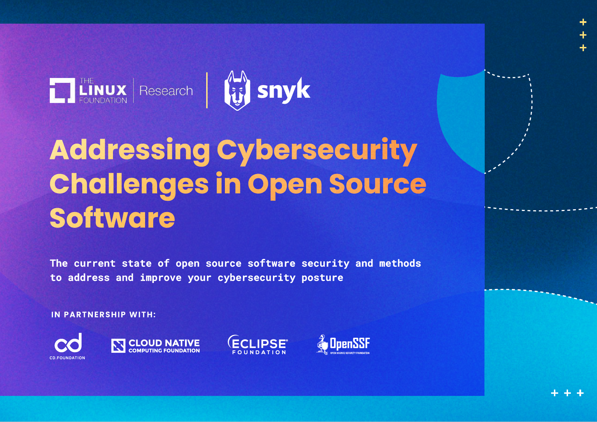
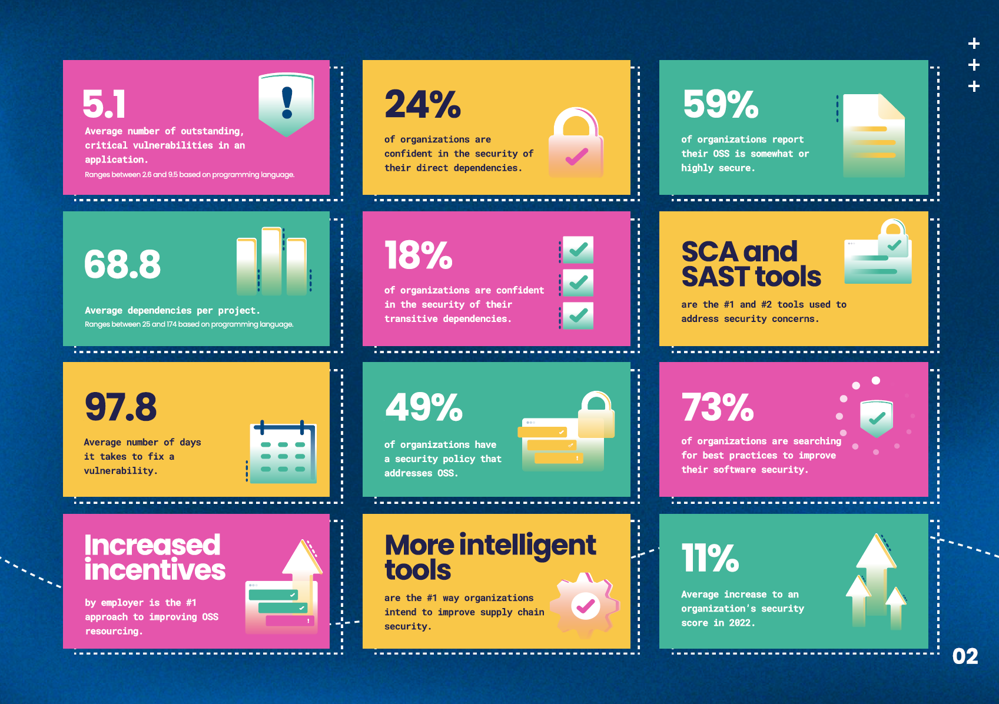

```
(Logo 不翻译)
Addressing Cybersecurity
Challenges in Open Source
Software
解决开源软件中的网络安全挑战

The current state of open source software security and methods
to address and improve your cybersecurity posture
当前开源软件安全状况和解决和改善网络安全姿态的方法

In Partnership With:
合作方：
(Logo 不翻译)
```

Open source software (OSS) has become an integral part of the technology landscape, as inseparable from the digital machinery of modern society as bridges and highways are from global transportation infrastructure. According to one report, typically 70% to 90% of a modern application stack consists of pre-existing OSS, from the operating system to the cloud container to the cryptography and networking functions, sometimes up to the very application running your enterprise or website. Thanks to copyright licenses that encourage no-charge re-use, remixing, and redistribution, OSS encourages even the most dogged of competitors to work together to address common challenges, saving money by avoiding duplication of effort, moving faster to innovate upon new ideas and adopt emerging standards.

开源软件（OSS）已成为技术领域不可或缺的一部分，就像桥梁和高速公路是全球交通基础设施不可或缺的一部分一样，已经和现代社会的数字机器紧密结合在一起。一份报告显示，现代应用程序栈通常由 70％ 至 90％ 的现有开源软件组成，从操作系统到云容器，再到加密和网络功能，甚至是支撑企业或网站运行的应用程序本身。由于版权许可证鼓励免费重用、混合和重新分发，开源软件鼓励即使是最顽固的竞争对手共同解决共同的挑战，通过避免重复工作来节省资金，更快地创新新思想和采用新兴标准。

However, this ubiquity and flexibility can come at a price. While OSS generally has an excellent reputation for security, the communities behind those works can vary significantly in their application of development practices and techniques to reduce the risk of defects in the code, or to respond quickly and safely when one is discovered by others. Often, developers trying to decide what OSS to use have difficulty determining which ones are more likely to be secure than others based on objective criteria. Enterprises often don't have a well-managed inventory of the software assets they use, with enough granular detail, to know when or if they're vulnerable to known defects, and when or how to upgrade. Even those enterprises willing to invest in increasing the security of the OSS they use often don't know where to make those investments, nor their urgency relative to other priorities.

然而，这种无处不在和灵活性也可能需要代价。虽然 OSS 通常具有出色的安全声誉，但是为了减少代码缺陷的风险或在其他人发现缺陷时做出快速和安全的响应，OSS 背后的社区在开发实践和技术方面的应用程度差异很大。通常，开发人员在决定使用哪个 OSS 时很难根据客观标准确定哪些 OSS 比其他 OSS 更安全。企业通常没有管理良好的软件资产清单，也没有足够详细的细节信息，来了解它们是否易受已知缺陷攻击，以及何时或如何升级。即使是那些愿意投资增加他们使用的 OSS 安全性的企业，通常不知道在哪里进行这些投资，以及这些投资相对于其他优先事项的紧迫性。

However, fighting security issues at their upstream source - trying to catch them earlier in the development process, or even reduce the chances of their occurrence at all - remains a critical need. We are also seeing new attacks that focus less on vulnerabilities in code, and more on the supply chain itself - from rogue software that uses "typosquatting on package names to insert itself unexpectedly into a developer's dependency tree, to attacks on software build and distribution services, to developers turning their one-person projects into "protest-ware" with likely unintended consequences.

然而，从上游源头打击安全问题——尝试在开发过程的早期阶段捕捉它们，甚至减少它们的发生几率——仍然是一个重要的需求。我们也看到了一些新的攻击，它们不再关注代码中的漏洞，而是专注于供应链本身——从使用“打包名错字”技术在软件包名称中插入自己以意外地进入开发人员的依赖树，到对软件构建和分发服务的攻击，再到开发人员将自己的个人项目变成可能产生意外后果的“抗议软件”。

To address the urgent need for better security practices, tools, and techniques in the open source software ecosystem, a collection of deeply invested organizations came together in 2020 to form the Open Source Security Foundation (OpenSSF), and chose to house that effort at the Linux Foundation. This public effort has grown to include hundreds of active participants across dozens of different public initiatives housed under 7 working groups, with funding and partnership from over 75 different organizations, and reaching millions of OSS developers. This report presents analysis that we intend to use to help support that effort. You can see a complete copy of my prepared testimony at: Testimony to the US House Committee on Science and Technology - Open Source Security Foundation (openssf.org).

为了满足开源软件生态系统中更好的安全实践、工具和技术的紧迫需求，一些深度投资的组织于 2020 年联合成立了开源安全基金会（OpenSSF），并选择将其设立在 Linux 基金会下。这项公共努力已经成长为包括 7 个工作组下的数十个不同公共计划中的数百名活跃参与者，得到了来自 75 个不同组织的资金和合作支持，并覆盖了数百万个开源软件开发者。本报告呈现了我们打算用来支持这一努力的分析。您可以在此处查看我准备好的完整证言的副本：对美国科技委员会的证言——开源基金会（openssf.org）。

**Brian Behlendorf**

**Brian Behlendorf**

**General Manager, Open Source Security Foundation**

**总经理，开源安全基金会**

**The Linux Foundation**
**Linux 基金会**

 