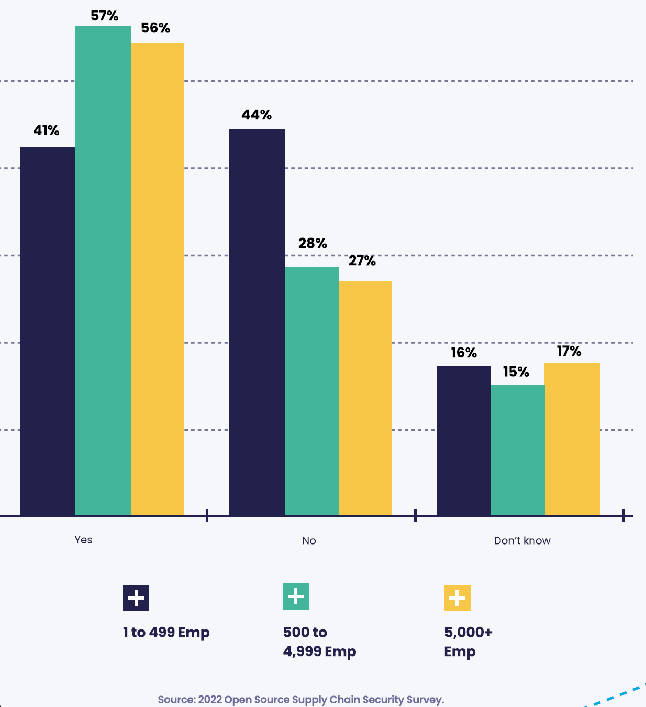
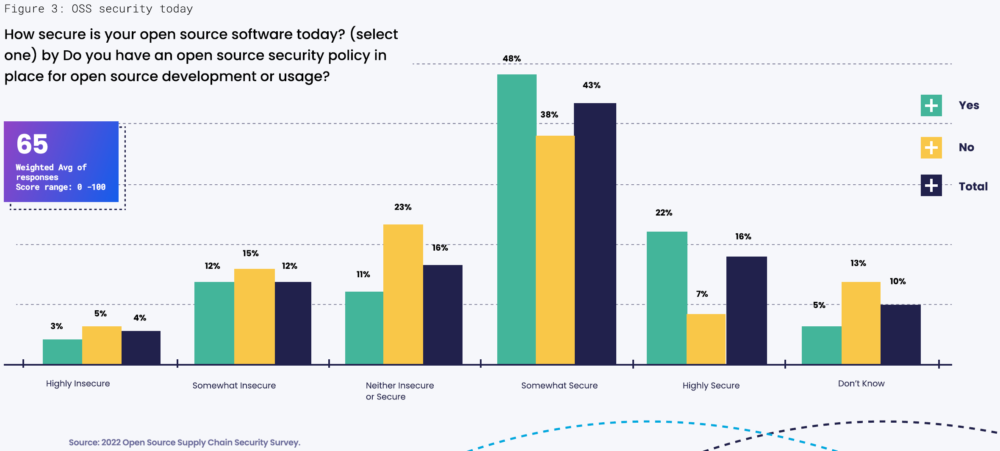
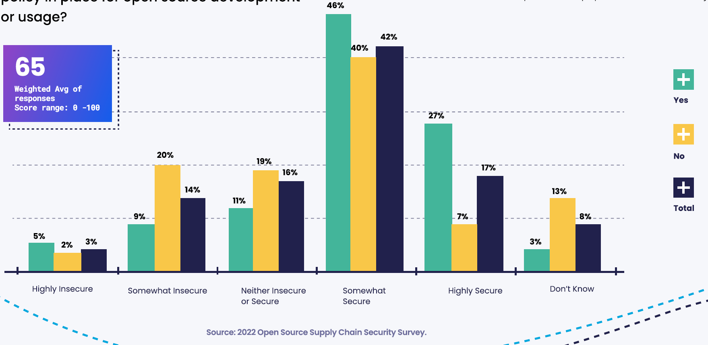
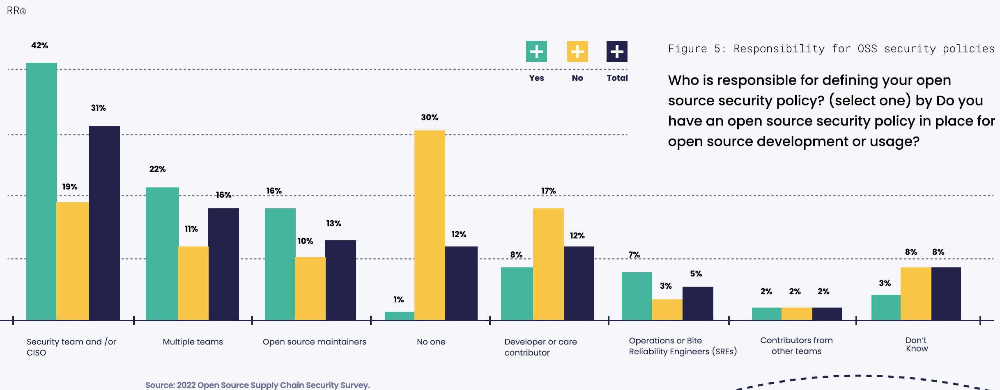
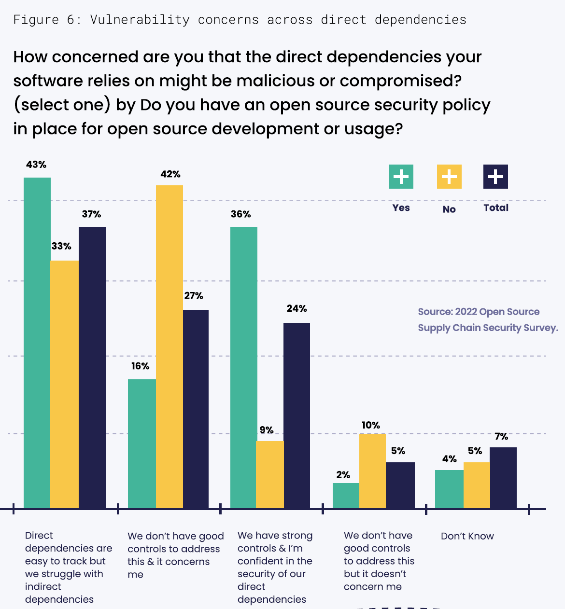
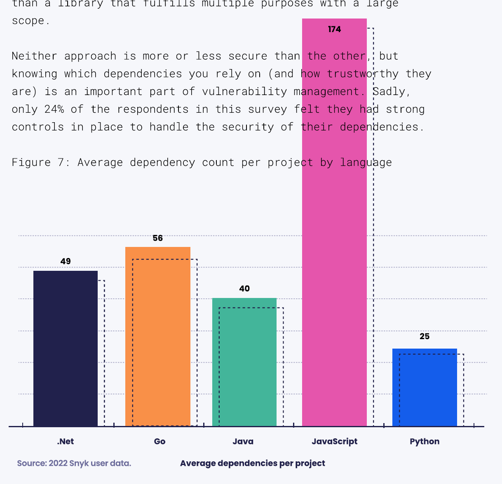
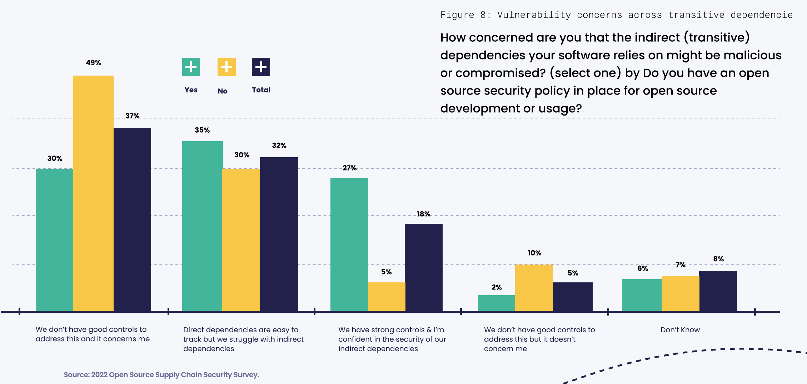
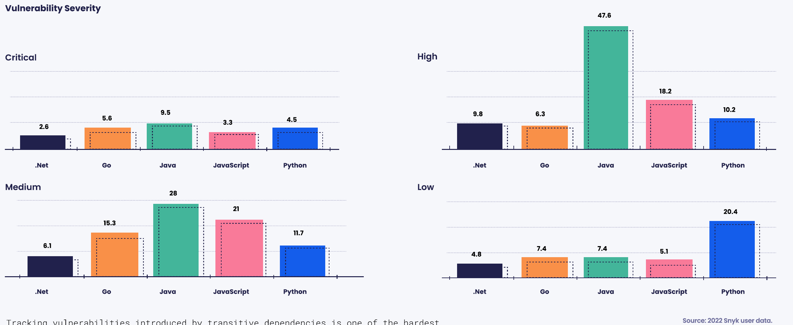

# Introduction

Open source software (OSS) has had a tremendous impact on the development and distribution of the software we depend on today.
Through its collaborative and open way of both developing and sharing software components, OSS has served as a key engine for innovation and encouraged the widespread reuse and sharing of core software components. Today, nearly all applications are composed of components dependent upon other components, creating a supply chain that involves hundreds of components and multitiered dependencies.

开源软件（OSS）对我们今天所依赖的软件的开发和分发产生了巨大的影响。OSS 作为创新的关键引擎，通过其协作和开放的方式开发和共享软件组件，鼓励了核心软件组件的广泛重用和共享。今天，几乎所有应用程序都由依赖其他组件的组件组成，形成了一个包含数百个组件和多层依赖的供应链。

Organizations of all sizes are heavily reliant on software, and much of that software supply chain consists of open source software components. Because of this, open source software has cybersecurity implications: the software supply chain is an attractive entry point for people and organizations interested in theft, disruption, or exploitation for economic or political gain. The attack surface today is changing from those in traditional cybersecurity threat models. Defects in small libraries that are widely used across the software ecosystem can cause systemic risk, as we've seen with incidents such as Log4shell.

各种规模的组织都严重依赖软件，其中大部分的软件供应链包含开源软件组件。正因为如此，开源软件具有网络安全的影响：软件供应链是入侵者利用进行盗窃、破坏或为了经济或政治利益而开发的一个有吸引力的入口点。如今，攻击面正在从传统的网络安全威胁模型中改变。在整个软件生态系统中广泛使用的小型库中的缺陷可能会导致系统性风险，正如我们在 Log4shell 等事件中所见到的那样。

## Security challenges
## 安全挑战

Addressing the security of open source software components requires a different approach from traditional approaches of securing proprietary, vendor-supported software. The more loosely structured and community focused nature of OSS development presents a more challenging environment for addressing software security. The distribution of OSS projects is bookended by a small number of large visible projects (like the Linux kernel and Kubernetes) to a very large number of small projects. Smaller projects typically have fewer contributors and resources, and are therefore more likely to adopt a minimalist approach to development and security.

解决开源软件组件的安全问题需要与传统保护专有、厂商支持软件的方法不同的方法。开源软件开发的结构更加松散，关注社区的本质，因此对于解决软件安全问题来说环境更加具有挑战性。OSS 项目的分布是由少数几个大型可见项目（如 Linux 内核和 Kubernetes）到非常多的小型项目组成。小型项目通常具有更少的贡献者和资源，因此更有可能采用极简主义的开发和安全方法。

The tremendous benefits and prevalence of OSS in organizational software, combined with the vulnerability of the OSS software supply chain, puts us at a crossroads. Organizations and companies that use open source software need to become more aware of what dependencies they are using, proactively and regularly monitoring all components for usability, trustworthiness, and vulnerabilities. Ultimately, open source software is a two-way street: consumers of open source software must contribute back to the OSS communities to ensure the health and viability of the dependencies they rely on. Merely using open source software, without contributing back, is not enough. What is required is both to 1) incorporate the nature of OSS dependencies into standard cybersecurity and development practices and 2) contribute back to the OSS communities that organizations rely on.

开源软件在组织软件中的巨大益处和普遍使用，以及 OSS 软件供应链的脆弱性，让我们处于一个十字路口。使用开源软件的组织和公司需要更加了解它们正在使用的依赖关系，主动并定期监控所有组件以确保可用性、可信度和漏洞。最终，使用开源软件与回馈开源社区应该是一种互惠互利的关系：开源软件的使用者必须向 OSS 社区做出贡献，以确保他们所依赖的依赖关系的健康和可行性。仅仅使用开源软件而不进行回馈是不够的。需要的是将 OSS 依赖性的特性纳入标准的网络安全和开发实践，并向组织所依赖的 OSS 社区做出贡献。

## Research approach
## 研究方法

This report focuses on OSS security perspectives and how to improve OSS security and sustainability.

本报告的关注点在开源软件安全，以及如何改善开源软件的安全性和可持续性。

Research began in March 2022 with fifteen interviews of open source software maintainers and cybersecurity experts. These qualitative interviews helped to shape the scope of the research and the design of the quantitative survey instrument.

研究始于 2022 年 3 月，进行了 15 次开源软件维护者和网络安全专家的访谈。这些定性访谈有助于塑造研究范围和设计定量调查工具。

**A worldwide survey was fielded in April 2022, targeting the following roles:**
**2022 年 4 月，针对以下角色进行一项全球调查：**

- Individuals who contribute to, use, or administer Oss
- Maintainers, core contributors, and occasional contributors to OSS
- Developers of proprietary software to use OSS
- Individuals with a strong focus on software supply chain security

* 贡献、使用或管理开源软件的个人
* 开源软件的维护者、核心贡献者和偶尔的贡献者
* 使用开源软件的专有软件开发人员
* 关注软件供应链安全的个人

**The survey included four sections:**
**该调查包括四个部分：**

- Screening questions and demographics
- OSS security perspectives. Sample size is 539 and margin of error (MoE) is +/- 3.6% at a 90% confidence level.
- OSS best practices for secure software development. Sample size is 72. Only OSS maintainer and core contributors were invited to complete this section of the survey. Because of the technical detail that was characteristic of this section, it was not addressed as part of this report and instead will be discussed in a separate report to be published in 2022 Q3.
- Improving OSS security. Sample size is 433 and margin of err (MoE) is +/-4.0% at a 90% confidence level.

* 筛选问题和人口统计学信息
* 开源软件安全视角。样本量为 539，置信度水平为 90%，误差率为 +/- 3.6%
* 为安全软件开发提供最佳实践。样本量为 72，只邀请了开源软件维护者和核心贡献者完成本部分的调查。由于这一部分的技术细节较多，本报告没有对其进行讨论，将在 2022 年 Q3 发表的另一份报告中进行讨论。
* 改进开源软件安全。样本量为 433，置信度水平为 90%，误差率为 +/- 4.0%。

For more information about this research approach and sample demographics, see the methodology section of this paper.
The data provided by Snyk is based on over 1.3 million projects and was collected from April 1, 2021 until March 31, 2022. Snyk's efforts were primarily focused on understanding how five key languages/ecosystems (.Net, Go, Java, JavaScript, and Python) are influencing the complexity of the software supply chain. This data was gathered from the use of Snyk Open Source, a static code analysis (SCA) tool free to use for individuals and open source maintainers.

更多有关此研究方法和样本统计信息的信息，请参阅本文的方法部分。

Snyk 提供的数据基于超过 130 万个项目，采集周期为 2021 年 4 月 1 日至 2022 年 3 月 31 日。Snyk 的工作主要集中在了解五种关键语言 / 生态系统（.Net、Go、Java、JavaScript 和 Python）如何影响软件供应链的复杂性上。这些数据是通过使用 Snyk 开源工具收集的，该工具是一个静态代码分析（SCA）工具，供个人和开源维护人员免费使用。

# Open source software security perspectives
# 开源软件安全观点

Initial questions in this survey were designed to understand organizational commitment to security that covers OSS development and use and beliefs about the security of the OSS and its dependencies in use. Responses to these questions suggest that organizations collectively have been slow to make software security a priority.

该调查的初始问题旨在了解组织在涵盖开源软件开发和使用方面的安全承诺以及对正在使用的开源软件及其依赖性安全性的信念。对这些问题的回答表明，组织在使软件安全成为优先事项方面进展缓慢。

## Many organizations do not have a security policy that covers OSS
## 许多组织没有涵盖开源软件的安全政策。

One of the most startling findings of this research, as shown in Figure 1, is that only 49% of organizations have a security policy that covers OSS development or use. 34% of organizations indicate that they do not have a security policy for OSS development and usage, and 17% of respondents were not sure if their organization had a plan or not. If we prorate this 17% based on the existing distribution of responses, the number of organizations with a security policy covering OSS rises from 49% to 59%, and those without a policy rise from 34% to 41%.

这项研究最惊人的发现之一是，如图 1 所示，只有 49％ 的组织拥有涵盖开源软件开发或使用的安全策略。 34％ 的组织表示，他们没有开源软件开发和使用的安全策略，17％ 的受访者不确定他们的组织是否有计划。如果我们根据现有的回答分布来按比例计算这 17％，则拥有涵盖开源软件的安全策略的组织数量从 49％ 上升到 59％，而没有策略的组织则从 34％ 上升到 41％。

Figure 1: Organizations with a security policy covering OSS

图 1：有涵盖开源软件的安全政策的组织

Do you have an open source security policy in place for open source development or usage? (select one)

您是否已为开源软件的开发或使用制定了开源安全政策？（请选择一项）


```
（粉色图例应该是标错了）
Yes：是
No：否
Total：（英文应该是错了，坐标轴上是Don't know）不知道
```

Having a security policy covering OSS indicates that you have a security action plan that includes the many OSS components in use. Without a software security policy, organizations may expose themselves to a significant amount of financial and reputational risk because they may not be evaluating software before its inclusion and/or may not be prepared for the inevitable updates due to software vulnerabilities (OSS or not).

拥有涵盖开源软件的安全策略表示您拥有包含许多使用的开源软件组件的安全行动计划。如果没有软件安全策略，组织可能会面临相当大的财务和声誉风险，因为他们可能没有在将软件包含进项目之前进行评估，或者可能没有为由于软件漏洞（无论是开源软件还是其他软件）而不可避免的更新做好准备。

Note that we intentionally did not have any special requirements on how the security policy covering OSS was stated. Some organizations have a single policy on software, and then only have specific statements for OSS in the relatively few cases where OSS would be sensibly different. This would be an application of the so-called "Hellekson's Law" ("a more specific policy can be improved for the general case by removing delimiters that narrow the policy scope, "e.g., deleting "open source" from an "open source software" policy typically improves it). For our purposes this is fine. We simply let the respondents identify whatever applied to their organization.

请注意，我们有意没有对涵盖开源软件的安全策略有任何特殊要求。一些组织只有一个关于软件的策略，然后仅在开源软件有相对少的情况下才有特定的声明。这是所谓的“Hellekson 定律”的应用（“通过删除缩小策略范围的分隔符，例如，从“开源软件”策略中删除“开源”，可以改进通用情况下的更具体策略）。对于我们的研究目的来说，这是可以接受的。我们只是让受访者确定他们所在组织适用的情况。

The one benefit of the distribution shown in Figure 1 is that we can statistically compare and contrast the characteristics of organizations with a security policy against those without one. Understanding these comparative differences helps us describe the OSS security journey that organizations are on.

图 1 所示的分布的一个好处是，我们可以对拥有安全策略的组织与没有安全策略的组织进行统计学比较和对比。了解这些比较差异有助于我们描述组织在开源软件安全方面的旅程。

## Small organizations shoulder disproportionate OSS security risk
## 小型组织承担着不成比例的开源软件安全风险

This survey included organizations of various sizes (based on the number of worldwide employees). The survey sample was distributed by organization size as follows: small organizations (44%, 1-499 employees), medium organizations (20%, 500-4,000 employees), large organizations (35%, 5,000+ employees), and 1% don’t know or are not sure.

本次调查涵盖了各种规模的组织（根据全球员工人数划分）。调查样本按组织规模分布如下：小型组织（44％，1-499 名员工），中型组织（20％，500-4,000 名员工），大型组织（35％，5,000 名及以上员工），1％ 不知道或不确定。

The measure of security policy covering OSS by organizational size is shown in Figure 2. Immediately noticeable is the difference in distributions between organizations with 1-499 employees and those with 500 employees or more. Just 41% of small organizations have an OSS security policy, compared to 56%-57% of larger organizations. This significant difference indicates that small organizations behave differently than larger organizations when it comes to OSS security policy adoption.

按组织规模衡量涵盖开源软件的安全政策的情况如图 2 所示。立即显着的是，1-499 名员工的小型组织和 500 名员工以上的组织之间的分布差异。只有 41% 的小型组织拥有开源软件安全政策，而大型组织的开源软件安全政策采用率在 56%-57% 之间。这个显著的差异表明，小型组织在开源软件安全政策采用方面的行为与大型组织不同。

Figure 2: A distribution of OSS security policy by organization size

图 2：按组织规模分布的开源软件安全策略

Do you have an open source security policy in place for open source development or usage? (select one) by Enterprise size

您是否有针对开源软件开发或使用的开源安全策略？按企业规模（选择一项）


```
Yes: 是
No: 否
Don't know: 不知道

1 to 499 Emp: 员工数 1～499
500 to 4999 Emp: 员工数 500~4999
5000+ Emp: 员工数 5000+

Source: 2022 Open Source Supply Chain Security Survey.
来源：2022年开源供应链安全调查。
```

One reason that small organizations are OSS security challenged is economies of size. Small organizations have small IT staff and budgets, and the functional needs of the business often take precedence so that the business can remain competitive. Lack of resources and time were the leading reasons why organizations were not addressing OSS security best practices.

小型组织开源软件安全面临挑战的原因之一是规模经济。小型组织拥有较少的 IT 人员和预算，业务的功能需求通常具有优先性，以使业务能够保持竞争力。缺乏资源和时间是组织未能解决开源软件安全最佳实践的主要原因。

While it is disappointing that 44% of small organizations do not have an OSS security policy, an additional concern is that close to 30% of larger organizations also do not have an OSS security policy. Small organizations can rationalize increased financial, reputational, and legal risk, but this becomes tenuous for medium organizations and insupportable for large organizations with 5000+ employees. Medium and large organizations likewise complain about not enough having resources or time to address OSS security needs. Surprisingly, a lack of awareness about security best practices is more often identified by large organizations as a reason for not attending to OSS security needs than lack of time.

虽然令人失望的是，44% 的小型组织没有开源软件安全策略，但更令人担忧的是，接近 30% 的大型组织也没有开源软件安全策略。小型组织可以理性地解释为增加财务、声誉和法律风险，但对于 5000 多名员工的中型和大型组织来说，这变得岌岌可危。中型和大型组织同样抱怨没有足够的资源或时间来应对开源软件安全需求。令人惊讶的是，大型组织更常常将缺乏安全最佳实践的意识视为不关注开源软件安全需求的原因，而不是时间不足。
## Many Organizations score poorly on OSS security
## 许多组织在开源软件安全方面得分低

We asked organizations how secure their open source software is today. Responses to this question are shown in Figure 3. Overall, 59% of organizations feel their OSS is either somewhat secure or highly secure. For organizations with an OSS security policy, this value rises to 70%. It falls to 45% for organizations without a security policy.

我们询问了组织关于他们的开源软件安全性的评估。这个问题的回答如图 3 所示。总体而言，59% 的组织认为他们的开源软件在某种程度上是安全的或者非常安全的。对于有开源软件安全策略的组织，这个比例上升到了 70%。而对于没有安全策略的组织，这个比例则下降到了 45%。


```
Figure 3: OSS security today
图 3：当今的开源软件安全情况

How secure is your open source software today? (select one) by Do you have an open source security policy in place for open source development or usage?
您的开源软件今天有多安全？按您是否有一个用于开源开发或使用的开源安全策略进行分组（选择一项）

65
Weighted Avg of responses
Score range: 0 -100

65
回答的加权平均分
分数范围：0～100

Yes：是
No：否
Total：综合

Highly Insecure：非常不安全
Somewhat Insecure：有些不安全
Neither Insecure or Secure：中性
Somewhat Secure：有些安全
Highly Secure：非常安全
Don’t Know：不知道

Source: 2022 Open Source Supply Chain Security Survey.
来源：2022年开源供应链安全调查。
```

A simple weighted average of all responses shows a composite score of 65 for all organizations, which is a poor grade.
Organizations with an OSS security policy score a 70, and organizations without a policy score a 58.

简单的加权平均所有回答的分数显示，所有组织的综合分数为 65 分，这是一个不好的分数。拥有开源软件安全策略的组织得分为 70 分，而没有策略的组织得分为 58 分。

## The secure development of OSs is also at risk
## 开发或使用开源软件的安全问题同样存在风险

Similarly, Figure 4 shows how secure the process for developing or using OSS is today. Using the same responses shown in Figure 3, the results are nearly identical. Across all organizations, 59% believe that their development processes are somewhat secure or highly secure. This value rises to 73% for organizations with an OSS security policy and falls to 47% for organizations without.

同样，图 4 展示了开发或使用开源软件的过程的安全性。使用图 3 中展示的相同回答，结果几乎相同。在所有组织中，59% 的人认为他们的开发过程是相对安全或高度安全的。对于拥有 OSS 安全策略的组织，这个值升至 73%，而对于没有安全策略的组织，则下降至 47%。

Figure 4: Security of OSS development and use today

图 4：如今的开源软件开发和使用的安全性

How secure is your process for developing or using open source software today? (select one) by Do you have an open source security policy in place for open source development or usage?

您是否已经针对开源开发或使用实施了开源安全策略？（选择一项）按照您是否对开源开发或使用实施了安全策略，您认为您目前的开源软件开发或使用流程有多安全？（选择一项）


```
65
Weighted Avg of responses
Score range: 0 -100

65
回答的加权平均分
分数范围：0～100

Yes：是
No：否
Total：综合

Highly Insecure：非常不安全
Somewhat Insecure：有些不安全
Neither Insecure or Secure：中性
Somewhat Secure：有些安全
Highly Secure：非常安全
Don’t Know：不知道

Source: 2022 Open Source Supply Chain Security Survey.
来源：2022年开源供应链安全调查。
```

The similarity of this distribution when compared to Figure 4 also yields a weighted average of 65 and organizations with the security policy score 71 and organizations without a policy 58.

与图 4 相比，这个分布的相似性也产生了一个加权平均值为 65，安全策略得分为 71，没有策略的组织得分为 58。

Across organizations, there is a belief that the security of OSS development and use will improve to a weighted average score of 72 by the end of 2022 and 77 by the end of 2023. Later in this report, you will see that an organizational cornerstone of their
OSS security strategy is for the vendor community to provide security tools with greater intelligence. Other key elements of their OSS security strategy include a more complete understanding of best practices for secure software development and greater CI/ CD automation to eliminate manual actions and opportunities that expose the pipeline to security risks.

跨组织而言，人们认为到 2022 年底，OSS 开发和使用的安全性将提高到加权平均分数为 72，到 2023 年底将提高到 77。在本报告的后面部分，您将看到，组织制定的 OSS 安全策略的基石是让供应商社区提供更具智能的安全工具。他们的 OSS 安全策略的其他关键要素包括更全面地了解安全软件开发的最佳实践，并实现更多的 CI / CD 自动化以消除手动操作和可能导致安全风险的机会。

## Who drives OSS security policies?
## 谁推动了开源软件安全策略？

Figure 5 superficially creates a conundrum: how do organizations without a top-down OSS security policy have people responsible for defining OSS security policy? Additionally. not having an OSS security policy doesn't mean that groups aren't addressing OSS security in ad hoe ways.

图 5 表面上制造了一个难题：没有由上而下的开源软件安全策略的组织如何有负责定义开源软件安全策略的人？此外，没有开源软件安全策略并不意味着各组没有以临时方式解决开源软件安全问题。

Across organizations, just 31% vest responsibility for defining an OSS security policy in the hands of a CIS and/or security team. The second leading choice of multiple teams at 16% suggests that instead of policy being established by a CIS, it evolves across the Software Development Life Cycle (SDLC) based on the focus of the team. Because a security focus should exist across the CI/CD pipeline, multiple teams are needed to implement OSS security policy. Reliance on open source maintainers at 13% overall can be workable 1f the maintainers are either part of the organization or known to the organization - but it sdems recklessly optimistic to put trust in OSS projects with unknon provenance.

跨组织而言，仅有 31% 的组织将定义 OSS 安全策略的责任归属于 CIS（计算机信息安全）和 / 或安全团队。16% 的多个团队作为第二选择表明，政策的制定不是由 CIS 确定的，而是根据团队的重点在软件开发生命周期 (SDLC) 中逐步形成。由于在 CI/CD 管道中应存在安全重点，因此需要多个团队来实施 OSS 安全策略。总体上依赖于开源维护者的 13% 可能是可行的，前提是维护者要么是组织的一部分，要么已知于组织，但是如果信任来源未知的 OSS 项目，这种做法似乎过于乐观。


```
Figure 5: Responsibility for OSS security policies
Who is responsible for defining your open source security policy? (select one) by Do you have an open source security policy in place for open source development or usage?

图5：开源安全策略的责任
谁负责制定您的开源安全策略？（选择一项）按您是否有适用于开源开发或使用的开源安全策略？

Yes：是
No：否
Total：综合

Security team and /or CISO：安全团队/CISO
Multiple teams：多个团队
Open source maintainers：开源维护者
No one：没有人
Developer or care contributor：开发人员或贡献者
Operations or Bite Reliability Engineers (SREs)：运维或可靠性工程师（SREs）
Contributors from other teams：其他团队的贡献者
Don’t Know：不知道

Source: 2022 Open Source Supply Chain Security Survey.
来源：2022年开源供应链安全调查。
```

The percentages in Figure 5 are especially revealing. Across organizations with an OSS security policy, 80% vest the definition of an OSS security policy with the CISO/security team, multiple teams, or open source maintainers. This contrasts with organizations without an OSS security policy where 40% of these same groups are involved with OSS security in some capacity.

在图 5 中的百分比特别说明了问题。在有开源安全策略的组织中，80％的组织将开源安全策略的定义归属于 CISO / 安全团队、多个团队或开源维护人员。而在没有开源安全策略的组织中，这些同样的团队中有 40％以某种方式参与开源安全。

Perhaps one positive indicator in Figure 5 is that only 30% of organizations without an OSS security policy admit that no one is addressing OSS security. This means that 70% of these organizations are addressing OSS security in part through ad hoc means, suggesting that organizations without an OSS security policy are not completely adrift and have some grassroots activities to address OSS security needs.

或许在图 5 中令人欣慰的一个指标是，仅有 30% 的没有开源安全策略的组织承认没有人在处理开源安全。这意味着 70% 的这些组织通过一些临时手段部分地解决了开源安全问题，表明没有开源安全策略的组织并非彻底被遗弃，有一些基层活动来解决开源安全需求。

## Organizations are not effectively managing the security of their dependencies
## 组织未能有效地管理其依赖项的安全性

Dependencies are a characteristic of modern development. Direct dependencies are typically components or services called directly by your code. Indirect or transitive dependencies are essentially dependencies of your dependencies (in typically many tiers).

依赖项是现代开发的一个特征。直接依赖通常是被你的代码直接调用的组件或服务。间接或传递依赖实际上是你的依赖项的依赖项（通常有许多层）。

Vulnerabilities exist in component code for many reasons.
Contributing factors include the programming language used, the CI/CD process in use, the education and skill of the developer in developing secure software, and the scope of testing.
Complicating matters is that vulnerability management is not a perfect science. Vulnerability scanning normally identifies many false positives based on the information available to the scanning tool. Conversely, an actual vulnerability in a component may not matter if the code linked to the vulnerability is never executed and/or will only provide trusted data to the vulnerable code.

组件代码存在漏洞的原因有很多。其中的因素包括使用的编程语言、使用的 CI/CD 过程、开发人员在开发安全软件方面的教育和技能以及测试的范围。复杂化问题的是，漏洞管理并不是一门完美的科学。漏洞扫描通常会基于扫描工具可用的信息识别出很多误报。相反，如果与漏洞相关的代码从未被执行，或者只会向漏洞代码提供可信数据，那么组件中的实际漏洞可能就不重要了。

What is known is that organizations are not well-positioned to manage their vulnerabilities. Only one response in Figure 6 indicates that organizations are confident in the security of their direct dependencies.

已知的是，组织机构并没有处于良好的漏洞管理位置。在图 6 中只有一个回答表明组织对其直接依赖的安全性有信心。


```
Figure 6: Vulnerability concerns across direct dependencies
图 6：对直接依赖项的漏洞担忧

How concerned are you that the direct dependencies your software relies on might be malicious or compromised? (select one) by Do you have an open source security policy in place for open source development or usage?
你对你的软件所依赖的直接依赖项可能是恶意的或被攻击的有多担忧？（选择一项）通过是否对开源开发或使用制定了开源安全策略？

Yes：是
No：否
Total：综合

Source: 2022 Open Source Supply Chain Security Survey.
来源：2022年开源供应链安全调查。

Direct dependencies are easy to track but we struggle with indirect dependencies
直接依赖关系易于跟踪，但我们难以处理间接依赖关系

We don’t have good controls to address this & it concerns me
我们没有好的控制措施来解决这个问题，这让我感到担忧

We have strong controls & I’m confident in the security of our direct dependencies
我们有强有力的控制措施，我对我们的直接依赖关系的安全性感到有信心

We don’t have good controls to address this but it doesn’t concern me
我们没有好的控制措施来解决这个问题，但我并不担心

Don’t Know：不知道
```

Across all organizations, only 24% have confidence in the security of their direct dependencies. This value rises to 36% for organizations that have an OSS security policy but falls to just 9% of organizations without such a security policy.
Organizations reporting that dependencies are easy to track (37%) may be correct in understanding their dependencies, but this doesn't mean that these dependencies are collectively secure.

所有组织中，只有 24% 的组织对其直接依赖的安全性感到有信心。对于有开源安全策略的组织，这个值上升到 36％，但对于没有这样的安全策略的组织，这个值只有 9％。
报告依赖项易于跟踪的组织（37％）可能正确地理解了它们的依赖项，但这并不意味着这些依赖项总体上是安全的。

## Snyk - Dependencies drive complexity
## Snyk - 依赖关系驱动复杂性

Dependencies are one of the key components driving much of the conversation about the software supply chain. Professionals in both development and security teams are increasingly aware that securing their enterprise does not depend entirely on their organization. Instead, we are having to look further and further, down the rabbit hole of "Where did this code come from?" It's hard enough to understand where everything originated when you're trying to test code written in-house. When you add dependencies two, three, or more levels deep, it becomes daunting to even consider the problem.

依赖关系是驱动软件供应链大部分讨论的关键组成部分之一。开发和安全团队的专业人员越来越意识到，保护他们的企业不仅取决于他们的组织。相反，我们不得不越来越深地去了解“这段代码从哪里来？”当你试图测试自己编写的代码时，理解所有代码的起源已经很困难了。当你添加了两个、三个或更多级别的依赖关系时，甚至考虑这个问题都变得令人望而生畏。

The libraries we call in our code, the code snippets we pull from the internet, and the tools we include in container configurations are all examples of direct dependencies. In each of these cases we are relying on third-party code explicitly to fulfill a specific need or purpose.

直接依赖项是我们在代码中调用的库、从互联网获取的代码片段以及包含在容器配置中的工具等。在这些情况下，我们明确地依赖第三方代码来满足特定的需求或目的。

Measuring the number of dependencies per project, therefore, makes a good starting point for understanding how complex the problem of tracking dependencies really is. As shown in Figure 7, the average number of dependencies per project stretches from Python, with 25 dependencies per project, to JavaScript's 173 per project.

因此，衡量每个项目的依赖关系数量是了解跟踪依赖关系问题的复杂性的好起点。如图 7 所示，每个项目的平均依赖关系数量从 Python 的 25 个到 JavaScript 的 173 个不等。

Does that mean JavaScript is inherently more complex than .Net (49 dependencies), Go (56 dependencies), or Java (40 dependencies)? Not necessarily. In the case of JavaScript, each dependency often has a single purpose and small scope, rather than a library that fulfills multiple purposes with a large
scope.

这是否意味着 JavaScript 本质上比 .Net（49 个依赖项）、Go（56 个依赖项）或 Java（40 个依赖项）更复杂？不一定。在 JavaScript 的情况下，每个依赖项通常只有一个目的和小的范围，而不是一个具有大范围的多个目的的库。

Neither approach is more or less secure than the other but knowing which dependencies you rely on (and how trustworthy they are) is an important part of vulnerability management.
Sadly, only 24% of the respondents in this survey felt they had strong controls in place to handle the security of their dependencies.

这两种方法都不比另一种更安全，但了解你依赖的依赖项（以及它们的可信度）是漏洞管理的重要组成部分。不幸的是，在此次调查中，只有 24% 的受访者认为他们已经采取了强有力的措施来处理其依赖项的安全性。


```
Figure 7: Average dependency count per project by language
图 7：按语言每个项目的平均依赖项数量

（下面几个编程语言不翻译）
.Net
Go
Java
JavaScript
Python

Source: 2022 Open Source Supply Chain Security Survey.
来源：2022年开源供应链安全调查。

Average dependencies per project
平均每个项目的依赖项数
```

Recent efforts by the US Government to encourage, and even mandate, organizations to create a Software Bill of Materials (SBOM) is evidence of how important it is to have a handle on dependencies. Tracking direct dependencies is a significant issue by itself. Indirect, or transitive, dependencies mark the real start of complexity. Each of the libraries referenced in a project incorporates additional code to perform its own function, and each of those third-party libraries may rely on other libraries as well. Organizations who want a complete accounting of their transitive dependencies should be requiring SBOMs from their suppliers and investing in tools to consume these SBOMs.

美国政府最近鼓励甚至要求组织创建软件清单（SBOM）的努力，就是表明掌握依赖关系的重要性。追踪直接依赖本身就是一个重要问题。而间接或传递性依赖才是复杂性的真正开始。每个在项目中引用的库都会包含额外的代码来执行其自身的功能，而每个这样的第三方库可能也依赖于其他库。想要完整记录传递依赖关系的组织应该要求其供应商提供 SBOM，并投资于消费这些 SBOM 的工具。

Figure 8 is patterned directly after Figure 6, except that it focuses on transitive dependencies. Transitive dependencies are objectively more difficult to evaluate as the level of dependency increases. The result is that fewer organizations believe that their transitive dependencies are secure

图 8 直接复制了图 6 的结构，不过它专注于间接依赖。随着依赖程度的增加，间接依赖的评估变得更加困难，因此，越来越少的组织认为它们的间接依赖是安全的。


```
Figure 8: Vulnerability concerns across transitive dependencie
图 8：跨传递依赖的漏洞问题

How concerned are you that the indirect (transitive) dependencies your software relies on might be malicious or compromised? (select one) by Do you have an open source security policy in place for open source development or usage?
您担心您的软件间接（传递）依赖关系可能存在恶意或被攻击的风险吗？ （选择一项） 您是否为开源开发或使用制定了开源安全策略？
```

Figure 8 shows that just 18% of organizations are confident in the security of their transitive dependencies. Once again, this value rises to 27% for organizations that have an OSS security policy but plummets to just 5% for organizations without a security policy.

图 8 显示，只有 18% 的组织对其传递依赖的安全性有信心。同样，这个值对于制定了开源安全策略的组织升至 27％，但对于没有安全策略的组织则下降至 5％。

A recent discussion with David A. Wheeler, a leading authority on OSS security, yielded this insight, "I think many organizations often don't update their OSS software, even when the older version of the OSS has widely-known vulnerabilities. That's not unique to OSS, many organizations also often don't update old versions of proprietary software with widely-known vulnerabilities

最近与开源安全领域的权威专家 David A. Wheeler 的讨论提供了这个见解：“我认为许多组织经常不更新其开源软件，即使旧版开源软件已经存在广为人知的漏洞。这不是开源软件的独特现象，许多组织也经常不更新已知有漏洞的旧版专有软件。
## Snyk - Dependency creates vulnerability
## Snyk - 依赖关系创建了漏洞

How many vulnerabilities are there in my project? We estimated this by totaling known vulnerabilities in a particular project combined with the known vulnerabilities of its dependencies (presuming that the vulnerabilities in the dependencies were exploitable). The Net projects in our data had 23 vulnerabilities per project on average, with Go at 34, Java at 90, JavaScript having 47, and Python at 36.
This covers both errors introduced in development and vulnerabilities in transitive dependencies. According to Snyk's data, approximately 40% of all vulnerabilities are from these transitive dependencies. We further broke down the count of vulnerabilities per project in Figure 9 to highlight the effect of severity by language.

我的项目中有多少漏洞？我们通过汇总一个特定项目中已知的漏洞以及其依赖项的已知漏洞数量来估计。假设依赖项中的漏洞是可利用的。我们的数据中，.Net 项目平均有 23 个漏洞，Go 项目有 34 个漏洞，Java 项目有 90 个漏洞，JavaScript 项目有 47 个漏洞，Python 项目有 36 个漏洞。
这包括开发中引入的错误和传递依赖项中的漏洞。根据 Snyk 的数据，大约 40% 的漏洞来自这些传递依赖项。我们在图 9 中进一步分解了每个语言的漏洞计数，以凸显严重性的影响。

A large part of the value of SCA tools is finding where vulnerabilities are being introduced by the use of known bad libraries. Is your code incorporating an older version of a library with known vulnerabilities? Is the package still maintained or is it abandoned? Did you accidentally get a library pretending to be the one you actually wanted? These are just a few of the potential issues that could get a package flagged.

SCA 工具的很大一部分价值在于发现由于使用已知存在漏洞的库所引入的漏洞。您的代码是否正在使用一个存在已知漏洞的旧版库？该软件包是否仍在维护中或已被放弃？您是否意外获取了一个假冒您实际需要的库的库？这些只是可能会导致软件包被标记的一些潜在问题。

Knowing the number of vulnerabilities in your own project helps you understand how your efforts compare to global numbers. Organizations that see data far different from the baseline number of vulnerabilities in a project can investigate the causes of a disparity. It could be as simple as different ways of measuring the same metric. On the other hand, the difference in numbers could indicate poor coding practices or a large number of old libraries being part of a standard. Without policies and standards that require vulnerability tracking, you may never know.

了解自己项目中漏洞的数量有助于了解自己的努力与全球数据相比的情况。看到与项目中基线漏洞数量迥然不同的数据的组织可以调查差异的原因。这可能只是衡量同一指标的不同方法。另一方面，数字的差异可能表明糟糕的编程实践或大量的旧库作为标准的一部分。如果没有要求跟踪漏洞的政策和标准，您可能永远不会知道。

Figure 9: Average count of vulnerabilities by language and severity

图 9：按语言和严重程度划分的平均漏洞数量


```
Vulnerability Severity
漏洞严重程度

Critical：严重
High：高危
Medium：中危
Low：低危

（编程语言不翻译）
.Net
Go
Java
JavaScript
Python

Source: 2022 Snyk user data.
来源：2022年 Snyk 用户数据。
```

Tracking vulnerabilities introduced by transitive dependencies is one of the hardest challenges in DevOps today. Think about a project that has fifty dependencies; if the average project has five critical vulnerabilities, just the first level of dependencies could lead to 200+ critical vulnerabilities. Each layer down expands the problem dramatically. Luckily, most vulnerabilities are tightly constrained by the factors needed to exploit them.

跟踪由传递依赖引入的漏洞是当今 DevOps 面临的最大挑战之一。考虑一个有 50 个依赖关系的项目；如果平均每个项目有 5 个严重漏洞，那么仅第一级依赖关系就可能导致 200 多个严重漏洞。每一层依赖都会大大扩大问题的规模。幸运的是，大多数漏洞都受到利用所需因素的严格限制。
