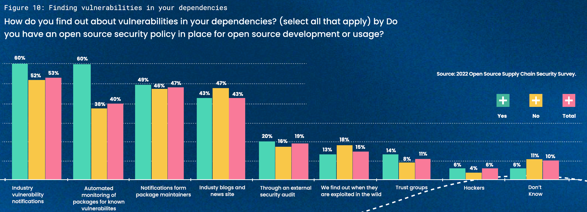
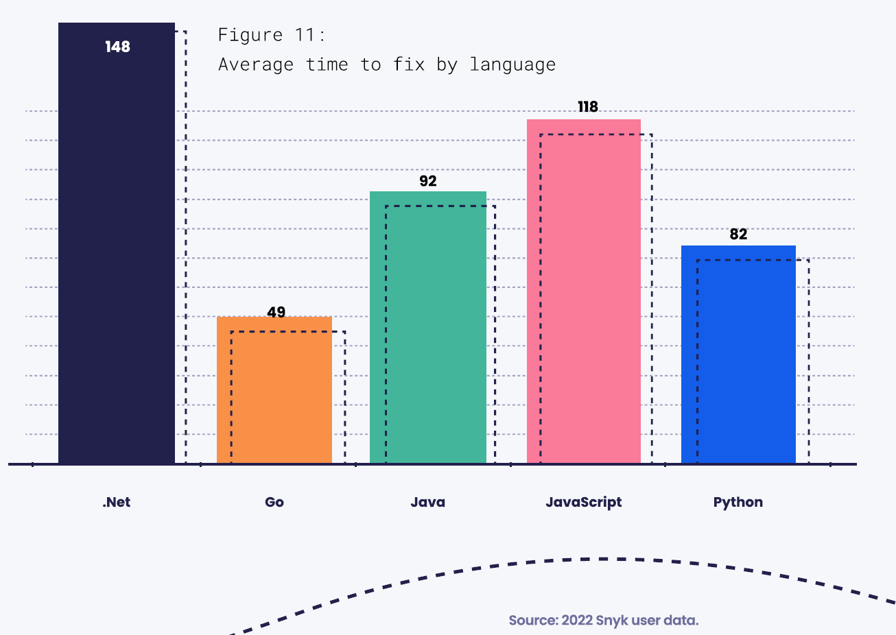
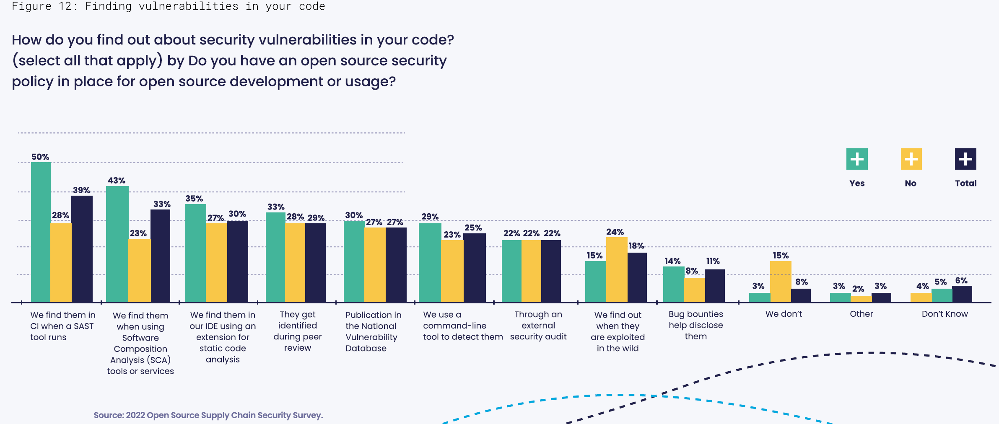
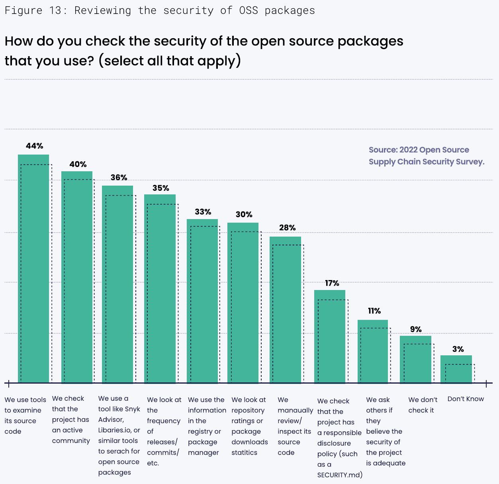
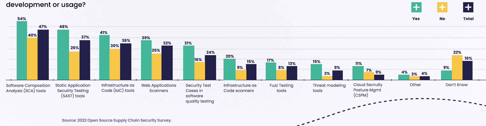
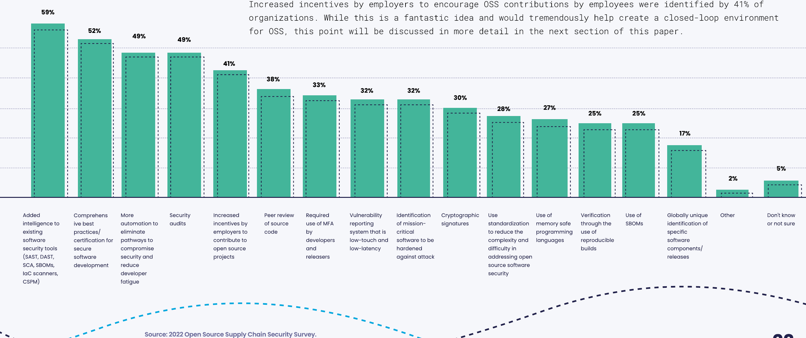

# How organizations are addressing and prioritizing their cybersecurity needs
# 组织如何解决和优先考虑其网络安全需求

A key finding of this research is that security, as it applies to OSS, is a rapidly evolving domain. Each of the primary threat vectors (source threats, build threats, and dependency threats) identified in the SLSA (Supply Chain Levels for Software Artifacts) model will require multiple actions on the part of most organizations to address.
However, because OSS security is also rapidly evolving, increased functionality and tool consolidation should help reduce the complexity that organizations face in addressing software supply chain security needs.

该研究的一个关键发现是，与开源软件(OSS)相关的安全性是一个快速发展的领域。SLSA（软件工件供应链级别）模型中确定的每个主要威胁向量（源威胁、构建威胁和依赖威胁）都需要大多数组织采取多个行动来应对。然而，由于开源软件的安全性也在快速发展，增加功能和工具整合应该有助于减少组织在应对软件供应链安全需求方面面临的复杂性。

This section of the report describes how organizations are addressing how vulnerabilities in code are found, how security of OSS components is evaluated, what security-focused tools are being used, and what security-related activities are most important.

本报告的这一部分描述了组织如何解决代码中的漏洞如何被发现，如何评估开源组件的安全性，使用了哪些专注于安全的工具，以及哪些与安全相关的活动最为重要。


```
Figure 10: Finding vulnerabilities in your dependencies
How do you find out about vulnerabilities in your dependencies? (select all that apply) by Do you have an open source security policy in place for open source development or usage?

图表 10：发现依赖项中的漏洞
您如何了解依赖项中的漏洞？（选择所有适用项）按照您是否有针对开放源代码开发或使用的安全策略进行筛选。

Source: 2022 Open Source Supply Chain Security Survey.
来源：2022 年开源供应链安全调查。

Industry vulnerability notifications
行业漏洞通知

Automated monitoring of packages for known vulnerabilites
自动监测已知漏洞的软件包

Notifications form package maintainers
来自软件包维护者的通知

Industy blogs and news site
行业博客和新闻网站

Through an external security audit
通过外部安全审计

We find out when they are exploited in the wild
我们发现了漏洞当它们在外面被利用了

Trust groups
信任的群体

Hackers
黑客

Don’t Know
不知道
```

## Organizational approaches to identifying vulnerabilities in dependencies
## 组织内识别依赖漏洞的方法

A common question in addressing OSS security is how to comprehensively identify vulnerabilities across your dependencies. Figure 10 shows that there are four commonly used techniques to identify vulnerabilities. The leading approach practiced by 53% of organizations is to subscribe to one or more vulnerability catalogs from CISA (US-CERT), NIST (NVD), MITRE (CVE), security product & service vendors, and/or catalog aggregators (like FIRST) that aggregate content from leading worldwide sources. These subscriptions have the advantage of pushing vulnerability notifications to their subscribers.

在处理开放源代码软件（OSS）安全问题时，一个常见的问题是如何全面地识别依赖关系中的漏洞。图10显示了四种常用的识别漏洞的技术。53%的组织采用的主要方法是订阅来自CISA（美国国家信息安全局），NIST（美国国家标准与技术研究所），MITRE（通用漏洞披露系统）以及安全产品和服务供应商和/或目录聚合器（例如FIRST）的一个或多个漏洞目录，这些目录汇集了来自全球领先的信息源的内容。这些订阅的优点是向其订阅者推送漏洞通知。

The second leading approach is automated monitoring — or scanning of packages for known vulnerabilities — and is practiced by 49% of organizations. One challenge with this approach is that it’s often difficult to map vulnerability reports to the component(s) containing the vulnerabilities. For example, there may be a vulnerability reported in some component foo, but often there are many components and forks named foo so users often can’t be confident when a report is relevant. While it’s a best practice to scan code formulaically based on time, changes to the code base and the identification of relevant vulnerabilities, a comprehensive approach to this technique is still on the horizon.

第二个主要方法是自动化监控或扫描已知漏洞的软件包。这种方法被49%的组织所采用。这种方法的一个挑战是，往往很难将漏洞报告映射到包含漏洞的组件上。例如，可能会报告某个组件foo中存在漏洞，但通常有许多命名为foo的组件和分支，因此用户经常无法确定报告的相关性。虽然根据时间、代码库的更改和相关漏洞的识别来公式化地扫描代码是最佳实践，但是这种技术的全面方法仍然需要探索。

Notifications from package maintainers are leveraged by 47% of organizations and can provide a conduit to keep packages updated when supported by maintainers. Industry blogs and news sites are used by 43% of organizations and can facilitate the timely delivery of information for a better sense of importance.

软件包维护者的通知被47%的组织所利用，当维护者支持时，可以提供更新软件包的渠道。行业博客和新闻网站被43%的组织使用，可以促进及时传递信息，以获得更好的重要性感知。

## Snyk - How long will it take to fix?
## Snyk - 需要多长时间来修复？

Once a vulnerability has been identified, the next logical question is “How long is this going to take to fix?” The answer is all too often, “I don’t know. It’s complicated.” Unsurprisingly, the question becomes even more complex when we apply it to the software supply chain. Our dependence on third-party code, especially transitive dependencies, often make that question difficult or impossible to answer.

一旦发现漏洞，下一个合理的问题是“修复需要多长时间?” 答案往往是：“我不知道。这很复杂。” 不出所料，当我们将其应用于软件供应链时，这个问题变得更加复杂。我们对第三方代码的依赖，尤其是传递依赖，经常使得这个问题难以或不可能回答。

Looking at the average time to fix by language in Figure 11, we see that Snyk’s data shows that Go has the best time to fix at 49 days, while .Net is the obvious laggard at 148 days to fix a vulnerability. While some maintainers might be able to fix vulnerabilities in days or hours, there have been a few vulnerabilities that took years to remediate.

观察图 11 中按语言分组的平均修复时间，我们可以看到 Snyk 的数据显示 Go 语言具有最佳的修复时间，为 49 天，而 .Net 则是明显的落后者，需要 148 天来修复漏洞。虽然一些维护者可能能够在几天或几小时内修复漏洞，但也有一些漏洞需要数年时间才能修复。


```
Figure 11:
Average time to fix by language

图 11：
按语言修复漏洞的平均时间

（坐标轴编程语言不翻译）

Source: 2022 Snyk user data.
来源：2022 年 Snyk 用户数据。
```

We expect that popularity and awareness influence the time to fix. A popular project is more likely to attract other collaborators, and additional collaborators can speed up incident response time. In addition, if a project is popular, awareness by users (including via technical press news) is likely to be larger.

我们预计受欢迎程度和意识会影响修复时间。一个受欢迎的项目更有可能吸引其他协作者，而额外的协作者可以加快事件响应时间。此外，如果一个项目很受欢迎，用户（包括通过技术新闻媒体）的关注度可能会更高。

A popular project can affect a significant portion of all projects. As an example, the Spring Framework library is found in 9% of all Java projects. The team responsible for Spring Framework responded quickly to fix the Spring4Shell remote code execution vulnerability when it was identified in the spring of 2022. But what if that vulnerability had existed in a less responsive yet popular package?

一个受欢迎的项目可能影响所有项目的重要部分。例如，Spring 框架库在所有 Java 项目中都有 9％的使用率。当在 2022 年春季发现 Spring4Shell 远程代码执行漏洞时，负责 Spring 框架的团队迅速做出了修复。但如果该漏洞存在于一个反应较慢但受欢迎的软件包中会怎样呢？


```
Figure 12: Finding vulnerabilities in your code
How do you find out about security vulnerabilities in your code? (select all that apply) by Do you have an open source security policy in place for open source development or usage?

图 12：发现代码中的安全漏洞
如何发现您的代码中的安全漏洞？（选择所有适用项）根据您是否制定了开放源代码安全策略来决定。

We find them in CI when a SAST tool runs
我们在 CI 中运行 SAST 工具时发现它们

We find them when using Software Composition Analysis (SCA) tools or services
我们在使用软件构成分析（SCA）工具或服务时发现它们

We find them in our IDE using an extension for static code analysis
我们在 IDE 中使用静态代码分析扩展程序时发现它们

They get identified during peer review
它们在同行评审期间被识别

Publication in the National Vulnerability Database
发布到国家漏洞数据库

We use a command-line tool to detect them
我们使用命令行工具检测它们

Through an external security audit
通过外部安全审计

We find out when they are exploited in the wild
我们在它们被实际利用时发现

Bug bounties help disclose them
赏金计划有助于披露它们

We don’t
我们不知道

Other
其他

Don’t Know
不知道
```

## Organizational approaches to identifying vulnerabilities in code
## 组织内识别代码漏洞的方法

Finding security vulnerabilities in code requires multiple approaches, much like finding vulnerabilities in dependencies.
Figure 12 identifies the leading ways that developers find security vulnerabilities. The leading approach used by 39% of organizations, of the options included in the survey, is to use a SAST (Static Application Security Testing) tool. SAST tools are immensely useful during development because they can be configured to run automatically as part of a CI (continuous integration) process and can often identify specific line(s) of code responsible for a vulnerability.

发现代码中的安全漏洞需要多种方法，就像发现依赖项中的漏洞一样。
图表 12 显示了开发人员发现安全漏洞的主要方式。在调查包括的选项中，39% 的组织使用 SAST（静态应用程序安全测试）工具，这是最常用的方法。SAST 工具在开发过程中非常有用，因为它们可以配置为作为 CI（持续集成）过程的一部分自动运行，并且通常可以确定负责漏洞的具体代码行。

The second leading approach practiced by 33% of organizations, among the survey options, is to use an SCA (software composition analysis) tool. Use of these tools can be automated, and they typically address manifest scanning and binary scanning to identify known security vulnerabilities, licensing issues, or quality problems. While this capability is more closely associated with finding vulnerabilities in dependencies, including SCA in the build process helps OSS security activities to shift left.

第二个主要方法是SCA（软件构成分析）工具，SCA工具被在调查选项中的33%中的组织使用。使用这些工具可以自动化，并且通常涉及清单扫描和二进制扫描，以识别已知的安全漏洞、许可问题或质量问题。虽然这种能力更与发现依赖项中的漏洞密切相关，但将SCA纳入构建流程有助于将开源软件的安全活动向左移动。

Finally, a SAST tool can be used within an IDE providing the developer with a more immediate, hands-on, and configurable approach to manual security testing. What this approach lacks in automation is more than compensated for in direct and timely developer involvement. Figure 12 shows that 30% of organizations leverage this approach.

最后，SAST工具可以在集成开发环境（IDE）中使用，为开发人员提供更直接、及时和可配置的手动安全测试方法。虽然这种方法缺乏自动化，但直接且及时的开发人员参与可以弥补这一不足。图12显示，30% 的组织利用这种方法。

Although just 29% of organizations use peer review to help identify vulnerabilities in code, peer review and a reliance on multifunctional teams is a best practice and cornerstone of agile development.

尽管只有29%的组织利用同行评审来帮助发现代码漏洞，但同行评审和依赖于多功能团队是敏捷开发的最佳实践和基石。

Although this particular survey question did not offer tool choices other than SCA and SAST, Figure 14 does and confirms the leading popularity of SCA and SAST tools.

尽管此项调查问题未提供除SCA和SAST之外的工具选择, 但图14提供了其他工具的流行度, 并确认了SCA和SAST工具的领先流行度。

## Snyk - Dependencies in the real world
## Snyk - 现实中的依赖关系

When talking about direct and transitive vulnerabilities, the actual pervasiveness of transitive vulnerabilities is easy to overlook or dismiss. As observed earlier, nearly 40% of the vulnerabilities we detect originate in third-party code. Two examples of recent, high profile vulnerabilities, Log4Shell and Spring4Shell, give us an opportunity to compare the nature of direct vs. transitive dependencies in the real world.

当谈到直接和传递性漏洞时，我们容易忽视或忽略传递性漏洞的实际普遍性。正如先前观察到的，检测到的近40％的漏洞源于第三方代码。最近出现的两个备受关注的漏洞 “Log4Shell” 和 “Spring4Shell” 为我们提供了比较现实世界中直接依赖和传递性依赖性质的机会。

Last Christmas, Log4Shell was the bane of security teams and developers across the globe. The log4j-core project has been used extensively to enable logging in millions of projects. Because of this, nearly 52% of the vulnerabilities we detected were present because of a direct dependency on the log4j-core code base. (It’s important to note that we counted direct dependencies first, so a project with both direct and indirect dependencies would be counted as direct.)

去年圣诞节，Log4Shell 是全球安全团队和开发人员的噩梦。log4j-core 项目已被广泛使用，在数百万项目中启用日志记录功能。由于这个原因，我们发现的近52％的漏洞存在于直接依赖 log4j-core 代码库的项目中。（需要注意的是，我们首先计算直接依赖项，因此既有直接依赖项又有间接依赖项的项目将被视为直接依赖项。）

In contrast to Log4j, over 90% of the Spring Framework core was transitive, called by code one layer or more removed from the developer. The Spring Framework can be described as the ‘plumbing of enterprise applications’, which helps explain why it’s a transitive dependency so often. This is a very common example of how vulnerable code gets incorporated into projects, and why it’s important to track transitive vulnerabilities.

与 Log4j 相比，超过90％的Spring框架核心是传递性的，Spring框架由代码调用而距离开发人员一层或更多层。Spring 框架可以被描述为“企业应用程序的管道”，这有助于解释为什么它经常是一个传递性依赖项。这是一个非常常见的漏洞代码被纳入项目的例子，也是为什么跟踪传递性漏洞很重要的原因。

## Prerequisites to using OSS
## 使用开源软件的前提条件

Using open source components can help to reduce cost, speed time to market, and free staff up to engage in more innovation and value- added activities. There is no “right way” to evaluate the security of OSS packages, but Figure 13 indicates that on average organizations use three of the approaches listed.

使用开源组件可以降低成本，加速产品进入市场的时间，以及释放员工从事更多的创新和增值活动。虽然评估开源软件包的安全性没有“正确的方法”，但是图 13 表明了组织平均使用列出的三种方法。

The most common approach used by 44% of organizations is to have developers examine source code. A review of source code can speak volumes about the quality of the code, which is highly correlated with its security.

最常见方法是让开发人员检查源代码，该方法被44%的组织机构所采用。对源代码的审查可以充分说明代码的质量，这与其安全性高度相关。

A second approach relied on by 40% of organizations is to assess the community that supports the project or component. An active community and an organized approach to contribution and maintainership are seen as positive signs for a project.

第二种方法是评估支持项目或组件的社区，该方法被40%的组织机构所依赖。一个活跃的社区和有组织的贡献和维护方法被视为项目的积极信号。

The third most popular strategy, observed at 36% of organizations, is using third-party tools to help developers find and vet components.

第三种最受欢迎的策略，在36% 的组织中观察到，是使用第三方工具来帮助开发人员查找和审核组件。

A variety of additional manual activities are used by organizations, including reviewing the frequency of releases/ commits (35%), analysis of registry/package manager information (33%), and reviewing usage statistics such as repository ratings or download statistics (30%). These help establish the viability and commitment of the community to the component.

组织使用各种额外的人工活动，包括查看发布/提交的频率（35%），分析注册表/包管理器信息（33%），以及查看使用情况统计信息，例如存储库评级或下载统计信息（30%）。这些有助于建立社区对该组件的可行性和承诺。


```
Figure 13: Reviewing the security of OSS packages
图 13：审查开源软件包的安全性

How do you check the security of the open source packages that you use? (select all that apply)
你如何检查你使用的开源软件包的安全性？（选择所有适用项）

Source: 2022 Open Source SupplyChainSecuritySurvey.
来源：2022 年开源供应链安全调查。

We use tools to examine its source code
我们使用工具检查其源代码

We check that the project has an active community
我们检查该项目是否有一个活跃的社区

We use a tool like Snyk Advisor, Libaries.io, or similar tools to serach for open source packages
我们使用像 Snyk Advisor、Libraries.io 或类似的工具搜索开源包

We look at the frequency of releases/ commits/ etc.
我们查看发布 / 提交等的频率

We use the information in the registry or package manager
我们使用注册表或包管理器中的信息

We look at repository ratings or package downloads statitics
我们查看存储库评级或软件包下载统计信息

We manaually review/ inspect its source code
我们手动检查其源代码

We check  that the project has a responsible disclosure policy (such as a SECURITY.md)
我们检查该项目是否有负责任的披露策略（例如 SECURITY.md）

We ask others if they believe the security of the project is adequate
我们询问其他人是否认为该项目的安全性足够

We don’t check it
我们不检查它

Don’t Know
不知道
```

## Using multiple security testing tools is an OSS best practice
## 使用多个安全测试工具是开源软件的最佳实践

On average, organizations in the study used between two and three security testing tools. Using third-party tools can significantly improve your OSS security posture because of their scope, scalability, automation potential, and coverage across the SDLC. As budgets, resources, and time allows; using more tools can be advantageous since they all add value in different ways.

平均而言，研究中的组织使用了两到三种安全测试工具。使用第三方工具可以显著改善您的 OSS 安全状况，因为它们的范围、可扩展性、自动化潜力和覆盖整个 SDLC。在预算、资源和时间允许的情况下, 使用更多工具可能是有利的，因为它们都以不同的方式增加价值。

Figure 14 shows that preference is higher for SCA tools (47%) than for any other tool category. The ability of SCA tools to identify vulnerabilities and license compliance across an organization’s portfolio of components and dependencies, in a highly automated way, is immensely valuable.

图 14 显示，对 SCA 工具的偏好高于任何其他工具类别（47%）。SCA 工具在高度自动化的方式下，可以识别组织组件和依赖项组合中的漏洞和许可证合规性，这是极其有价值的。

Figure 14: Security tools in use when developing OSS

图 14：在开发 OSS 时使用的安全工具

What security tools do you regularly use when developing open source software? (select all that apply) by Do you have an open source security policy in place for open source development or usage?

在开发开源软件时，您定期使用哪些安全工具？（选择所有适用项）您是否针对开源开发或使用制定了开源安全策略？


```
Software Composition Analysis (SCA) tools
软件组件分析工具（SCA）

Static Application Secuirty Testing (SAST) tools
静态应用程序安全性测试 (SAST) 工具

Infrastructure as Code (IaC) tools
基础设施即代码 (IaC) 工具

Web Applications Scanners
Web 应用程序扫描器

Security Test Cases in software quality testing
软件质量测试中的安全测试用例

Infrastructure as Code scanners
基础设施即代码扫描器

Fuzz Testing tools
模糊测试工具

Threat modeling tools
威胁建模工具

Cloud Secruity Posture Mgmt (CSPM)
云安全姿态管理（CSPM）

Other
其他

Don’t Know
不知道
```

Other than SCA tools, additional choices become complex based on the organization’s approach to DevOps and preferences regarding security testing. SAST tools (37%), IaC tools (36%), and web application scanners (32%) all effectively compete for developer and security team attention. Web application scanners and fuzz testing tools together make up the dynamic application security testing (DAST) tool domain. Realistically, the use of both SAST and DAST tools makes sense because both help organizations find vulnerabilities. However, IaC tools are invaluable in helping to script and automate CI/CD activities, eliminating many of the manual and ad hoc activities that consume time that could be better spent elsewhere.

除了 SCA 工具之外，根据组织的 DevOps 方法和安全测试偏好，其他选择会变得复杂。SAST 工具 （37%）、IaC 工具 （36%） 和 Web 应用程序扫描程序 （32%） 都有效地争夺了开发人员和安全团队的注意力。Web 应用程序扫描程序和模糊测试工具共同构成了动态应用程序安全测试 （DAST） 工具域。实际上，同时使用 SAST 和 DAST 工具是有意义的，因为两者都可以帮助组织发现漏洞。但是，IaC 工具在帮助编写脚本和自动化 CI/CD 活动方面非常宝贵，消除了许多耗时的手动和临时活动，省下的时间可以更好地花在其他地方。

An honorable mention goes out to the remaining tools on the list. Some of these tools are relatively new, but each of them offers a unique value proposition that adds value to improving OSS security.

我们还要向剩下的工具表示敬意。这些工具中有些是相对较新的，但它们每一个都有独特的价值主张，为提升开源软件安全增添了价值。

Examining the tool use profiles of organizations with a security policy versus those without provides an overview of where organizations often start their OSS security journey, and what this journey looks like as it matures.

分析具有安全策略和没有安全策略的组织在使用工具方面的差异，可以提供有关组织开始和成熟过程中的开源软件安全旅程的概述。

## The most important ways to improve OSS security
## 提升开源软件安全最重要的方法

The data in Figure 15 is likely the most important collection of key findings in this report. When asked which of the following activities are important to improving the security of OSS, organizations were permitted to give multiple responses.

图 15 中的数据可能是本报告中最重要的关键发现集合。当被问及以下哪些活动对提高开放源码软件的安全性很重要时，允许各组织作出多重回答。

The most important activity — confirmed by 59% of organizations — identified a desire to have vendors add increased intelligence to, and to be responsible for, security tooling. There are two ways to interpret what this means. The first is that end user organizations view the vendor community as a force multiplier, because more intelligent tools can ease the burden on developers or security professionals in exchange for licensing fees. Organizations and vendors both perceive this as a win-win scenario assuming competitive market dynamics. An alternative way to interpret this is that end-user organizations are struggling to understand how to address security concerns and welcome the opportunity to share/grant this responsibility to vendors and service providers who have more extensive expertise.

最重要的活动， 得到59%的组织证实， 确定了让供应商增加安全工具智能并负责安全工具的愿望。有两种方法可以解释这意味着什么。第一种解释是，最终用户组织将供应商社区视为力量倍增器，因为更智能的工具可以减轻开发人员或安全专业人员的负担，以换取许可费。假设市场动态竞争激烈，组织和供应商都认为这是一个双赢的局面。另一种解释方式是，最终用户组织正在努力了解如何解决安全问题，并乐于与具有更广泛专业知识的供应商和服务提供商共享 / 授权这种责任。

Another way to look at this is that end user organizations have scarce resources, and more intelligent tools are expected to provide higher value in a transparent way (meaning having no or inconsequential impact on developer productivity). This is the most seamless way to improve software security without material changes to process models.

另一种看待这个问题的方式是，终端用户组织资源有限，更加智能的工具预计以透明的方式提供更高的价值，意味着对开发人员生产率没有或者只有微不足道的影响。这是在不对过程模型进行重大更改的情况下提高软件安全性的最无缝方法。

The second most important activity is to source comprehensive best practices/certifications for secure software development (cited by 52% of organizations). The strong interest by end user organizations in best practices for secure software development is exciting to see. This suggests that these organizations are invested in understanding how to address OSS security. The good news is that there are already several trusted sources who can address this need:
* There are a variety of sources to identify best practices/ certifications for evaluating projects themselves. This includes the OpenSSF Best Practices badge, the OpenSSF Scorecards project, the CNCF paper on best practices for supply chain security, and SLSA (<https://slsadev>)
* This also suggests an interest in encouraging developers to learn best practices & acquire certifications. The good news is that these are available. For example, OpenSSF’s developing secure software (LFD121) provides both a training course and certification of completion for individuals who pass the final exam. This course is sponsored by the OpenSSF which is part of the Linux Foundation.

第二个最重要的活动是为安全软件开发提供全面的最佳实践/认证（52%的组织引用）。最终用户组织对安全软件开发最佳实践的浓厚兴趣令人兴奋。这表明这些组织在了解如何解决开放源码软件安全问题方面进行了投资。好消息是，已经有几个值得信赖的来源可以满足这一需求：
* 有多种来源可以确定评估项目本身的最佳实践/认证。这包括OpenSSF最佳实践徽章，OpenSSF记分卡项目，CNCF关于供应链安全最佳实践的文件和SLSA（<https://slsadev>）。
* 这也表明鼓励开发人员学习最佳实践和获得认证的兴趣。好消息是这些都可用。例如，OpenSSF 的安全软件开发（LFD121）提供培训课程和通过期末考试获得认证的个人证书。该课程由 OpenSSF 赞助，是 Linux 基金会的一部分。

Figure 15: Activities for improving the security of open source software

图 15：改善开源软件安全的活动

Which of the following activities are important to improving the security of the open source software supply chain? (select all that apply)

以下哪些活动对于改善开源软件供应链的安全性很重要？（选择所有适用项）


```

Added intelligence to existing software security tools (SAST, DAST, SCA, SBOMs, IaC scanners, CSPM)
增加软件安全工具的智能化（SAST，DAST，SCA，SBOM，IaC 扫描程序，CSPM）

Comprehens ive best practices/ certification for secure software development
全面的安全软件开发最佳实践 / 认证

More automation to eliminate pathways to compromise security and reduce developer fatigue
更多自动化以消除威胁安全的途径并减轻开发人员的负担

Security audits
安全审计

Increased incentives by employers to contribute to open source projects
雇主提供更多的激励鼓励员工参与开源项目

Peer review of source code
源代码的同行评审

Required use of MFA by developers and releasers
要求开发人员和发布者使用多因素认证

Vulnerability reporting system that is low-touch and low-latency
低成本、低延迟的漏洞报告系统

Identification of mission-critical software to be hardened against attack
识别需要加强防攻击的关键软件

Cryptographic signatures
使用加密签名

Use standardization to reduce the complexity and difficulty in addressing open source software security
标准化以减少处理开源软件安全性的复杂性和难度

Use of memory safe programming languages
使用内存安全编程语言

Verification through the use of reproducible builds
通过使用可重现构建来验证

Use of SBOMs
使用 SBOMs

Globally unique identification of specific software components/ releases
全球唯一标识特定软件组件 / 发布版本

Other
其他

Don't know or not sure
不知道或不确定

Source: 2022 Open Source Supply Chain Security Survey.
来源：2022 年开源供应链安全调查。
```

In third place for most popular activities around secure software development, we see a tie between increased automation to reduce attack surfaces and security audits, which were cited by 49% of organizations. The use of IaC tools can provide a reliable path to increased automation of CI CD activities.
These tools have proven to be popular across organizations in this survey, and in the right hands, they can be extremely effective. Security audits are also a valuable way to gauge the current state of security for some or all of the organization’s applications. However, security audits — as measured through the eyes of maintainers who participated in the survey — were not valued nearly as highly. While security audits can be invaluable at comprehensively assessing an organization’s security risks, the organization must be positioned to act upon the findings of that audit —  which seems a bridge too far for organizations without a security policy. However, note that there were only 72 maintainers participating in this survey, and 78% of them had not participated in an external security audit. It’s possible that security audits are so rare that few software developers have experienced them (and thus can only guess about their advantages).

最受欢迎的安全软件开发活动，增加自动化以减少攻击面和安全审计并列第三，这两项活动被 49% 的组织提到。使用基础架构即代码（IaC）工具可以提供可靠的路径来增加 CI CD 活动的自动化。

这些工具在本次调查中已被证明受到组织的欢迎，在正确的使用下可以非常有效。安全审计也是衡量组织某些或所有应用程序当前安全状态的有价值方式。但是，从参加调查的维护者的角度来衡量安全审计，它们的价值远不如前两项。虽然安全审计可以全面评估组织的安全风险，但组织必须有能力对审计结果进行行动 - 这对于没有安全策略的组织来说似乎过于困难。但请注意，本次调查只有 72 名维护者参加，其中 78％的人没有参加过外部安全审计。安全审计可能非常罕见，以至于很少有软件开发人员经历过它们（因此只能猜测它们的优势）。

Increased incentives by employers to encourage OSS contributions by employees were identified by 41% of organizations. While this is a fantastic idea and would tremendously help create a closed-loop environment for OSS, this point will be discussed in more detail in the next section of this paper.

41%的组织认为雇主为鼓励雇员贡献开放源码软件而采取的激励措施有所增加。虽然这是一个绝妙的主意，并且将极大地帮助创建开源软件的闭环环境，但本文的下一节将更详细地讨论这一点。
