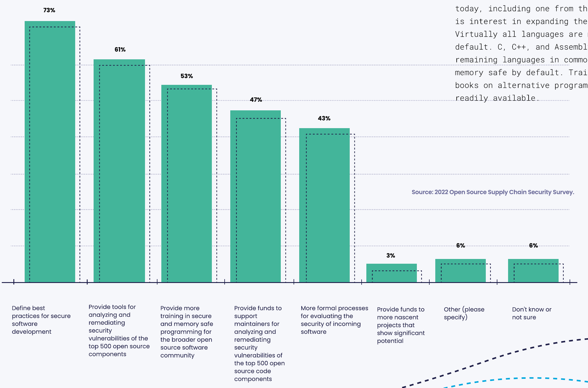
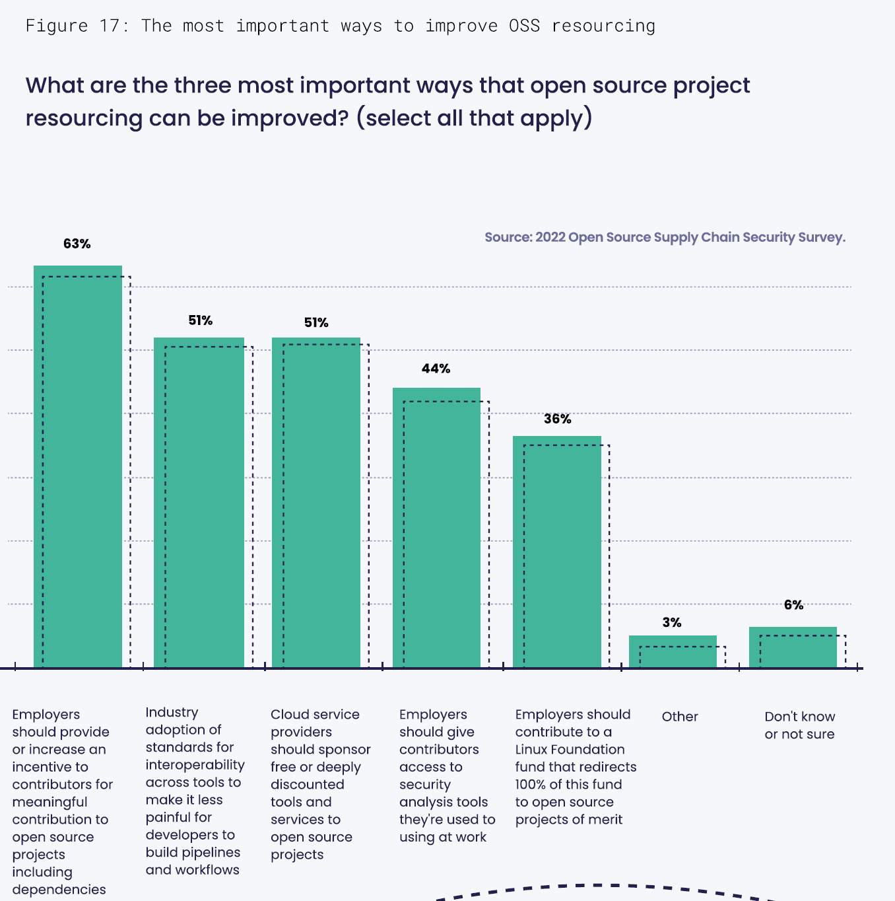
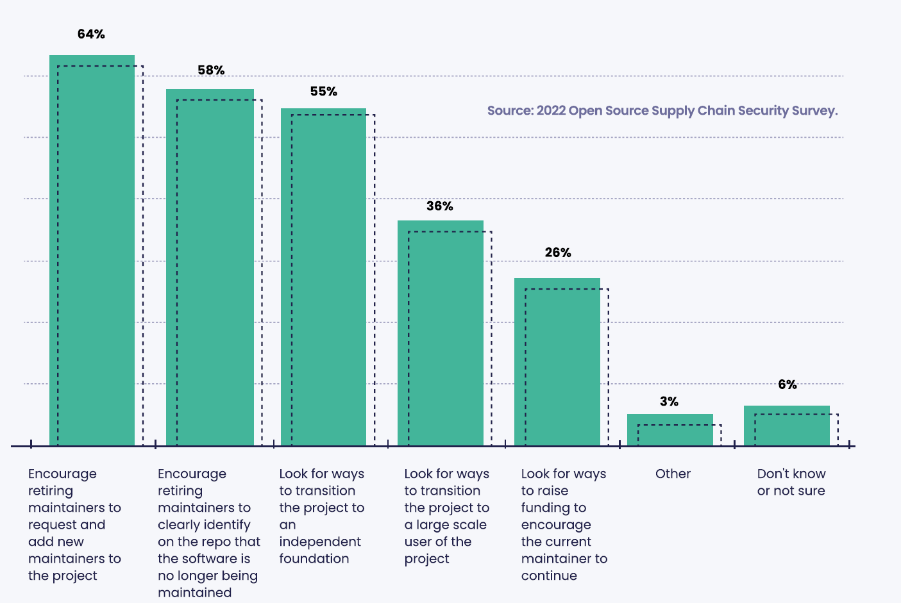

The IT industry must take a more active rol to improve OSS securit and sustainability

Open source software has thrived as an alternative engine of innovation for organizations and developers alike. The pervasive use of OSS is testimony to the impact that it has had on the IT industry. However, OSS security and quality requires a full lifecycle commitment which creates additional investments in resources, time, and developers when compared to current practice. This section of the report introduces a variety of OSS security and sustainability challenges and solicits advice from organizations on how to address them.

Improving the security of oss development

Organizations and developers are no strangers to the importance of best practices for secure software development. The significance of best practices for OSS development was initially voiced in Figure 15 as the 2nd most important activity for improving OSS security. Best practices have been voiced again by 73% of organizations in Figure 16 as the leading way IT industry organizations can improve the security of OSS development. IT industry organizations (such as the Linux Foundation) have taken this responsibility seriously and are delivering best practices content across a variety of channels.

The and Leading improvement, identified by 61% of organizations, is providing tools for analyzing and remediating security vulnerabalities in Oss components. This need is being addressed as part of the Openssf's open source Software Security
Nobilization Plan. This plan was released at the Open Source Software Security Summit IT in Washängton DG on Nay 12-13, 2022, This plan is avadlable at shttps://
openssf.org/oss-security-mobilization-plan/»,

Figure 16: How organizations can improve the security of OSS development
What are some of the ways that IT Industry Organizations could improve the security of developing open source software? (select all that apply)

The 3rd ranked improvement identified in Figure 16 by 53% of organizations is to provide more training in secure and memory safe programming.
Sadly, many software developers have not been trained on how to develop secure software. As noted earlier, there are some courses available today, including one from the OpenS, and there is interest in expanding these courses further.
Virtually all languages are memory safe by default. C, C++, and Assembly are the only remaining languages in common use that are not memory safe by default. Training courses and books on alternative programming languages are readily available

Improving open source software resourcing

OSS resourcing is a growing challenge because of the need to improve the security and quality of OSS components. The Open Source Software Security Mobilization Plan, put forward by the OpenSSF, aims to address the following:

Secure aSS production. Focus on preventing security defects and vulnerabilities in code and open source packages in the färst place.

• Improving vulnerability discovery and remediation. Improving the process for finding defects and fixing them.

•Shorten ecosystem patching response time. Shorten the response time for distributing and implementing fixes.

This plan is estimated to cost in the vicinity of $70 million to $110 million per year and is designed to provide a blueprint and services including education, training, tools, and processes to secure the top OSS projects. While this plan will provide a useful model for OSS projects in general, there are millions of ongoihg OSS projects. How will funding for many of these projects be accomplished?

Figure 17 addresses this dilemma. The leading response shared by 63% of organizations suggests that employers should provide or increase an incentive to contributors of meaningful OSS projects.
If end-user organizations elected to "give back" to the oss communities they depend on, it would attract more contributors and improve the security and quality of those OSS components.

Figure 17: The most important ways to improve OSS resourcing
What are the three most important ways that open source project resourcing can be improved? (select all that apply)

Industry adoption of standards for interoperability across tools and discounted resources provided by CSPs (Cloud Service Providers) to OSS projects resonate across 51% of organizations in this study Interoperability concerns were frustrating and are a characteristic of immature markets. The fragmented nature of today's software security markets suggests that consolidation will occur and help address this problem although the timeframe is unknown.
The concept of cloud service providers providing support for secure
OSS development is intriguing. Having access to a portfolio of tools adept at secure software development at deeply discounted prices would be a win for developers. It could also be a win for CSPs as an on-ramp to more conventionally priced runtime services.
However, whether this idea has been vetted with CSPs is unknown as is their overall receptivity to the idea.

44% of developers at organizations also embrace having their employer establish a sandbox for developing OSS projects using the same tools they are already familiar with. This is also an intriguing idea and would qualify as yet another perk provided by an employer to their employees who contribute to material OSS projects.
Although the ideas presented as responses in Figure 17 are speculative, they all reflect the realization that secure OSS development will require additional investment which needs to be provided by the community that benefits from the value derived from OSS.

Snyk - Broken Containers

Vulnerability management is complicated enough to start with, but the advent of containers, virtual machine images, IaC, and microservices complicate it even further. While many organizations are still improving how to handle vulnerabilities in their own code, and starting to examine direct and transitive dependencies in depth, fixing the vulnerabilities introduced by containers is still a struggle. Container images (among other constructs) are often
"black boxes" that organizations do not examine further.

Returning to our examples of recent vulnerabilities, as of the time of this writing, only 8% of container projects with Spring Framework dependencies have fully remediated the Spring4Shell vulnerability. In contrast, Log4Shell has been resolved in nearly 25% of all containers.

Because containers can be ephemeral, the act of creating and destroying containers provides an opportunity for implementing
*_ updates that could occur rapidly and significantly improve existing vulnerability dynamics. Changing the code in one container configuration could potentially result in hundreds of updated containers. The flip side is that one container configuration forgotten or missed can also easily result in the same number continuing to be vulnerable. This later challenge is one readily resolved through the use of SBOMs.

Improving OSs sustainability

OSS sustainability is an important topic for anyone who depends on OSS. For small OSS projects maintained by a single person, challenges exist. Sustainability requires continuity over time. To achieve this requires the successful ability to transfer maintainer responsibilities to additional maintainers.

Figure 18 helps prioritize key activities to help address OSS sustainability. Across organizations, 64% report that maintainers should plan for their own retirement by bringing new maintainers into the project. This is the preferred path forward but requires attention to nontechnical activities focused on process and communication. Adding a second maintainer to a project and transferring responsibility from the original maintainer are likely to be some of the most difficult activities a project must overcome.
Recognizing the challenges of transferring project responsibility, 58% of organizations believe that if a project reaches its end of life the retiring maintainer should clearly identify on the repo that the software is no longer being maintained.

An alternative path for transferring maintainership responsibility is to find a foundation or IT industry organization that will create a new home for the project. 55% of organizations endorsed this path forward although it may prove to be nearly as complex as independently finding a new maintainer.

Figure 18: Improving OSS sustainability
How should open source software sustainability be addressed if the
maintainer(s) on a project decide to retire? (select all that apply)

 
