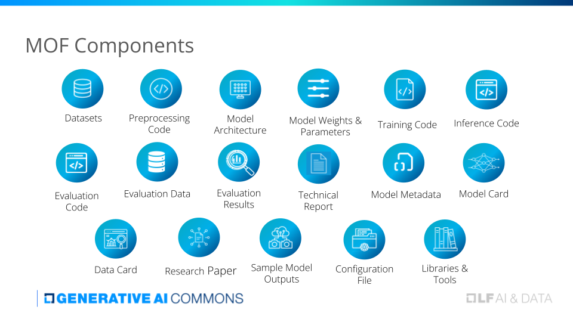

Author: Cakery
作者： Cakery
Date: April 17, 2024
日期：4月17号，2024
Title: The MOF in a Nutshell
题目：MOF（模型开放性框架）简介

The field of artificial intelligence (AI) is at an inflection point. The rapid rise of generative AI systems and large language models (LLMs) has unlocked unprecedented capabilities in natural language processing, image and video generation, and more. From GPT-4 to Stable Diffusion, these models are capturing the public imagination and driving a new wave of applications and research.
人工智能（AI）领域正处于一个转折点。生成式AI系统和大语言模型（LLMs）的快速崛起开启了在自然语言处理、图像和视频生成等方面前所未有的能力。从GPT-4到Stable Diffusion，这些模型正吸引着公众的想象力，推动着新一波应用和研究的涌现。

However, amidst the excitement lies a growing unease. Many state-of-the-art AI models remain opaque “black boxes” and their inner workings are shielded from scrutiny. Details about training data, model architectures, and development processes are often scant. This lack of transparency makes it difficult to independently verify claimed capabilities, audit for potential biases and safety issues, and build on the work.
然而，在这种兴奋之中存在着日益增长的不安。许多最先进的AI模型仍然是不透明的“黑盒子”，它们的内部工作原理被封闭起来，难以进行审查。关于训练数据、模型架构和开发过程的细节通通不清不楚。这种缺乏透明度造成难以单独验证其声称的能力，难以审计潜在的偏见和安全问题，并难以在此基础上继续研究工作。

Some model producers have taken steps towards openness by releasing models publicly, but a closer examination reveals concerning patterns. Models purported as “open-source” frequently employ bespoke licenses with ambiguous terms. Documentation is sparse and scattered. Key artifacts like datasets, training code, and benchmarks are absent.
一些模型生产者采取了向公众发布模型的举措，仔细一检查却揭示了令人担忧的模式。所谓的“开源”模型经常采用带有模糊条款的定制许可证。文档稀少且零散。关键的工件，如数据集、训练代码和基准测试，都缺失不可见。

This “open-washing” trend threatens to undermine the very premise of openness – the free sharing of knowledge to enable inspection, replication, and collective advancement. If we are to realize the immense promise of AI while mitigating its risks and pitfalls, we need genuine openness across all stages of the model development lifecycle.
这种“开源洗白”的趋势威胁着开放性的本质——即知识共享难以实现检查、复制和共同进步。如果我们希望实现人工智能的巨大潜力，同时又要减轻风险和陷阱，我们就需要在模型开发生命周期的所有阶段实现真正的开放性。

It is in this context that we introduce the Model Openness Framework (MOF). The MOF is a comprehensive framework for objectively evaluating and classifying the completeness and openness of machine learning models. It does so by assessing which components of the model development lifecycle are publicly released and under what licenses.
正是在这种背景下，我们引入了模型开放性框架（MOF）。MOF是一个全面性的框架，用于客观评估和分类机器学习模型的完整性和开放性。它评估模型开发生命周期的哪些组件是公开发布的，以及采用何种许可证来实现这一目标。

The framework identifies 16 critical components that constitute a truly complete model release:
本框架确定了构成完备模型发布的16个关键组件：

译者注释：
MOF Components: MOF主件
Datasets：数据集
Preprocessing：预处理
Model Architecture: 模型架构
Model Weights & Parameters:模型权重和参数
Training Code:训练代码
Inference Code:推理代码
Evaluation Code:评估代码
Evaulation Data:评估数据
Evaluation Results:评估结果
Technical Report:技术报告
Model Metadata:模型元数据
Model Card:模型卡
Data Card:数据卡
Research Paper:研究论文
Sample Model Outputs:模型样本输出
Configuration File:配置文件
Libraries & Tools:库和工具

For each component, the MOF stipulates the use of standard open licenses based on the artifact type – open-source licenses for code (e.g. Apache 2.0, MIT), open-data licenses for datasets and model parameters (e.g. CDLA-Permissive, CC-BY), and open-content licenses for documentation and content/unstructured data (e.g. CC-BY).
对于每个组件，MOF规定了基于工件类型的标准开放许可证如何使用——对于代码采用开源许可证（例如Apache 2.0、MIT），对于数据集和模型参数采用开放数据许可证（例如CDLA-Permissive、CC-BY），对于文档和内容/非结构化数据采用开放内容许可证（例如CC-BY）。

Using these building blocks, the MOF defines three progressively broader classes of model openness:
利用这些模块，MOF定义了三个逐渐扩展的模型开放类别：

译者注释：
MOF Class：MOF分类
Components Included:组成模块
Class I - Open Sicence: I类 - 开放科学
Research Paper:研究论文
Datasets:数据集
Data Preprocessing Code:数据预处理代码
Mode Parameters and Metadata(Intermediate Checkpoints and Optimizer States):模型参数和元数据
Class II - Open Tooling:II类-开放工具
Training Code:训练代码
Inference Code:推理代码
Evaluation Code:评估代码
Evaluation Data:评估数据
Supporting Libraries & Tools:支撑库&工具
Class III - Open Model:III类 - 开放模型
Model Architecture:模型架构
Model Card:模型卡
Data Card:数据卡

Class III – Open Model: The minimum bar for entry, Class III requires the public release of the core model (architecture, parameters, basic documentation) under open licenses. This allows model consumers to use, analyze, and build on the model, but limits insight into the development process.
III级 – 开放模型：作为入门标准，III类要求将核心模块（架构、参数、基本文档）公开发布，并采用开放许可证。这使得模型使用者能够使用、分析和构建模型，但限制了使用者对开发过程的深入了解。

Class II – Open Tooling: Building on Class III, this tier includes the full suite of code used to train, evaluate, and run the model, plus key datasets. Releasing these components enables the community to better validate the model and investigate issues. It is a significant step towards reproducibility.
II级– 开放工具：在III类基础上，这一级别的开放还涵盖了用于训练、评估和运行模型的全部代码，以及关键数据集。公开这些组件可以使社区更好地验证模型并探查其中的问题。这是迈向可重现性的重要一步。

Class I – Open Science: The apex, Class I entails releasing all artifacts following open science principles. In addition to the Class II components, it includes the raw training datasets, a thorough research paper detailing the entire model development process, intermediate checkpoints, log files, and more. This provides unparalleled transparency into the end-to-end development pipeline, empowering collaboration, auditing, and cumulative progress.
I级 – 开放科学：顶级，I级要求按照开放科学原则发布所有工件。除了II级开放组件外，还包括原始训练数据集、详尽的研究论文，详细说明整个模型开发过程，中间检查点、日志文件等。这提供了端到端开发流程的无与伦比的透明度，增强了协作、审计和累积进展。

By laying out these requirements, the MOF provides both a north star to strive for and a practical roadmap to get there. It turns openness from an abstract ideal to an actionable framework. Model producers have clear guideposts for what and how to release. Model consumers can readily discern the degree of openness and make informed usage decisions.
通过明确这些要求，MOF既提供了一个可追寻的北极星方向，又提供了一个实用的实现路线图。它将开放性从抽象的理念转化为可行的框架。模型生产者可以清楚地了解该发布什么以及如何发布。模型使用者可以轻松辨别开放程度，并做出知情的使用决策。

The Merits of Openness in AI
开放AI的优势

The power of open science and open source: The MOF reflects a conviction that openness is not just a nice-to-have, but an ethical and scientific imperative in the development of consequential AI systems. It builds on the hard-won lessons and successes of the open science and open source software movements.
开放科学和开源软件的力量：MOF反映了一种信念，即在开发具有重大影响的AI系统时，开放性不仅是一种美好的品质，而且是一种道德和科学的必要条件。它建立在开放科学和开源软件运动的艰苦实践和成功之上。

Open science has become a clarion call across the research community. From the life sciences to physics and psychology, scholars are embracing practices like code sharing, data sharing, and open access publication for research papers. The benefits have been manifold – greater reproducibility, faster dissemination of results, increased trust, and accelerated discovery through collaboration. The MOF brings this ethos to AI development.
开放科学已经成为整个研究界的共同呼吁。从生命科学到物理学和心理学，学者们正在拥抱很多实践，像代码共享、数据共享和研究论文出版物的公开获取。这些做法带来了许多好处——更可靠的可重现性、结果更快地传播、增强的信任和通过协作而加速的发现。是MOF将这种理念引入到了AI开发中。

Similarly, open source software has revolutionized the technology industry. The LAMP stack, Linux, and myriad other projects demonstrate the power of community-driven development. Open code has become infrastructure and spawned multi-billion dollar businesses. Bugs are surfaced and fixed faster, new features iterated more rapidly. The MOF recognizes that AI, too, can be democratized and improved through openness.
同样，开源软件已经彻底改变了技术行业。LAMP堆栈、Linux和无数其他项目展示了社区驱动开发的力量。开放代码已经成为基础设施，并衍生出价值数十亿美元的企业。错误被更快地发现和修复，新功能被更快地迭代。MOF认同，通过开放性，AI也可以民主化并得到改进。

Indeed, we have already seen the promise of open approaches in AI. The transformative ImageNet dataset was made freely available, catalyzing breakthroughs in computer vision. More recently, initiatives like EleutherAI, The Allen Institute, and RWKV have pioneered the development of open large language models. By making code and models accessible with permissive licensing, they have dramatically expanded participation in AI research and enabled scores of new applications.
事实上，我们已经看到开放方法在AI中的潜力。革新的ImageNet数据集被免费提供，催生了计算机视觉的突破。最近，像EleutherAI、艾伦研究所和RWKV等倡议推动了开放大型语言模型的发展。通过采用宽松的许可证使代码和模型，它们极大地扩展了AI研究的参与度，并实现了大量新应用的诞生。

The MOF builds on this momentum by providing a systematic framework for open development. It covers not just models, but the entire ML lifecycle, from dataset curation to evaluation and analysis. In doing so, it aims to make open the default, not the exception, in AI.
MOF借助这种势头提供了一个系统化的开发框架。它涵盖了整个机器学习生命周期，从数据集筛选到评估和分析。通过这样做，它旨在使开放成为AI中的默认选择，而不是例外。

Just the start: Help us refine the MOF
这是个开始：请帮助我们完善MOF。

For the MOF to succeed, it must be a community endeavor. The framework emerged out of discussions with scores of researchers, engineers, ethicists, and legal experts passionate about advancing AI responsibly. But it is only a starting point.
为了使MOF取得成功，它必然是一个社区努力的结果。该框架是在与数十名研究人员、工程师、伦理学家和法律专家的讨论中产生的，他们热衷于推动负AI有责任地前进。但这仅仅是一个起点。

To that end, we invite anyone invested in the future of AI to join the Generative AI Commons, an open and neutral forum dedicated to advancing open science and open source in AI. The community is already hard at work implementing tools to support the MOF, particularly the Model Openness Tool (MOT) at https://isitopen.ai and a badging system to certify openness levels for projects hosted with Github. By joining, you can provide feedback to refine the framework, contribute code, and help advocate for open practices.
为此，我们邀请所有对AI未来投入了兴趣的人加入生成式AI共同体，以及一个开放的中立论坛，致力推进AI中的开放科学和开源发展。社区已经在努力实施支持MOF的工具，特别是位于 https://isitopen.ai 的模型开放性工具（MOT）和一套用于在Github上托管的项目上认证开放性水平的徽章系统。通过加入，你可以提供反馈以便完善框架，贡献代码，并帮助倡导开放实践。

The Generative AI Commons is a project of the Linux Foundation’s AI & Data Foundation. As such, it builds on the Linux Foundation’s two decades of experience fostering world-changing open technologies. With a commitment to vendor neutrality, transparency, and inclusion, it provides the necessary infrastructure for sustainable open collaboration in AI.
生成式AI共同体是Linux基金会下AI和数据基金会的一个项目。因此，它建立在Linux基金会二十年来培育世界变革性开放技术的经验基础之上。致力于供应商中立、透明和包容，它为可持续的AI开放协作提供了必要的基础设施。

The road ahead is long but full of promise. With the MOF as a guide and the strength of community, we can chart a course towards AI systems that are open, trustworthy, and beneficial to all. Let us step forward together to make responsible AI a reality.
前路漫漫，但充满了希望。有了MOF作为指导，以及社区的力量，我们可以共同制定开放的，值得信赖的，且对所有人有益的AI系统的道路。让我们一起迈步，实现有责任的AI。

To learn more and get involved:
要了解更多信息并参与其中：

Explore the full Model Openness Framework [here](https://docs.google.com/presentation/d/1Ie0NKJ4N5u3UINUdiwoA7pBYtaRrUdH0gEcMUo9M9Y0/edit?pli=1#slide=id.g2c0160abebd_0_72)
[探索完整的模型开放性框架](https://docs.google.com/document/d/1RUNrs4flAsYsikXTPu1jWBH1BAumCyeG/edit?pli=1) 

Join the Generative AI Commons community and mailing list [here](https://docs.google.com/presentation/d/1Ie0NKJ4N5u3UINUdiwoA7pBYtaRrUdH0gEcMUo9M9Y0/edit?pli=1#slide=id.g2c0160abebd_0_72)
[加入生成式AI共同体社区和邮件列表](https://docs.google.com/presentation/d/1Ie0NKJ4N5u3UINUdiwoA7pBYtaRrUdH0gEcMUo9M9Y0/edit?pli=1#slide=id.g2c0160abebd_0_72)

Contribute comments to improve the MOF [here](https://docs.google.com/document/d/1RUNrs4flAsYsikXTPu1jWBH1BAumCyeG/edit?pli=1#heading=h.gjdgxs)
[提供评论以改善MOF的质量](https://docs.google.com/document/d/1RUNrs4flAsYsikXTPu1jWBH1BAumCyeG/edit?pli=1#heading=h.gjdgxs)

Advocate for the use of MOF in your organization and network
在你的组织和网络中倡导使用MOF

Stay tuned for the release of the Model Openness Tool [here](https://isitopen.ai/)
敬请关注[此处](https://isitopen.ai/)发布的模型开放性工具

The future is open. Let’s build it together.
未来是开放的。让我们共同建设它。
