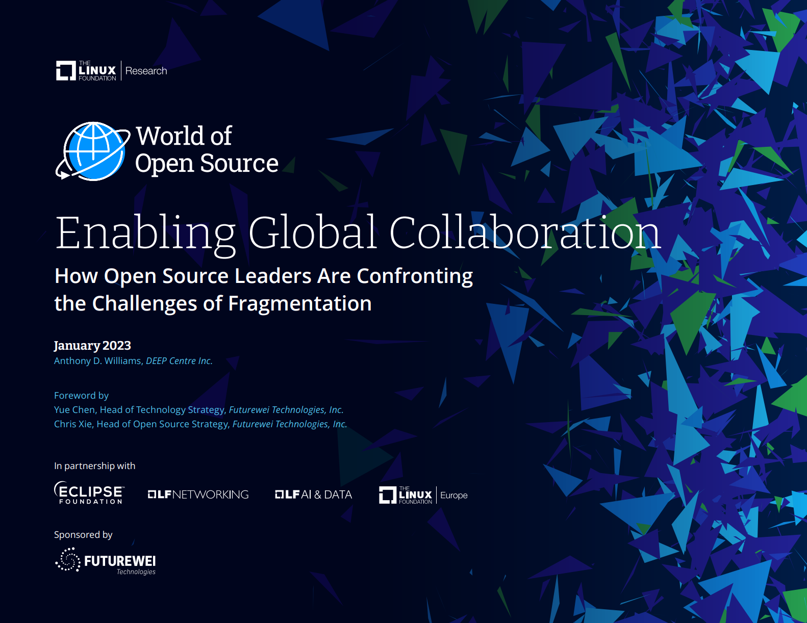

# Enabling Global Collaboration

# 助力全球协作

**How Open Source Leaders Are Confronting the Challenges of Fragmentation**

**开源代码的领导者如何面对碎片化的挑战**

**January 2023**

**2023年1月**

Anthony D. Williams, *DEEP Centre Inc.*

Foreword by

前言：

Yue Chen, Head of Technology Strategy, *Futurewei Technologies, Inc.*

Chris Xie, Head of Open Source Strategy, *Futurewei Technologies, Inc.*

In partnership with

联合

Sponsored by

赞助：

**Contents**

**目录**

[Infographic 3]
[信息图表 ..............................................................3]

[Foreword 4]

[前言.................................................................. 4]

[Executive Summary 5]

[执行摘要..........................................5]

[Introduction 8]

[简介.............................. 8]

[Innovation and collaboration 8]

[创新与协作 ..................................................... 8]

[Global inclusion 9]

[全球包容........................................... 9]

[Open source governance 9]

[开源治理........................................................... 9]

[Enabling Innovation and Collaboration 10]

[促成创新与协作............................................................ 10]

[Fragmentation across the software landscape 11]

[整个软件领域的碎片化......................................................11]

[Fragmentation challenges and solutions 13]

[碎片化的挑战和解决方案 .............................. 13]

[Promoting Global Inclusion 15]

[促进全球包容 ........................................................15]

[The barriers to global participation 16]

[全球参与的障碍........................................ 16 ]

[The building blocks for global inclusion 17]

[全球包容性的基石.................................... 17]

[Transcending Techno-Nationalism 19]

[超越技术-民族主义 ..................................................... 19]

[Will techno-nationalism balkanize open source? 19]

[技术民族主义会使开放源代码巴尔干化吗？................................................... 19]

[Tackling techno-nationalism with transparency and trust 22]

[以透明和信任解决技术民族主义问题 ....................................22]

[Breaking Down the Governance Silos 23]

[打破治理孤岛...............................................................23]

[Maintaining critical open source infrastructure 25]

[维护关键的开源基础设施 ............................................................25]

[Increasing collaboration on technology policy and regulation 28]

[加强技术政策和监管方面的合作............................. 28]

[Conclusion 30]

[结论 ...........................................................30]

[Managing fragmentation 30]

[管理碎片化 .................................................... 30]

[Confronting techno-nationalism and fostering global inclusion 32]

[对抗技术民族主义，促进全球包容........................ 32]

[Final thoughts 34]

[最后的想法...................................................... 34]

[About the Author 35]

[关于作者 ................................................... 35]

[Endnotes 36]

[尾注 ...............................................................36]

|      |      |      |
|---------------- | --------------- | --------------- |
| Fragmentation is a double-edged sword, where attempting to solve fragmentation challenges could hurt innovation and competition.    分裂是一把双刃剑，试图解决分裂挑战可能会损害创新和竞争。   | There is considerable heterogeneity in the software landscape when it comes to fragmentation: Some domains are highly fragmented, and some are highly consolidated.   在软件领域，关于分裂问题存在相当大的异质性：某些领域高度分裂，而某些领域高度整合。  | The principal downsides of fragmentation include increased costs and complexity for consumers and vendors of open source solutions.   在软件领域，关于分裂问题存在相当大的异质性：某些领域高度分裂，而某些领域高度整合。   |
| Once firmly rooted in the United States and Western Europe, today’s open source community is increasingly global and cosmopolitan.   如今的开源社区已经从最初的美国和西欧扎根开始，变得越来越全球化和国际化。  | Language, culture, and geopolitics remain barriers to participation in open source communities.    如今的开源社区已经从最初的美国和西欧扎根开始，变得越来越全球化和国际化。  | Diversity and inclusion are critical to building a robust open source talent pool.    多样性和包容性对于建立强大的开源人才库至关重要。   |
| Techno-nationalism poses a severe threat to open source collaboration, with geopolitical tensions creating regional silos in global innovation communities.   技术民族主义对于开源合作构成严重威胁，地缘政治紧张局势在全球创新社区中产生了区域性壁垒。  | Transparent open source development protocols are the best antidote for techno-nationalism.   技术民族主义对于开源合作构成严重威胁，地缘政治紧张局势在全球创新社区中产生了区域性壁垒。   | The creation of new open source projects has seen a comparable increase in the number of new foundations.   新开源项目的创建看到了新基金会数量的相应增加。  |
| Ecosystem leaders want foundations to do more to align open source projects that have similar objectives.   生态系统领袖希望基金会在更好地协调具有相似目标的开源项目方面做出更多努力。  | Securing and safeguarding critical open source infrastructure should be a focal point for collaboration.    生态系统领袖希望基金会在更好地协调具有相似目标的开源项目方面做出更多努力。 | The need for enhanced collaboration extends to a range of Internet governance issues, including cybersecurity, intellectual property, and antitrust.   加强协作的需要涵盖了一系列互联网治理问题，包括网络安全、知识产权和反垄断等。  |

Copyright © 2023 The Linux Foundation | January 2023. This report is licensed under the Creative Commons Attribution-NoDerivatives 4.0 International Public License

版权所有 &copy; Linux基金会 | 2023年1月。本报告在the Creative Commons Attribution-NoDerivatives 4.0国际公共许可证下发布。
