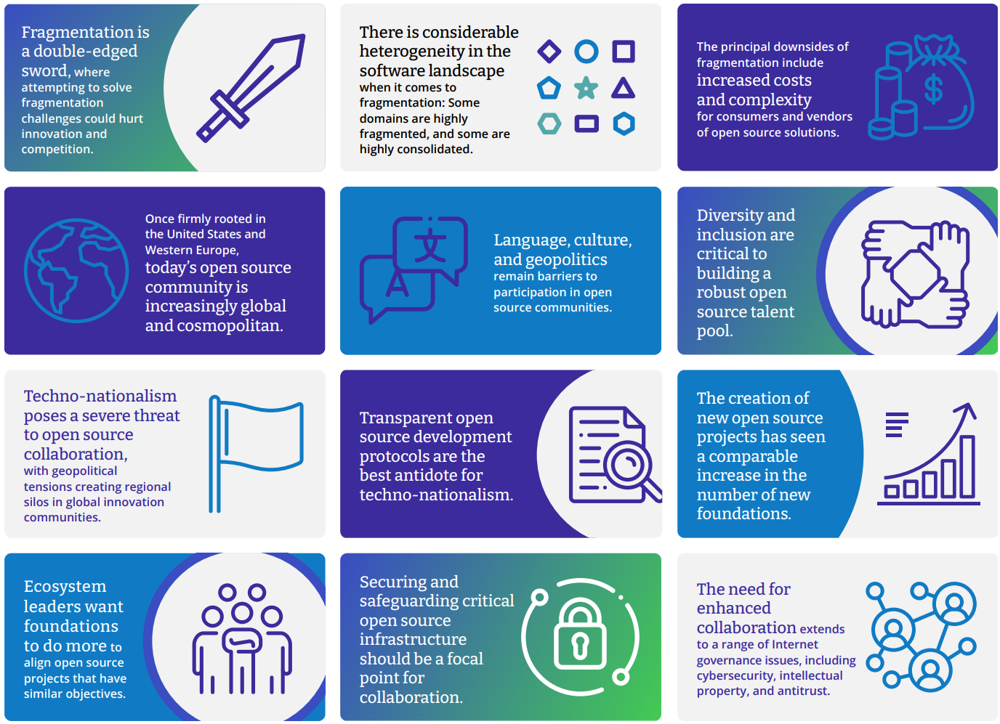

# Enabling Global Collaboration

# 助力全球协作

**How Open Source Leaders Are Confronting the Challenges of Fragmentation**

**开源代码的领导者如何面对分裂的挑战**

**January 2023**

**2023年1月**

Anthony D. Williams, *DEEP Centre Inc.*

Foreword by

前言：

Yue Chen, Head of Technology Strategy, *Futurewei Technologies, Inc.*

Chris Xie, Head of Open Source Strategy, *Futurewei Technologies, Inc.*

In partnership with

联合

Sponsored by

赞助：

**Contents**

**目录**

[Infographic 3]

[信息图表 ..............................................................3]

[Foreword 4]

[前言.................................................................. 4]

[Executive Summary 5]

[执行摘要..........................................5]

[Introduction 8]

[简介.............................. 8]

[Innovation and collaboration 8]

[创新与协作 ..................................................... 8]

[Global inclusion 9]

[全球包容........................................... 9]

[Open source governance 9]

[开源治理........................................................... 9]

[Enabling Innovation and Collaboration 10]

[促成创新与协作............................................................ 10]

[Fragmentation across the software landscape 11]

[整个软件领域的分裂......................................................11]

[Fragmentation challenges and solutions 13]

[分裂的挑战和解决方案 .............................. 13]

[Promoting Global Inclusion 15]

[促进全球包容 ........................................................15]

[The barriers to global participation 16]

[全球参与的障碍........................................ 16 ]

[The building blocks for global inclusion 17]

[全球包容性的基石.................................... 17]

[Transcending Techno-Nationalism 19]

[超越技术-民族主义 ..................................................... 19]

[Will techno-nationalism balkanize open source? 19]

[技术民族主义会使开放源代码巴尔干化吗？................................................... 19]

[Tackling techno-nationalism with transparency and trust 22]

[以透明和信任解决技术民族主义问题 ....................................22]

[Breaking Down the Governance Silos 23]

[打破治理孤岛...............................................................23]

[Maintaining critical open source infrastructure 25]

[维护关键的开源基础设施 ............................................................25]

[Increasing collaboration on technology policy and regulation 28]

[加强技术政策和监管方面的合作............................. 28]

[Conclusion 30]

[结论 ...........................................................30]

[Managing fragmentation 30]

[管理分裂 .................................................... 30]

[Confronting techno-nationalism and fostering global inclusion 32]

[对抗技术民族主义，促进全球包容........................ 32]

[Final thoughts 34]

[最后的想法...................................................... 34]

[About the Author 35]

[关于作者 ................................................... 35]

[Endnotes 36]

[尾注 ...............................................................36]

|      |      |      |
|---------------- | --------------- | --------------- |
| Fragmentation is a double-edged sword, where attempting to solve fragmentation challenges could hurt innovation and competition.    分裂是一把双刃剑，试图解决分裂挑战可能会损害创新和竞争。   | There is considerable heterogeneity in the software landscape when it comes to fragmentation: Some domains are highly fragmented, and some are highly consolidated.   在软件领域，关于分裂问题存在相当大的异质性：某些领域高度分裂，而某些领域高度整合。  | The principal downsides of fragmentation include increased costs and complexity for consumers and vendors of open source solutions.   碎片化的主要缺点包括增加了开源软件解决方案的消费者和供应商的成本和复杂性。 |
| Once firmly rooted in the United States and Western Europe, today’s open source community is increasingly global and cosmopolitan.   如今的开源社区已经从最初的美国和西欧扎根开始，变得越来越全球化和国际化。  | Language, culture, and geopolitics remain barriers to participation in open source communities.    语言、文化和地缘政治仍然是参与开源社区的障碍。 | Diversity and inclusion are critical to building a robust open source talent pool.    多样性和包容性对于建立强大的开源人才库至关重要。   |
| Techno-nationalism poses a severe threat to open source collaboration, with geopolitical tensions creating regional silos in global innovation communities.   技术民族主义对于开源合作构成严重威胁，地缘政治紧张局势在全球创新社区中产生了区域性壁垒。  | Transparent open source development protocols are the best antidote for techno-nationalism.   透明的开源开发协议是对技术民族主义最好的解药。 | The creation of new open source projects has seen a comparable increase in the number of new foundations.   新开源项目的创建看到了新基金会数量的相应增加。  |
| Ecosystem leaders want foundations to do more to align open source projects that have similar objectives.   生态系统领袖希望基金会在更好地协调具有相似目标的开源项目方面做出更多努力。  | Securing and safeguarding critical open source infrastructure should be a focal point for collaboration.    保障关键的开源基础设施的安全应该成为协作的重点。| The need for enhanced collaboration extends to a range of Internet governance issues, including cybersecurity, intellectual property, and antitrust.   加强协作的需要涵盖了一系列互联网治理问题，包括网络安全、知识产权和反垄断等。  |

Copyright © 2023 The Linux Foundation | January 2023. This report is licensed under the Creative Commons Attribution-NoDerivatives 4.0 International Public License

版权所有 &copy; Linux基金会 | 2023年1月。本报告在知识共享署名-禁止演绎 4.0 国际公共许可证授权。

## Foreword

## 前言

Starting in the late 1960s as a way to share computer software, open source has become one of the most influential global collaborations representing the collective sum of humanity's knowledge due to its fundamental values of equal access, community-driven development, transparency, and inclusiveness.

自20世纪60年代末期开始作为共享计算机软件的一种方式，开源已经成为全球最有影响力的协作之一，代表着人类知识的集体总和，因为它具有平等获取、社区驱动发展、透明度和包容性等基本价值观。

In the recent past, open source has faced numerous challenges regarding security, sustainability, and legal and license compliance. Owing much to their resiliency, open source communities have collectively worked together in each instance to tackle these issues.

最近，开源面临着许多关于安全性、可持续性以及法律和许可证合规性的挑战。由于其韧性，开源社区在每个实例中共同努力解决这些问题。

But there is a newfound concern. Software fragmentation, politicization, weaponization, and techno-nation- alism could negatively impact open source as a collaborative framework and knowledge base for humanity; As such, these could broadly undermine the original spirit of open source innovation.

但是现在有一个新的问题。软件的分裂、政治化、武器化和技术民族主义可能会对开源作为人类协作框架和知识库产生负面影响；因此，这些可能广泛破坏开源创新的原始精神。

This report represents an open source practitioner's view of these challenges through extensive interviews, validating how global communities can work together to navigate complexities so that the open source mission as a global knowledge base and collaboration platform for humanity remains intact.

本报告代表了开源从业者对这些挑战的观点，通过广泛的采访，验证了全球社区如何共同努力解决复杂问题，以确保开源使命作为人类全球知识库和协作平台保持完整。

We express our sincere gratitude to Hilary Carter of Linux Foundation Research and Anthony D. Williams of DEEP Centre Inc., who shared our vision for this research topic and worked diligently from ideation to fruition. We also thank the many partners who participated and contributed to this research. We trust that this report will serve as a resource for all curious about the power of open source, inspiring participants worldwide to become active contributors to open source projects.

我们向 Linux 基金会研究院（Linux Foundation Research）的Hilary Carter和DEEP Centre Inc.的Anthony D. Williams表示真诚的感谢，他们分享了我们对这个研究课题的愿景，并从构思到实现一直勤奋工作。我们还感谢许多参与和贡献这项研究的合作伙伴。我们相信这份报告将成为所有对开源力量感到好奇的人的资源，鼓舞世界各地的参与者成为开源项目的积极贡献者。

**Yue Chen, Head of Technology Strategy**

**Yue Chen，华为技术有限公司技术战略主管**

**Chris Xie, Head of Open Source Strategy Futurewei Technologies, Inc.**

**Chris Xie，华为技术有限公司开源战略主管**

## Executive Summary

## 执行摘要

Over two decades, the open source community has grown immensely. In 2000, there were a handful of high-profile open source projects and a small number of companies and organiza- tions to help steer the community's evolution. Today, the global open source ecosystem consists of millions of projects and an equally large and regionally diverse constellation of participants.

在二十多年的时间里，开源社区已经成长为一个庞大的生态系统。在2000年，有几个知名的开源项目和一些公司和组织来帮助引导社区的发展。今天，全球开源生态系统包括数百万个项目和同样庞大和地区多样的参与者。

Growing global participation in open source software (OSS) is a testament to the ecosystem's success. However, the proliferation of open source projects and organizations also raises a vital question: Is fragmentation in the open source community impeding its progress?

开源软件（OSS）全球参与的增长证明了该生态系统的成功。然而，开源项目和组织的增多也引发了一个重要的问题：开源社区中的分裂是否妨碍了其进展？

This report draws on interviews with open source leaders to examine fragmentation in the open source ecosystem and investigate why it occurs, where it is beneficial, where it is problematic, and what key stakeholders are doing to confront the challenges of fragmen- tation. Specifically, the report examines three domains where fragmentation poses challenges: the development of open source solutions, the integration of diverse contributors from various regions of the world, and the governance of open source communities, including the role of foundations in safeguarding critical open source infrastructure.

本报告基于对开源领袖的采访，探讨开源生态系统的分裂，并调查其产生的原因、何时有益、何时有问题，以及主要利益相关者为应对分裂带来的挑战所做的努力。具体而言，该报告研究了3个领域中分裂带来的挑战：开源解决方案的开发、来自世界各地不同贡献者的集成，以及开源社区的治理，包括基金会在保障关键开源基础设施中的作用。

The key findings from the research are as follows:

研究的主要发现如下：

1. **Fragmentation is a double-edged sword**. While open source leaders acknowledge some fragmentation-related challenges in developing open source solutions, they argue that a decentralized ecosystem will always have an inherent degree of fragmentation and duplication. Moreover, the freedom to independently modify open source code produces a diversity of approaches to solving problems and generates superior solutions. While fragmentation can sometimes result in an inefficient allocation of resources, open source leaders caution that efforts to reduce fragmentation could stifle competition and innovation. In other words, solving the frag- mentation problem risks killing the open source goose that laid the golden egg.

2. **There is considerable heterogeneity in the software land- scape when it comes to fragmentation**. Ecosystem leaders observe that some domains are highly consolidated, whereas others are highly fragmented. Typically, fragmentation follows a maturity curve, where fragmentation is highest in the early stages of a technology's development and then consolidation increases over time. Examples of consolidated domains include operating systems (Linux), web servers (Apache), and web browsers (Chrome). Fragmented fields include embedded devices, machine learning, and blockchain.

3. **The principal downsides of fragmentation include increased costs and complexity for consumers and vendors of open source solutions**. Several open source leaders argued that the explosion of projects on GitHub signals an abundance of duplication and risks a diffusion of the community's resources. For vendors, the proliferation of competing projects places a more significant burden on their capacity to support customers. However, end users of open source solutions maintain that the proliferation of projects makes it more challenging to identify, test, and deploy suit- able code libraries. Fragmentation can also reduce the open source effect of having a large community collaborate around a shared platform or standard. Finally, the most unhealthy or disruptive forks are those implemented for non-technical
objectives, specifically for techno-nationalist reasons.

4. **Once firmly rooted in the United States and Western Europe, today's open source community is increasingly global and cosmopolitan**. China, for example, is a signifi- cant consumer of and contributor to open source technol- ogies. Not only do nearly 90% of Chinese firms use open source technologies, but Chinese users are also the second most prolific group on GitHub after users from the United States.[^1] However, China is not alone. Many emerging econo- mies contain large communities of open source developers, including India, Russia, Korea, and Ukraine. For low- and middle-income countries, engagement with open source communities is giving rise to new entrepreneurial ventures and accelerating the pace of economic development.

5. **Language, culture, and geopolitics remain barriers to participation in open source communities**. While open source is flourishing globally, open source project leaders outside of North America point to language, culture, and geopolitics as genuine obstacles to their ability to maximize the participation of talented developers. Although the open source community is increasingly international, several leaders argue that organizations headquartered in the United States have outsized influence in shaping most open source projects. Open source leaders fear that a failure to address diversity and inclusion issues will curtail the open source community's access to talent and ingenuity.

6. **Diversity and inclusion are critical to building a robust open source talent pool**. The challenges of integrating different languages and cultures into open source communities are not new problems, and there is considerable confidence in the ecosystem's capacity to foster global inclusion. However, open source leaders agree that the community can do more to promote global inclusion. For example, interviewees underlined the need to invest in rapid machine translation capabilities for project communications. Leaders also discussed the impor- tance of promoting open source norms, taming the industry's macho "bro" culture, and fostering professionalism in commu- nity dialogues and decision-making.

7. **Techno-nationalism poses a severe threat to open source collaboration**. Over the past decade, the United States and China have introduced increasingly stringent measures to restrict the transfer of critical innovations beyond national borders. Meanwhile, the war between Russia and Ukraine has heightened geopolitical tensions and made the security of technology supply chains a policy imperative. Numerous inter- viewees cited evidence that geopolitical tensions are creating national or regional silos in global innovation communities. Many open source leaders worry that rising protectionist measures could restrict the distribution of open source code and undermine the community's unfettered approach to inter- national collaboration.

8. **Transparent open source development protocols are the best antidote for techno-nationalism**. To counter techno- nationalism, open source communities must alleviate fears that national interests or malicious actors could taint or corrupt open source projects. Ecosystem leaders see reputation frame- works with enhanced peer review and third-party audits as a means to instill trust in the software development process. Interviewees also called for open source foundations and proj- ects to position themselves as impartial actors and neutral homes for collaboration. They argue that establishing neutral, inclusive, and transparent structures for cooperation will not only broaden participation but can also reduce incentives for ecosystem participants to create parallel efforts along national or regional lines.

9. **The creation of new open source projects has seen a commensurate increase in the number of new founda- tions.** One empirical study found over 100 active entities across a wide range of open source projects. Ecosystem leaders say the proliferation of new foundations and initia- tives is leading to a growing sense of engagement over- load and vendor fatigue, with some enterprises choosing to be more selective about how and where they engage. However, as open source becomes increasingly global, many ecosystem leaders welcome the creation of new open source organizations around the world. For example, stakeholders recognize that some regional or sector-based foundations can more effectively cater to the needs of their unique constituents.

10. **Ecosystem leaders want foundations to do more to align open source projects.** Open source foundations are reluctant to play a lead role in identifying and championing winning open source projects, arguing that picking winners is a marketplace function. However, leaders do see a need for better project curation and want foundations and other ecosystem participants to make greater efforts to align projects with similar objectives. To accomplish this, founda- tions need to enlist skilled community managers with the experience and know-how to compel diverse stakeholders to forge alignment around shared goals. Leaders also called for foundations to bring similar projects under a shared umbrella to eliminate duplication, economize on overhead, and reduce so-called "vendor fatigue."

11. **Securing and safeguarding critical open source infra- structure should be a focal point for collaboration.** All ecosystem leaders agree that building trust and confidence in OSS and supporting the ongoing maintenance of critical open source infrastructure are urgent imperatives. Decentralized innovation is producing a remarkable tapestry of open source components that are being widely deployed to support the digital economy. However, leaders observe that maintaining these disparate components is a complex challenge that requires a transparent and coordinated approach and a more significant deployment of funding and resources from the principal beneficiaries of open source infrastructure.

12. **The need for enhanced collaboration extends to a range of Internet governance issues**. Several ecosystem leaders argued that the open source community has not been as influential or assertive in technology policy dialogues as it should be. They maintain that the absence of a coordinated open source response to such issues has left the playing field open to domination by larger, better-resourced entities. Many would like joint efforts to advance open source advo- cacy on Internet governance issues, including cybersecu- rity, intellectual property, privacy, and antitrust. Ecosystem leaders say greater alignment on policy issues among open source foundations would be helpful, along with the creation of open source program offices (OSPOs) in the public sector to facilitate engagement.

 

1. **分裂是一把双刃剑。** 虽然开源领袖们承认开发开源解决方案存在一些与分裂相关的挑战，但他们认为分裂的生态系统总会具有固有程度的分裂和重复。此外，独立修改开源代码的自由产生了各种解决问题的方法和更优秀的解决方案。尽管分裂有时可能导致资源分配的低效，但开源领袖们警告说，减少分裂的努力可能会扼杀竞争和创新。换句话说，解决分裂问题会冒杀死孵出金蛋的开源鹅的风险。

2. **在软件领域，分裂的情况千差万别。** 生态系统领导者观察到，有些领域高度集中，而有些则高度分裂。通常，分裂遵循成熟度曲线，即技术发展的早期阶段分裂最高，然后随着时间的推移，集中度会增加。集中的领域包括操作系统（Linux）、Web 服务器（Apache）和 Web 浏览器（Chrome）。分裂的领域包括嵌入式设备、机器学习和区块链。

3. **分裂的主要缺点是增加了开源解决方案的消费者和供应商的成本和复杂性。** 几位开源领袖认为，GitHub 上项目的爆炸式增长标志着资源的过度复制和社区的扩散风险。对于供应商而言，竞争项目的繁多会对其支持客户的能力造成更大的负担。然而，开源解决方案的最终用户认为，项目的增多使得确定、测试和部署合适的代码库更加困难。分裂也可能降低开源社区围绕共享平台或标准进行大规模协作的效果。最后，实现非技术目标的分支，特别是为技术民族主义原因而实现的分支，是最不健康或具有破坏性的分支。

4. **如今的开源社区已越来越全球化和国际化，而不再是早期在美国和西欧扎根的社区。** 例如，中国是开源技术的重要消费者和贡献者。几乎90%的中国公司使用开源技术，而中国用户也是继美国之后GitHub上贡献最多的用户。[^1] 然而，中国并不是唯一的例子，许多新兴经济体都有庞大的开源开发者社区，包括印度、俄罗斯、韩国和乌克兰。对于低收入和中等收入国家来说，与开源社区的接触正在催生新的企业家精神，并加速经济发展的步伐。

5. **语言、文化和地缘政治仍然是参与开源社区的障碍。** 虽然开源技术在全球范围内蓬勃发展，但北美以外的开源项目领导者指出语言、文化和地缘政治确实是影响他们最大化吸引才华横溢的开发者参与的障碍。虽然开源社区越来越国际化，但一些领导者认为总部位于美国的组织在塑造大多数开源项目方面具有不可忽视的影响力。开源领导者担心，如果不能解决多样性和包容性问题，将会限制开源社区获取人才和创新的能力。

6. **多样性和包容性对于建立强大的开源人才库至关重要。** 将不同语言和文化融入开源社区的挑战并不是新问题，生态系统有很大信心能够促进全球包容性。然而，开源领导者认为社区可以采取更多措施促进全球包容性。例如，受访者强调需要投资快速机器翻译能力，以进行项目通信。领导者还讨论了在社区对话和决策中促进开源规范、遏制该行业的男性文化，并培养专业素养的重要性。

7. **技术民族主义对开源合作构成严重威胁。** 过去十年，美国和中国引入了越来越严格的措施，以限制关键创新技术的跨国转移。与此同时，俄罗斯和乌克兰之间的战争加剧了地缘政治紧张局势，并使技术供应链的安全成为政策必须。许多受访者引用证据表明，地缘政治紧张局势正在在全球创新社区中创造国家或地区的信息孤岛。许多开源领袖担心，日益保护主义的措施可能会限制开源代码的分发，并破坏社区对国际合作的无拘束态度。

8. **透明的开源开发协议是技术民族主义的最佳解药。** 为了对抗技术民族主义，开源社区必须缓解人们对于国家利益或恶意行为可能玷污或破坏开源项目的担忧。生态系统领袖认为，通过增强同行评审和第三方审计的声誉框架可以建立对软件开发过程的信任。受访者还呼吁开源基金会和项目定位为公正的参与者和协作的中立家园。他们认为，建立中立、包容和透明的合作结构不仅可以扩大参与范围，还可以减少生态系统参与者在国家或地区范围内创建并行努力的动机。

9. **新开源项目的创立使得新基金会的数量相应增加。** 一项实证研究发现，有100多个活跃的实体涵盖了广泛的开源项目。生态系统领袖表示，新基金会和新举措的不断增加正在导致日益增加的参与负担和供应商疲劳，一些企业选择更加谨慎地选择他们参与的方式和位置。然而，随着开源变得越来越全球化，许多生态系统领袖欢迎在世界各地创建新的开源组织。例如，利益相关者认识到，一些地区或行业基础的基金会可以更有效地满足其独特的成员需求。

10. **生态系统领袖希望基金会在协调开源项目方面发挥更大的作用。** 开源基金会不愿意在识别和支持优胜劣汰的开源项目方面发挥领导作用，他们认为选择胜者是市场功能。然而，领袖们认为需要更好的项目策划，希望基金会和其他生态系统参与者更加努力地将项目与相似的目标对齐。为此，基金会需要招募有经验和知识的熟练社区经理人，促使不同的利益相关者围绕共同目标形成对齐。领袖们还呼吁基金会将类似的项目纳入共享伞下，以消除重复，节省开支，并减少所谓的“供应商疲劳”。

11. **保护和维护关键的开源基础设施应该是合作的重点。** 所有生态系统领袖都认为，建立对开源软件的信任和信心，支持关键开源基础设施的持续维护是紧迫的任务。分散的创新正在产生一个非常广泛的开源组件网络，这些组件被广泛地部署以支持数字经济。然而，领袖们观察到，维护这些不同的组件是一个复杂的挑战，需要透明和协调的方法，以及来自开源基础设施的主要受益者的更大的资金和资源的投入。

12. **需要增强的协作范围包括一系列互联网治理问题。** 几位生态系统领袖认为，开源社区在技术政策对话中的影响力或主张力还不够强。他们认为缺乏一个协调的开源响应机制使得更大、更有资源的实体主导了这个领域。许多人希望共同努力推进开源在互联网治理问题上的倡导，包括网络安全、知识产权、隐私和反垄断等问题。生态系统领袖表示，在开源基金会之间加强政策问题的对齐，以及在公共部门设立开源办公室（OSPOs）以促进参与，将会有所帮助。

## Introduction

## 简介

Over two decades, the open source community has grown immensely. In 2000, there were a handful of high-profile open source projects and a small number of companies and organiza- tions to help steer the community's evolution. Today, the global open source ecosystem consists of millions of projects and an equally large and regionally diverse constellation of participants.

开源社区已经成长了二十多年。在2000年，只有少数几个备受关注的开源项目和一些公司和组织帮助引导社区的发展。如今，全球开源生态系统包含了数以百万计的项目和同样庞大且具有地区多样性的参与者群体。

Nothing underlines the open source community's growth and global reach like GitHub. In 2010, the social coding platform hosted roughly 100,000 users and 1 million code repositories.[^2] As of October 2022, GitHub hosts 83 million developers, 4 million organizations, and over 200 million open source code repositories.[^3] Some 74% of its global user base resides outside of the United States, with a significant increase in the share of developers based in Asia, Latin America, and Eastern Europe. Meanwhile, several breakthrough OSS innovations have come from places such as Japan (Ruby), Finland (Linux), and South Africa (Ubuntu).

没有什么能够像GitHub一样突显出开源社区的增长和全球影响力。在2010年，这个社交代码平台托管了大约100,000个用户和1百万个代码库。[^2] 截至2022年10月，GitHub托管了8300万开发者、400万组织和超过2亿个开源代码仓库。[^3] 其中全球用户群体中有74%来自美国以外，而亚洲、拉美和东欧的开发者人数占比有显著增长。同时，许多突破性的开源软件创新来自于日本（Ruby）、芬兰（Linux）和南非（Ubuntu）等地。

Growing global participation in OSS is a testament to the ecosystem's success. However, the proliferation of open source projects and organizations also raises a vital question: Is fragmentation in the open source community impeding its progress?

开源软件（OSS）在全球范围内的日益增长证明了生态系统的成功。然而，开源项目和组织的不断增多也引发了一个至关重要的问题：开源社区的分裂是否妨碍了它的发展？

On the surface, the open source community's recent track record would suggest otherwise. After all, two-plus decades of open collaboration have resulted in a potent array of reusable software components and fostered unrivaled innovation and creativity in the digital economy. One recent estimate (and most others) suggests that 70% to 90% of most modern application stacks consist of OSS, from operating systems to cryptography and networking functions to the enterprise applications running mission-critical operations for global corporations.[^4]

表面上看，开源社区最近的记录似乎表明情况并非如此。毕竟，二十多年的开放合作已经产生了大量可重用的软件组件，并在数字经济中促进了无与伦比的创新和创造力。一项最近的估计（以及其他大多数估计）表明，现代应用程序栈的70%至90%由 OSS 组成，从操作系统到加密和网络功能再到运行全球公司的关键业务操作的企业应用程序。[^4]

On the flip side, open source ecosystem leaders are raising legitimate questions and concerns about whether fragmentation in the community could undermine several essential functions vital to a sustainable and thriving ecosystem. For example, consider the fol- lowing three domains:

另一方面，开源生态系统的领导者正在提出合理的问题和关切，即社区的分裂是否会削弱对于可持续和繁荣的生态系统至关重要的几个基本功能。例如，考虑以下三个领域：

### Innovation and collaboration

### 创新和协作

The freedom to see, modify, and distribute code has always been the open source community's central tenet, along with the community's decentralized production model, which frequently results in hundreds and sometimes thousands of independent contributors collaborating to build and refine open source code libraries. Even the most ardent of competitors often work together to address shared challenges, thereby avoiding the duplication of effort while moving faster to develop and adopt emerging standards and innovations.

自由地查看、修改和分发代码一直是开源社区的核心理念，与社区分散的生产模式一起，这经常导致数百甚至数千个独立的贡献者合作构建和改进开源代码库。即使是最热烈的竞争对手也经常共同解决共同的挑战，从而避免了重复劳动，同时更快地开发和采用新兴的标准和创新。

The potency of the open source model notwithstanding, the stag- gering existence of 200-million-plus projects on GitHub has stirred a debate. Some open source leaders say the continued proliferation of new projects and coordinating bodies creates healthy compe- tition between rival approaches, and competition drives innova- tion. Other participants argue that the explosion of projects signals an abundance of duplication and risks a diffusion of the commu- nity's resources. To what extent could increasing fragmentation in software development efforts create inefficiencies and clutter in the marketplace for open source solutions? And if fragmentation is indeed a problem in some domains, what steps should the commu- nity take to align its projects, talent, and resources?

尽管开源模式的潜力无法否认，但在GitHub上存在超过2亿个项目的现状引发了一场辩论。一些开源领袖表示，新项目和协调机构的持续增长在竞争对手之间创建了健康的竞争，而竞争推动了创新。其他参与者则认为项目的爆炸性增长意味着重复的过度和风险扩散社区的资源。在软件开发努力中，增加的分裂在开放源码解决方案市场中会产生低效和杂乱的情况吗？如果在某些领域确实存在分裂问题，社区应该采取哪些步骤来协调其项目、人才和资源？

### Global inclusion

### 全球包容性

While open source is flourishing globally, open source project leaders outside of North America point to language, culture, and geopolitics as genuine obstacles to their ability to maximize the participation of talented developers. At the same time, rising global trade tensions and political conflict risk politicizing decision-making and participation in open source development communities. Rising techno-nationalism, for example, has the world's advanced economies engaged in a high-stakes contest to reign supreme in key technological domains. Could techno-nationalist policies balkanize OSS development into regional silos and frustrate efforts to foster greater inclusion and deepen the community's talent pool? Or could open source be the key to avoiding balkanization across technology? As the scope and diversity of the community increase, how can open source project leaders integrate diverse participants and successfully promulgate open source norms, ethics, and best practices?

虽然开源在全球范围内蓬勃发展，但北美以外的开源项目领导人指出，语言、文化和地缘政治是影响他们最大化吸引有才华的开发者参与的真正障碍。同时，全球贸易紧张局势和政治冲突的上升可能会将决策和参与开源开发社区的行为政治化。例如，崛起的技术民族主义让世界上先进的经济体在关键技术领域上进行高风险竞赛。技术民族主义政策会不会将OSS开发分割成区域性孤立，从而阻碍扩大包容性和加深社区的人才池？或者，开源是否是避免技术上的分裂的关键？随着社区的范围和多样性增加，开源项目领导者如何整合不同的参与者并成功地传播开源规范、伦理和最佳实践？

### Open source governance

### 开源治理

Good governance is increasingly paramount as OSS becomes a vital component of critical digital infrastructure. For example, quickly identifying and rectifying security vulnerabilities requires timely and effective coordination across the globally decentralized open source community. Several open source foundations have stepped in to help steward new initiatives designed to address the ecosystem's vulnerabilities. However, the population of new open source foundations continues to multiply, raising concerns about the impact of organizational silos on cosystem governance. Are smaller, more focused organizations more efficient and effective in addressing narrower mandates defined by specific industries, regions, and application spaces? Or will the continued proliferation of projects and organizations impede efforts to create global stan- dards, address security vulnerabilities, and promote the adoption of open source solutions?

随着OSS成为关键数字基础设施的重要组成部分，良好的治理变得越来越重要。例如，快速识别和纠正安全漏洞需要全球分散的开源社区进行及时有效的协调。几个开源基金会已经介入，帮助管理旨在解决该生态系统漏洞的新举措。然而，新的开源基金会数量继续增加，引发了对组织壁垒对生态系统治理的影响的担忧。更小、更专注的组织是否更有效率和更有效地处理由特定行业、地区和应用领域定义的狭窄任务？还是继续项目和组织的增加会妨碍全球标准的制定、处理安全漏洞并促进开源解决方案的采用？

This report draws on interviews with open source leaders to examine fragmentation in the open source ecosystem and investigate why it occurs, where it is beneficial, where it is problematic, and what key stakeholders are doing to confront the challenges of fragmentation.

本报告借助开源领袖的访谈，探讨了开源生态系统中的分裂，并研究了它发生的原因、它在哪里是有益的、在哪里是有问题的以及关键利益相关者在应对分裂挑战方面所做的工作。

- Section 2 of the report discusses the benefits and potential pitfalls of fragmentation in the development of open source code.

- Section 3 examines the internationalization of open source and highlights the tools and methods project leaders are deploying to overcome potential barriers to participation in open source communities.

- Section 4 assesses the implications of techno-nationalism for open source collaboration and proposes strategies for reducing the risks of regional balkanization.

- Section 5 provides stakeholder reflections on the state of open source governance and identifies several priorities for increased collaboration between open source foundations.

- Section 6 provides a summary of key findings and recommendations.

- 报告的第二部分讨论了开源代码开发中分裂的利弊。

- 第三部分审查了开源的国际化，并强调了项目领导者为克服参与开源社区的潜在障碍而采用的工具和方法。

- 第四部分评估了技术民族主义对开源协作的影响，并提出了减少区域分裂风险的策略。

- 第五部分提供了利益相关者对开源治理状况的反思，并确定了增加开源基金会之间合作的几个优先事项。

- 第六部分提供了关键发现和建议的摘要。

## Enabling Innovation and Collaboration

## 促成创新与协作

In a study of fragmentation in OSS ecosystems, Professor Christopher Yoo at the University of Pennsylvania Law School posits that the inherent freedom of action that characterizes OSS development creates the potential for excessive fragmentation. Excessive frag- mentation, Yoo alleges, creates a host of challenges for the open source community. As Yoo put it:

宾夕法尼亚大学法学院的 Christopher Yoo 教授在一项关于开源软件生态系统分裂的研究中提出，开源软件开发所特有的行动自由创造了过度分裂的可能性。Yoo 称，过度的分裂会给开源社区带来一系列的挑战。以下为原文：

>"On the one hand, users' freedom to customize software is integral to the open source movement... On the other hand, infinite flexibility creates costs for the open source community by requiring the diffusion of effort and the duplication of work across multiple projects. Fragmentation also harms device manufacturers and app developers by limiting interoperability and by requiring them to adapt their products for what are now separate platforms."[^5]

>“一方面，用户定制软件的自由是开源的组成部分。另一方面，无限的灵活性要求在多个项目中分散精力和重复工作，这样会给开源社区带来成本。分裂也损害了设备制造商和应用程序开发人员，因为它限制了互操作性，并要求他们为现在的独立平台调整其产品。”[^5]

Yoo's research refers principally to the problem of forking in open source development projects. He argues that the most extreme form of fragmentation occurs when a contributor to an open source project customizes the community's source code to the extent that it is no longer fully interoperable with the rest of the project. The result is to divide the system into two distinct and incompatible versions. Given the economic inefficiencies that ensue, Yoo concludes that "some constraints on the flexibility of open source are thus inevitable."[^6]

Yoo 研究的内容主要是指开源开发项目中的复刻问题。他认为，当一个开源项目的贡献者将社区的源代码修改到不再能与项目的其他部分完全互通的程度时，就会出现最极端的分裂形式。最终的结果是将系统分为两个不同的、不兼容的版本。鉴于随之而来的经济效率低下，Yoo 总结为："因此，对开源的灵活性的一些限制是不可避免的。"[^6]

In discussing fragmentation with open source leaders, a starting point for many is the recognition that forking and duplication are inevitable and often desirable consequences of a decentralized ecosystem.

在与开源领袖讨论分裂问题时，许多人的出发点是承认复刻和重复是不可避免的，而这往往是去中心化生态系统中不可避免的结果。

Decentralization, several argued, is not necessarily an optimal design for efficiency, but it is a powerful engine for innovation. "The whole open source world is a testament to the power of decentralization," said Rod Beckstrom, former CEO of ICANN and director of the U.S. National Cybersecurity Center. "One conse- quence of decentralization is overlap and redundancy. You cannot end the overlap without central control. You can evolve or nudge a decentralized system, but there is no means to control it."

一些人认为，去中心化不一定是效率最佳的设计，但它能推动创新。ICANN 前 CEO、美国国家网络安全中心主任 Rod Beckstrom 说："整个开源世界证明了去中心化的力量"。"去中心化的一个后果是重叠和冗余。如果没有中央控制，就无法避免重叠。你可以发展或推动一个去中心化的系统，但没有办法控制它。"

Moreover, most participants of the study are comfortable with the reality that a decentralized open source ecosystem will always feature some inherent degree of disorder. As Mark Surman, presi- dent of the Mozilla Foundation, put it, "The point of open source is that it's decentralized. The ability to gather a set of people to col- laborate around a particular problem or domain has always been the challenge and opportunity of open source. Can we pool our resources in a way that we can get enough value back out from the resources that I am putting in? The freedom to convene and collaborate means you will never have perfect order."

此外，大多数研究的参与者都认为去中心化的开源生态系统总是具有一些内在的无序程度。正如 Mozilla 基金会主席 Mark Surman 所说："开源的意义在于去中心化。聚集一群人围绕一个特定的问题或领域进行合作的能力，一直是开源的挑战和机遇。我们能否以一种方式汇集我们的资源，使我们能够从我投入的资源中获得足够的价值回报？召集和协作的自由意味着你永远不会有完美的秩序"。

More fundamentally, open source leaders argue that forking is part of the standard workflow for open source projects and an essential aspect of how software systems evolve and improve over time. "In good forks, you take a code library and address a problem that the community has not previously addressed," said Tim Bird, a senior software engineer with Sony Mobile Communications. "Developers split off to address the new problem and eventually come back together to reintegrate the new code into the larger ecosystem." In practice, Jim Zemlin, executive director of the Linux Foundation, points to several reasons to fragment or fork a component, such as addressing a significant technical problem or solving security issues.

更为根本的是，开源领导者认为，复刻（fork）是开源项目标准工作流程的一部分，也是开源项目随着时间推移而演变和改进的一个重要方式。Sony 移动通信公司的高级软件工程师 Tim Bird 说：”在优秀的复刻库中，你可以利用一个代码库，解决一个社区以前没有解决的问题“。“开发者分开来解决新的问题，并最终回到一起，将新的代码重新整合到更大的生态系统中”。在实践中，Linux 基金会的执行董事 Jim Zemlin 指出了分割或复刻一个组件的几个原因，如解决一个重要的技术问题或解决安全问题。

The freedom to independently experiment with an existing code library is especially beneficial when developers go off to try new ideas, add new features, and explore new use cases for OSS. "The codebases get stronger and stronger as a result," said Mike Dolan of the Linux Foundation, "because developers address their specific use cases without breaking things for everybody else." He adds, "The key part is that developers bring those new fragments back into the core upstream open source project."

当开发者去尝试新的理念，增加新的功能，探索开源软件的新用例时，独立实验现有代码库的自由尤其有益。"代码库因此变得越来越强大，"Linux 基金会的 Mike Dolan 说，"因为开发者解决了他们特定的用例，而没有破坏其他人的东西。" 他补充说："关键的部分是，开发人员将这些新的片段带回核心的上游开源项目中。"

Ultimately, ecosystem leaders agree that decentralized collaboration has resulted in a remarkable tapestry of independent open source components that developers can put together to do something bigger and more useful. "We have a huge variety of software to choose from now," said Bird. "In many ways, we are in the golden age of open source." Jim Zemlin amplifies this point, noting that a typical software package has 4,000 to 5,000 open source components. "The availability of lots of reusable components dramatically increases the efficiency of software development and speeds time to market," said Zemlin. "Enterprises can innovate around the edges. They don't have to build everything from scratch. The availability of reusable components also prevents a lot of fragmentation because everyone is drawing from the same code libraries. Nobody is taking the Linux kernel and creating a new version."

最终，生态系统的领导者们一致认为，去中心化的合作导致了独立的开源组件的非凡织锦，开发者可以把它们放在一起做一些更大、更有用的事情。“我们现在有大量的软件可供选择。”Bird说。“在许多方面，我们正处于开源的黄金时代。” Jim Zemlin 放大了这一点，他指出，一个典型的软件包有 4000 到 5000 个开源组件。Zemlin 说：”大量可重复使用的组件的可用性极大地提高了软件开发的效率，并加快了上市时间”。“企业可以在边缘地带进行创新。他们不必从头开始建立一切。可重复使用的组件的可用性也防止了大量的分裂，因为每个人都是从相同的代码库中提取的。没有人拿着 Linux 内核去创造一个新的版本”。

Even when fragmentation produces overlap and redundancy, open source leaders warn that attempts to control or curtail the freedom inherent in open source development could be more harmful than the fragmentation itself. "Fragmentation is the inno- vation engine," said Mike Milinkovich, executive director of the Eclipse Foundation. "Developers must be allowed to foster new ideas and projects. Anything that brings a draconian order to the production side of the equation is doomed to fail."

即使分裂产生了重叠和冗余，开源领导人警告说，试图控制或削减开源开发中固有的自由，可能比分裂本身危害更大。"分裂是创新的引擎，" Eclipse 基金会的执行董事 Mike Milinkovich 说。"必须允许开发者培养新的想法和项目。任何给生产方面带来严格限制令的东西都是注定要失败的。"

>"Over time, competition between rival approaches gives way to increasing consolidation as market forces separate the winners from the losers."

>“随着时间推移，市场将赢家和输家区分开来，竞争对手之间也开始进行合作。”

### Fragmentation across the software landscape

### 软件环境中的分裂

Open source leaders concede that fragmentation is not a grave problem in the open source ecosystem but part of the essential life cycle in how the community develops software. Fragmentation is not only normal but largely healthy as well. As Astor Nummelin Carlberg, executive director of OpenForum Europe, put it, "The resilience of the system increases when there are competing alter- natives. Competition can also drive innovation. The distributed nature of open source produces a diversity of thought and differ- ent approaches to solving problems."

开源领导者承认，分裂并不是开放源码生态系统的一个严重问题，而是社区开发软件的基本生命周期的一部分。分裂不仅是正常的，而且在很大程度上也是健康的。正如欧洲开放论坛的执行董事 Astor Nummelin Carlberg 所说，"当有竞争性的替代方案时，系统的恢复能力就会增加。竞争也可以推动创新。开源的分布式性质产生了思想的多样性和解决问题的不同方法"。

However, looking across the software landscape, there is considerable heterogeneity in the degree of fragmentation, and leaders suggest that not all of it is desirable. Some domains are highly consolidated, while others feature a multiplicity of different software packages. Typically, the level of fragmentation follows a maturity curve where experimentation (and thus some inherent duplication of effort) is highest in the early stages of developing applications for a given domain. Over time, competition between rival approaches gives way to increasing consolidation as market forces separate the winners from the losers.

然而，纵观整个软件领域，分裂程度有相当大的异质性，而且领导者认为并非所有的分裂都是可取的。领导人表示，并非所有的分裂都是可取的。一些领域是高度整合的，而另一些领域则有许多不同的软件包。通常情况下，分裂程度遵循一个成熟度曲线。在为一个特定领域开发应用的早期阶段，实验（以及一些固有的重复工作）的分裂程度是最高的。随着时间推移，市场将赢家和输家区分开来，竞争对手之间也开始进行合作。

Several open source leaders point to Linux as a quintessential example of healthy consolidation. "Linux has been around for 32 years," said Alan Clark of the CTO Office at SUSE. "It's very mature. Sometimes you get new community distributions of Linux, but they occupy particular niches. In short, we see creativity around the edges, with developers incorporating their innovations into the main kernel."

一些开源的领导人指出，Linux 是一个典型的健康整合的例子。”Linux 已经存在了 32 年。“ SUSE 公司 CTO 办公室的 Alan Clark 说。“它是非常成熟的。有时你会得到新的 Linux 社区发行版，而他们也占据了一席之地。简而言之，我们看到了边缘的创造力，开发者们将他们的创新融入到主内核中"。

Jerry Cuomo, an IBM fellow and VP and CTO of Technology & Consulting, adds that the open source community's ability to foster broad participation in developing and using shared platforms has been enormously beneficial. "Linux has been inviting for diverse col- laboration for decades, but it also invites fierce competition," said Cuomo. "You can contribute your piece to the kernel and then pull in proprietary components to compete with other vendors. The key to its success is the architecture and heavy-handed prescription about keeping people focused on the core Linux kernel. The Apache web server is another example of this. There is only one Apache server, and the Web wouldn't be the same without it."

IBM 研究员、技术与咨询部副总裁兼首席技术官 Jerry Cuomo 补充说，开源社区促进广泛参与开发和使用共享平台的能力为很多人提供了帮助。“几十年来，Linux 一直在吸引各种各样的合作，但它也引发了激烈的竞争，”Cuomo 说，"你可以把你的那部分贡献给内核，然后拉进专有组件，与其他供应商竞争。其成功的关键是架构和关于让人们专注于核心 Linux 内核的重磅规定。Apache 网络服务器就是一个例子。如果只有 Apache 服务器，网络就不可能是现在这个样子了。

Several leaders argued that, in some domains, too much consoli- dation is a more significant concern than too much fragmentation. "In the core areas where open source is prominent, do we have the opposite problem?" asks Mark Surman of the Mozilla Foundation. "Is open source too concentrated? And when is concentration okay? There's a big difference between the collaborative mainte- nance of an open standard and the dominance of a single product. In browsers, you could argue that we need more fragmentation, not less. Look at Google's Chrome. It dominates the market."

几位领导人认为，在某些领域，过多的合并比过多的分裂更令人担忧。"在开源突出的核心领域，我们是否有相反的问题？"Mozilla 基金会的 Mark Surman 问道。”开源代码是否过于集中？什么时候集中是好的呢？开放标准的合作性维护和单一产品的主导地位之间有很大区别。在浏览器方面，你可以说我们需要更多的分裂，而不是更少。比如谷歌的 Chrome 浏览器，现在已经主导了市场。“

By contrast, fragmentation is prominent in domains that are earlier in the maturity cycle and where open source is less established. "Look at various aspects of AI," said Surman. "It's still early days.

相比之下，在成熟周期较早、开放源码建立较少的领域，分裂现象十分突出。"看看人工智能的各个方面，" Surman 说。"这仍然是早期的事情。

There are many players. Perhaps there is some fragmentation in machine learning frameworks. But it should be up to the market to decide which solutions, standards, and products will prevail."

也许在机器学习框架中存在一些分裂现象。但应该由市场来决定哪些解决方案、标准和产品会占上风"。

Where else do open source leaders see challenges with fragmenta- tion? As Tim Bird of Sony put it, "If you don't see the fragmentation, you are not looking very hard. Just look at a range of stacks. There is way too much software that does similar things. It becomes a burden. Both the consumer electronics and automotive industries have issues. Fragmentation in graphic APIs is very painful. There are no standards. Everyone is doing their own thing."

开源领袖们还在哪里看到了分裂的挑战？Sony 的 Tim Bird 指出，”如果认真看，就会看到分裂。看看现在已有的东西就知道了。有太多的软件在做类似的事情，这成为了一种负担。消费电子和汽车行业都有问题。图形 API 的分裂没有标准，这是非常痛苦的。每个人都各自为战。“

Both Bird and Clark describe the embedded device space as rife with fragmentation. "In embedded electronics, there is a natural tendency to fragment," said Bird. "It is different from the desktop and enterprise software space. To conserve resources, you tighten down the screws and build software solutions that are highly cus- tomized to the manufacturer's hardware. For example, the television stack is very different across different manufacturers. Developers code the software close to the metal to optimize performance. That causes a lot of fragmentation."

Bird 和 Clark 都说嵌入式设备领域充斥着分裂的现象。”在嵌入式电子产品中，有一个自然的趋势，就是将其分裂。“ Bird 说到。”它与桌面和企业软件领域不同。为了节约资源，你拧紧螺丝，建立高度定制的软件解决方案，以适应制造商的硬件。例如，不同制造商的电视零件是非常不同的。开发者为了优化性能而尽可能地使用底层语言去开发软件。这导致了大量的分裂。“

Gabriele Columbro of FINOS and Linux Foundation Europe, on the other hand, calls blockchain one of the most fragmented domains. "There are too many foundations, platforms, standards, and cur- rencies," said Columbro. "Many players call themselves open source but not openly governed. The result is a proliferation of forks. You don't get consolidation when you don't have clear and transparent governance."

另一方面，FINOS 和欧洲 Linux 基金会的 Gabriele Columbro 称区块链是最分裂的领域之一。”已经有太多的基金会、平台、标准和货币“，Columbro 说。许多项目自称是开源的，但没有开放的管理。其结果是复刻的泛滥。当你没有明确和透明的管理时，你的项目就不会发展。

### Fragmentation challenges and solutions

### 分裂的挑战和解决方案

>"Open source is reducing fragmentation, not causing it."

>”开源正在减少分裂，而不是导致分裂。“

Several leaders consulted for the study see what they describe as problematic instances of fragmentation in the development of open source solutions. So, what are the potential costs to the eco- system? The principal downsides of fragmentation are increased cost and complexity for consumers and vendors of open source solutions. Fragmentation can also reduce the open source effect of having a large community collaborate around a shared platform or standard, resulting in a less efficient deployment of resources.

接受调研的几位领导人看到了他们所描述的开源解决方案发展中存在的分裂问题的实例。那么，生态系统的潜在成本是什么？分裂的主要坏处是增加了消费者和开源解决方案供应商的成本和复杂性。分裂也会降低开源的效果，让一个庞大的社区围绕一个共享的平台或标准进行合作，导致资源部署的效率降低。

For vendors, the proliferation of competing projects places a more significant burden on their capacity to support customers. "The disadvantage of fragmentation is that it increases costs and causes vendors to deploy more resources," said Alan Clark of SUSE. "You must track what is going on, assess the efficacy of different approaches, and sometimes you have to support multiple solu- tions for your customers. The duplication of effort equals more resources and more cost. And then it creates a challenge around standards and compatibility issues."

对于供应商来说，竞争项目的激增给他们带来了更大的压力。”分裂增加了成本，导致供应商部署更多的资源”，SUSE 的 Alan Clark 说。你必须跟踪正在发生的事情，评估不同方法的功效，有时你必须为你的客户支持多种解决方案。重复的努力意味着更多的资源和更多的成本。继而，它又会引发标准和兼容性问题。

>"Without open source, the redundancy and fragmentation just happen behind closed doors with lots of individual proprietary projects." **- STORMY PETERS**

>“如果没有开源，大量的独立项目都会闭门造车，导致冗余和分裂。”**- STORMY PETERS**

On the other hand, end users of open source solutions maintain that the proliferation of projects makes it more challenging to identify, test, and deploy suitable code libraries. Tim Bird of Sony, for example, argues that fragmentation in the software environ- ment adds time and cost to the development process for device manufacturers. "We look for open source code libraries to tackle particular problems," said Bird, "but when the open source projects proliferate, it requires a lot of research and customization to find a library that is suitable for our needs." Maintenance is another challenge, according to Bird. "When new forks emerge, it splits the community and results in fewer developers on each fork to fix bugs or address security concerns. Fragmentation creates duplica- tion of effort. We lose the open source effect."

另一方面，开源解决方案的终端用户坚持认为，项目的激增使得识别、测试和部署合适的代码库更具挑战性。例如，Sony 的 Tim Bird 认为，软件环境的分裂给设备制造商的开发过程增加了时间和成本。Bird 说，“我们通过寻找开源代码库来解决特定的问题，但当开源项目激增时，需要大量的研究和修改来找到适合我们需求的库。”Bird 表示维护项目也是一个难题。“当新的复刻库出现时，它分裂了社区，导致每个复刻库上修复错误或解决安全问题的开发人员减少。”

According to Jerry Cuomo of IBM, fragmentation can create addi- tional inefficiencies in the marketplace for solutions. "For open source to work well on the business side, you need a healthy eco- system of competing solutions that orbit around shared platforms," said Cuomo. "An enterprise that uses open source needs to know that the vendor will support its solution. Can I trust it? Is it secure? What if the vendor lets you down? What do you do?" Cuomo and others note that enterprises can freely move from vendor to vendor when the vendors work around a shared platform. "They can go for better prices and better solutions," said Cuomo. "It creates healthy competition and lowers lock-in and switching costs for enterprise users. Non-fragmented ecosystems create an open economy. When it's fragmented, you don't have that as much."

据 IBM 的 Jerry Cuomo 说，分裂会造成额外的损失。“要使开源在商业方面运作良好，你需要一个由围绕共享平台的竞争性解决方案组成的健康的生态系统，”Cuomo 说到，“使用开放源码的企业需要知道，供应商将支持其解决方案。他值得信任吗？是不是安全的？如果供应商不支持怎么办？等等。”Cuomo 等人指出，当供应商基于共享平台工作时，企业可以自由地从一个供应商转移到另一个供应商。“他们可以去争取更好的价格和更好的解决方案。”Cuomo 说，“它创造了良性竞争，降低了企业用户的锁定和转换成本。非分裂的生态系统创造了一个开放的经济当它是分裂的时候，你就不会有那么多。”

For the broader ecosystem of contributors to open source solu- tions, there is an argument that duplication and redundancy rep- resent an inefficient deployment of the community's resources. "On the one hand, you can argue that overlapping or redundant efforts are a waste of talent and resources," said Astor Nummelin Carlberg of OpenForum Europe. "On the other hand, we also see gaps in the marketplace, with competing projects in high-demand areas and less focus on critical areas that demand attention."

对于更广泛的开源解决方案的贡献者的生态系统来说，有一种说法是，重复和冗余代表了社区资源的低效部署。“一方面，你可以说重叠或多余的工作是对人才和资源的一种浪费。”欧洲开放论坛的 Astor Nummelin Carlberg 说到，“另一方面，我们也看到了市场上的差距，在高需求的领域有竞争性的项目，而对需要关注的关键领域的关注则较少。”

In the final analysis, fragmentation is a double-edged sword. On the one hand, the software ecosystem needs healthy competition between rival ideas and approaches. Nobody consulted for the study wants to reduce fragmentation at the expense of competi- tion and innovation. Moreover, looking across the entire software landscape, there is a solid case to be made that open source is reducing fragmentation, not causing it. As Stormy Peters of GitHub put it, "Without open source, the redundancy and fragmentation just happen behind closed doors with lots of individual propri- etary projects."

On the other hand, leaders acknowledge that a decentralized open source ecosystem will inevitably produce duplicate projects and, thus, some inefficiencies for vendors and other partici- pants. "For a company like SUSE and other vendors," said Clark, "duplication creates a challenge because we need to be selective regarding which projects we will support. Which projects offer the most robust solution and a supportable future? Which solu- tions are the most relevant to our customers?"

归根结底，分裂是一把双刃剑。一方面，软件生态系统需要对手的想法和方法之间的良性竞争。接受调研的人都不希望以牺牲竞争和创新为代价来减少分裂。此外，纵观整个软件领域，有充分的理由证明，开源正在减少分裂，而不是导致分裂。正如 GitHub 的 Stormy Peters 所说，“如果没有开源，大量的独立项目都会闭门造车，导致冗余和分裂。”另一方面，领导人承认，一个去中心化的开源生态系统将不可避免地产生重复的项目，因此，对供应商和其他参与者来说，会有一些低效的问题。Clark 说，“对于像 SUSE 和其他供应商这样的公司来说，重复给我们带来了挑战，因为我们需要甄别支持哪些项目。哪些项目提供最稳定的解决方案，在未来能一直支持？哪些解决方案最适合我们的客户？”

Some enterprise leaders suggested that open source foundations could intervene in fragmented domains by helping to identify and champion winning solutions. However, foundation leaders pushed back on this idea, asserting that market forces rather than founda- tions should determine the winners. "We help competitors, suppli- ers, and customers all work together and build things in a neutral forum," said Mike Dolan of the Linux Foundation. "And, in an open forum where anybody can participate, people vote by showing up. If they show up with their developers, resources, and buying power, those projects can become de facto standards. That's how the tech industry picks winners."

一些企业领导人建议，开源基金会可以通过帮助识别和支持成功的解决方案来干预分裂领域。然而，基金会领导人对这一想法进行了反驳，声称最后的赢家应该由市场力量而不是基金会决定。“我们帮助竞争者、供应商和客户一起工作，并在一个中立的论坛上进行工作。”Linux 基金会的 Mike Dolan 说到，“在一个开放的论坛里，大家用脚投票。如果开发人员、资源和购买力等都集中向了某些项目，那么这些项目可以成为事实上的标准。这就是科技行业的竞争的方式。”

Most open source leaders agree that when the ecosystem follows open source principles, the fragmentation and duplication of effort get resolved over time. "We want to see different ideas in a new space, and we want them to try them out in rapid succession," said Mike Milinkovich of Eclipse. "Open source is the best way to do that.

You do not want to corral that innovation; we want to encourage it. Competition will determine the winners and losers. Over time, projects will consolidate, and the ecosystem can move forward."

大多数开源领袖都同意，当生态系统遵循开源原则时，分裂和重复工作会随着时间的推移得到解决。“我们希望在一个新的空间里看到不同的想法，并希望他们迅速地尝试这些想法。”Eclipse 的 Mike Milinkovich 说到，“开源是最好的方式。你不应该紧固创新，而是应该鼓励创新。赢家和输家通过竞争决出。随着时间的推移，项目将得到发展，而生态系统也可以向前发展。”

Open source leaders also insist that intelligent project design can go a long way toward reducing unnecessary fragmenta- tion. Establishing neutral, inclusive, and transparent structures for collaboration will broaden the tent and reduce incentives to create parallel efforts. "When we launch a project, we do it in a way that says this is going to be neutral," said Mike Dolan of the Linux Foundation. He points to Kubernetes, where Google went to great lengths to distribute control over the project and reassure other contributors that Google was ready and willing to collabo- rate. "Google could have open sourced Kubernetes and kept all the maintainer control," said Dolan. "Instead, they handed off key parts of the codebase to other companies and leaders who proved very capable of doing it. In doing so, Google got broad buy-in and helped make Kubernetes the de facto standard for the industry."

开放源码的领导者还坚持认为，明智的项目设计可以在很大程度上减少不必要的分裂现象。建立中立、包容和透明的协作关系，会让我们未来的路更宽，也可以减少重复劳动。“当我们启动一个项目时，我们应该让它成为中立的。”Linux 基金会的 Mike Dolan 说到。他指出，在 Kubernetes 中，谷歌花了很大力气来分配对项目的控制权，并向其他贡献者保证，谷歌已经准备好并愿意进行合作。Dolan 说，“谷歌本可以将 Kubernetes 开源，并保持所有维护者的控制权。但我们（没有这么做，而是）把代码库的关键部分交给了其他公司和领导人，事实证明他们非常有能力做到这一点。这样做以后，谷歌得到了广泛的支持，并使 Kubernetes 成为了行业的事实标准。”

## Promoting Global Inclusion

## 促进全球包容

Once firmly rooted in the United States, today's open source community is increasingly global and cosmopolitan. China, for example, has become a significant consumer of and contributor to open source technologies. Not only do nearly 90% of Chinese firms use open source technologies[^7], Chinese users are the second most prolific group on GitHub after users from the United States.[^8]

曾经在美国根深蒂固的开源社区，今天正变得越来越全球化和国际化。例如，中国已经成为开源技术的重要消费者和贡献者。不仅近90%的中国公司使用开源技术[^7]，中国用户是 GitHub 上仅次于美国用户的第二大用户群体。[^8]

With China intent on boosting its software prowess, Chinese participation in open source will increase dramatically in the years ahead. China's Ministry of Industry and Information Technology (MIIT) has expressed concerns about its domestic software indus- try's international competitiveness and sees deeper participation in international open source projects as a means to place itself on an equal footing with global players[^9]. Among the plans to improve the state of homegrown software, the MIIT is investing in a series of software parks, implementing additional policy supports, and creating two or three open source foundations or communities to bolster China's international influence.

随着中国致力于提升其软件实力，中国在开源领域的参与度将在未来几年大幅增加。中国工业和信息化部（MIIT）对其国内软件产业的国际竞争力表示担忧，并将更深入地参与国际开源项目视为一种手段，使其与全球玩家处于平等地位[^9]。 工信部正在投资一系列软件园区，实施额外的政策支持，并创建两三个开源基金会或社区，以增强中国的国际影响力。

>"A global open collaboration orchestrated by an effective foundation is arguably the best way to reduce fragmentation and promote international cooperation."

>“一个由高效基金会策划的全球开源协作可以说是减少分裂和促进国际合作的最佳方式”

Chinese technology leaders have already initiated and championed several prominent open source projects. Alibaba, for example, has one of China's most robust open source talent pools. An active participant in RISC-V, the global open source semiconduc- tor community, the e-commerce giant recently took the bold step of open sourcing its semiconductor design development via the OpenXuantie project. [^10] In another example, Baidu launched Apollo in 2017, which has since evolved into one of the world's leading open source solutions for autonomous vehicles.[^11] Baidu is lever- aging driverless technology in its Apollo Go robotaxi service. The autonomous taxi service currently operates in five Chinese cities, but the company plans to expand Apollo Go to 65 cities by 2025 and then 100 cities by 2030.[^12]

中国技术领袖已经发起并支持了几个著名的开源项目。例如，阿里巴巴拥有中国最强大的开源人才库之一。作为 RISC-V（全球开源半导体制造商社区）的积极参与者，这家电子商务巨头最近采取了大胆的步骤，通过 OpenXuantie 项目对其半导体设计开发进行开源。[^10] 在另一个例子中，百度于2017年推出了 Apollo，此后，Apollo 已发展成为全球领先的自动驾驶汽车开源解决方案之一。[^11] 百度正在其 Apollo Go 机器人出租车服务中利用无人驾驶技术。自动驾驶出租车服务目前在中国五个城市运营，但该公司计划到2025年将 Apollo Go 扩展到65个城市，然后到2030年扩展到100个城市。[^12]

China is a prominent example of the globalization of OSS. However, many emerging economies contain large communities of open source developers, including India, Russia, Korea, and Ukraine. Harvard Business School researchers Nataliya Langburd Wright, Frank Nagle, and Shane Greenstein observe in a recent study that "Just like their counterparts in developed economies, programmers around the globe employ open source tools, speak the vocabulary of open source, and interact with open source libraries."[^13] Engagement with OSS communities, in turn, is giving rise to new entrepreneurial ventures and accelerating the pace of economic development. Wright, Nagle, and Greenstein conclude that "\[OSS\] represents an opportunity for low- and middle-in- come countries to reach the technological frontier more quickly than if they needed to develop such software from scratch or obtain it from costly sources\..."[^14]

中国是开放源码软件全球化的一个突出例子。然而，许多新兴经济体包含大量开源开发者，包括印度、俄罗斯、韩国和乌克兰。哈佛商学院（Harvard Business School）的研究人员 Nataliya Langburd Wright、Frank Nagle和Shane Greenstein在最近的一项研究中观察到，“与发达经济体的同行一样，全球各地的程序员使用开源工具，使用开源词汇，并与开源库互动。”，[^13] 正在催生新的创业企业，加快经济发展步伐。Wright、Nagle和Greenstein总结道，“OSS为中低收入国家提供了一个机会使其可以更快抵达技术前沿，相比从头开始开发此类软件或从昂贵的来源获得此类软件……” [^14]

Calista Redmond, CEO of RISC-V, argues that a global open collabo- ration orchestrated by an effective foundation is arguably the best way to reduce fragmentation and promote international coopera- tion. "Collaboration on open standards and software has proven throughout history that alignment to a shared collective model reduces the temptation and economic feasibility for ecosystem participants to take a proprietary approach to common building blocks," said Redmond. "We are creating a strong foundation with a global community where roughly one-third of our members are in NA, one-third in AMEA, and one-third in APAC."

RISC-V 首席执行官Calista Redmond认为，由一个有效的基金会组织的全球开放合作可以说是减少分裂和促进国际合作的最佳方式。Redmond 表示：“在开放标准和软件上的合作在整个历史上都证明，与共享的集体模型相一致，可以减少生态系统参与者对共同构建块采取专有方法的诱惑和经济可行性。”。“我们正在建立一个强大的全球社区基础，其中约三分之一的成员在北美，三分之一在欧洲、中东和非洲，三分一在亚太地区。”

"It's easier to collaborate globally now," said Redmond. "We have the technology to support globally distributed teams." Redmond points to growing global participation in RISC-V's technical working groups. Today, RISC-V has 65+ working groups. Redmond said there could be 80 by the end of 2022. "Now we are starting to ship actual products in a variety of vertical markets, including automo- tive, industrials, transportation, and aerospace. It's a remarkable time. We are building a robust ecosystem across workloads, from embedded to enterprise, and accomplishing in five or six years what it took earlier microprocessor architectures 20 years to do."

Redmond 说：“现在全球合作更容易了。”。“我们拥有支持全球分布式团队的技术。” Redmond 还指出，RISC-V 技术工作组的全球参与度越来越高。如今，RISC-V 拥有65个以上的工作组。雷德蒙表示，到2022年底可能会有80人。“现在，我们开始在各种垂直市场销售实际产品，包括汽车、工业、运输和航空航天。这是一个了不起的时刻。我们正在构建一个从嵌入式到企业级的跨工作负载的强大生态系统，并在五到六年内完成了早期微处理器架构20年才能完成的任务。”

### The barriers to global participation

### 全球参与的障碍

>"The hegemony of North American participants can overshadow open source projects that originated in other parts of the world."

>“北美参与者的霸权可能会使起源于世界其他地区的开源项目黯然失色。”

Open source leaders consulted for the study agree that global participation in open source is on the rise. However, there is also broad recognition that a failure to eliminate several formidable barriers to full participation could result in regional fragmenta- tion in the open source ecosystem. For example, leaders point to language, culture, and geopolitics as ongoing challenges. There also remains a prevalent sense that companies and foundations headquartered in the United States have outsized influence in shaping most open source projects.

为这项研究咨询的开源领袖一致认为，全球对开源的参与正在增加。然而，人们也普遍认识到，如果不能消除充分参与的几个巨大障碍，可能会导致开源生态系统的区域分裂。例如，领导人将语言、文化和地缘政治视为持续的挑战。人们还普遍认为，总部设在美国的公司和基金会在塑造大多数开源项目方面具有巨大的影响力。

Among the first challenges raised by interviewees is the tech industry's long history of systemic discrimination, including its deeply entrenched sexism and its dismal record on diversity and inclusion. Interviewees suggest that open source communities are not immune to these challenges, despite the community's efforts to address them. "Some parts of the open source world still feel like old school 'bro' culture," said Mark Surman of the Mozilla Foundation. "That's a big issue in a world where diversity of thought and experience are key assets."

受访者提出的首要挑战之一是科技行业长期存在的系统性歧视，包括根深蒂固的性别歧视，以及在多样性和包容性方面的糟糕记录。受访者表示，尽管社区努力应对这些挑战，但开源社区并不能幸免。Mozilla 基金会的 Mark Surman 表示：“开源世界的一些地方仍然感觉像是老派的‘兄弟’文化。”。“在一个思想和经验多样性是关键资产的世界，这是一个大问题。”

Open source leaders fear that a failure to address the open source community's "bro" culture will curtail its access to talent and ingenuity. "The people who don't feel welcomed will build technology in other ways," said Surman. "Unfortunately, that could mean that the best talent will build proprietary technology because they don't have the time and resources to contribute for free."

开源领袖担心，如果不能解决开源社区的“兄弟”文化，将限制其获取人才和创造力的机会。苏尔曼说：“那些感觉不受欢迎的人会以其他方式构建技术。”。“不幸的是，这可能意味着最优秀的人才将建立专有技术，因为他们没有时间和资源免费贡献。”

Ramon Roche, general manager of the DroneCode Foundation, argues that another cultural barrier to global participation is the lack of acceptance of open source methods and principles in some regions. "In Latin America, we still lack validation that open source is a key component of success and a valid way to produce software," said Roche. "Managers and decision-makers don't understand how the open source community works, and develop- ers often fight uphill battles to contribute to open source efforts."

DroneCode 基金会总经理 Ramon Roche 认为，阻碍全球参与的另一个文化障碍是在某些地区缺乏对开源方法和原则的接受。Roche 表示：“在拉丁美洲，我们仍然缺乏对开源是成功的关键组成部分和生产软件的有效途径的验证。”。“管理者和决策者不了解开源社区是如何运作的，开发人员经常为了为开源工作做出贡献而进行艰苦的斗争。”

When Roche started creating open source code for drones 10 years ago in Mexico, he struggled to find a vibrant open source community locally and lacked the know-how to build one from scratch. "There was nowhere to go for support or help," said Roche. "Most of the open source organizations are based in North America. The estab- lished tech players like Google, Meta, and Microsoft, and the people that work there, control what is going on. They lead steering commit- tees as well. You need to finance your seat or be a maintainer or top contributor to be visible and influential in the community."

10年前，当 Roche 在墨西哥开始为无人机创建开源代码时，他很难在当地找到一个充满活力的开源社区，并且缺乏从头开始构建开源社区的诀窍。“没有地方可以寻求支持或帮助，” Roche 说。“大多数开源组织都设在北美。像谷歌、Meta 和微软这样的老牌科技公司，以及在那里工作的人，控制着正在发生的事情。他们还领导着指导委员会。你需要为自己的席位提供资金，或者成为维护者或最高贡献者，才能在社区中有影响力。”

Reflecting on the Japanese experience, Noriaki Fukuyasu, VP of Japan Operations at the Linux Foundation, says the pace of innova- tion is slower than in North America, and enterprise IT managers are less comfortable with open source. "We have fewer engineers on the user side driving innovation," said Fukuyasu. "They prefer what they perceive to be the more stable, proprietary solutions, and their reticence to experiment is slowing down transformation."

北美参与者的霸权反过来也会掩盖源自世界其他地区的开源项目。Roche 表示：“拉丁美洲的开发者和软件初创公司希望看到更多人承认我们的存在。”。“拉丁美洲的项目常常被忽视。如果你积极寻找它们，整个大陆都有社区和公司，但它们却位于开源社区的核心之外。”

The hegemony of North American participants, in turn, can over- shadow open source projects that originated in other parts of the world. "Latin American developers and software startups would like to see more acknowledgment that we exist," said Roche. "Projects in Latin America are often overlooked. If you actively look for them, there are communities and companies across the conti- nent, but they sit outside the core of the open source community."

Linux 基金会日本运营副总裁 Noriaki Fukuyasu 在反思日本的经验时表示，创新的步伐比北美慢，企业IT经理对开源不太满意。Fukuyasu 表示：“我们在用户端推动创新的工程师更少。”。“他们更喜欢他们认为更稳定、更专有的解决方案，他们对实验的沉默正在减缓转型。”

Even when Japanese enterprises adopt OSS, they are less likely to contribute their modifications back into the upstream code. "They use open source, but they tend to modify locally," said Fukuyasu. "They rarely apply the new patches, even though the patches and fixes exist." Fukuyasu attributes the dearth of engagement to the fact that Japanese enterprises outsource much of their IT manage- ment to external vendors. "They don't see open source as a core competence and, as a result, the community of open source devel- opers is quite small relative to the United States."

即使当日本企业采用 OSS 时，他们也不太可能将其修改贡献回上游代码。Fukuyasu 说：“他们使用开源，但倾向于在本地进行修改。”。“他们很少应用新的修补程序，即使修补程序和修复程序存在。” Fukuyasu 将缺乏参与归因于日本企业将大部分IT管理外包给外部供应商的事实。“他们不认为开源是一项核心能力，因此，与美国相比，开源开发者的社区相当小。”

For the community of open source developers in Japan, it can take time to adjust to open source norms. "Culturally, people are not comfortable showing off their thoughts in public forums, online chats, and mailing lists," said Fukuyasu. "Language is also a big issue. For example, delaying the translation of project mate- rials when launching a new project can significantly slow down adoption by the Japanese community."

对于日本的开源社区开发者来说，适应开放源码规范可能需要时间。Fukuyasu 说：“从文化上讲，人们不愿意在公共论坛、在线聊天和邮件列表中炫耀自己的想法。”。“语言也是一个大问题。例如，在启动一个新项目时，推迟项目材料的翻译可能会大大减缓日本社区的采用。”

### The building blocks for global inclusion

### 全球包容的基石

>"The scale of the challenge is much larger now because of growing participation." **- JIM ZEMLIN**

>“由于越来越多的参与，现在挑战的规模要大得多。”**-JIM ZEMLIN**

Creating a more equitable balance of power and promoting global inclusion are critical to the future of open source, especially its talent pool. So, what can the open source community do to avoid fragmentation along regional and cultural fault lines? Key sugges- tions include championing diversity and inclusion, investing in better translation, fostering professionalism, educating participants about open source norms, and using in-person events to build trust.

创造更公平的力量平衡和促进全球包容对于开源的未来至关重要，尤其是对其人才库而言。那么，开源社区可以做些什么来避免地区和文化断层的分裂？关键建议包括倡导多样性和包容性，投资于更好的翻译，培养专业精神，教育参与者了解开源规范，以及利用面对面活动建立信任。

Open source leaders say that policies and practices that foster diversity and inclusion are vital starting points. "It's not only about gender," said Alan Clark of SUSE. "Diversity is also about being aware of the different cultures within our global developer community and ensuring that community methods are inclusive." Clark says collaboration is part of the DNA at SUSE and claims that executives have made efforts to understand and adapt the company's pro- cesses to the unique cultural dynamics in different regions of the world. "Diversity is increasingly key to building a strong talent pool. You can bring in new perspectives and insights. That integration of global perspectives has made open source more successful."

开源领袖表示，促进多样性和包容性的政策和做法是至关重要的起点。SUSE的 Alan Clark 表示：“这不仅仅关乎性别。”。“多样性也意味着了解我们全球开发者社区中的不同文化，并确保社区方法具有包容性。” Clark 表示，合作是SUSE DNA的一部分，并声称高管们已经努力了解并调整公司的流程，以适应世界不同地区的独特文化动态。“多元化越来越成为建立强大人才库的关键。你可以引入新的观点和见解。这种全球视角的融合使开源更加成功。”

Jim Zemlin of the Linux Foundation argues that open source projects should also have DEI requirements but that policies alone are insufficient. "Having a set of collective cultural norms is key," said Zemlin. "But the scale of the challenge is much larger now because of growing participation from around the world." Zemlin points out that social coding platforms can help identify challenges in integrating diverse participation by measuring the form and nature of collaboration. "In 2022, project leaders and open source companies can measure every digital engagement touchpoint. Are there small voices and loud voices? Are you successfully onboard- ing new developers? How long does it take for individuals to con- tribute to discussions actively?"

Linux基金会的Jim Zemlin 认为，开源项目也应该有DEI要求，但仅靠政策是不够的。Zemlin 说：“有一套集体文化规范是关键。”。Zemlin 指出，社交编码平台可以通过衡量协作的形式和性质，帮助识别整合不同参与的挑战。“2022年，项目负责人和开源公司可以衡量每一个数字参与接触点。是否有小的声音和大的声音？您是否成功地加入了新的开发人员？个人需要多长时间才能积极参与讨论？”

Digital engagement data can inform decision-making. Then it's up to leaders to foster a project ethic and culture that attracts diverse participants. "What people miss is the aspect of highly skilled individual leadership," said Zemlin. "You need a technical subject matter expert with the human qualities to lead. And not just people but also the companies who are participating. Pulling these diverse international networks together takes a lot of capability."

数字参与的数据可以为决策提供信息。然后由领导者来培养吸引不同参与者的项目伦理准则和文化。Zemlin 说：“人们怀念的是高度熟练的个人领导力。”。“你需要一个具有人类素质的技术主题专家来领导。不仅是人，还包括参与其中的公司。将这些多样化的国际网络拉到一起需要很多能力。”

An essential task for project leaders is taming the macho "bro" culture that pervades today's tech world. "We insist on a profes- sional culture," said Mike Milinkovich of Eclipse. "To increase inclu- sion, you must focus on professionalism in your dialogue and behavior. Keeping things professional helps smooth cultural differ- ences around conflict resolution and project communication."

项目领导者的一项基本任务是驯服当今科技界弥漫的男子汉“兄弟”文化。“我们坚持职业文化，”Eclipse的 Mike Milinkovich 说。“为了提高包容性，你必须在对话和行为中注重专业性。保持专业性有助于消除冲突解决和项目沟通方面的文化差异。”

>"Rapid translation is the key to fostering greater engagement." - **NORIYAKI FUKUYASU**

>“快速翻译是促进更多参与的关键。”-**NORIYAKI FUKUYASU**

At the operational level, open source leaders are also address- ing language translation challenges. English may be the lingua franca of the software world, but project leaders outside of North America insist that translating project communications into native languages drives broader participation. For example, Ramon Roche of the DroneCode Foundation claims that translation and language are genuine barriers in Latin America and has experi- enced the same challenges in engaging developers from Asia. "Asian communities have been eager adopters of our open source solutions for drones," said Roche. "We found that although they were using our software, they were not contributing very much back. So we hired a bilingual community manager, and she helped us reach those communities. We translated our materials into Korean and Chinese and have seen a large influx of new users." In addition to translating project materials, DroneCode started using popular messaging tools such as WeChat and then went to work translating its user interfaces. "Our Chinese membership picked up significantly once we organized a community to help with the user interface translation efforts," said Roche. "Companies that used to clone our work are now active participants."

在运营层面，开源领导者也在应对语言翻译挑战。英语可能是软件世界的通用语言，但北美以外的项目负责人坚持认为，将项目沟通翻译成母语可以促进更广泛的参与。例如，DroneCode基金会的 Ramon Roche 声称，翻译和语言在拉丁美洲是真正的障碍，在吸引来自亚洲的开发人员方面也遇到了同样的挑战。 Roche 表示：“亚洲社区一直积极采用我们的无人机开源解决方案。”。“我们发现，虽然他们在使用我们的软件，但他们并没有做出太多贡献。所以我们聘请了一位双语社区经理，她帮助我们接触这些社区。我们将我们的材料翻译成韩语和中文，并看到了大量新用户的涌入。”除了翻译项目材料，DroneCode开始使用微信等流行的消息传递工具，然后开始翻译其用户界面。 Roche 表示：“一旦我们组织了一个社区来帮助用户界面翻译工作，我们的中国会员数量就大大增加了。”。“过去克隆我们工作的公司现在是积极的参与者。”

Manual translation is time-consuming and expensive, so open source leaders see machine translation as the future. Linux Foundation Japan, for example, is working with Japanese institutes to implement machine translation systems that will speed up the translations of project materials and user interfaces. "Rapid trans- lation is the key to fostering greater engagement," said Noriaki Fukuyasu. "We are working on it 24/7. The scale of the translation challenge has exceeded what can be done by human resources."

人工翻译耗时且昂贵，因此开源领导者将机器翻译视为未来。例如，日本 Linux 基金会正在与日本研究所合作，实施机器翻译系统，以加快项目材料和用户界面的翻译速度。Noriaki Fukuyasu 表示：“快速翻译是培养更大参与度的关键。”。“我们正在全天候工作。翻译挑战的规模已经超过了人力资源所能完成的任务。"

Fukuyasu and others also argue that the return of in-person events in the post-COVID-19 era will expand the person-to-person connec- tions required to solidify trust in the community. "Japanese people are generally reluctant to contribute until they have had an oppor- tunity to meet the people they are working with," said Fukuyasu. He explains that events build trust by allowing developers to establish a rapport with project maintainers. "COVID-19 put a hold on our Linux Foundation gatherings, but we are eager to get that going again to foster those international connections."

Fukuyasu 和其他人也认为，新冠肺炎后个人活动的回归将扩大巩固社区信任所需的人与人之间的联系。Fukuyasu 说：“日本人通常不愿意做出贡献，除非他们有机会与他们合作的人见面。”。他解释说，事件通过允许开发人员与项目维护人员建立密切关系来建立信任。“新冠肺炎病毒（COVID-19）暂时阻止了我们的 Linux 基金会集会，但我们渴望再次推动这一进程，以促进这些国际联系。”

## Transcending Techno-Nationalism

## 超越技术民族主义

While global participation in open source is increasing dramat- ically, the rise of techno-nationalism is pulling in the opposite direction. The competition for national technological superiority is such that ecosystem leaders worry that geopolitical tensions could undermine the international collaboration on which the open source software community depends.

尽管全球对开源的参与在急剧增加，但技术民族主义的兴起却朝着相反的方向发展。国家技术优势的竞争使得生态系统领导人担心地缘政治紧张可能会破坏开源软件社区所依赖的国际合作。

For decades, technology has driven increased interconnectivity and global commerce. Yet, today, investments in technology and innovation are becoming inextricably bound up in geopolitical rivalries. In short, geopolitical rivals are engaged in an increasingly high-stakes contest to reign supreme in the technological sectors thought likely to dominate the 21st century, from robotics and arti- ficial intelligence (AI) to the industrial Internet and advanced telecommunications networks.

几十年来，技术推动了互联性和全球商业的增长。然而，今天，技术和创新投资正与地缘政治竞争密不可分。简而言之，地缘政治竞争对手正在进行一场日益激烈的竞争，以在被认为可能主导21世纪的技术领域中占据主导地位，从机器人和人工智能（AI）到工业互联网和先进的远程通信网络。

Alex Capri of the National University of Singapore defines tech-no-nationalism as "a mercantilist behavior that links a nation's tech capabilities and enterprise with issues of national security, economic
prosperity, and social stability."[^15] This new brand of techno-nationalism has seen countries worldwide move to restrict the transfer of critical innovations beyond national borders, believing that doing so will spur national economic growth and foster domestic competitive advantages. As a case in point, Capri cites "the steady progression of export controls on tangible, hard technology, followed by restrictions on data access and usage, and, most recently, new controls ... that will impede the free movement and development of human capital."

新加坡国立大学（National University of Singapore）的 Alex Capri 将技术民族主义定义为“将一个国家的技术能力和事业与国家安全、经济繁荣和社会稳定问题联系起来的重商主义行为”。[^15] 这一新的技术民族主义标志着世界各国开始限制关键创新在国界之外的转移，相信这样做将刺激国家经济增长，并培育国内竞争优势。作为一个例子， Capri 引用了“有形硬技术出口管制的稳步推进，随之而来的是对数据访问和使用的限制，以及最近的新管制……这将阻碍人力资本的自由流动和发展。”

Some public and private sector leaders believe that borderless technologies will transcend these nationalist tendencies and drive increased interconnectivity in the years ahead, just as they have in the two decades prior. For example, at a recent meeting of the World Economic Forum, Jayraj Nair, chief technology officer of IT services company Wipro, argued that technology will only acceler- ate globalization. "As far as technology is concerned, the scaling of AI, or 5G, or blockchain, any of these technologies will increase the velocity \[of globalization\]," said Nair. "In fact, the velocity will only exponentially escalate."[^16]

一些公共和私营部门领导人认为，无边界技术将超越这些民族主义倾向，并在未来几年推动互联互通，就像二十年前一样。例如，在世界经济论坛最近的一次会议上，IT服务公司 Wipro 的首席技术官 Jayraj Nair 认为，技术只会加速全球化。Nair 表示：“就技术而言，人工智能、5G或区块链的规模化，这些技术中的任何一项都将提高全球化的速度。”。“事实上，速度只会呈指数级增长。”[^16]

Other observers are less sanguine and forecast a new era of deglobalization due to the increased geopolitical tensions and the rise of protectionist measures deployed by various nations. In 2019, for example, Beijing took aim at American technology companies by ordering its government agencies and public institutions to stop using foreign-made computers and software. More recently, Washington broadened the scope of the advanced technologies covered by its export control regulations to include semiconduc- tors. In addition to stemming the flow of critical technologies, Washington is also pursuing a worldwide campaign to block the adoption of 5G wireless technology developed by Chinese telecom giant Huawei. [^17] The net effect of these measures is a decoupling of strategic rivals from global supply chains, digital platforms, and knowledge networks.

其他观察人士则不那么乐观，他们预测，由于地缘政治紧张局势加剧，以及各国采取的保护主义措施增多，将进入一个新的去极端化时代。例如，2019年，北京命令其政府机构和公共机构停止使用外国制造的计算机和软件，以此打击美国科技公司。最近，华盛顿扩大了其出口管制条例所涵盖的先进技术的范围，将半导体制造商包括在内。除了阻止关键技术的流动，华盛顿还在全球范围内开展运动，阻止采用中国电信巨头华为开发的5G无线技术。[^17] 这些措施的净效果是战略竞争对手与全球供应链、数字平台和知识网络脱钩。

### Will techno-nationalism balkanize open source?

### 技术民族主义会阻碍开源事业吗？

How will techno-nationalism impact collaborative, knowledge-in- tensive activities such as the creation of OSS? Consultations for this study revealed a spectrum of opinions. On one end of the spectrum are those who think that techno-nationalism is fundamentally changing how global innovation networks operate by inserting political considerations into otherwise technical decisions about who participates, on what terms, and to what ends. Several indi- viduals consulted for the study pointed to concrete examples in which geopolitical tensions resulted in national or regional silos.

技术民族主义将如何影响诸如开源软件的创建等知识紧张的合作性活动？这项研究的咨询揭示了一系列意见。另一方面，有人认为技术民族主义正在从根本上改变全球创新网络的运作方式，将政治因素纳入到其他技术决策中，比如谁参与、参与的条件和目的。为研究咨询的几个个人指出了地缘政治紧张导致国家或地区孤立的具体例子。

Others see techno-nationalism as more of a looming threat than a real obstacle to open source collaboration at present. All agreed, however, that techno-nationalism poses a danger to global cooper- ation and that open source communities should commit to politi- cal neutrality.

其他人则认为，技术民族主义更多地是一种迫在眉睫的威胁，而不是目前开源合作的真正障碍。然而，所有人都同意，技术民族主义对全球合作构成危险，开源社区应致力于政治中立。

"Code review in OSS is about improving the code quality and building trust between developers," said Han Xiao, the Berlin-based founder of Jina AI, a commercial OSS company. "Adding politics to the code review will hurt both and eventually roll back the open source movement in China." [^18] Xiao identified the creation of Gitee, a state-backed Chinese competitor to the international code repository platform GitHub, as a clear sign of nationalist prerogatives trumping the open source community's predilection for unencumbered global collaboration. Gitee has become a backup plan of sorts for Chinese organizations concerned the U.S. might someday change its laws in an attempt to exclude Chinese participants from open source codebases. That is a highly unlikely scenario, given that open source is publicly available and that it is impossible to block any one country's access, but it has factored into backup plans.

“OSS 中的代码审查是为了提高代码质量，建立开发者之间的信任，”商业 OSS 公司 Jina AI 的创始人 Han Xiao 表示。“在代码审查中加入政治因素将损害这两者，并最终使中国的开源运动倒退。”[^18] Xiao 认为，国家支持的中国国际代码库平台GitHub的竞争对手Gitee的创建，是民族主义特权战胜开源社区偏好无阻碍全球合作的明显标志。Gitee已经成为一些中国组织的备份计划，他们担心美国有朝一日可能会改变法律，试图将中国参与者排除在开源代码库之外。鉴于开源是公开的，不可能阻止任何一个国家的访问，但这已经成为备份计划的一部分，这是极不可能的情况。

>"Geopolitical conflicts and tensions are fragmenting the open source community around national interests."

>“地缘政治冲突和紧张局势正在围绕国家利益分裂开源社区。”

Rebecca Arcesati, an analyst at the Mercator Institute for China Studies, also sees Gitee and similar homegrown Chinese alter- natives to foreign-owned platforms as part of a broader attempt by the Chinese government to lessen the country's reliance on American tech giants and insulate the domestic open source com- munity from risks arising from geopolitical tensions. Arcesati argues most Chinese developers don't want to be cut off from global open source networks and are circumspect about China's direction. "The more Beijing tries to nationalize open source and create an indigenous ecosystem, the less eager developers will be to participate in what they perceive to be government-led open source
projects," said Arcesati.[^19]

墨卡托中国研究所（Mercator Institute for China Studies）的分析师 Rebecca Arcesati 也认为，Gitee和类似的中国土生土长的外资平台是中国政府更广泛努力的一部分，目的是减少该国对美国科技巨头的依赖，并使国内开源社区免受地缘政治紧张局势带来的风险。Arcesati 认为，大多数中国开发者不想与全球开源网络隔绝，对中国的发展方向持谨慎态度。Arcesati 表示：“北京方面越是试图将开源国有化，创建本土生态系统，开发商就越不愿意参与他们认为是政府主导的开源项目。”。[^19]

Peixin Hou, chief software architect and community director for Open Source of Huawei, is another of those who see evidence that geopolitical conflicts and tensions are fragmenting the open source community around national interests. He says Chinese users and developers of OSS are concerned that the U.S. government might expand its trade restrictions into the open source world, which would be harmful to both sides and eventually undermine collabo- rative innovation between nations.

华为开源首席软件架构师兼社区总监Peixin Hou是另一位看到地缘政治冲突和紧张局势正在围绕国家利益分裂开源社区的人。他表示，OSS 的中国用户和开发者担心美国政府可能会将其贸易限制扩大到开源世界，这将对双方都有害，并最终破坏国家间的合作创新。

Hou and others voiced concerns that forks could emerge in key software platforms to enable national economies to control aspects of the technology domestically. And then there is the risk that techno-nationalism could diminish the global open source talent pool. "Developers in China have concerns," said Hou. "Will contributors from certain countries be discriminated against when they participate in open source projects? Could concerns about national security lead developers to reduce their participation if geopolitical tensions escalate further?" Hou worries that tech- no-nationalism runs the risk of excluding a significant source of talent and ingenuity. "The trust between developers and open source communities has traditionally depended upon the contri- butions of individual developers instead of his or her country of origin or organizational affiliation, but is this going to change?" asks Hou.

Hou 和其他人表示担心，关键软件可能会出现分叉, 从而使国家经济能够在国内控制技术的各个方面。此外，还有技术民族主义可能会削弱全球开源人才库的风险。“中国的开发商有担忧，” Hou 说。“当某些国家的贡献者参与开源项目时，他们会受到歧视吗？对国家安全的担忧会导致开发者减少他们的参与吗？如果地缘政治紧张局势进一步升级？”侯担心，技术民族主义可能会排除一个重要的人才和创造力来源。“开发人员和开源社区之间的信任传统上取决于单个开发人员的贡献，而不是其原籍国或组织从属关系，但这会改变吗？” Hou 问。

The ongoing conflict between Russia and Ukraine has also raised alarm bells for some open source projects. Ramon Roche of the DroneCode Foundation says the war in Ukraine has changed everything. "Drones are being widely deployed in the conflict," said Roche, "and that brings the security and safety of the supply chains into critical focus." Roche says the U.S. and European coun- tries only want drones developed by trusted manufacturers. "They also want to ensure that foreign entities are not embedding mali- cious code in the open source systems for the drones."

俄罗斯和乌克兰之间持续的冲突也给一些开源项目敲响了警钟。DroneCode基金会的 Ramon Roche 表示，乌克兰战争改变了一切。“无人机在冲突中被广泛部署，” Roche 表示，“这将供应链的安全和保障纳入了至关重要的重点。” Roche 表示美国和欧洲国家只希望无人机由值得信赖的制造商开发。“他们还希望确保外国实体不会在无人机的开源系统中嵌入恶意代码。”

>"Europeans see open source as an opportunity to enhance digital autonomy and sovereignty and lessen their dependence on US tech giants." **- ASTOR NUMMELIN-CARLBERG**

>“欧洲人将开源视为增强数字自主性和主权、减少对美国科技巨头依赖的机会。”**-ASTOR NUMMELIN-CARLBERG**

For years, the DroneCode Foundation worked closely with Chinese developers. As of now, Roche says end users from certain regions can't use software or hardware developed by Chinese compa- nies. "We want open collaboration," said Roche. "We don't want to exclude any developers. They can make valuable contributions, and they can be totally innocuous. Unfortunately, we also have a big Russian community that has completely stopped contributing. We don't even talk now. We had active contributors. We had com- panies doing research and development in the drone space. They are now completely out of the loop."

多年来，DroneCode基金会与中国开发者密切合作。到目前为止， Roche 表示，某些地区的终端用户不能使用中国公司开发的软件或硬件。 Roche 表示：“我们希望开放合作。”。“我们不想排斥任何开发者。他们可以做出有价值的贡献，而且可以是完全无害的。不幸的是，我们还有一个俄罗斯大社区，已经完全停止了贡献。我们现在甚至都不谈。我们有积极的贡献者。我们有一些公司在无人机领域进行研究和开发。他们现在完全脱离了圈子。”

Astor Nummelin Carlberg of OpenForum Europe claims techno-nationalism is also rearing its head in Europe. "The issue of exclud- ing companies and other participants from standards bodies and open source projects based on nationality has become quite contentious," said Carlberg. He notes that there have been cases where European companies have been unwilling to participate in international open source projects in which Chinese compa- nies are also present because of the perceived legal uncertainties and the risk of a policy backlash at home. At the same time, he sees European policymakers attempting to insert national objec- tives into open source projects. "Europeans see open source as an opportunity to enhance digital autonomy and sovereignty and lessen their dependence on U.S. tech giants," said Carlberg. As a result, "European countries often push for greater European par- ticipation in standards bodies, and there are discussions around the creation of uniquely open source projects and foundations."

OpenForum Europe的Astor Nummelin Carlberg声称，技术民族主义也在欧洲抬头。Carlberg 说：“将公司和其他参与者排除在标准机构和基于国籍的开源项目之外的问题已经变得非常有争议。”。他指出，由于法律上的不确定性和国内政策反弹的风险，欧洲公司一直不愿参与中国公司参与的国际开源项目。与此同时，他看到欧洲决策者试图将国家目标纳入开源项目。Carlberg 表示：“欧洲人将开源视为增强数字自主性和主权、减少对美国科技巨头依赖的机会。”。因此，“欧洲国家经常推动欧洲在标准机构中的参与，并围绕创建独特的开源项目和基金会展开讨论。”

### Tackling techno-nationalism with transparency and trust

### 以透明度和信任应对技术民族主义

Despite widespread concerns, there is considerable confidence among open source leaders that transparent open source protocols can help the community transcend techno-nationalist tendencies.

尽管存在广泛的担忧，但开源领袖们仍有相当大的信心，认为透明的开源协议可以帮助社区超越技术民族主义倾向。

Alan Clark of SUSE says he sees the risks of techno-nationalism. "It's hard to counter it," he said. "However, the solution is to be open. You can alleviate many concerns about the subversion of code to national interests or other agendas by being open and transparent with your communications and recording all your decisions and how you arrived at those decisions. We need OSS development to transcend national interests. Otherwise, we risk real fragmentation."

SUSE的Alan Clark 克表示，他看到了技术民族主义的风险。“很难对抗，”他说。“然而，解决方案是开放的。你可以通过公开透明的沟通和记录你的所有决定以及你如何做出这些决定，来缓解人们对代码颠覆国家利益或其他议程的担忧。我们需要开源软件的开发，以超越国家利益。否则，我们面临真正的分裂风险。”

Chris Aniszczyk, chief technology officer of the Linux Foundation, notes that mature OSPOs are increasingly helping their organizations navigate project politics and overcome any proclivities toward techno-nationalism. Aniszczyk argues that OSPOs can help organizations "understand and navigate project politics, such as maintaining a neutral stance when multiple influential actors are attempting to steer a project or illuminating the latent political considerations of community members." He suggests that "OSPOs can help companies maintain a neutral posture on techno-nationalism and bridge political differences by cultivating personal and working relationships that transcend national boundaries and political realms. Increasingly, this value extends to the work of foundations and nonprofits, as those realms become important neutral spaces in open source."[^20]

Linux基金会的首席技术官 Chris Aniszczyk 指出，成熟的OSPO（开源办公室）越来越能帮助他们的组织应对项目政治并克服任何倾向于技术民族主义的倾向。Aniszczyk认为，OSPO可以帮助组织“理解和应对项目政治，例如在多个有影响力的参与者试图引导一个项目时保持中立立场，或揭示社区成员的潜在政治考虑。”他建议，“ OSPO 可以通过培养跨越国界和政治领域的个人和工作关系，帮助公司保持技术民族主义上的中立立场并弥合政治分歧。越来越多地，这个价值观延伸到基金会和非营利组织的工作，因为这些领域成为开源中重要的中立空间。”[^20]

>"The open source community is a great stage for track two diplomacy." **- ROD BECKSTROM**

>“开源社区是第二轨道外交的绝佳舞台。”**-ROD BECKSTROM**

Ramon Roche of the DroneCode Foundation agrees that transpar- ent protocols are the key to ensuring that open source projects operate without geopolitical tensions influencing how and when they engage with talented developers**.** "If your infrastructure is secure, and you have robust processes for testing and deploying new software, then you can trust the source code no matter where it comes from," said Roche.

DroneCode基金会的 Ramon Roche 同意，透明协议是确保开源项目在不受地缘政治紧张局势影响的情况下运行的关键。“如果您的基础设施是安全的，并且您拥有测试和部署新软件的强大流程，那么无论源代码来自何处，您都可以信任源代码。” Roche 说。

Rod Beckstrom goes even further, suggesting that open source communities could provide informal bridges to help reconcile geo- political tensions. "Look at science and its rapid progression on so many fronts," said Beckstrom. "The progress continues despite the politics and the tensions between the U.S. and China." He expects open source will follow a similar trajectory to other scientific dis- ciplines. "In fact, the open source community is a great stage for track two diplomacy," said Beckstrom. "We need to build mutual trust and respect. Open source collaboration provides an opportu- nity for informal networking and relationship building."

Rod Beckstrom 更进一步，他建议开源社区可以提供非正式的桥梁，帮助调和地缘政治紧张局势。 Beckstrom 说：“看看科学及其在许多方面的快速发展。”。“尽管美国和中国之间存在政治和紧张关系，但进展仍在继续。”他预计开源将遵循与其他科学学科类似的轨迹。 Beckstrom 说：“事实上，开源社区是第二轨道外交的绝佳舞台。”。“我们需要建立互信和尊重。开源协作为非正式网络和建立关系提供了机会。”

In the end, open source leaders agree that countries that close off collaboration at national borders will be less successful than those that embrace global cooperation and its benefits. "Fragmentation due to techno-nationalist imperatives is inherently misguided," said Jim Zemlin. "Policymakers are the ones creating these tensions. Many don't even realize that they are giving up the good stuff because of a lack of trust, including faster times to market and the ability to leverage a much larger developer community."

最终，开源领导人一致认为，在国家边界上关闭合作的国家将比那些接受全球合作及其利益的国家更不成功。Jim Zemlin 表示：“由于技术民族主义的要求而导致的分裂本质上是错误的。”。“政策制定者是制造这些紧张局势的人。许多人甚至没有意识到，由于缺乏信任，他们正在放弃好东西，包括更快的上市时间和利用更大的开发商社区的能力。”

## Breaking Down the Governance Silos

## 突破治理壁垒

Most of the early open source projects, including Linux and Apache, grew out of the voluntary efforts of a small but dispersed group of individuals. As the projects gained commercial traction, concerned stakeholders came together to create nonprofit orga- nizations that could provide the legal and economic infrastructure for ongoing community collaboration and make projects such as Linux less dependent on the individuals who initiated them. The resulting OSS foundations, including the Linux Foundation, the Apache Software Foundation, and others, are now integral to the open source ecosystem.

大多数早期开源项目，包括Linux和Apache，都是通过少数分散的个人自发努力而发展起来的。随着项目获得商业吸引力，相应的利益相关者聚集在一起创建了非营利组织，能够为正在进行的社区合作提供法律支持和经济基础，并减少诸如Linux这些项目对发起人个体的依赖。由此产生的OSS基金会，例如Linux基金会、Apache软件基金会等，如今都成为了开源生态系统的组成部分。

The creation of new open source projects has seen a commensurate increase in the number of new foundations. Javier Cánovas of the Universitat Oberta de Catalunya recently led an empirical study of open source foundations and found over 100 active entities across a wide range of open source projects.[^21] As Cánovas observes:

伴随着新开源项目的创建，新基金会的数量也有了相应的增加。加泰罗尼亚开放大学（the Universitat Oberta de Catalunya）的Javier Cánovas最近领导了一项关于开源基金会的实证研究，并在众多开源项目中发现了超过100个活跃的实体。[^21] Cánovas经过观察得出：

>"The survival of an OSS project largely depends on its ability to retain developers, onboard new ones (i.e., newcomers), and create a community of users who promote its adoption and use. As these projects grow, developers tend to organize and build communities. Still, many lack formal governance models to structure and manage the (potentially large) community around them (and the challenges this implies). Support to deal with all kinds of organizational decisions (including legal and economic aspects) is a huge concern for all projects at this stage."

>“一个OSS项目的存续在很大程度上取决于它是否有能力留下开发者、吸收新的开发人员（即新人），以及创建一个帮助其被采纳和使用的用户社区。随着这些项目的发展，开发者倾向于社区的组织和构建。尽管如此，许多公司仍然缺乏正式的治理模型来构建和管理其（可能很大的）外延社区（以及其中的挑战）。对执行各种组织决策（包括法律和经济方面）的支持是这个阶段所有项目的一大焦点。”

While mandates vary from organization to organization, foun- dations typically set the stage for collaboration on open source projects. The roles include building tools and processes to enable collaborative development, hosting a structured gover- nance process for steering the evolution of open source projects, handling legal issues (particularly around intellectual property licensing, trademarks, and patents), and engaging with policymak- ers and regulators. Many foundations also play a role in educa- tion, training, and marketing. Across these domains, foundations provide a legal entity to hire staff and raise funds to pay for activi- ties that benefit the community.

虽然各个组织的授权有所不同，但基金会通常会为开源项目的合作奠定基础。其作用包括构建可以支持开发的工具和流程，主持结构化的治理流程以指导开源项目的发展，处理法律事务（特别是关于知识产权许可、商标和专利的问题），以及与决策者和监管者进行沟通。许多基金会还在教育、培训和营销方面发挥作用。在这些领域中，基金会提供了一个法人实体来雇佣员工和筹集经费去资助有益于社区的活动。

The sheer number of foundations identified in [Cánovas](https://livablesoftware.com/author/jlcanovas/)' empirical study raises a question as to whether the governance of OSS is now too diffuse to enable sufficient progress on the challenges facing the community. For example, has the proliferation of founda- tions created a crowded field that could ultimately impede efforts to develop global standards, address security vulnerabilities, and promote the adoption of open source solutions? And does a crowded field make it more difficult for interested stakeholders to determine how and where to allocate their time and resources?

实证研究过程中，Cánovas在确定基金会的实际数量时提出了一个问题，即当前的 OSS 治理是否过于分散，以至于无法在社区面临的挑战上取得足够的进展。例如，基金会的激增是否创造了一片红海，最终可能阻碍全球标准的制定、安全漏洞的解决和促进采用开源解决方案的努力？一个拥挤的领域是否会让感兴趣的利益相关者更难决定如何以及在哪里分配他们的时间和资源。

Several open source leaders consulted for the study agreed that the proliferation of open source foundations and projects has become problematic. They worry, for example, that the flurry of new open source projects and associations for narrow verticals will pull key stakeholders in too many directions. As one inter- viewee put it, "Quite frankly, none of the participants has a clue how to do open source. It is disconcerting. The probability of success is very low. Their scope is too narrowly focused. They don't understand that open source is a unique discipline they don't have the skills to master."

为该研究提供咨询的几位开源领导者一致认为，开源基金会和项目的激增已经成为问题。举例来说，他们担心新的开源项目和针对狭窄垂直领域的协会将把重要的利益相关者拉向过多的方向。正如一位受访者所言，“坦率地讲，没有一个参与者知道如何做开源。这让人感到不安。成功的希望渺茫。这些人的局限太狭窄了。他们不明白开源是一门独特的学科，并没有掌握相关技能。”

The proliferation of new foundations has already led some enter- prises to be more selective about how and where they engage. For example, Deborah Bryant, formerly of Red Hat, notes that her OSPO was spending more time re-evaluating the firm's participation in software foundations on a regular cadence to "ensure that \[Red Hat was\] getting a return on its investment."[^22]

新基金会的激增已经导致一些企业在参与方式和领域上更加挑剔。例如，曾受雇于红帽公司的Deborah Bryant表示，她的 OSPO 正在耗费更多时间来定期重新评估公司对软件基金会的参与，以“确保（红帽）从投资中获得回报”。[^22]

>"As vendors, we must determine which foundations and projects our customers care about. It's time consuming." **- ALAN CLARKE**

>“作为供应商，我们必须确定我们的客户关心哪些基金会和项目。这是一件很耗时的事情。” **——ALAN CLARKE**

Meanwhile, Alan Clarke of SUSE acknowledges that foundations are businesses and that they ultimately compete for members and revenues. But the imperative to increase memberships and revenues by launching new projects creates what he and others describe as "vendor fatigue" and "engagement overload." "Foundations create projects to address the sexy spaces in hopes that doing so will boost memberships and revenues," said Clark. "The result may be multiple different approaches to the same problem, and you get fragmented solutions. Then, as vendors, we must determine which founda- tions and projects our customers care about. Which projects will address the real market needs, and which will be successful? It's
time-consuming."

与此同时，来自SUSE的Alan Clarke承认，基金会也是企业，他们最终所争夺的是会员和收益。但是，通过推出新项目来增加会员数量和收益的必然性，导致了大家所说的“卖方疲劳”和“用户参与过载”。Clark 表示：“基金会通过创建项目来提高吸引力，并希望借此增加会员数量和收益。”“结果可能是同一问题出现多种不同的解决方法，你会得到分裂的解决方案。因此，作为供应商，我们必须确定客户所关心的是哪些基金会和项目。哪些项目将满足真正的市场需求，哪些项目将获得成功？这是一件很耗时的事情。”

Nevertheless, some argued that creating new OSS foundations is justified if they can mobilize more efficiently and effectively to address narrower mandates defined by specific industries, regions, and application spaces. "Policymakers realize that open source is a vital part of the innovation economy," said Mike Milinkovich of the Eclipse Foundation. "To protect the future prosperity of their citizens, they need to understand and participate in open source. Inevitably there will be verticals and jurisdictions where stakehold- ers take solace from working with organizations that speak their language and have similar norms and legal frameworks."

尽管如此，一些人仍然坚信，如果能够更有效地动员新的 OSS 基金会来解决由特定行业、地区和应用空间定义的更垂直赛道，那么创建新的OSS基金会是合理的。“决策者意识到开源是经济创新的重要组成部分，”Eclipse基金会的Mike Milinkovich表示。“为了保护公民未来的繁荣，他们需要理解和参与开源。不可避免地，在某些领域和司法范围内，利益相关者会通过与说自己语言、拥有类似规范和法律框架的组织合作中获得安慰。”

Until recently, most of the OSS foundations were California-based organizations. However, as open source becomes increasingly global, many ecosystem leaders concede that the present and future gov- ernance of open source communities can't be located solely in California. "Sometimes you need specialized expertise or capabilities to address the needs of a particular vertical or region," said Jim Zemlin of the Linux Foundation. "For example, the E.U. is working on technology sovereignty and seeking to harness open source to lessen the influence of U.S. tech giants. If you want to access E.U. grant funding to contribute to relevant projects, you need European experts, and your organization must also be incorporated in the E.U." To that end, the Linux Foundation launched a European branch (Linux Foundation Europe) in September 2022 to strengthen its part- nerships with European constituencies and provide an on-ramp for European projects and companies seeking to harness open source solutions in the public and private sectors. [^23]

到如今，大多数OSS基金会都设在了加利福尼亚。然而，随着开源变得越来越全球化，许多生态系统领导者都承认，开源社区目前和未来的治理将不会仅仅局限于加州。Linux基金会的Jim Zemlin表示:“有时你需要特定的专业知识或能力来满足特定垂直领域或地区的需求。”“例如，欧盟正在致力于技术主权，并试图利用开源来削弱美国科技巨头的影响力。如果你在相关项目上希望获得欧盟的资助，那么就需要聘用欧洲专家，你的组织也必须在欧盟国家注册。”鉴于此，Linux基金会于2022年9月成立了欧洲分支机构（Linux基金会欧洲），以加强与欧洲资助者的合作关系，并为寻求在公共和私营部门利用开源解决方案的欧洲项目和公司提供一个窗口。[^23]

In this sense, Milinkovich and Zemlin agree that one could inter- pret the creation of regional associations as a sign of success rather than a failure of global collaboration. They point to China, which is on the record as wanting to be an influential player in open source with its own associations and projects. "The European Commission may do the same," said Milinkovich. "These regional associations may be unsuccessful, but hopefully give rise to a com- petition of ideas."

从这个意义上讲，Milinkovich 与 Zemlin 都认为，人们可以把区域性协会的创立看作是全球合作成功的标志，而不是失败的标志。他们以中国为例，中方公开表示希望通过自己的协会和项目成为开源领域具有影响力的参与者。Milinkovich 说:“欧盟委员会可能也会效仿。“这些区域性协会不一定会取得成功，但非常有希望引导一场思维的竞赛。”

>"All stakeholders consulted for the study agree that improved collaboration between open source foundations is required to address the ecosystem's challenges."

>“参与这项研究的所有利益相关者一致认为，为了应对生态系统的挑战，需要改进开源基金会之间的合作。”

Whatever their feelings on the proliferation of new foundations and initiatives, all stakeholders consulted for the study agree that improved collaboration between open source foundations is required to address the ecosystem's challenges. Indeed, with modern tools, open source leaders see few excuses for not working together to address issues of shared concern. "The foundations should be insisting on open and broad collaboration to limit the duplication of effort," said Alan Clark of SUSE. "We need to find a way to align the projects. In fact, the projects themselves need to follow open source methods. The design and development pro- cesses should be transparent. The meetings and records should be open. The discussions and decision-making should be well docu- mented. In other words, the initiatives that foundations lead should be truly open source projects," said Clark.

无论对新基金会和新项目的激增抱有什么样的看法，所有参与研究的利益相关者都已经意识到，为了应对生态系统的挑战，需要改进开源基金会之间的合作。事实上，通过使用现代化工具，开源领袖们几乎没有了不想通过合作方式来解决共同关心问题的借口。SUSE的 Alan Clark 认为：“各个基金会应当坚持开放和广泛的合作，以规避重复工作。”“我们需要找到一种方法来协调这些项目。事实上，项目本身需要遵循开源方法。设计和开发过程应该是透明的。会议和记录要予以公开。讨论和决策应该有很好的文件记录。换句话说，基金会领导的项目应该是真正的开源项目。”

Mike Dolan of the Linux Foundation also sees an opportunity for larger open source foundations to provide an umbrella for smaller projects, reducing overlap and economizing on overhead and other resources. "We might launch five projects in a quarter. GitHub is launching 5,000 new projects a day," said Dolan. The challenge is that each has a unique set of stakeholders who want a neutral, growing project that enables new cost savings or market opportunities---and they want to work on them together. Foundations enable them to work together in a structured way. Dolan argues that it is difficult in many instances to curtail the creation of new projects. However, he sees a role for foundations in helping to align efforts and streamline operations. "This innova- tion is happening with or without us," said Dolan, "so what we're trying to do is to concentrate on a few projects that matter and provide an umbrella structure for projects with shared objectives to come together."

Linux基金会的 Mike Dolan 也分析了大型开源基金会为小型项目提供护佑的机遇：减少重叠，节约开销和其他资源。“我们可能会在一个季度推出五个项目。GitHub 每天推出5000个新项目，”Dolan 这样说。其中的挑战在于，每个公司都有一组独特的利益相关者，他们想要一个中立的、持续发展的项目，以实现新的成本节约或市场机会——他们想共同奋斗。基金会使他们能够以一种结构化的方式并肩协作。Dolan 认为，在许多情况下，限制新项目的创建是很困难的。不过，他看到了基金会在帮助协调各方努力和简化运营方面的作用。Dolan 表示：“不管有没有我们，这种创新都会发生，所以我们正在努力做的是专注于几个重要的项目，并为有共同目标的项目提供一个保护框架。”

### Maintaining critical open source infrastructure

### 关键开源基础设施维护

One area urgently calling for increased collaboration is securing and safeguarding the vast patchwork of critical open source com- ponents. Decentralized innovation has produced a remarkable tapestry of open source components, and their deployment have widely supported the digital economy. However, maintaining the disparate components is a complex challenge that requires a transparent and coordinated approach and more significant funding and resources from organizations that draw value from open source infrastructure.

如果说哪个领域迫切需要加强合作，那无疑是海量关键开源组件的安全和保护。大量的开源组件在去中心化创新的过程中产生，它们的部署已经对数字经济提供了广泛支持。然而，对不同组件的维护也是一项复杂的挑战，需要采取透明和同步的方式，并向那些在开源基础设施中获益组织申请更多的资金和资源。

Cybercriminals and other malevolent networks are ramping up their attacks, making cybersecurity essential to safeguarding the global economy and defending critical infrastructure. As a result, industries and governments have invested considerable sums in correcting the frequent security issues plaguing proprietary software. However, the recent Log4Shell software vulnerabili- ties highlight the need for a commensurate effort to protect open source tools, which are just as critical and often more ubiquitous than their proprietary counterparts.

网络犯罪分子和其他恶意网络行为正在不断加大攻击力度，网络安全对于保护全球经济和保护关键基础设施变得至关重要。因此，行业和政府都投入了大量资金来治理那些频发的困扰专有软件的安全问题。然而，最近的Log4Shell软件漏洞突出表明，开源工具的保护也需要付出相应的努力，这些工具与专有工具一样重要，而且往往更普及。

Open source components are embedded in numerous pieces of critical infrastructure that provide the underpinnings for global commerce, from power grids, shipping, and transportation to electronic commerce and finance. Understanding which compo- nents are most widely used and most vulnerable to exploitation is crucial for the continued health of the open source ecosystem and the broader digital economy. As Jim Zemlin, executive director of the Linux Foundation, explains, "Hundreds of thousands of OSS packages are in production applications throughout the supply chain. Understanding what we need to be assessing for vulnera- bilities is the first step for ensuring long-term security and sus- tainability of OSS."[^24] However, as the Laboratory for Innovation Science at Harvard points out, "it is difficult to fully understand the health and security of OSS because 1) OSS, by design, is distrib- uted in nature, so there is no central authority to ensure quality and maintenance, and 2) because OSS can be freely copied and modified, it is unclear how much OSS, and precisely what types of OSS, are most widely used."[^25]

许多关键基础设施中都嵌入了分裂开源组件，这些基础设施为全球商业提供的基础服务从电网、物流和交通直到电子商务和金融。了解哪些组件使用最广泛、最容易被利用，对于开源生态系统和更广泛数字经济的持续健康至关重要。正如Linux基金会执行董事Jim Zemlin所阐述的，“在整个供应链中，有数十万个 OSS 软件包处于应用程序的研发中。明确了解哪些漏洞需要评估，是确保OSS长期安全和可持续发展的首要任务。”[^24] 然而，正如哈佛大学创新科学实验室所持的态度，“很难完全了解开源软件的健康和安全程度，因为：（1）从设计上讲，开源软件本质上是分布式的，没有一个权威中枢对其质量和维护进行保证；（2）因为开源软件可以自由复制和修改，目前尚不清楚有多少开源软件，或者更确切地说，哪种类型的开源软件被广泛使用。”[^25]

Tracking the proliferation of OSS and monitoring potential vulnera- bilities are complex tasks. Just as vexing, however, is the challenge of maintaining the vast number of critical OSS components in use today. As Kent Walker, Alphabet's president of global affairs, points out, "\[In most cases\] there's no official resource allocation and few formal requirements or standards for maintaining the security of critical open source code."[^26] While high-profile projects, such as Linux, have active communities and receive regular attention, other projects are infrequently updated and have few watchers.

跟踪OSS的增长和监测潜在的漏洞是一项复杂的任务。然而同样令人烦恼的，是当下大量关键OSS组件投入使用的挑战。正如Alphabet的全球事务总裁Kent Walker所指出的一样，“在大多数情况下，没有官方的资源分配，很少有正式的规范或标准来保证关键开源代码的安全性。”[^26]“尽管Linux等高调的项目有活跃的社区并时刻被关注，但其他项目却不能经常更新，也很少有人注意。”

"Open source infrastructure is the classic small pieces, loosely joined with lots of independent components developed by small maintainers who are not necessarily compensated for their work," said Mark Surman. As the ecosystem addresses its sustainabil- ity challenges, Surman advises, "It is vital to remember that open source is a tremendous accelerator of innovation and the digital economy. It's not realistic to consolidate it all. So how can we ensure longevity? Are there ways to compensate those maintain- ers? Could we have a Patreon for open source components?"

Mark Surman认为：“开源基础设施是典型分裂，众多由小规模维护人员开发的独立组件被连接在一起，而这些维护人员的工作不一定会享受报酬。”在生态系统应对可持续性发展挑战的问题上，他建议到：“一定要牢记，开源是创新和数字经济的巨大加速器。全部加固是不现实的。那么，我们如何才能青春永驻呢?有补偿这些维护者的办法吗？我们也可以拥有一个Patreon来支持开源组件吗?”

In the absence of a distributed compensation and resourcing model, organizations such as the newly created Open Source Security Foundation (OpenSSF) will play a vital role in identifying critical com- ponents, assessing vulnerabilities, and establishing new commu- nity-based processes and standards for regular maintenance and testing. "The OpenSSF is an industry effort with a roving SWAT team," said Jim Zemlin. "They will identify the abandoned projects and then shore them up. The scorecard and SLSA frameworks we are working on are key to this. We can use these frameworks to identify the vulnerable components, including all the dependencies in the ecosystem, and then target resources to those unsupported or under-resourced areas."

在分散补偿和资源分配模型不足的情况下，一些像开源安全基金会（OpenSSF）之类新兴组织将在识别关键组件、评估漏洞和新建基于社区的定期维护和测试过程和标准等方面发挥至关重要的作用。 Jim Zemlin认为：“OpenSSF是一整个行业努力的成果，它拥有一个流动的SWAT小组。”“他们识别出一些即将中止的项目，然后予以支持。我们正在开发的记分卡和SLSA框架是其中的关键。我们可以使用这些框架来识别脆弱的组件，包括生态系统中所有的依赖项，然后让资源向到那些不受支持或资源不足的领域倾斜。”

>"Many leaders consulted for the study would also like to see large enterprises and other significant beneficiaries pitching in to help sustain a thriving open source ecosystem."

>“为这项研究提供咨询的许多领导者也希望大型企业和其他显著受益者参与其中，助力维持一个蓬勃发展的开源生态系统。”

In 2022, DARPA, the U.S. military's research arm, weighed in on the matter with a multi-million-dollar effort, over 18 months, to help identify malicious actors and prevent them from corrupting critical open source infrastructure. DARPA notes that much of the U.S. Department of Defense's computing infrastructure rests on a foun- dation of OSS. DARPA's so-called "Social Cyber" program will harness AI "to detect and counteract any malicious campaigns to submit flawed code, launch influence operations, sabotage development, or even take control of open-source projects." Part of the effort involves scouring through millions of lines of code to detect vulnerabilities. DARPA will also analyze social interactions on mailing lists and other forums to gain insight into the community of software developers who write, fix, implement, and influence that code. DARPA hopes that sentiment analysis deployed at scale will allow researchers to identify trustworthy contributors and the individuals and groups that justify extra vigilance.[^27] However, the countereffect is that devel- opers and open source advocates see any government monitoring as potentially harmful and intrusive. Programs like this could lead to backlash from the same project communities that governments intend to support.

2022年，美国军方研究机构DARPA耗时18个月、耗资数百万美元，对恶意行为的识别工作进行支持，并阻止其破坏关键开源基础设施。DARPA 指出，美国国防部的大部分计算基础设施都基于OSS。DARPA 所谓的“社交网络”项目将利用人工智能“检测和抵消各种恶意行为，诸如提交有缺陷的代码，发起影响行动，破坏开发，甚至控制开源项目。”这些工作中有一部分就包括在数百万行代码中检测漏洞。DARPA 还将分析邮件列表和其他论坛上的社交互动，以深入了解编写、修复、实现和影响代码的软件开发社区。DARPA希望大规模部署的情绪分析可以帮助研究人员识别可信的贡献者，以及需要加以警惕的个人和团体。[^27] 然而事与愿违，开发人员和开源倡导者都认为任何政府监控都带有潜在的危害性和入侵性。这种项目可能会在政府计划支持的项目社区中引起反弹。

Stormy Peters says GitHub is also trying to make it easier for devel- opers to make their software more secure by providing a free and open database of vulnerability information and enabling private vul- nerability reporting. However, many leaders consulted for the study would also like to see large enterprises and other significant benefi- ciaries pitching in to help sustain a thriving open source ecosystem.

Stormy Peters 表示，GitHub 还试图通过提供免费开放的漏洞信息数据库和授权定制漏洞报告，让开发人员更容易提高软件安全性能。然而，为该研究提供咨询的许多领导者也希望看到大型企业和其他重要受益者参与进来，共同为开源生态系统的蓬勃发展提供帮助。

"Technology consumers, especially the enterprises, have had a free ride for far too long," said Mike Milinkovich of Eclipse. "Some vendors include open source components in the products they use, yet enterprises rarely give anything back to the communities they rely upon for their application development. The sustainabil- ity problems are related to the lack of money and resources to do all the things that must be done." Peters agrees that the absence of funding for small project maintainers is a problem and notes that GitHub is also working on tools to help companies contribute finan- cial resources to maintaining critical infrastructure components.

Eclipse的Mike Milinkovich认为：“消费型科技，尤其是在企业中，搭了太长时间的便车。”“一些供应商在产品中包含开源组件，但很少向他们所依赖的应用程序开发社区提供任何回馈。可持续发展问题与缺乏资金、资源去处理那些必要的事情息息相关。”Peters也认可小型项目维护者缺乏资金已经成为问题，并指出GitHub也在致力于开发一些工具，帮助企业贡献经费资源来维护关键基础设施组件。

Milinkovich, Zemlin, Peters, and others claim that software vendors and enterprise users have received the memo that they need to engage in the communities from which they are drawing benefits. "It is time to recalibrate their engagement in light of where they get the code and what they need to do to ensure the code is properly main- tained and sustainable," said Milinkovich. "In the end, there is no free lunch." Zemlin points to Google (one of Alphabet's subsidiaries) as one of several good enterprise stewards that have stepped up to help make code libraries bulletproof.

Milinkovich、Zemlin、Peters等人声称，软件供应商和企业用户已经收到了一份备忘录，他们需要参与社区活动，以便从中获益。Milinkovich说:“这是一个恰当的时机，可以根据他们获得代码的渠道、采取何种措施来确保代码得到适当维护和可持续发展，来重新调整他们的参与程度。”“总之，天下没有免费的午餐。”Zemlin指出，谷歌（Alphabet的子公司之一）是几个优秀的企业管理者之一，他们已经开始帮助强化代码库。

In 2020, for example, more than 10% of Alphabet's full-time employ- ees (approximately 15,000) actively contributed to open source projects.[^28] In addition to managing its own open source code repos- itories, Alphabet employees contribute to a vast pool of external projects and actively participate in boosting the security and sus- tainability of open source and its supply chain. In a significant sign of progress, hundreds of prominent enterprise and consumer tech- nology firms, ranging from Amazon to VMware, have established OSPOs and dedicate comparable proportions of their workforce to developing and maintaining open source projects.[^28]

例如，在2020年，超过10%的Alphabet全职员工（约15，000人）积极地为开源项目做出贡献。[^28] 除了管理自己的开源代码库外，Alphabet的员工在大量的外部项目中做出了贡献，并积极参与提高开源及其供应链的安全性和可持续性。从亚马逊到VMware，数百家著名的企业和消费科技公司已经建立了 OSPO，并将相当比例的人力用于开发和维护开源项目，这是一个显著的进步现象。[^29]

Ultimately, Zemlin and others would prefer that the ecosystem address the sustainability challenge publicly, transparently, and collaboratively. "The complexity of the modern supply chain is such that we need a transparent and coordinated approach," said Zemlin. "We need coordinated disclosure of potential vulnerabili- ties. We need free training for maintainers of critical projects. We need regular auditing of specific projects. And in some cases, we need to augment the talent pool available to do the heavy lifting on maintaining critical components."

从源头上，Zemlin等人都更希望生态系统能够公开、透明、合作地应对可持续性挑战。Zemlin说:“现代供应链非常复杂，我们需要一种透明和协作的方法。”“我们需要协调一致地披露潜在的漏洞。我们需要为关键项目的维护人员提供免费培训。我们需要对具体项目进行定期审计。有的时候，我们还需要扩充可用的人才库，以完成维护关键组件的繁重工作。”

With so much at stake, Rod Beckstrom crystallizes the sense of urgency to act. "Global reliability is key," said Beckstrom, who spent much of his time as CEO of ICANN and director of the National Cybersecurity Center wrestling with the thorny issues of Internet governance and cybersecurity. "The market has to step in. Operation Global Blackout from Anonymous was a credible threat. The system is vulnerable, and we need to look closely at the central points of failure. That said, I don't worry too much about the open source systems. The ecosystem is rife with shep- herds and custodians. Open source has added tremendous value to human life. Some people will try to break it. Those efforts will likely fail. Bottom-up will win."

时不我待，Rod Beckstrom深知形势已经迫在眉睫。Beckstro在担任ICANN首席执行官和国家网络安全中心主任期间，耗费大量时间解决互联网治理和网络安全的棘手问题。他呼吁道：“关键是全球化可靠性。” “市场必须介入。来自匿名者的全球封锁行动是对可信化的威胁。这个系统是脆弱的，我们需要密切关注故障的中心点。实际上，我不太担心开源系统。生态系统中到处都是牧羊人和监护人。开源为人们生活带来巨大的价值。有人试图打破它，而这些努力很可能会失败。自下而上才能笑到最后。”

### Increasing collaboration on technology policy and regulation

### 强化在科技政策和监管方面的合作

>"The foundations would be much stronger if they worked together." **- ALAN CLARKE**

>“如果他们齐心协力，基础会更加牢固。” **——ALAN CLARKE**

Beyond cybersecurity, open source leaders consulted for the study point to a host of other Internet policy issues on which they argue there could be improved collaboration. For example, in critical matters such as intellectual property, privacy, and anti- trust, there is a widely shared view that the open source commu- nity has not been as influential or assertive in technology policy dialogues as it should.

除了网络安全之外，为这项研究提供咨询的开源领导者还指出了许多其他互联网政策问题，他们认为在这些问题上可以改善合作方式。例如，在知识产权、隐私和反垄断等关键问题上，人们普遍认为，开源社区在技术政策对话中没有发挥应有的影响力或判断力。

"Educating politicians can be an uphill battle," said Rod Beckstrom. "They don't always understand the complexities and nuances of Internet infrastructure and the related policy issues. But there is no shortage of critical policy issues where the open source view is needed, including patent issues, privacy, cybersecurity, antitrust, and beneficial AI."

Rod Beckstrom 称：“对政治家进行教育可能会是一场艰苦的战斗。”“他们并不总是理解互联网基础设施和相关政策问题的复杂性和细微差别。但在关键的政策问题上，也不缺乏开源观点，包括专利问题、隐私、网络安全、反垄断和有益的人工智能。”

The absence of a coordinated open source response to such issues has left the playing field open to domination by larger, better-resourced entities. "The big tech players with deep pockets and teams of lobbyists have tended to dominate the policy and regulatory conversations," said Alan Clark of SUSE. Clark says the open source community has been reactive rather than active on most policy issues. He and others would like to see open source foundations come together to propose new policies around security, transparency, privacy, and other pertinent matters. "The foundations would be much stronger if they worked together," said Clark. "The open source point of view is especially relevant today. We need an open source approach to solving global problems."

对上述问题缺乏配套的开源响应，导致竞争环境被规模更大、资源更好的实体所统治。SUSE的Alan Clark 表示：“拥有雄厚财力和游说团队的大型科技公司往往主导着政策和监管对话。”Clark 说，开源社区在大多数政策问题上一直处于被动位置而非主动。他和其他人希望看到开源基金会联合起来，围绕安全、透明、隐私和其他相关问题提出新的政策。Clark 认为：“如果大家合作起来，基础会更加牢固。”“开源的观点在今天尤为重要。我们需要一种开源的方法来解决全球性问题。”

Mike Milinkovich of Eclipse calls the relative absence of open source foundations in crucial policy debates a "sin of omission." "We are not a set of stakeholders that policymakers and politicians are accustomed to dealing with." However, Milinkovich also concedes that the current state of collaboration among open source foun- dations is "abysmal and almost non-existent." "Just looking after our own communities is hard enough," said Milinkovich. "Engaging with our peers is difficult. We don't have a good venue to do it. We also compete for members and projects. The bottom line is that we need to grow up and collaborate."

Eclipse 的 Mike Milinkovich 称，在关键政策辩论过程中，开源基金会的相对缺席是一种“疏忽之罪”。“我们不政策制定者和政治家习惯于打交道的那种利益相关者。”然而，Milinkovich也承认，目前开源基金会之间的合作状态“糟糕透顶，几乎没有”。Milinkovich 说：“光是照料我们自己的社区就已经很难了。”“与同行交流很困难。我们没有一个合适的地点。我们还竞争会员和项目。唯独底线是需要成长和合作。”

>"We need a repeatale and trustable process that achieves public policy goals through open source innovation." **- GABRIELE COLUMBRO**

>“我们需要一个可复现、可信赖的流程，从而通过开源创新实现公共政策目标。” **——GABRIELE COLUMBRO**

Jim Zemlin agrees that the foundations don't have a stellar track record of collaboration. However, he points out that open source is on the radar in the wake of the Log4Shell vulnerabilities. "Going forward, we have an opportunity to be much more influential in guiding the evolution of the Internet," said Zemlin. Mike Dolan adds that much of the behind-the-scenes work the Linux Foundation does may not be visible because it is not set up or resourced to be a full-time government education organization. "We do not have government education staff sitting full time in Washington, or Brussels, or Beijing, or Tokyo," said Dolan, "but we are here to protect the ability of open source communities to collaborate and thrive. We channel our members, brands, and capabilities into those efforts. I think it's been quite effective. Open source com- munities have been active since 1990, and, in that time, there has been no policy that killed open source. The reality is that we have big defenders. Microsoft, IBM, Red Hat, Google, Oracle, Intel, and others are equipped to stand up to the U.S. government if they try to do something that threatens the open source collaboration underpinning multi-billion dollar businesses they can't just walk away from."

Jim Zemlin 也认为，这些基金会在合作方面没有出彩的历史。然而，他同时指出，随着Log4Shell漏洞的出现，开源正在受到关注。Zemlin 说：“展望未来，我们有机会在引导互联网发展方面发挥更大的影响力。” Mike Dolan 补充到，Linux 基金会所做的许多幕后工作可能不为人所知，因为它不是一个全职的政府教育组织。“我们没有在华盛顿、布鲁塞尔、北京或东京从事全职工作的政府教育人员，” Dolan 说，“但我们在这里是为了保护开源社区合作和繁荣发展的能力。我们将会员、品牌和能力输送到这些努力之中。我认为这很有效。开源社区自1990年以来一直很活跃，并且从那时起，没有任何政策会扼杀开源。实际上我们有强大的守护者。微软、IBM、红帽、谷歌、甲骨文、英特尔和其他公司都有能力对抗美国政府，如果政府试图做一些事情，威胁到支持数十亿美元业务的开源合作，这些企业就不能坐视不管。”

Beckstrom argues that the open source community could increase its policy influence through lightweight coordination. "Convene a regular meeting circle of top foundation leaders," said Beckstrom. "Create a dialogue among the leaders, and identify the shared issues on which the ecosystem could collectively assert its voice. Then create a circle of the chief legal counsels. There could be a benefit from further collaboration between the policy leads."

Beckstrom认为，开源社区可以通过轻量级协调来增强其政策影响力。Beckstrom说：“召集顶级基金会领导者的定期会议。在领导者之间创建对话，并确定生态系统可以共同发声的共同问题。然后创建首席法律顾问的圈子。政策领域的进一步协作可能会带来益处。”

Astor Nummelin Carlberg of OpenForum Europe notes that there are challenges on the governmental side as well. "In Europe, we work with the European Commission around issues ranging from product safety to cybersecurity to privacy," said Carlberg. "However, many policies and regulations in those domains are still driven by national bodies. It requires a lot of resources and staffing to participate in policy deliberations across so many individual nation-states." Carlberg argues that creating OSPOs at the national level could provide an interface for discussions around policy and regulation and notes that France has built one and Germany is in the process of doing so. "We won't have a coherent voice if we work company-by-company and foundation-by-foundation."

OpenForum Europe的Astor Nummelin Carlberg指出，政府方面也存在挑战。Carlberg说：“在欧洲，我们与欧洲委员会合作解决从产品安全到网络安全和隐私等一系列问题。然而，许多政策和法规在这些领域仍然由国家机构推动。参与许多单独的国家政策讨论需要大量的资源和人员配备。” Carlberg认为，在国家层面创建OSPO可以为政策和法规讨论提供接口，并指出法国已经建立了一个OSPO，德国正在进行这样的工作。Carlberg表示：“如果我们逐个公司和基金会开展工作，我们将没有一个连贯的声音。”

More broadly, there is a global opportunity for the OSS community to position itself as a rich source of solutions for public policy issues. "The biggest frontier for open source is in the public sphere," said Gabriele Columbro of FINOS and Linux Foundation Europe. "The Linux Foundation has perfected its governance models for enabling collaboration with corporations and individuals. We need a similar model and pattern of engagement with the public sector." Columbro points to digital public services, healthcare, education, and climate change as significant opportunity spaces for open source solutions. "We need a repeatable and trustable process that achieves public policy goals through open source innovation."

进一步讲，OSS社区有一个全球化的机会，可以将自己定位成为公共政策问题解决方案的丰富来源。FINOS 和 Linux 欧洲基金会的Gabriele Columbro 说:“开源最大的前沿是在公共领域。”“Linux 基金会已经完善了与公司及个人合作的治理模型。我们需要与公共机构建立类似的合作模式。”Columbro 指出，数字公共服务、医疗保健、教育和气候变化是开源解决方案的重要机会领域。”“我们需要一个可重复和可信赖的过程，通过开源创新来实现公共政策目标。”

## Conclusion

## 结论

In its purest form, OSS development is a way of producing software that relies entirely on self-organizing communities of individuals who come together voluntarily to work on a software project. However, most successful OSS communities mix elements of hierarchy and self-organization and rely on meritocratic principles of organiza- tion. In other words, the most skilled and experienced community members provide leadership and help integrate contributions from the community.

在其最纯粹的形式中，开源软件开发是一种完全依靠自我组织的个人社区自愿聚集在一起工作的方式。然而，大多数成功的开源社区都混合了等级制度和自我组织的元素，并依赖于组织的精英主义原则。换句话说，最有技能和经验的社区成员提供领导，并帮助整合社区的贡献。

This combination of decentralized innovation and effective leadership is integral to the long-term viability and success of open source projects. As Professor Christopher Yoo put it, "Success of an open source project depends on inspiring a community of people willing to work on it. In a real sense, an open source leader's authority depends on the existence of followers. In a world where all contributions are voluntary, and the community is always free to exit the community by forking the project, leaders' ability to retain their positions depends largely on their responsiveness to the needs of those led. These needs include providing fast feedback, serving as an effective moderator of technical disputes and personality conflicts, and realistic interim and long-term goals."[^30]

这种分散式创新和有效的领导力的结合对于开源项目的长期生存能力和成功至关重要。正如 Christopher Yoo 教授所说：“开源项目的成功取决于激发一群愿意为之工作的人的社区。从某种意义上说，开源领导者的权威性取决于追随者的存在。在所有贡献都是自愿的、社区始终可以通过分叉项目自由退出的世界中，领导者保留其职位的能力在很大程度上取决于他们对被领导者需求的反应性。这些需求包括提供快速反馈、作为技术争议和个性冲突的有效调解者、以及制定现实的中期和长期目标。” [^30]

The Linux ecosystem provides an excellent example of how leader- ship and strong governance can reduce fragmentation. In the early days of Linux, Linus Torvalds' role as the project leader was instru- mental in averting the risk of fragmentation and project forking.

Linux生态系统提供了一个极好的例子，说明领导力和强有力的治理可以减少分裂。在Linux的早期，Linus Torvalds作为项目领导者的角色对避免分裂和项目分叉的风险起了重要作用。

Torvalds' status as Linux's creator made him the natural person to exercise authority over the community. When required, Torvalds did not hesitate to take action to prevent significant forks from emerging. However, he bolstered his authority by taking great care to document and justify his decisions. His dedication and sound judgment in managing the community fostered considerable goodwill, as did his deft touch in handling community politics and interpersonal dynamics. Ultimately, that transparency also enabled Linus to delegate decisionmaking for the codebase to core maintainers, who have over decades grown to be the core engine of contribution to and maintenance of the modern Linux kernel.

Torvalds 作为 Linux 的创始人，天然地成为行使社区权威的人。在需要时，Torvalds毫不犹豫地采取行动，防止出现重大分叉。然而，他通过认真记录和证明自己的决策来增强自己的权威性。他在管理社区方面的奉献精神和明智的判断力，培养了相当多的善意，他在处理社区政治和人际动态方面的娴熟手法也赢得了赞誉。最终，这种透明度也使Linus能够将代码库的决策委托给核心维护人员，他们在几十年的时间里成为现代Linux内核贡献和维护的核心引擎。

As Professor Yoo concludes, "To say that open source projects require a type of leadership that is somewhat different from the leadership that characterizes commercial companies that produce proprietary software is not to say that they need no leadership at all. On the contrary, ensuring that an open source platform does not fragment depends on the presence of an actor with sufficient authority to resolve disputes and to steer the platform in a beneficial direction."[^31]

正如 Yoo 教授所总结的：“说开源项目需要的领导方式与生产专有软件的商业公司的领导方式有所不同，并不意味着它们不需要领导。相反，确保开源平台不会分裂取决于一个具有足够权威来解决争端并将平台引导到有益方向的行动者的存在。”[^31]

In discussions for the study, open source leaders offered several additional concrete recommendations to address some of the pain points described in this report. We divide the recommendations into two broad categories: a) managing fragmentation in the development and governance of open source solutions and b) confronting techno-nationalism and fostering global inclusion.

在研究讨论中，开源领袖提供了几个额外的具体建议，以解决本报告中描述的一些痛点。我们将这些建议分为两大类：a) 管理开源解决方案的开发和治理中的分裂，b) 应对技术民族主义并促进全球包容。

### Managing fragmentation

### 管理分裂

The recommendations for managing fragmentation in the development and governance of open source solutions include forging greater alignment between open source projects, strengthening inter-foundation collaboration, and harnessing open source maturity models to help identify robust code libraries and components.

管理开源解决方案开发和治理中的分裂的建议包括加强开源项目之间的协调，加强基金会间的合作，利用开源成熟度模型来帮助识别稳健的代码库和组件。

##### HARNESS MATURITY MODELS

##### 利用成熟度模型

While open source leaders acknowledge some fragmentation-related challenges, they warn that "solving" the fragmentation problem risks killing the goose that laid the golden egg. "When people perceive fragmentation, they often look at it from a consumer point of view," said Mike Milinkovich of the Eclipse Foundation. "They see a broad landscape of possible solutions and wonder what is safe, what is supported, and what is sustainable." Rather than "solving fragmentation," Milinkovich and others suggest that an open source maturity model would make it easier to identify robust code libraries and components and thus focus the community's efforts. As Mike Dolan put it, "The proliferation of open source projects is not necessarily bad. It just means that there are many options out there. It also means that we need better filters to make it easy for developers and end users to discover the little modules that do things that are useful for them."

虽然开源领袖们承认了一些与分裂相关的挑战，但他们警告说，“解决”分裂问题可能会毁掉下金蛋的鹅。 “当人们看到分裂时，他们通常会从消费者的角度来看待它，” Eclipse基金会的Mike Milinkovich说道，“他们看到了许多可能的解决方案，想知道什么是安全的，什么是得到支持的，什么是可持续的。” Milinkovich和其他人建议，与其“解决分裂”，不如采用开源成熟度模型来更容易地识别出稳健的代码库和组件，从而集中社区的努力。正如Mike Dolan所说，“开源项目的扩散不一定是坏事，这只是意味着有很多选择。这也意味着我们需要更好的过滤器，以便开发人员和最终用户可以发现对他们有用的小模块。”

##### ENLIST SKILLED COMMUNITY MANAGERS

##### 征召熟练的社区经理

If effective leadership is integral to successful open source projects, then skilled community managers are the foot soldiers for building high-performing collaboration networks.

如果有效的领导是成功的开源项目的不可或缺的一部分，那么有技能的社区经理是构建高效协作网络的步兵。

Unfortunately, in a world dominated by proprietary technologies, few people understand how to create and grow an open source ecosystem. However, Calista Redmond of RISC-V points out that technologists are adapting to a new way of working as open stan- dards increasingly overtake proprietary approaches. "Ethernet is a great example," said Redmond, "where proprietary approaches are now nearly nonexistent." Redmond and her colleagues have built the RISC-V community from scratch to become the world's most popular open and widely used microprocessor instruction set architecture standard. Along the way, RISC-V encountered numerous concerns about forking, especially when companies in the ecosystem identified missing pieces and had the temptation to develop proprietary solutions.

不幸的是，在一个被专有技术主导的世界里，很少有人了解如何创建和发展开源生态系统。然而，RISC-V 的 Calista Redmond 指出，随着开放标准逐渐取代专有方法，技术人员正在适应新的工作方式。“以太网就是一个很好的例子，”Redmond说，“在那里，专有方法现在几乎不存在了。”Redmond 和她的同事们从零开始建立了RISC-V社区，成为了全球最受欢迎的开放式和广泛使用的微处理器指令集架构标准。在此过程中，RISC-V 遇到了许多关于分叉的问题，特别是当生态系统中的公司发现缺失的部分并有诱惑开发专有解决方案时。

To avoid fragmentation in the community, Redmond and her team work hard to gather participants and align efforts on the missing pieces. "We have to run really fast to catch up with our community," said Redmond. "It's a different skill set. Most people have built proprietary strongholds. We need people who know how to orchestrate true collaboration. Our CTO comes from Sun Microsystems, where he was responsible for Solaris. He is very community-oriented. You need to find those people with the skills for ecosystem leadership."

为了避免社区的分裂，Redmond 和她的团队努力汇集参与者，并协调努力解决缺失的部分。Redmond 说，“我们必须跟上我们的社区。”这需要不同的技能。大多数人都建立了专有领地，我们需要那些知道如何协调真正协作的人。我们的首席技术官来自 Sun Microsystems，在那里他负责Solaris。他非常注重社区。你需要找到那些具备生态系统领导技能的人。

##### ALIGN OPEN SOURCE PROJECTS AROUND SHARED GOALS

##### 将开源项目围绕共同目标进行整合

Open source foundations are reluctant to play a lead role in identi- fying and championing winning open source projects, arguing that picking winners is a marketplace function. However, leaders do see a need for better project curation and want foundations and other ecosystem participants to make greater efforts to align projects with similar objectives. "We nurture multiple projects, and some- times they overlap," said Gabriele Columbro, general manager of [**Linux Foundation Europe**](https://linuxfoundation.eu/). "But the most mature foundations have a project life cycle where they can help coalesce efforts and even consolidate projects." Columbro says that survival of the fittest, or "open source Darwinism," will usually dictate which projects are ultimately sustainable. However, he and other open source leaders agree that bringing similar projects under a shared umbrella can eliminate duplication, economize overhead, and reduce so-called "vendor fatigue." In some instances, foundations could also do a better job killing or archiving projects. "We are very good at bringing projects in," said Columbro. "But it's equally important we do a great job cycling projects through the life cycle and shelving projects when necessary."

开源基金会不愿扮演识别和推广优胜开源项目的主导角色，他们认为挑选优胜者是市场的职能。然而，领导人们认为需要更好的项目筛选，并希望基金会和其他生态系统参与者在更好地将项目与相似目标对齐方面做出更大努力。Linux基金会欧洲的总经理 Gabriele Columbro 表示：“我们培养多个项目，有时它们会重叠。但最成熟的基金会都有一个项目生命周期，在那里他们可以帮助凝聚努力，甚至整合项目。” Columbro 说，适者生存或“开源达尔文主义”通常决定哪些项目最终是可持续的。然而，他和其他开源领导人都同意，将类似的项目纳入一个共享的伞下可以消除重复、节约开销并减少所谓的“供应商疲劳”。在某些情况下，基金会还可以更好地关闭或归档项目。Columbro 说：“我们很擅长引入项目。但同样重要的是，我们要在适当的时候将项目引导通过生命周期，并对其进行归档。”

##### STRENGTHEN INTER-FOUNDATION COLLABORATION ON ECOSYSTEM CHALLENGES

##### 加强基金会间在生态系统挑战方面的合作

The need for enhanced collaboration between open source projects and foundations extends to other priorities for the ecosys- tem, including joint efforts to advance open source advocacy on a range of Internet governance issues. Mark Surman of the Mozilla Foundation said foundation leaders could leverage the communi- ty's shared values as a starting point for collaboration. "The open source community is united by core values such as independence, decentralization, public assets, and public benefits," said Surman. "In essence, we agree on the vital role of the commons." The next step is to convene the foundation leaders and work together to identify shared policy goals. "What are possible threads of unity, and to what ends should we pull them?" asks Surman.

加强开源项目和基金会之间的协作需要在生态系统的其他优先事项方面，包括联合努力推进一系列互联网治理问题的开源倡导工作。Mozilla 基金会的 Mark Surman 表示，基金会领导人可以利用社区的共同价值观作为合作的起点。“开源社区的核心价值观，如独立性、去中心化、公共资产和公共利益，使我们团结在一起，” Surman 说。“实际上，我们都认同公共资源的重要作用。”下一步是召集基金会领导人并共同努力，以确定共享政策目标。“我们可以找到哪些团结的纽带，并达到什么目的呢？”Surman问道。

One goal that all ecosystem leaders agree on is the need to build trust and confidence in OSS and support the ongoing maintenance of critical open source infrastructure. "The cybersecurity order from the White House has put the ecosystem on notice," said Jerry Cuomo of IBM. "Now, the stewards of open source need to step up. It would be huge if the community had a shared ledger and audit system where we could demonstrate that the software is robust and secure. We need a transparent, ecosystem-wide view of our vulnerabilities, and we need to be able to predict potential problems. That's an OSS service that the community can trust."

所有生态系统领导者都同意一个目标，即需要建立对开源软件的信任和信心，并支持关键开源基础设施的持续维护。 "来自白宫的网络安全令让生态系统警觉起来，" IBM 的 Jerry Cuomo 表示。 "现在，开源软件的管理者需要站出来。如果社区拥有一个共享的分类账和审计系统，能够证明软件是强大和安全的，那将是巨大的。我们需要一个透明、全生态系统范围内的漏洞视图，并且我们需要能够预测潜在问题。这是社区可以信任的开源软件服务。"

Open source security and sustainability are top of mind, but eco- system leaders point to various policy issues on which open source foundations could find common ground. "The foundations should do more to educate policymakers and work on shared issues such as data security, intellectual property, antitrust, and privacy, among other things," said Peixin Hou of Huawei. "We urgently need global action on these issues."

开源安全和可持续性是当前的主要问题，但是生态系统领导者指出，开源基金会可以在数据安全、知识产权、反垄断和隐私等共同关注的政策问题上找到共同点。 "基金会应该更多地教育决策者，共同解决诸如数据安全、知识产权、反垄断和隐私等问题，" 华为的 Peixin Hou 表示。 "我们迫切需要全球性的行动来解决这些问题。"

### Confronting techno-nationalism and fostering global inclusion

### 应对技术民族主义和促进全球包容

The recommendations for confronting techno-nationalism and fostering global inclusion include positioning foundations as neutral actors, building reputation frameworks and audit systems for open source code, and creating tools and protocols for inte- grating diverse contributors into open source communities.

应对技术民族主义和促进全球包容的建议包括将基金会定位为中立的参与者、建立针对开源代码的声誉框架和审计系统，以及创建整合多元贡献者到开源社区的工具和协议。

##### BUILD REPUTATION FRAMEWORKS

##### 建立声誉框架

Adherence to transparent and secure development protocols is, ultimately, the best antidote to fears that national interests could taint or even corrupt open source projects. "To counter the tech- no-nationalism, we need to instill trust in the software develop- ment process," said Jim Zemlin. For example, Zemlin proposes the creation of reputation frameworks with better peer review and third-party audits. "We need trust networks that are transparent and scalable enough to work across open source communities," said Zemlin. "You can think of it as a liquidity of trust. Where you are from and whom you work for are not as relevant as knowing that your work is trustworthy and high-quality. It's the code that is vital. So we need a reputation framework for the codebase."

遵循透明和安全的开发协议，最终是消除国家利益可能玷污或甚至破坏开源项目的最佳解决方案。"为了抵制技术民族主义，我们需要在软件开发过程中建立信任,"Jim Zemlin 说。例如，Zemlin 建议创建具有更好的同行评审和第三方审计的声誉框架。"我们需要透明和可扩展到所有开源社区的信任网络，" Zemlin说。"你来自哪里，以及你为谁工作并不重要，知道你的工作是值得信任和高质量的才是重要的。所以我们需要针对代码库的声誉框架。"

##### POSITION FOUNDATIONS AND PROJECTS AS NEUTRAL ACTORS

##### 将基金会和项目定位为中立参与者

In addition to reputation frameworks, positioning open source foundations and projects as impartial actors is critical to creating a neutral home for global collaboration. Establishing neutral, inclusive, and transparent structures for collaboration will not only broaden participation but can also reduce incentives for ecosystem participants to create parallel efforts. Reflecting on his work at ICANN, Rod Beckstrom said his number-one job was building a neutral zone in the domain name system that holds the Internet together. "We did everything we could to bring China and Russia into the tent," said Beckstrom. "We were doing it for the global community. Otherwise, we are starting from a position of mistrust." Likewise, building confidence in ICANN's protocols and decision-making process was critical to creating a produc- tive relationship with countries that were suspicious of American dominance of Internet governance. "As long as the system works openly and fairly, everyone can participate," said Beckstrom. "The Internet is a global infrastructure---it must remain neutral. It's to the benefit of the world."

除了声誉框架之外，将开源基金会和项目定位为公正的参与者对于创建全球合作的中立家园至关重要。建立中立、包容和透明的合作结构不仅可以扩大参与度，还可以减少生态系统参与者创建平行努力的动机。在回顾他在 ICANN 的工作时，Rod Beckstrom 说他的首要工作是在维持互联网的域名系统中建立一个中立区域。"我们尽了一切努力将中国和俄罗斯纳入帐篷，" Beckstrom说。"我们为全球社区而这么做。否则，我们将从不信任的立场开始。"同样，建立对 ICANN 协议和决策过程的信心对于与对美国互联网治理主导怀有怀疑态度的国家建立富有成效的关系至关重要。"只要系统公开、公正，每个人都可以参与，" Beckstrom 说。"互联网是全球基础设施——必须保持中立。这对世界有利。"

##### EDUCATE POLICYMAKERS ABOUT THE DOWNSIDES OF TECHNO-NATIONALISM

##### 教育决策者有关技术民族主义的弊端

To combat techno-nationalism, ecosystem leaders must convince policymakers that restricting the transfer of critical innovations across national borders is paradoxical and self-defeating in a world where cross-border collaborations are the backbone of countless innovation communities. Calista Redmond and others argue that open source and global standards provide a superior path for both local and global economic growth because global collaboration leads to global markets with long-term strategic importance. “Every country has a home-team bias, but the growing techno-nationalism is a major concern,” said Redmond. “We need to educate the community and the policymakers about the downsides of techno-nationalism. Countries can fund companies and initiatives locally, but they must participate globally. Countries won’t be successful if they close off collaboration at national borders.” Columbro even adopted that perspective as a motto to define the mission of Linux Foundation Europe: “Collaborate locally, innovate globally.”

为了应对技术民族主义，生态系统领袖必须说服政策制定者，限制跨国界传递关键创新是矛盾和自我毁灭的，因为跨国界合作是无数创新社区的支柱。Calista Redmond 和其他人认为，开源和全球标准为本地和全球经济增长提供了更优越的道路，因为全球合作导致具有长期战略重要性的全球市场。Redmond 表示：“每个国家都有一种本土偏见，但不断增长的技术民族主义是一个重大问题。我们需要教育社区和政策制定者关于技术民族主义的不利因素。国家可以在本地资助公司和计划，但必须全球参与。如果关闭国家边界上的合作，国家就不会成功。” Columbro 甚至将这一观点作为 Linux 基金会欧洲定义使命的座右铭：“本地合作，全球创新。”

##### CREATE THE CONDITIONS TO INTEGRATE DIVERSE CONTRIBUTORS

##### 创造条件以整合不同贡献者

The challenges of integrating different languages and cultures into open source communities are not new problems, and there is considerable confidence in the ecosystem's capacity to foster global inclusion. As Stormy Peters at GitHub explains, "The open source community has been integrating diversity for a long time. We have people contributing from across Europe, Asia, Africa, and South America. We have always understood the importance of international networks and communications, even more than the corporate community. We have leveraged asynchronous commu- nications to address the fact that users in some regions had less Internet bandwidth."

将不同语言和文化融入开源社区的挑战并不是新问题，生态系统在促进全球包容方面有相当的信心。正如 GitHub 的Stormy Peters所解释的那样，“开源社区一直在整合多样性。我们有来自欧洲、亚洲、非洲和南美的贡献者。我们一直理解国际网络和通信的重要性，甚至比企业社区更重要。我们利用异步通信来解决一些地区用户的互联网带宽较低的问题。”

The sheer number of people that GitHub and other organizations are onboarding into the global open source community provides proof of the ecosystem's progress in integrating diverse contributors. "We have proven that open source projects can operate globally," said Peters. "We are working effectively across regions and in multiple languages. We are creating OSPOs to structure the engagement of companies and organizations with the open source community."

GitHub 和其他组织吸纳到全球开源社区的人数之多，证明了这个生态系统在整合不同贡献者方面取得了进展。“我们已经证明开源项目可以在全球范围内运作，” Peters 表示。“我们在跨区域和多语言方面的合作非常有效。我们正在创建 OSPO 来规范公司和组织与开源社区的互动。”

Open source leaders agree, however, that the community can do more to promote global inclusion. For example, open source leaders underlined the need to invest in rapid machine translation capabilities for project communications. Open source leaders also discussed the importance of promoting open source norms, taming the industry's macho "bro" culture, and fostering professionalism in community dialogues and decision-making. Finally, collaboration platforms such as GitHub can enable open source communities to integrate diverse contributions at scale. Key advances in the GitHub platform include new tools to improve collaboration, translate mate- rials, and monitor the productivity and engagement of community members. "We believe we have the tools to bring open source col- laboration to a new level," said Peters.

然而，开源领导人们认为社区可以做更多来促进全球包容。例如，开源领导人强调了投资于快速机器翻译能力以进行项目通信的必要性。开源领导人还讨论了在社区对话和决策中促进开源规范、驯服行业的“兄弟文化”和培养专业精神的重要性。最后，GitHub 等协作平台可以使开源社区在规模上整合多样化的贡献。GitHub 平台的关键进展包括新工具来改进协作、翻译材料以及监测社区成员的生产力和参与度。“我们相信我们有工具可以将开源协作提升到一个新的水平，” Peters 说道。

### Final thoughts

### 总结

By any yardstick, OSS is wildly successful. Hundreds of millions of users of set-top boxes, smart fridges, and other home appli- ances use OSS, and billions of people use it indirectly whenever they access Google, Facebook, or the myriad of other apps and websites. Whether you drive a Tesla, Toyota, or Mercedes, chances are very high it's running Linux and open source in the back- ground.[^32] So too are the supercomputers that power everything from advanced climate models to AI-enabled drug discovery and other scientific pursuits, such as astronomy, meteorology, and nuclear physics.[^33]

无论用什么标准来衡量，开源软件系统都非常成功。数亿用户使用机顶盒、智能冰箱和其他家用电器使用 OSS，而数十亿人在访问Google、Facebook 或无数其他应用程序和网站时也在间接使用 OSS。无论你开特斯拉、丰田还是奔驰，它背后很有可能都在运行Linux和开源软件。[^32] 超级计算机也是如此，它们为从先进气候模型到支持AI药物发现和其他科学研究（如天文学、气象学和核物理学）的一切提供动力。[^33]

The global open source community powering these innovations is encountering some inevitable fragmentation. Some of the frag- mentation in software development is essential to how the open source community functions. A globally decentralized ecosystem may produce some overlap, but its constant churn of incremen- tal innovation and improvement has yielded a vast reservoir of software building blocks for the digital economy.

支持这些创新的全球开源社区遇到了一些不可避免的分化。软件开发中的一些分化对于开源社区的运作至关重要。全球分裂的生态系统可能会产生一些重叠，但其不断的渐进式创新和改进已经产生了一个庞大的软件构建块库，为数字经济提供支持。

In other instances, fragmentation in the community is creating needless redundancy, driving up costs and complexity for producers and consumers alike. Worst of all, intensifying techno- nationalism could introduce new geopolitical fault lines, disrupting the free flow of ideas and restricting the community's access to talented developers.

在其他情况下，社区的分化正在创造不必要的冗余，增加生产者和消费者的成本和复杂性。最糟糕的是，日益加剧的技术民族主义可能会引入新的地缘政治断层，扰乱思想的自由流动，并限制社区获取才华横溢的开发人员的能力。

Now it is up to the community of developers, public and private sector organizations, companies, foundations, and beyond to continue to push for global collaboration. The open source commu- nity is larger, more diverse, and more capable than ever, but its progress is not forever inevitable. It is incumbent upon the commu- nity's leaders to take the necessary steps to continue these trendlines into the future.

现在，推动全球合作的责任在于开发者社区、公共和私营部门组织、公司、基金会等等。开源社区比以往任何时候都更加庞大、多样化和能力强大，但其进步并非永远不可避免。社区的领导者有责任采取必要的步骤，将这些趋势延续到未来。

## About the Author

## 关于作者

Anthony is the founder and president of the DEEP Centre and an internationally recognized authority on the digital revolution, innovation, and creativity in business and society. He is co-au- thor (with Don Tapscott) of the groundbreaking bestseller *Wikinomics* and its follow-up *Macrowikinomics: New Solutions for a Connected Planet.*

Anthony 是 DEEP Centre 的创始人和总裁，是商业和社会中数字革命、创新和创造力的国际公认权威人士。他与Don Tapscott 合著了划时代的畅销书《维基经济学》及其续集《大维基经济学：连接星球的新解决方案》。

Among other appointments, Anthony serves as a research director with the [**Blockchain Research Institute**](https://www.blockchainresearchinstitute.org/), an expert advisor to the [**Markle Foundation**](https://www.markle.org/)'s Initiative for America's Economic Future, and a senior fellow with the [**Lisbon Council**](https://www.lisboncouncil.net/) in Brussels. Anthony was recently a committee member of the National Research Council's Committee on [**Science for the EPA's Future**](https://www.nap.edu/catalog/13510/science-for-environmental-protection-the-road-ahead), a visiting fellow with the [**Munk School of Global Affairs**](https://munkschool.utoronto.ca/) at the University of Toronto, and chief advisor to Brazil's Free Education Project. His work on technol- ogy and innovation has been featured in publications such as the *Harvard Business Review*, the *Huffington Post* and *The Globe and Mail.*

除了其他职务外， Anthony 还担任区块链研究所的研究主任，马克尔基金会美国经济未来计划的专家顾问，以及位于布鲁塞尔的里斯本理事会的高级研究员。 Anthony 最近是美国国家研究委员会“未来环保科学委员会”的委员、多伦多大学蒙克全球事务学院的访问学者以及巴西自由教育项目的首席顾问。他的技术和创新工作曾在《哈佛商业评论》、《赫芬顿邮报》和《环球邮报》等出版物中受到关注。

## Endnotes

## 脚注

[^1]: [https://merics.org/en/short-analysis/china-bets-open-](https://merics.org/en/short-analysis/china-bets-open-source-technologies-boost-domestic-innovation) [source-technologies-boost-domestic-innovation](https://merics.org/en/short-analysis/china-bets-open-source-technologies-boost-domestic-innovation)

[^2]: <https://nira.com/github-history/>

[^3]: <https://github.com/about>

[^4]: [https://www.sonatype.com/hubfs/Corporate/Software%20Supply%20](https://www.sonatype.com/hubfs/Corporate/Software%20Supply%20Chain/2020/SON_SSSC-Report-2020_final_aug11.pdf?hsLang=en-us) [Chain/2020/SON\_SSSC-Report-2020\_final\_aug11.pdf?hsLang=en-us](https://www.sonatype.com/hubfs/Corporate/Software%20Supply%20Chain/2020/SON_SSSC-Report-2020_final_aug11.pdf?hsLang=en-us)

[^5]: [https://lisboncouncil.net/wp-content/uploads/2020/08/Open-Source-](https://lisboncouncil.net/wp-content/uploads/2020/08/Open-Source-Modular-Platforms-and-the-Challenge-of-Fragmentatio-1-1.pdf) [Modular-Platforms-and-the-Challenge-of-Fragmentatio-1-1.pdf](https://lisboncouncil.net/wp-content/uploads/2020/08/Open-Source-Modular-Platforms-and-the-Challenge-of-Fragmentatio-1-1.pdf)

[^6]: [https://lisboncouncil.net/wp-content/uploads/2020/08/Open-Source-](https://lisboncouncil.net/wp-content/uploads/2020/08/Open-Source-Modular-Platforms-and-the-Challenge-of-Fragmentatio-1-1.pdf) [Modular-Platforms-and-the-Challenge-of-Fragmentatio-1-1.pdf](https://lisboncouncil.net/wp-content/uploads/2020/08/Open-Source-Modular-Platforms-and-the-Challenge-of-Fragmentatio-1-1.pdf)

[^7]: <https://interconnected.blog/open-source-in-china-the-players/>

[^8]: <https://octoverse.github.com/#the-world-of-open-source>

[^9]: <https://www.theregister.com/2021/12/01/china_five_year_software_plan/>

[^10]: [https://riscv.org/news/2021/10/alibaba-announces-open-](https://riscv.org/news/2021/10/alibaba-announces-open-source-risc-v-based-xuantie-series-processors-pandaily/) [source-risc-v-based-xuantie-series-processors-pandaily/](https://riscv.org/news/2021/10/alibaba-announces-open-source-risc-v-based-xuantie-series-processors-pandaily/)

[^11]: <https://developer.apollo.auto/>

[^12]: [https://www.cnbc.com/2021/11/18/chinas-baidu-wants-to-](https://www.cnbc.com/2021/11/18/chinas-baidu-wants-to-launch-robotaxi-service-in-100-cities-by-2030.html) [launch-robotaxi-service-in-100-cities-by-2030.html](https://www.cnbc.com/2021/11/18/chinas-baidu-wants-to-launch-robotaxi-service-in-100-cities-by-2030.html)

[^13]: [https://www.hbs.edu/ris/Publication%20Files/20-139\_](https://www.hbs.edu/ris/Publication%20Files/20-139_f108f488-ae3a-45e1-a1c8-38d83dfa661b.pdf) [f108f488-ae3a-45e1-a1c8-38d83dfa661b.pdf](https://www.hbs.edu/ris/Publication%20Files/20-139_f108f488-ae3a-45e1-a1c8-38d83dfa661b.pdf)

[^14]: [https://www.hbs.edu/ris/Publication%20Files/20-139\_](https://www.hbs.edu/ris/Publication%20Files/20-139_f108f488-ae3a-45e1-a1c8-38d83dfa661b.pdf) [f108f488-ae3a-45e1-a1c8-38d83dfa661b.pdf](https://www.hbs.edu/ris/Publication%20Files/20-139_f108f488-ae3a-45e1-a1c8-38d83dfa661b.pdf)

[^15]: [https://thediplomat.com/2020/09/us-china-techno-](https://thediplomat.com/2020/09/us-china-techno-nationalism-and-the-decoupling-of-innovation/) [nationalism-and-the-decoupling-of-innovation/](https://thediplomat.com/2020/09/us-china-techno-nationalism-and-the-decoupling-of-innovation/)

[^16]: [https://www.weforum.org/agenda/2019/07/the-rise-of-](https://www.weforum.org/agenda/2019/07/the-rise-of-techno-nationalism-and-the-paradox-at-its-core/) [techno-nationalism-and-the-paradox-at-its-core/](https://www.weforum.org/agenda/2019/07/the-rise-of-techno-nationalism-and-the-paradox-at-its-core/)

[^17]: [https://www.nytimes.com/2022/07/05/us/](https://www.nytimes.com/2022/07/05/us/politics/us-china-export-controls.html) [politics/us-china-export-controls.html](https://www.nytimes.com/2022/07/05/us/politics/us-china-export-controls.html)

[^18]: [https://www.technologyreview.com/2022/05/30/1052879/](https://www.technologyreview.com/2022/05/30/1052879/censoring-china-open-source-backfire/) [censoring-china-open-source-backfire/](https://www.technologyreview.com/2022/05/30/1052879/censoring-china-open-source-backfire/)

[^19]: [https://merics.org/en/short-analysis/china-bets-open-](https://merics.org/en/short-analysis/china-bets-open-source-technologies-boost-domestic-innovation) [source-technologies-boost-domestic-innovation](https://merics.org/en/short-analysis/china-bets-open-source-technologies-boost-domestic-innovation)

[^20]: [\ <https://linuxfoundation.org/wp-content/uploads/>](https://linuxfoundation.org/wp-content/uploads/LFResearch_OSPO_Report.pdf) [LFResearch\_OSPO\_Report.pdf](https://linuxfoundation.org/wp-content/uploads/LFResearch_OSPO_Report.pdf)

[^21]: <https://livablesoftware.com/study-open-source-foundations/>

[^22]: [https://linuxfoundation.org/wp-content/uploads/](https://linuxfoundation.org/wp-content/uploads/LFResearch_OSPO_Report.pdf) [LFResearch\_OSPO\_Report.pdf](https://linuxfoundation.org/wp-content/uploads/LFResearch_OSPO_Report.pdf)

[^23]: [https://www.linuxfoundation.org/press/press-](https://www.linuxfoundation.org/press/press-release/linux-foundation-europe-launches) [release/linux-foundation-europe-launches](https://www.linuxfoundation.org/press/press-release/linux-foundation-europe-launches)

[^24]: [https://www.hbs.edu/news/releases/Pages/census-open-source-](https://www.hbs.edu/news/releases/Pages/census-open-source-software-security.aspx) [software-security.aspx\#](https://www.hbs.edu/news/releases/Pages/census-open-source-software-security.aspx):\~:text=Hundreds%20of%20thousands%20of%20open,source%20software%2C%E2%80%9D%20said%20Zemlin.

[^25]: [https://www.coreinfrastructure.org/wp-content/uploads/](https://www.coreinfrastructure.org/wp-content/uploads/sites/6/2020/02/census_ii_vulnerabilities_in_the_core.pdf) [sites/6/2020/02/census\_ii\_vulnerabilities\_in\_the\_core.pdf](https://www.coreinfrastructure.org/wp-content/uploads/sites/6/2020/02/census_ii_vulnerabilities_in_the_core.pdf)

[^26]: [https://www.blog.google/technology/safety-security/making-](https://www.blog.google/technology/safety-security/making-open-source-software-safer-and-more-secure/) [open-source-software-safer-and-more-secure/](https://www.blog.google/technology/safety-security/making-open-source-software-safer-and-more-secure/)

[^27]: [https://www.technologyreview.com/2022/07/14/1055894/](https://www.technologyreview.com/2022/07/14/1055894/us-military-sofware-linux-kernel-open-source/) [us-military-sofware-linux-kernel-open-source/](https://www.technologyreview.com/2022/07/14/1055894/us-military-sofware-linux-kernel-open-source/)

[^28]: [https://opensource.googleblog.com/2021/08/metrics-spikes-and-](https://opensource.googleblog.com/2021/08/metrics-spikes-and-uncertainty-open-source-contribution-during-a-global-pandemic.html) [uncertainty-open-source-contribution-during-a-global-pandemic.html](https://opensource.googleblog.com/2021/08/metrics-spikes-and-uncertainty-open-source-contribution-during-a-global-pandemic.html)

[^29]: [https://linuxfoundation.org/wp-content/uploads/](https://linuxfoundation.org/wp-content/uploads/LFResearch_OSPO_Report.pdf) [LFResearch\_OSPO\_Report.pdf](https://linuxfoundation.org/wp-content/uploads/LFResearch_OSPO_Report.pdf)

[^30]: [https://lisboncouncil.net/wp-content/uploads/2020/08/Open-Source-](https://lisboncouncil.net/wp-content/uploads/2020/08/Open-Source-Modular-Platforms-and-the-Challenge-of-Fragmentatio-1-1.pdf) [Modular-Platforms-and-the-Challenge-of-Fragmentatio-1-1.pdf](https://lisboncouncil.net/wp-content/uploads/2020/08/Open-Source-Modular-Platforms-and-the-Challenge-of-Fragmentatio-1-1.pdf)

[^31]: [https://lisboncouncil.net/wp-content/uploads/2020/08/Open-Source-](https://lisboncouncil.net/wp-content/uploads/2020/08/Open-Source-Modular-Platforms-and-the-Challenge-of-Fragmentatio-1-1.pdf) [Modular-Platforms-and-the-Challenge-of-Fragmentatio-1-1.pdf](https://lisboncouncil.net/wp-content/uploads/2020/08/Open-Source-Modular-Platforms-and-the-Challenge-of-Fragmentatio-1-1.pdf)

[^32]: [https://www.automotivelinux.org/](https://www.automotivelinux.org/)

[^33]: [https://www.zdnet.com/article/supercomputer-leaders-](https://www.zdnet.com/article/supercomputer-leaders-come-together-on-new-open-source-framework/) [come-together-on-new-open-source-framework/](https://www.zdnet.com/article/supercomputer-leaders-come-together-on-new-open-source-framework/)

Futurewei maintains ongoing, in-depth collaboration with forward-thinking companies worldwide.

Futurewei 与全球前瞻性公司保持着持续深入的合作关系。

We pursue openness in research and development (R&D) by embracing an open innovation model and striving to share ideas and knowledge with technology communities to create new business opportunities.

我们通过采用开放式创新模式和努力与技术社区分享想法和知识以创建新的业务机会来追求研究和开发中的开放性。

- Our vision is *Shaping the Future Toward a Fully Connected, Intelligent World.*

- Our mission is *Developing Innovations to Benefit an Intelligent and Digital Society via Open Source, Standardization, and Collaboration within Ecosystems.*

- 我们的愿景是“引领未来走向完全连接的智能世界。”

- 我们的使命是“通过开放源代码、标准化和生态系统内的协作开发创新，造福智能数字社会。”

Our experts have actively engaged in standards programs for the past two decades. Through this work, we participate in developing next- generation wireless technologies and networks and building open ecosystems through open application platforms for ICT systems.

我们的专家已经积极参与标准化计划已有二十年。通过这项工作，我们参与开发下一代无线技术和网络，并通过开放应用平台为ICT系统建立开放的生态系统。

[**www.futurewei.com**](http://www.futurewei.com/)

Founded in 2021, Linux Foundation Research explores the growing scale of open source collaboration, providing insight into emerging technology trends, best practices, and the global impact of open source projects. Through leveraging project databases and networks, and a commitment to best practices in quantitative and qualitative methodologies, Linux Foundation Research is creating the go-to library for open source insights for the benefit of organizations the world over.

Linux 基金会研究成立于2021年，探索了开源协作的不断扩大规模，提供有关新兴技术趋势、最佳实践和开源项目的全球影响的见解。通过利用项目数据库和网络，以及承诺采用数量和质量方法的最佳实践，Linux 基金会研究正在为全球组织创建开源洞察的权威库。

[**twitter.com/linuxfoundation**](https://twitter.com/linuxfoundation)

[**facebook.com/TheLinuxFoundation**](https://www.facebook.com/TheLinuxFoundation)

**[linkedin.com/company/the-linux-foundation](https://www.linkedin.com/company/the-linux-foundation/)**

[**youtube.com/user/TheLinuxFoundation**](https://www.youtube.com/user/TheLinuxFoundation)

[**github.com/LF-Engineering**](https://github.com/LF-Engineering)

Copyright &copy; 2023 [**The Linux Foundation**](https://www.linuxfoundation.org/)

版权所有 &copy; 2023 Linux基金会

This report is licensed under the [**Creative Commons Attribution-NoDerivatives 4.0 International Public License**](https://creativecommons.org/licenses/by-nd/4.0/).

本报告采用知识共享署名-禁止演绎 4.0 国际公共许可证授权。

To reference the work, please cite as follows: Anthony Williams, "Enabling Global Collaboration: How Open Source Leaders Are Confronting the Challenges of Fragmentation," The Linux Foundation, January, 2023.

引用本文，请使用以下格式：Anthony Williams，“Enabling Global Collaboration: How Open Source Leaders Are Confronting the Challenges of Fragmentation，”The Linux Foundation，2023年1月。
