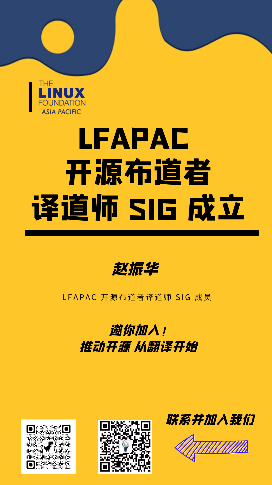

# History

## 2023年
### 11月21日 Hyperledger Fabric 2.5 中文文档上线

### 1月12日 《软件材料清单（SBOM）与网络安全准备度》深度解读直播，观看量接近10000人

直播地址：InfoQ视频号
主持人：
王一鹏 InfoQ 极客传媒总编辑
嘉宾：

1. 赵振华，Linux Foundation APAC开源布道者 译道师SIG组长
2. 杨轩  Linux Foundation APAC 总监
3. 朱贤曼 上海安势信息技术有限公司 架构总监
4. 王永雷  新思科技-Synopsys 开源治理专家

## 2022年

### 12月15日 《深入理解开源项目办公室》翻译完成，对外发布。深入理解开源项目办公室

### 12月12日 《技术债务与开源开发》翻译完成，对外发布

### 11月28日 《软件材料清单（SBOM）与网络安全准备度》翻译完成，对外发布

### 9月7日 开始 **The Evolution of the Open Source Program Office (OSPO)** 翻译

### 9月5日 联合InfoQ举办《企业开源指南》报告深度解读直播，观看量超过5000

主持人：
王一鹏 InfoQ 极客传媒总编辑
嘉宾：

1. 赵振华 深圳市启锐信息技术有限公司 CEO
2. Keith Linux亚太区策略总监、CNCF中国区总监
3. 李建盛（适兕）， 《开源之迷》作者，“开源之道”主创
4. 庄表伟 开源社理事
5. 郭浩 开放原子基金会高级顾问

### 8月24日 启动 **A Deep Dive Into Open Source Program Offices** 翻译工作

该eBook与《企业开源指南》为同一作者，**Ibrahim Haddad**，该request来自作者本人。

### 8月8日 《企业开源指南》中文版正式发布

### 8月5日 开始***Technical Debt and Open Source Development***翻译工作

### 7月20日 开始组织***Software Bill of Materials (SBOM) and Cybersecurity Readiness***的翻译  

### 7月13日 制作译道师志愿者招募海报，继续招募志愿者

海报有志愿者**耿航**贡献。
Sample

### 7月6日 正式命名**译道师**

7月6日SIG会议上，正式确定**译道师**作为SIG中文名称。该名称由开源社刘天栋贡献。

- **译** - 翻译、解译
- **道** - 开源之道
- **师** - 传道、授业、解惑者

### 2022-06-01 SIG成立

6月1日 翻译SIG成立，赵振华任组长，李建盛任副组长。开始招募志愿者，以及征集SIG正式名称。并有赵振华开始翻译[A Guide to Enterprise Open Source](https://8112310.fs1.hubspotusercontent-na1.net/hubfs/8112310/LF%20Research/LF%20Research%20Guide%20to%20Enterprise%20Open%20Source.pdf)。
