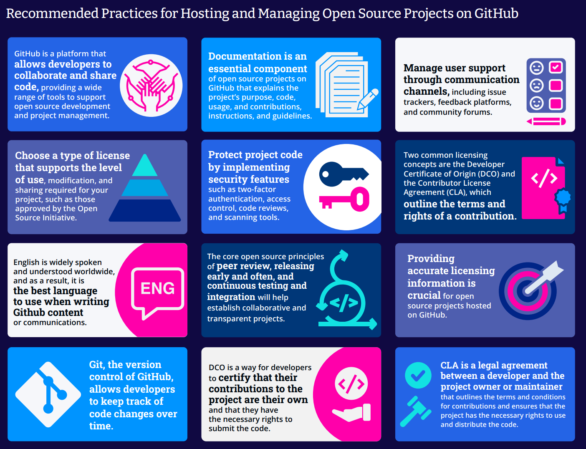

Recommended Practices for Hosting and Managing

Open Source Projects on GitHub

**March 2023**

**Ibrahim Haddad, Ph.D.**

**Vice President, Strategic Programs (AI & Data)**

**The Linux Foundation**

**Foreword by Jeff McAffer**
**Senior Director of Product**
**GitHub**

 Recommended Practices for Hosting and Managing Open Source Projects on
 GitHub

