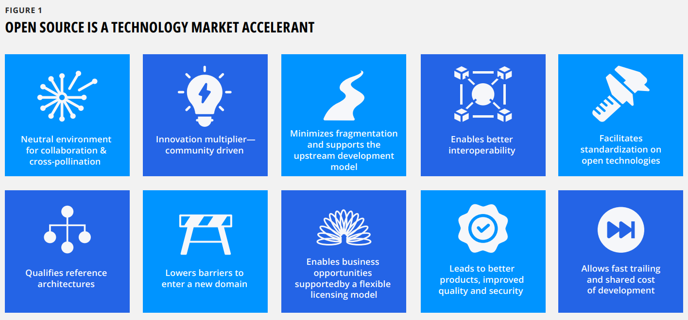
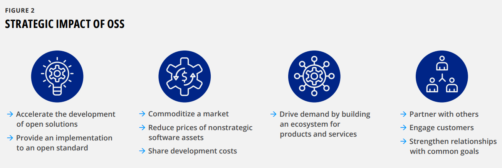
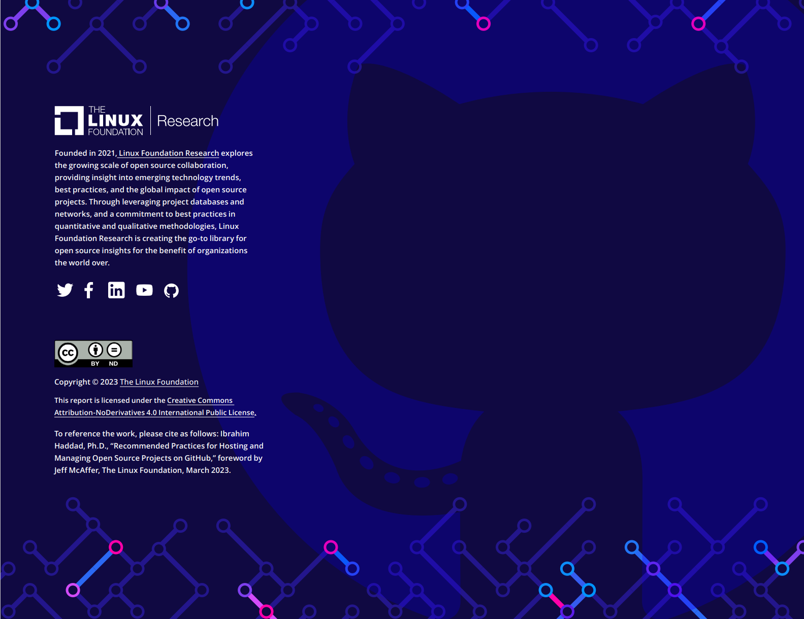

Recommended Practices 

for Hosting and Managing

Open Source Projects on GitHub

在GitHub上托管并管理开源项目的实践推荐

**March 2023**

**2023年3月**

**Ibrahim Haddad, Ph.D.**

**Ibrahim Haddad 博士**

**Vice President, Strategic Programs (AI & Data)**

**The Linux Foundation**

**Linux 基金会 战略项目（AI & Data）副总裁**

**Foreword by Jeff McAffer**

**前言作者 Jeff McAffer**

**Senior Director of Product**

**GitHub**

**GitHub 高级产品总监**


 Recommended Practices for Hosting and Managing Open Source Projects on
 GitHub

 在GitHub上托管并管理开源项目的实践推荐

GitHub is platform that **allow developer to collaborate and share code ,**providing a wide range to tools to support open source development and project management.

GitHub 是一个**支持开发者协作和共享代码**的平台，提供了各种各样的工具来支持开源开发和项目管理。

**Documentation is an essential component** of open source projects on GitHub that explains the project's purpose,code,usage,and contritions,instructions,and guidelines.

**文档是 GitHub 开源项目的重要组成**，介绍了项目的目的、代码、应用、贡献、说明和指南等信息。

**Manage user support through communication channels**,including issue trackers,feedback platforms,and community forums.

**通过沟通渠道管理用户支持**，包括问题跟踪、用户反馈平台和社区论坛。

**Choose a type of license that support the level of use**，modification,and sharing required for your project,such as those approved by Open Source Initiative.

**选择一种满足项目需求的使用**、修改和共享级别的许可证类型，例如开放源代码促进会批准的许可证。

**Protect project code by implementing security features** such as two-factor authentication,access control,code reviews,and scanning tools.

**通过实现安全功能来保护项目代码**，如双因素身份验证、访问控制、代码审查和扫描工具等。

Two common licensing concepts are Developer Certificate of Origin (DCO) and the Contributor License Agreement (CLA),which **outline the terms and rights of a contribution.**

关于许可有两个常见的概念，分别是开发者原创声明（DCO）和贡献者许可协议（CLA），它们**声明了贡献的条款和权利。**

English is widely spoken and understood worldwide, and as a result,it is **the best language to use when writing GitHub content** or communications.

英语在世界各地广泛使用和理解，因此，它是**编写 GitHub 内容和沟通时使用的最佳语言。**

The core open source principles of **peer review,releasing early and often,and continuous testing and integration** will help establish collaborative and transparent projects.

**同行评审、快速和频繁发布、持续测试和集成**的核心开源原则将有助于建设协作和透明的项目。

**Providing accurate licensing information is crucial** for open source projects hosted on GitHub.

对于托管在 GitHub 上的开源项目而言，**提供准确的许可信息至关重要。**

**Git,the version control of GitHub,allows developers to keep track of code changes over time.**

**Git 作为 GitHub 使用的版本控制工具，支持开发人员跟踪代码随时间的变化。**

DCO is a way for developers to **certify that their contributions to the projects are their own** and that they have the necessary rights to submit the code.

DCO是开发人员**证明他们对项目的贡献属于自己**，并且他们有提交这些代码的必要权利的一种方式。

**CLA is a legal agreement between the developer and the project owner or maintainer** that outlines the terms and conditions for contributions and ensures that the project has the necessary rights to use and distribute the code.

**CLA是开发人员与项目所有者或维护人员之间的一项法律协议**，明确了贡献的条款和条件，并确保项目拥有使用和分发代码的必要权利。

```text
Contents
Foreword.................................................................................................................................................................4
Abstract...................................................................................................................................................................5
Introduction..........................................................................................................................................................6
Documentation....................................................................................................................................................8
Support channels...............................................................................................................................................9
Security ................................................................................................................................................................ 10
Licensing .............................................................................................................................................................. 11
General Licensing Recommendations ....................................................................................................................................... 11
DCOs and CLAs........................................................................................................................................................................................... 12
Language ..............................................................................................................................................................13
Adopt core open source principles .........................................................................................................13
Peer review................................................................................................................................................................................................... 13
Release early and often......................................................................................................................................................................... 13
Continuous testing and integration ............................................................................................................................................. 14
Conclusion............................................................................................................................................................15
Endnotes ...............................................................................................................................................................16
Acknowledgments...........................................................................................................................................16
Linux Foundation resources .....................................................................................................................16
Feedback ...............................................................................................................................................................16
About the author............................................................................................................................................... 17

目录
序言 .............. 4
摘要 ............ 5
引言 ........... 6
文档 .................... 8
支持渠道 . 9
安全 ............. 10
许可证 .............. 11
常规许可证推荐 ................ 11
开发者贡献协议 (DCOs) 和贡献者许可协议 (CLAs) ............. 12
语言 ............... 13
遵循核心开源原则 ..... 13
代码同行评审 ... 13
尽早并频繁发布版本  13
持续测试和集成 ........ 14
结论 ............ 15
注释 ............ 16
致谢 ........... 16
Linux 基金会资源 .... 16
反馈 ............ 16
关于作者 ................. 17
```

## Foreword

## 前言

While open source principles are relatively straightforward, "getting it right" can be challenging. Open source sits at the intersection of technology, community, business, and personal identity, so it stands to reason that some amount of tooling and rigor---best practices---will help smooth the path to success.


虽然开源原则相对简单,
但是"正确实施"就具有挑战性了;
开源位于技术/社区/商业和个人身份的知识跨界点,
因此，很显然，使用一些工具，总结一些经验（最佳实践）将有助于铺平通往成功的道路;

 In my time as the Director of the Microsoft Open Source Programs Office (OSPO), the company evolved from having a few hundred developers and repos on GitHub to having tens of thousands of each. We moved from *ad hoc* operations to formal but still manual processes to near-full automation of our presence on GitHub and from project communities of dozens to thousands. We developed a ton of tools and best practices to smooth that path.


在我担任微软开源项目办公室(OSPO)主任期间,
公司从拥有数百名开发者发展到和 GitHub 中每个代码仓库都有上万名开发者;
我们也从临时操作迁移为正式但是仍需手动的流程,
再到我们在 GitHub 上的操作几乎全部自动化,
从数十个到数千个项目社区;
我们开发了大量工具和最佳实践来铺平这一道路;

 My move to work at GitHub nearly five years ago was meant to bring some of those tools and learnings to the GitHub product and, ultimately, you, the open source developers of the world. Today, GitHub has many facilities and possibilities, from discussions to actions / checks, packages, and releases, to security, that help you and your project. I can't even list them all.

将近五年前, 我在 GitHub 工作的目标
是将其中一些工具和知识带入 GitHub 产品中, 
并最终带给你以及世界上的开源开发者们;
今天,
GitHub 有很多工具和可能性,
从讨论到操作/检验/打包和发布, 再到安全性,
都可以帮助你和你的项目;
在此就不做逐一列举;

 Successful open source is as much about people and communities as it is about the code. With this article, Ibrahim applies his long history in open source to create a jumping-off point for you to make the most of your open source efforts on GitHub. Using the best practices outlined here will help you create a secure, robust, and vibrant community around your project. GitHub supplies much of the infrastructure, and you provide the innovation and community.


成功的开源不仅仅是代码,
还涉及到人与社区;
在这篇文章中, Ibrahim 用他在开源领域的丰富经历为你的开源旅程打造了一个开端,
以便在 GitHub 上充分开展你的开源成果;
本篇简述的最佳实践将引导你围绕项目创建一个安全、强大且充满活力的社区;
GitHub 提供大部分基础设施,
而你将在这基础上开展创新和运营社区;

See you in a repo.

我们在仓库中见。

**Jeff McAffer GitHub**

**Jeff McAffer GitHub**

## Abstract

## 摘要

 Open source software (OSS) has transformed our world and become the backbone of our digital economy and the foundation of our digital world. Today, OSS powers the digital economy and enables scientific and technological breakthroughs that improve our lives. From the Internet and the mobile apps we use daily to the operating systems and programming languages we use to build the future, OSS has played a vital role. It is the lifeblood of the technology industry.

开源软件(OSS)改进了我们的世界,
成为我们数字经济的支柱以及数字世界的基础;
如今 OSS 为数字经济提供动力,并实现改善我们生活的科技突破;
从我们日常使用的互联网和移动应用程序,
到我们用来构建未来的操作系统和编程语言,
OSS 都发挥了至关重要的作用;
OSS 是科技行业的命脉;

 The use of GitHub for open source development has become increasingly popular in recent years, providing a platform for collaboration and sharing code.

近年来, 使用 GitHub 进行开源开发越来越流行,
在这里提供了一个协作和共享代码的平台;

 Managing an open source project on GitHub can become less challenging with proper guidelines. This paper provides an overview of best practices for using GitHub for open source development. By following
 these practices, open source developers can improve the organization, understandability, and collaboration of their projects on GitHub, making it easier for other developers to adopt and contribute.

通过适当的指导, 在 GitHub 上管理开源项目会变得不那么具有挑战性;
本文概述了使用 GitHub 进行开源开发的最佳实践;
依照指示,通过这些实践, 
开源开发者可以改进他们在 GitHub 上的项目组织/可理解性以及协作,
使其它开发者更容易就项目采用和贡献;

## Introduction

## 引言

 The availability of OSS is changing how organizations develop and deliver products. A transparent development community and access to public source code enable organizations to think differ- ently about procuring, implementing, testing, deploying, and main- taining software (**FIGURE 1**).
 
 开源软件（OSS）的可用性正在改变组织开发和交付产品的方式。透明的开发社区和对公共源代码的访问使组织能够以不同的方式思考采购、实施、测试、部署和维护软件（图1）。

 OSS has created an ecosystem with many benefits for all involved. Organizations across industries are building and growing their open source operations under an OSPO to help use and contribute to open source projects more efficiently and effectively and to benefit from its strategic impact (**FIGURE 2**).
 
 开源软件创建了一个生态系统，为所有参与者都带来许多好处。各行业的组织都 OSPO 的领导下在建立和发展其开源运营，以便更有效地使用和贡献开源项目，并从其战略影响中受益（图2）。

OSS allows shared development and lowers research and development costs by enabling organizations to reap the benefit of billions of dollars of OSS, which they can harness to create better products and services. In addition, it helps to accelerate product development and enables a faster time to market by aligning business needs with upstream open source projects. Organizations do not get involved in open source projects because it is fun; they do it because it is a part of their business or product strategy.

开源软件促进了共享开发，并通过使组织能够利用价值数十亿美元的开源成果，降低了研发成本，从而创造出更优质的产品和服务。此外，它还有助于加快产品开发速度，并通过与上游开源项目对齐商业需求，缩短上市时间。组织参与开源项目并非仅仅因为其趣味性；而是因为这是它们商业或产品战略的一部分。



 **FIGURE 1**

 **OPEN SOURCE IS A TECHNOLOGY MARKET ACCELERANT**

 **开源是技术市场的加速器**

- Neutral environment for collaboration & cross-pollination
- 中立的协作与交流环境
- Innovation multiplier community driven
- 创新倍增社区驱动
- Minimizes fragmentation and supports the upstream development model
- 最小化碎片化并支持上游开发模式
- Enables better interoperability
- 促进更好的互操作性
- Facilitates standardization on open technologies
- 促进开放技术的标准化
- Qualifies reference architectures
- 确立参考架构
- Lowers barriers to enter a new domain
- 降低进入新领域的门槛
- Enables business opportunities supportedby a flexible licensing model
- 通过灵活的许可模式开启商业机会
- Leads to better products, improved quality and security
- 带来更优质的产品、提升质量和安全性
- Allows fast trailing and shared cost of development
- 允许快速试错和共享开发成本

  

 **FIGURE 2**

**STRATEGIC IMPACT OF OSS**

**开源软件的战略影响**

- Accelerate the development of open solutions
- 加速开放解决方案的开发
- Provide an implementation to an open standard
- 为开放标准提供实施
- Commoditize a market
- 商品化市场
- Reduce prices of nonstrategic software assets
- 降低非战略性软件资产的价格
- Share development costs
- 共享开发成本
- Drive demand by building an ecosystem for products and services
- 通过为产品和服务构建生态系统来推动需求
- Partner with others
- 与他人合作
- Engage customers
- 吸引客户
- Strengthen relationships with common goals
- 加强具有共同目标的关系

 Where does most open source development happen? **GitHub**. GitHub is a crucial platform for open source development. It is a web-based hosting service that uses the Git version control system to allow developers to collaborate and share their code.

 大多数开源开发发生在哪里？**GitHub**。GitHub 是开源开发的关键平台。它是一个基于网络的托管服务，使用 Git 版本控制系统，允许开发者协作和共享他们的代码。

 It provides a centralized platform for open source developers to store, manage, and track changes to their codebase and collaborate on development efforts with other contributors.

 它为开源开发者提供了一个集中平台，用于存储、管理和跟踪代码库的变更，并与其他贡献者协作开发工作。

 One of the critical advantages of GitHub is that it allows developers to easily share their code with others, making it simple for others to contribute, review, and merge changes. It is a powerful tool for open source development, as it enables developers to work together on large-scale projects, regardless of their physical location. GitHub also provides a platform for community building and collaboration by allowing users to create open source projects, create and manage issues, and communicate with other developers via pull requests (PRs) and comments.

 GitHub的一个关键优势在于它允许开发者轻松地与他人共享代码，使得其他人能够简便地贡献、审查和合并更改。它是开源开发的一个强大工具，因为它使开发者能够无论身处何地都能在大规模项目上共同工作。GitHub还提供了一个社区建设和协作的平台，允许用户创建开源项目，创建和管理问题，并通过拉取请求（PRs）和评论与其他开发者沟通。

 Additionally, GitHub provides a wide range of tools and features tailored to open source developer's needs. It includes features such as project management tools, code review functionality, packaging, release, deployment capabilities, and built-in integration with other developer tools such as continuous integration services, making it an all-in-one platform for open source development.

 此外，GitHub提供了大量针对开源开发者需求定制的工具和特性。这些包括项目管理工具、代码审查功能、打包、发布、部署能力，以及与其他开发者工具（如持续集成服务）的内置集成，使其成为开源开发的全方位平台。


 This paper will discuss recommended practices to help you improve your GitHub presence to attract more users and developers to your projects.

 本文将讨论推荐实践，帮助您提升GitHub上的存在感，以吸引更多用户和开发者参与到您的项目中。

## Documentation

## 文档

 Clear and detailed documentation is crucial for open source projects hosted on GitHub. It helps to ensure that the project is easy to understand and use for other developers, which can increase the number of contributors and users. Good documentation should include an overview of the project\'s purpose, usage instructions, and any dependencies or requirements. It should also include detailed explanations of the code, its workings, and any known issues or limitations. Having clear documentation can make it easier for other developers to understand the project and make contributions. It can also make it easier to maintain the project over time, as developers will better understand how the code works and can confidently make changes. Additionally, good documentation makes it easier for users to know how to use the software and troubleshoot any issues they may encounter.

 对于托管在GitHub上的开源项目来说，清晰而详细的文档至关重要。它有助于确保其他开发人员易于理解和使用该项目，从而增加贡献者和用户的数量。良好的文档应包括项目目的概述、使用说明以及任何依赖关系或要求。它还应包括代码、工作原理和任何已知问题或限制的详细解释。清晰的文档可以让其他开发人员更容易理解项目并做出贡献。同时，它也可以更容易地维护项目，因为开发人员将更好地了解代码的工作原理并可以自信地进行更改。此外，良好的文档可以帮助用户了解如何使用软件并解决可能遇到的任何问题。

 An open source project can provide different types of documentation to help users and developers of its community. Historically, documentation has been an area that requires improvements. However, the situation is improving, with many projects having excellent documentation covering all areas of the projects.
 开源项目可以提供不同类型的文档来帮助其社区的用户和开发人员。历史上，文档一直是需要改进的领域。但是，情况正在改善，许多项目都有覆盖项目所有领域的优秀文档。

 In the following subsections, we highlight three core areas where documentation is essential.
 在下面的子节中，我们重点介绍了文档至关重要的三个核心领域。


1. Project

1. 项目

    a.  Mission

    a.  任务

    b.  Governance

    b.  治理

    c.  Community structure

    c.  社区结构

    d.  Release cadence

    d.  发布节奏

    e.  Road map and priorities

    e.  路线图和优先

    f.  Use cases

    f.  使用案例

    g.  FAQs
    
    g.  常见问题解答（FAQ）


2. Documentation targeted for users

2. 针对用户的文档

    a.  User guide and tutorials

    a.  用户指南和教程

    b.  API guide

    b.  API 指南

    c.  Architecture overview

    c.  架构概述

    d.  Installation guide

    d.  安装指南

    e.  Feature request and security vulnerability reporting process

    e.  功能请求和安全漏洞报告流程

    f.  Experience sharing section

    f.  经验分享部分


3. Documentation targeted for developers

3. 针对开发人员的文档

    a.  Detailed architecture and mapping to code sub-systems services when
    applicable

    a.  详细的架构和代码子系统服务映射（当适用时）

    b.  Development process

    b.  开发过程

    c.  Getting involved

    c.  参与其中

    d.  Guidelines for participation

    d.  参与指南

    e.  Feature request process

    e.  功能请求流程

    f.  Patch submission process

    f.  补丁提交流程

    g.  Signed-off-by process, when applicable

    g.  签名流程（当适用时）

    h.  Developer guides and tutorials

    h.  开发人员指南和教程

    i.  API guide

    i.  API 指南


### Recommendations

### 建议

1. Use the [REPOLINTER](https://github.com/todogroup/repolinter)tool, created by the [TODO Group](https://todogroup.org/)^1, to identify common issues in GitHub repos.

1. 使用由 [TODO Group](https://todogroup.org/)^1创建的 [REPOLINTER](https://github.com/todogroup/repolinter)工具来识别GitHub存储库中的常见问题。

2. Add a README.md file welcoming new community members to the project and explaining why the project is worthwhile and how to begin.

2. 添加一个README.md文件，欢迎新的社区成员加入项目，并解释为什么该项目很有价值以及如何开始。

3. []{#_bookmark4 .anchor}Add a [CONTRIBUTING.md](https://docs.github.com/en/communities/setting-up-your-project-for-healthy-contributions/setting-guidelines-for-repository-contributors) file explaining how to contribute to the project. The file explains the types of contributions required and how the process works.

3. []{#_bookmark4 .anchor}添加一个[CONTRIBUTING.md](https://docs.github.com/en/communities/setting-up-your-project-for-healthy-contributions/setting-guidelines-for-repository-contributors)文件解释如何对项目进行贡献。该文件解释了所需的贡献类型以及流程如何运作。 

4. Add a [CODEOWNERS](https://docs.github.com/en/repositories/managing-your-repositorys-settings-and-features/customizing-your-repository/about-code-owners) file to define individuals or teams respon- sible for code in a repository.

4. 添加一个[CODEOWNERS](https://docs.github.com/en/repositories/managing-your-repositorys-settings-and-features/customizing-your-repository/about-code-owners)文件, 来定义存储库中负责代码的个人或团队。

5. Add a [CODE\_OF\_CONDUCT.md](https://docs.github.com/en/communities/setting-up-your-project-for-healthy-contributions/adding-a-code-of-conduct-to-your-project) file that sets the ground rules for participants' behavior and helps facilitate a friendly, welcoming environment. The CODE \_ OF \_ CONDUCT.md file signals that this is a welcoming project to contribute to and defines standards for engaging with the project's community.

5. 添加一个[CODE\_OF\_CONDUCT.md](https://docs.github.com/en/communities/setting-up-your-project-for-healthy-contributions/adding-a-code-of-conduct-to-your-project)文件, 设置参与者行为的规则，帮助促进友好和热情的环境。CODE_OF_CONDUCT.md文件表明这是一个欢迎贡献的项目，并定义了与项目社区互动的标准。

6. Add a [SECURITY.md](https://docs.github.com/en/code-security/getting-started/adding-a-security-policy-to-your-repository) file that tells users how to report secu- rity issues in the project.

6. 添加一个[SECURITY.md](https://docs.github.com/en/code-security/getting-started/adding-a-security-policy-to-your-repository) 文件, 告诉用户如何报告项目中的安全问题。

7. Provide documentation on the release methodology, cadence, criteria, etc.

7. 提供有关发布方法、频率、标准等的文档。

8. Document your project governance, and make it available on the project's repo.

8. 记录项目治理，并在项目的存储库中提供。

 GitHub provides the ability, at the organization level, to automatically apply such community health files to any repo created within the org. To learn more, please visit [GitHub Docs](https://docs.github.com/en/communities/setting-up-your-project-for-healthy-contributions/creating-a-default-community-health-file).
 
 GitHub在组织级别提供了自动应用此类社区健康文件到任何在组织内创建的存储库的能力。要了解更多信息，请访问[GitHub Docs](https://docs.github.com/en/communities/setting-up-your-project-for-healthy-contributions/creating-a-default-community-health-file)文档。

## Support channels
## 支持渠道

 Good user support is essential to maintaining an open source project on GitHub. Below, we provide recommended practices for open source projects to provide better support for their community:

良好的用户支持对于在GitHub上维护开源项目至关重要。接下来，我们为开源项目提供一些推荐的做法，以便为其社区提供更好的支持：

1. Create a [SUPPORT.md](https://docs.github.com/en/communities/setting-up-your-project-for-healthy-contributions/adding-support-resources-to-your-project) file that details how people can get help with your project(s).

  创建一个[SUPPORT.md](https://docs.github.com/en/communities/setting-up-your-project-for-healthy-contributions/adding-support-resources-to-your-project) 文件，提示用户如何对你的开源项目提供支持。

2. Create detailed and well-organized documentation: This can include instructions on installing and using the project, trou- bleshooting tips, and examples of everyday use cases.

创建详细的、思路清晰的文档，包括：项目安装文档、使用文档、故障排除技巧，以及日常使用的示例。

3. Use the issue tracker: This allows users to report bugs, request features, and ask for help. Responding promptly and providing precise and detailed responses can help to build trust and credibility with users.

 使用问题跟踪器：它允许用户报告错误、请求新功能，以及寻求帮助。及时响应，并提供准确详细的回复，有助于在用户之中建立信任和树立权威性。

4. Be open to feedback and suggestions: Encourage users to provide feedback, and actively seek feedback through surveys or interviews; this can help you understand what users want and how to improve your project.

 乐于接受反馈和建议：鼓励用户提供反馈，并通过调查或问卷等方式积极地寻求反馈；这可以帮助你了解用户的需求，以及如何改进你的项目。

5. Communicate actively and transparently: Using a blog, news- letter, or social media to share progress, road maps, and updates about your project can help users to know what\'s happening and how to plan for future changes.

积极沟通，使项目透明化：可以使用博客、新闻发布或社交媒体等，来分享项目的进展、路线图和更新等，帮助用户了解项目的当前进展，以及未来的计划和规划。

6. Use [GitHub Discussions](https://github.com/features/discussions) to support and engage with your users and developers. Projects use GitHub Discussions. It can help build a community around the project and provide an easy way for users to get help and connect with other users.

使用[GitHub Discussions](https://github.com/features/discussions)链接项目的用户和开发人员，并与之互动。使用GitHub讨论，可以帮助你围绕项目建立一个社区，并提供了一种简单的方式，方便用户获得帮助，并与其他用户沟通。

7. Set up an easy-to-find and access help center: a centralized location where users can find answers to common questions, submit support tickets, and contact the core developers.

建立帮助中心，且要易于查找、易于访问：放在一个集中的位置，方便用户查询常见问题的答案、提交支持票以及联系核心开发人员。

8. [Archive inactive repos](https://docs.github.com/en/repositories/archiving-a-github-repository/archiving-repositories) so that the users and developers know the repos are no longer receiving support.

设置一个[Archive inactive repos](https://docs.github.com/en/repositories/archiving-a-github-repository/archiving-repositories)，对不活跃的代码进行归档，这样用户及开发者就知道这些代码库已经不再提供帮助。

9. Consider adding a [FUNDING.md](https://docs.github.com/en/repositories/managing-your-repositorys-settings-and-features/customizing-your-repository/displaying-a-sponsor-button-in-your-repository) file to let users know how they can support your project.

考虑添加一个 [FUNDING.md](https://docs.github.com/en/repositories/managing-your-repositorys-settings-and-features/customizing-your-repository/displaying-a-sponsor-button-in-your-repository)筹集资金的文档，让用户知道如何支持你的项目；

 By following these practices, open source projects hosted on GitHub can provide better support, resulting in a more successful and sustainable project.
 
 通过遵循这些实践，可以使得托管在GitHub上的开源项目得到更好的支持，从而使项目更加成功和可持续。

## Security
## 安全

 Implementing security measures for GitHub organizations is vital to protect the code and data of the organization\'s projects. Below, we provide a few recommendations focused on security measures for GitHub organizations:
 
 对GitHub施加一些安全措施，对于保护组织项目的代码和数据至关重要。下面，我们提供了一些针对GitHub组织的安全措施建议：

1. Two-factor authentication (2FA): [Enabling 2FA](https://docs.github.com/en/authentication/securing-your-account-with-two-factor-authentication-2fa) for all organiza- tion members helps add an extra security layer to the organi- zation\'s accounts.

对所有组织成员进行双因子身份验证（2FA）[Enabling 2FA](https://docs.github.com/en/authentication/securing-your-account-with-two-factor-authentication-2fa)，给组织的帐户添加额外的安全层。

2. Access control: Use GitHub\'s built-in access control features, such as roles and teams, to limit who has access to the orga- nization\'s repositories and what actions they can perform.

访问控制：使用GitHub内置的访问控制功能（例如角色和团队），来限制有权访问组织代码库的人员，并对他们的行为权限进行约束。

3. Use [GitHub Branch Protection Rules](https://docs.github.com/en/repositories/configuring-branches-and-merges-in-your-repository/defining-the-mergeability-of-pull-requests/about-protected-branches) and CODEOWNERS files to ensure that every change to your repos has been reviewed by the right people.

使用[GitHub Branch Protection Rules](https://docs.github.com/en/repositories/configuring-branches-and-merges-in-your-repository/defining-the-mergeability-of-pull-requests/about-protected-branches)（Github分支保护规则）和CODEOWNERS（代码所有者）文件来确保对代码库的每一个更改都经由合适的人来审查。

4. Secure code reviews: Implement a code review process that includes security checks, such as static code analysis, to iden- tify and fix any potential vulnerabilities in the code.

代码安全审查：构建代码审查流程，包括安全检查，如静态代码分析，以识别和修复代码中的任何潜在漏洞。

5. Continuous integration & deployment (CI / CD): Use CI / CD tools like GitHub Actions or CircleCI to automate the building, testing, and deployment of code, allowing for faster identification and fixing of security issues.

持续集成和部署 (CI / CD)：使用GitHub Actions或CircleCI等CI/CD工具，自动编译、测试和部署代码，从而更快地识别和修复安全问题。

6. Use [GitHub Code Scanning](https://docs.github.com/en/code-security/code-scanning/automatically-scanning-your-code-for-vulnerabilities-and-errors/about-code-scanning) to find vulnerabilities in your code.

使用[GitHub Code Scanning](https://docs.github.com/en/code-security/code-scanning/automatically-scanning-your-code-for-vulnerabilities-and-errors/about-code-scanning)（Github代码扫描），以发现代码中的安全漏洞。

7. Use dependency security scanning tools: Run tools like GitHub\'s Dependabot, Snyk, etc. to find vulnerabilities in packages, libraries, and other third-party code you depend on.

使用依赖项安全扫描工具：使用GitHub的Dependabot、Snyk等工具来查找项目的依赖包、库和其他第三方代码中的漏洞。

8. Employee security training: Enroll in security practices training provided by your organization.

进行员工安全培训：参加组织提供的安全实践培训。

9. Achieve and maintain the [ OpenSSF Best Practices Badge](https://bestpractices.coreinfrastructure.org/en) for the open source project. The OpenSSF Best Practices Badge recognizes and encourages open source projects that follow best security and vulnerability management practices. Projects that earn the badge will have demonstrated that they have a security policy, a vulnerability reporting process, and a method for handling reported vulnerabilities. By having the badge, projects indicate that they take security seriously and that users and contributors can trust that the project addresses vulnerabilities responsibly.

获得项目的 [OpenSSF最佳实践徽章](https://bestpractices.coreinfrastructure.org/en)并保持。 OpenSSF最佳实践徽章，认可并鼓励开源项目遵循最佳安全策略和漏洞管理规范。项目获得徽章，可以证明它们有相关的安全策略、漏洞的报告流程和漏洞的处理方法。通过获得徽章，可以表明该项目确实在认真对待安全问题，使得用户和贡献者相信该项目已经负责任地解决了漏洞。

10. Identify who on the project will handle security issues (could be a team). Create a SECURITY.md file, and set up an email account to receive security vulnerability alerts.

在项目中，明确谁（也可能是一个团队）来处理安全问题。创建一个SECURITY.md文件，并设置一个电子邮件帐户以接收安全漏洞的警报。

11. Use [GitHub Security Advisories](https://docs.github.com/en/code-security/security-advisories/repository-security-advisories/about-repository-security-advisories) to track, manage, and publish responses to vulnerabilities found in your project.

采用[Github安全咨询](https://docs.github.com/en/code-security/security-advisories/repository-security-advisories/about-repository-security-advisories)来跟踪、管理和公开项目中发现的漏洞的响应方式。

12. Use GPG to [sign commits](https://docs.github.com/en/authentication/managing-commit-signature-verification/about-commit-signature-verification) locally so you can mark them as verified on GitHub. Other people can be confident that the changes come from a trusted source.

使用GPG在本地[签署提交](https://docs.github.com/en/authentication/managing-commit-signature-verification/about-commit-signature-verification)，以便你可以在GitHub 上将它们标记为已验证。使得其他人可以确信，这些更改来自可信的来源。

13. The [OpenSSF scorecard](https://securityscorecards.dev/) helps maintainers improve their security best practices, and open source consumers judge whether the software dependencies are safe. Scorecard assesses several heuristics associated with software security and assigns each check a score of 0 to 10. You can use these scores to understand specific areas to strengthen the secu- rity posture of the project.

使用[OpenSSF记分卡](https://securityscorecards.dev/)帮助项目维护人员改进他们的最佳安全实践，并帮助开源项目使用者判断软件依赖项是否安全。使用记分卡评估与软件安全相关的几种方法，并为每个检查项打分（从0到10）。你可以使用这些分数来了解特定领域的安全方法，以加强项目的安全态势。

 By implementing these practices, organizations and individuals can help protect their code and data and keep their projects on GitHub safe and secure. Security is an ongoing process, and there is a need to continuously update and reinforce security measures.
 
 通过采取这些方式，可以帮助组织和个人保护他们的代码和数据，并确保他们在GitHub上的项目安全可靠。安全是一个持续的过程，需要不断更新和加强安全措施。

## Licensing
## 许可

### General licensing recommendations
### 通用许可推荐

 The license of an open source project determines the rights to use, copy, modify, and distribute the code. The choice of license is essential in determining the project\'s openness. Open source projects are recommended only to use licenses approved by the Open Source Initiative and recognized as "free / libre" by the Free

 Software Foundation. Such licenses allow the software to be freely used, modified, and shared. To be approved by the Open Source Initiative, a license must go through its license review process to confirm that it satisfies its Open Source Definition (OSD). You may come across many other licenses that are incompatible with the OSD. Most of these licenses are "Source Available" licenses that commonly include restrictions or limitations on software use and distribution. These restrictions often render the licenses incom- patible with the OSD.
 
 开源项目的许可证决定了使用、复制、修改和分发代码的权利。许可证的选择直接影响到项目的开放性。建议开源项目只使用开源促进会（OSI）批准并被自由软件基金会认定为“免费/自由”的许可证。
 
 此类许可证允许软件自由使用、修改和共享。要获得 OSI 的批准，许可证必须通过其许可证审查流程，以确认其符合开源定义（OSD）。您可能会遇到许多与 OSD 不兼容的其他许可证。这些许可证大多是“源可用”许可证，通常包括对软件使用和分发的约束或限制。这些限制通常会使许可证与 OSD 不兼容。

 Below is a list of recommended practices that open source projects can adopt to help provide accurate licensing information:
 
 以下列表提供了开源项目可以采纳的推荐做法，能够帮助提供准确的许可信息：

1. Include a LICENSE.md file in a conventional location (e.g., at the root of the repository): The file should specify the terms and conditions for using, distributing, and modifying the software.

2. Use [OSI-approved open source licenses](https://opensource.org/licenses/alphabetical): These licenses have been widely reviewed and used, which makes them more accessible for developers to understand and comply with. In addition, GitHub has a convenient "choose a license" facility that makes it easy to use the most common OSI-approved licenses when creating your repos.

3. Include the license information in your REAMDE.md file: Include a note in the REAMDE.md file that specifies the project\'s license and provides a link to the LICENSE.md file.

4. Mark any third-party code: If the project contains third-party code, clearly mark it, and include information on the license of the third-party code.

5. Use a license badge in your README.md file: Users can quickly see what licenses your project uses by including a license badge in your README.md file.

6. Include a [Software Package Data Exchange](https://spdx.dev/) (SPDX) short-form identifier in a comment at the top headers of each source code file. SPDX is a standard format for communicating the components, licenses, and copyrights associated with soft- ware packages. Open source projects use SPDX to make the license and copyright information more accessible and machine-readable.

7. Ensure GitHub recognizes your license: Your chosen license should appear in the GitHub UI repo summary section. If it does not, it means GitHub could not find or understand your license. Unfortunately, that likely means others cannot as well.

8. Regularly review and update the licensing information to keep it current and accurate.

9. Provide clear guidelines for contributing to the project from a licensing perspective, especially if your project uses a DCO or a CLA (more on that in the next section).

1. 在便捷的位置（例如，在仓库的根目录）包含 LICENSE.md 文件：该文件应指定使用、分发和修改软件的条款和条件。

2. 使用 [OSI批准的开源许可证](https://opensource.org/licenses/alphabetical)：这些许可证已被广泛审查和使用，这使开发人员更容易理解和遵守这些许可证。此外，GitHub有一个方便的“选择许可证”功能，可以在创建仓库时轻松使用最常见的OSI批准的许可证。

3. 在 REAMDE.md 文件中包含许可证信息：在 REAMDE.md 文件中添加一个说明，该说明明确项目的许可证并提供指向 LICENSE.md 文件的链接。

4. 标记所有第三方代码：如果项目包含第三方代码，请明确地标记，并包括第三方代码的许可信息。

5. 在 README.md 文件中使用许可证徽章：通过在 README.md 文件中包含许可证徽章，来让用户直观地看到项目使用的许可证。

6. 在每个源代码文件顶部的头注释中添加[软件包数据交换](https://spdx.dev/)（SPDX）缩写标识符。SPDX 是一种用于沟通软件包相关的组件、许可证和版权的标准格式。开源项目使用 SPDX 使许可证和版权信息可以提升可访问性，并被程序识别。

7. 确保 GitHub 可以识别您的许可证：您选择的许可证应显示在 GitHub 仓库的摘要部分，如果没有显示，则意味着 GitHub 无法找到或理解您的许可证。不幸的是，这可能意味着其他人也一样不能。

8. 定期审查和更新许可信息，以保持其最新和准确。

9. 从许可的角度提供参与贡献项目的清晰指南，尤其是当您的项目启用 DCO 或 CLA 时（下一节将对此进行详细介绍）。

 By following these best practices, open source projects on GitHub can provide accurate licensing information and help developers comply with legal requirements, making it easier for developers to understand and use the software. These practices also help to avoid any legal or compliance issues.
 
 通过遵循这些最佳实践，GitHub上的开源项目可以提供准确的许可信息，并帮助开发人员遵守法律要求，使开发人员更容易理解和使用该软件。这些做法也有助于避免任何法律问题或合规问题。

### DCOs and CLAs
### DCO 与 CLA 

 DCO and CLA are two concepts used in the open source devel- opment on GitHub.
 
 DCO 与 CLA 是在 Github 上进行开源开发所用到的两个概念。

 DCO stands for Developer Certificate of Origin, and it is a way for developers to certify that their contributions to a project are their original work or that they have the necessary rights to submit the code. It happens by adding a \"Signed-off-by\" line to the end of each commit message, which indicates that the developer agrees to the DCO and that they are the original author of the code or have the right to submit it. For instance, the Linux kernel develop- ment process requires all contributors to sign off their code, which indicates the contributor certifies the code as outlined in the [DCO](https://developercertificate.org/).
 
 DCO 指开发者原创认证，是一种开发者证明其对于一个项目的贡献是他们的原创工作，或者他们有提交代码所必需的权限。一般通过在每次提交信息的最后添加一行 \"Signed-off-by\" 来实现，这表示该开发者同意 DCO，表明他们是该代码的原始作者，或者有权提交该代码。举例来说，Linux 内核开发流程要求所有贡献者签署他们的代码，以表明贡献者按照 [DCO](https://developercertificate.org/)中的概述对该代码进行了认证。

 The signature communicates that the contributor has created or received the contribution under an appropriate open source license that allows you to incorporate it into the project's code base under
 the license indicated in the file. The DCO establishes a chain of people responsible for the licensing and provenance of contributions to the project.
 
 签名表明贡献者已经根据适当的开源许可证创建或接受了贡献，该许可证允许你根据文件中指示的许可证将其合并到项目的代码库中。DCO 建立了一个项目许可和贡献出处的责任链。

 A Contributor License Agreement (CLA) is a legal agreement between a developer or their employer and the project owner or maintainer. A CLA outlines the terms and conditions for contrib- uting code to the project, such as the rights and responsibilities of both parties. Open source projects use CLAs to protect them- selves from legal issues that may arise from contributions made by third parties or when a company or organization is developing a project, and there is a solicitation of contributions from outside contributors.
 
 贡献者许可协议（CLA）是一个开发者或其雇主与项目所有者或维护者之间的法律协议。CLA概述了向项目贡献代码的条款和条件，例如双方的权利和责任。开源项目使用CLA来保护他们自己免受法律问题影响，这些法律问题可能来自第三方贡献或公司或正在开发项目的组织，该组织在征集外部贡献者的贡献。

### Recommendations
### 推荐做法

1. Include a copy of or reference to the DCO in your CONTRIBUTING.md file.

2. Set up a bot to enforce a "Signed-off-by:" tag in each commit. For example, you can install the [GitHub DCO app](https://github.com/apps/dco) to manage this aspect.

3. For projects hosted in the Linux Foundation or any umbrella foundations, use The Linux Foundation EasyCLA tool ([https://lfcla.com/](https://lfcla.com/)) to enforce signed CLAs before accepting contributions.

4. For projects hosted and managed by their founders, consider using [CLA Assistant](https://cla-assistant.io/). The recommendation is that employees consult with their corporate counsel on the most appropriate ways to handle CLAs.


1. 在 CONTRIBUTING.md 文件中包含一份 DCO 的拷贝或者引用链接。

2. 配置一个机器人，在每个提交中强制加上“签署”标签。比如，可以安装 [GitHub DCO app](https://github.com/apps/dco) 来管理这方面的事务。

3. 对于托管在 Linux 基金会或其下属基金会的项目，使用 Linux 基金会的 EasyCLA 工具 ([https://lfcla.com/](https://lfcla.com/)) 在接受贡献前强制签署 CLA 。

4. 对于由发起方自行托管的项目，可考虑使用  [CLA 助手](https://cla-assistant.io/)。建议员工向公司法务咨询处理 CLA 的最佳方式。

## Language
## 语言 

##  语言

 At the Linux Foundation, we work with open source projects from around the globe. Some projects come to the Linux Foundation for hosting from countries where English is not the official language. Much of the project's documentation on GitHub is sometimes not provided in English. Our recommendation has always been to use the English language for any content published on GitHub targeted at a global audience. It is the most common language in software development and open source communities. When a project makes available documentation in English, it can be easily under- stood and utilized by a much larger audience.
 
  Linux 基金会与来自全球各地的开放源码项目都有合作。Linux 基金会托管的一些项目的所属国家并不以英语为官方语言。GitHub 上的许多项目文档也没有英文版。我们一直建议在 GitHub 上发布的面向全球受众的内容都使用英语。英语是软件开发和开源社区中最常见的语言。一个项目提供英文版文档，它可以被更多的受众轻松理解和使用。

在Linux基金会，我们与来自全球各地的开源项目合作。一些项目是从英语不是官方语言的国家来到Linux基金会进行托管的。该项目在GitHub上的大部分文档有时不是用英语提供的。我们一直建议在GitHub上发布的任何面向全球受众的内容都使用英语。它是软件开发和开源社区中最常见的语言。当一个项目提供英文文档时，它可以很容易地被更多的受众所理解和使用。


### Adopt core open source principles
### 采用核心开源原则

### 采用核心开源原则

 Open source development is a collaborative approach to software development in which the source code is freely available for anyone to use, modify, and distribute. A defining characteristic of the development process is openness throughout the entire life cycle, from design to release. All aspects of the development process, including design, planning, implementation, testing, and release, are transparent and open to contributions from the wider community. This allows for a collaborative approach to software development, where individuals and organizations can share their expertise, knowledge, and resources to create high-quality software that meets the needs of a diverse set of users.
 
 开源开发是一种协作性的软件开发方式，源代码可以轻松地被所有人使用、修改和发布。开发过程的一个显著特征就是开放性贯穿从设计到发布的整个生命周期。开发过程中的设计、规划、实施、测试和发布等等所有方面都是透明的，并接受广大社区的贡献。这些特征使得软件开发可以以协作的方式进行，个人和组织可以分享他们的专长、知识和资源，以能满足不同用户的需求创造高质量的软件。

开源开发是一种软件开发的协作方法，其中源代码可供任何人自由使用、修改和发布。开发过程的一个决定性特征是从设计到发布的整个生命周期的开放性。开发过程的所有方面，包括设计、规划、实施、测试和发布，都是透明的，并向更广泛的社区开放。这允许软件开发的协作方法，个人和组织可以共享他们的专业知识、知识和资源，以创建满足不同用户需求的高质量软件。

 Core concepts of open source development that enable the collab- orative aspect at scale include peer review, release early and release often, and continuous testing and integration.
 
 能促成规模化的协作的开源开发的核心概念包括同侪审查、早发布并常发布、持续测试和集成等。

开源开发的核心概念能够实现大规模的协作，包括同行评审、尽早且频繁发布，以及持续的测试和集成。

- Peer review is having other developers review and critique the code, which helps improve the quality of the software.

- 同侪评审是指让其他开发者对代码进行审查和评论，这有助于提高软件的质量。

- Release early and release often is a strategy for making software available to users as soon as possible, with frequent updates and improvements.

- 早发布常发布是一种使软件尽早面世的策略，软件上线后进行频繁的更新和改进。

- Continuous testing and integration is constantly testing and integrating new code changes, which helps to identify and fix bugs early in the development process.

- 持续测试和集成是不断测试和集成新提交的代码，这有助于在开发过程中及早发现和修复错误。

 These concepts work together to create a collaborative, trans- parent, and efficient approach to software development. In the next subsections, we will explore how GitHub supports these core open source development concepts via various features that enable large-scale implementation of these concepts.
 
 这些概念构成了一种协作的、透明的、高效的软件开发方法。在接下来的小节中，我们将探讨 GitHub 如何通过各种功能来阐释这些核心的开源开发理念的，而这些功能就是这些理念的大规模工程实践。

#### Peer review

#### 同行评审

 The peer review practice reduces variations in style, prompts valuable conversations, and preserves the project's quality standards. GitHub manages it through the PR feature. A PR is a way for developers to submit changes they have made to a project\'s code for review by other collaborators. With the creation of a PR, other collaborators can review the code changes, leave comments, and approve or request changes before there is a merger of the code into the proj- ect\'s main branch. To ensure peer review, it is recommended that the owner of the GitHub org adjusts the settings and enables the [branch](https://docs.github.com/en/repositories/configuring-branches-and-merges-in-your-repository/defining-the-mergeability-of-pull-requests/about-protected-branches#require-pull-request-reviews-before-merging)
 
 同侪审查减少了风格上的差异，引发了有价值的对话，并保持了项目的质量标准。GitHub 通过 PR 功能对其进行管理。PR 是一种让开发者提交他们对项目代码所做的修改，供其他合作者审查的方式。通过创建 PR，其他合作者可以审查变更的代码，进行评论，并在代码合并到项目的主分支之前批准或要求修改。为了确保有同侪审查的流程，建议 GitHub 组织的所有者修改设置，开启[分支](https://docs.github.com/en/repositories/configuring-branches-and-merges-in-your-repository/defining-the-mergeability-of-pull-requests/about-protected-branches#require-pull-request-reviews-before-merging)。

 [protection rules](https://docs.github.com/en/repositories/configuring-branches-and-merges-in-your-repository/defining-the-mergeability-of-pull-requests/about-protected-branches#require-pull-request-reviews-before-merging) (either for the org or specific report) to require a PR.
 
 [保护规则](https://docs.github.com/en/repositories/configuring-branches-and-merges-in-your-repository/defining-the-mergeability-of-pull-requests/about-protected-branches#require-pull-request-reviews-before-merging)(无论是对组织还是特定的报告)，都需要一个PR。

同行评审做法减少了风格上的差异，促进了有价值的对话，并保持了项目的质量标准。GitHub通过PR功能进行管理。PR是开发人员提交他们对项目代码所做的更改以供其他合作者审查的一种方式。通过创建PR，其他合作者可以在代码合并到项目的主要分支之前审查代码更改、留下评论、批准或请求更改。为了确保同行评审，建议GitHub组织的所有者调整设置并启用[分支](https://docs.github.com/en/repositories/configuring-branches-and-merges-in-your-repository/defining-the-mergeability-of-pull-requests/about-protected-branches#require-pull-request-reviews-before-merging)[保护规则](https://docs.github.com/en/repositories/configuring-branches-and-merges-in-your-repository/defining-the-mergeability-of-pull-requests/about-protected-branches#require-pull-request-reviews-before-merging)（针对组织或特定报告）以对PR做出要求。

#### Release early and often
#### 早发布常发布

 "Release early and often" is an OSS development philosophy that advocates for frequent and incremental releases of a project.

“尽早且频繁发布”是OSS的一种开发理念，提倡项目的频繁和增量发布。

 GitHub supports this development approach in open source projects through [branches](https://docs.github.com/en/pull-requests/collaborating-with-pull-requests/proposing-changes-to-your-work-with-pull-requests/about-branches) and [releases](https://docs.github.com/en/rest/releases?apiVersion=2022-11-28).
 
GitHub通过[分支](https://docs.github.com/en/pull-requests/collaborating-with-pull-requests/proposing-changes-to-your-work-with-pull-requests/about-branches) 和[发布](https://docs.github.com/en/rest/releases?apiVersion=2022-11-28)在开源项目中支持这种开发方法。

By using a development branch for ongoing work and a separate release branch for stable, production-ready code, developers work on new features and bug fixes in the development branch and periodically merge the changes into the release branch.
 
 通过使用一个开发分支来处理正在进行的工作，一个单独的发布分支来处理稳定的、可用于生产的代码，开发人员在开发分支中处理新的功能和错误修复，并定期将这些变更合并到发布分支中。


 Another way is using feature branches, where developers create a new branch for each feature or bug fix they are working on. Once the work on a feature branch is complete, its merger into the development branch and eventually into the release branch can take place.
 
 另一种方法是使用特性分支，即开发人员为他们正在开发的每个特性或错误修复创建一个新的分支。当某个特性分支的工作完成后，就可以将其合并到开发分支，并最终合并到发布分支。

 Additionally, GitHub has a feature called releases, which allows packaging, tagging, and the distribution of software versions. This feature can mark specific versions of the code as a release and provide a way for users to download and use the release version. Users can also view the release notes and see the changes made in each release.
 
 此外，GitHub 还有一个叫做发布的功能，可以对软件版本进行打包、标记和发布。这个功能可以将特定版本的代码标记为发布版本，并为用户提供下载和使用发布版本的途径。用户还可以查看发布说明，并查看每个版本的变更。

通过使用一个开发分支进行正在进行的工作，使用一个单独的发布分支进行稳定的、可用于生产的代码，开发人员在开发分支中处理新功能和错误修复，并定期将更改合并到发布分支中。

另一种方法是使用功能分支，开发人员为他们正在处理的每个功能或bug修复创建一个新的分支。一旦功能分支的工作完成，就可以合并到开发分支，并最终合并到发布分支。

此外，GitHub还有一个称为release的功能，它允许打包、标记和发布软件版本。此功能可以将代码的特定版本标记为release版本，并为用户提供下载和使用发布版本的方式。用户还可以查看release notes，并查看每个发行版中所做的更改。

#### Continuous testing and integration

#### 持续测试和集成

 Continuous testing and integration in GitHub are managed through a combination of tools, such as [GitHub Actions](https://github.com/features/actions) and other CI / CD tools.
 
 GitHub 的持续测试和集成是通过一系列工具来管理的，比如 [GitHub Actions](https://github.com/features/actions) 和其他 CI / CD 工具。

GitHub中的持续测试和集成通过多种工具的组合进行管理，如[GitHub Actions](https://github.com/features/actions)以及其他CI/CD工具。

 GitHub Actions is a feature that allows developers to automate their build and test workflow by creating custom actions triggered by specific events, such as a push to a branch or a PR. With GitHub Actions, developers can set up automated tests and integration steps that run whenever specific events occur. For example, with the creation of a PR, developers can set up GitHub Actions and [Status Checks](https://docs.github.com/en/pull-requests/collaborating-with-pull-requests/collaborating-on-repositories-with-code-quality-features/about-status-checks) to run a suite of tests on the code changes to ensure that they work as expected before merging into the main branch.
 
 开发者可以通过 GitHub Actions 来创建由特定事件（如推送到分支或 PR）触发的自定义动作来实现构建和测试工作流程的自动化。设置好 GitHub Actions 后，开发者可以随时通过事件触发自动化流程。例如，创建 PR 后，开发者可以设置 GitHub Actions和[状态检测](https://docs.github.com/en/pull-requests/collaborating-with-pull-requests/collaborating-on-repositories-with-code-quality-features/about-status-checks)，对代码变更运行一套测试，以确保它们在合并到主分支之前符合预期。

 Another way to manage continuous testing and integration is by using third-party CI / CD tools such as [CircleCI](https://circleci.com/), [TravisCI](https://www.travis-ci.com/), [Jenkins](https://www.jenkins.io/), etc. These tools integrate with GitHub and allow developers to set up a pipeline of tests and integration steps that run automat- ically whenever there are code changes pushed to a repository.
 
 另一种管理持续测试和集成的方法是使用第三方 CI/CD 工具，如 [CircleCI](https://circleci.com/)、[TravisCI](https://www.travis-ci.com/)、[Jenkins](https://www.jenkins.io/)等。借助于 GitHub 与这些工具的集成，开发人员可以设置测试和集成步骤的工作流，当有代码被推送到仓库时就自动运行。

 For example, when there are code changes pushed to the develop- ment branch, the CI / CD tool can automatically run tests, build and deploy the code to a staging environment, and then run additional tests to ensure that everything is working as expected before deploying to production.
 
 例如，当有代码被推送到开发分支时，CI/CD 工具可以自动运行测试、构建并部署代码到预发布环境，然后运行其他的测试，以确保在部署到生产之前一切都符合预期。

 Additionally, many third-party tools offer various testing options, such as unit testing, integration testing, and end-to-end testing, which allows for testing different aspects of the application. The design of both GitHub Actions and third-party CI / CD tools makes the continuous testing and integration process as seamless and efficient as possible.
 
 此外，许多第三方工具提供了各种测试选项，如单元测试、集成测试和端到端测试，从而可以测试应用程序的不同方面。GitHub Actions 和第三方 CI/CD 工具的设计使持续测试和集成过程变得尽可能地无缝和高效。

GitHub Actions是一项功能，允许开发人员通过创建由特定事件触发的自定义操作（如推送到分支或PR）来自动化构建和测试工作流程。使用GitHub Action，开发人员可以设置自动测试和集成步骤，这些步骤在特定事件发生时运行。例如，通过创建PR，开发人员可以设置GitHub Actions和[Status Checks](https://docs.github.com/en/pull-requests/collaborating-with-pull-requests/collaborating-on-repositories-with-code-quality-features/about-status-checks)对代码更改运行一套测试，以确保它们在合并到主分支之前按预期工作。

管理连续测试和集成的另一种方法是使用第三方CI/CD工具，如[CirleCI](https://circleci.com/)，[TravisCI](https://www.travis-ci.com/)，[Jenkins](https://www.jenkins.io/)等。这些工具与GitHub集成，并允许开发人员建立一个测试和集成步骤的管道，每当代码更改被推送到存储库时，这些步骤都会自动运行。

例如，当代码更改被推送到开发分支时，CI/CD工具可以自动运行测试，构建代码并将其部署到暂存环境，然后运行额外的测试，以确保在部署到生产环境之前一切正常。

此外，许多第三方工具提供了各种测试选项，如单元测试、集成测试和端到端测试，这允许测试应用程序的不同方面。GitHub Actions和第三方CI/CD工具的设计使持续的测试和集成过程尽可能无缝高效。

## Conclusion
## 总结

## 总结

 GitHub plays an essential role in open source development by providing a centralized platform for code collaboration, community building, and project management, making it easy for developers to collaborate on open source projects and bring them to fruition. It is a vital tool that allows developers to share, collaborate, and improve their contribution to the open source ecosystem.
 
 GitHub 在开源开发中起着至关重要的作用，它为代码协作、社区建设和项目管理提供了一个集中的平台，使开发者能够轻松地在开源项目上进行协作并将其付诸实现。它是一个重要的工具，使开发者能够分享、协作和提高他们对开源生态系统的贡献。

 As for getting started, there are several steps individuals can follow to bootstrap their open source development activities on GitHub:
 
 你可以遵循几个步骤来开始你在 GitHub 上的开源开发活动：

1. Start by finding a project that interests you. Look for proj- ects with a transparent development process and an OSI-approved license.

2. Read the project\'s documentation and guidelines. Make sure you understand the project\'s goals and its organization.

3. Create a project fork on GitHub to have a copy of the project to which you can work and submit changes.

4. Make small changes, and submit them as PRs to the upstream project. This process will allow the project maintainers to review your work and provide feedback.

5. Be open to feedback and willing to make changes. Open source development is collaborative, and good communica- tion is critical.

6. Contribute to the project\'s community by answering ques- tions, providing support, and helping new contributors.

7. Look for mentorship opportunities; if you find a maintainer whose work you admire, reach out to them, and ask if they would be willing to mentor you.

8. Keep your fork up to date with the main project by regularly syncing your fork with the original repository.

<br />

1. 首先找到一个你感兴趣的项目。寻找具有透明开发过程和 OSI 批准的许可证的项目。

2. 阅读项目的文档和指南。理解项目的目标和它的组织。

3. 在 GitHub 上复刻一个项目，你就可以在这个项目副本上 提交你的修改了 。

4. 做一些小的改动，并将其作为 PR 提交给上游项目。通过这个过程，项目维护者就可以审查你的工作并提供反馈。

5. 对反馈持开放态度并愿意做出改变。开源开发是协作性的，良好的沟通是关键。

6. 通过回答问题、提供支持和帮助新的贡献者，为项目的社区做出贡献。

7. 寻找被指导的机会；如果你发现一个你欣赏的维护者，请联系他们，并询问他们是否愿意指导你。

8. 通过定期与原始仓库同步，使你的复刻仓库保持有主项目的最新代码。

 We hope you find this paper helpful in providing an overview of best practices for using GitHub for open source development. If you're looking to start working with open source development, head to GitHub, set up an account, and begin!
 
 我们希望本文对使用 GitHub 进行开源开发的最佳实践的概述对你有所帮助。如果你想开始从事开源开发，请前往 GitHub，创建一个账户，然后开始吧！

## Endnotes 
## 尾注

 1 The TODO Group is an open community of practitioners hosted at the Linux Foundation whose goal is to create and share knowledge, collaborate on practices, tools, and other ways to run successful and effective open source initiatives and program offices.

 1 TODO 小组是由一个 Linux 基金会主办的从业者开放社区，其目标是创建和共享知识、合作实践、工具等，以成功有效地运行开源倡议和项目办公室。

## Acknowledgments
## 致谢

 The author would like to express his gratitude to Hilary Carter, Jason Perlow, Melissa Schmidt, and Barry Hall for their invaluable contri- butions to the development of this paper. Special thanks to Jeff McAffer for contributing the Foreword and for his insights and detailed feedback that has played a crucial role in improving this paper. Thank you all for your time and effort. The author also would like to acknowledge the contributions he received via LinkedIn from Sumanta Mukhopadhyay, Phil Coval, and Andreas Fehlner.

 笔者对 Hilary Carter、Jason Perlow、Melissa Schmidt 和 Barry Hall 为本文写作所做出的宝贵贡献表示感谢。特别感谢 Jeff McAffer 对前言的贡献，以及他的见解和详细反馈，这些对改进本文起到了至关重要的作用。感谢大家付出的时间和精力。笔者还想感谢 Sumanta Mukhopadhyay、Phil Coval 和 Andreas Fehlner 通过 LinkedIn 平台提交的贡献。

## Linux Foundation resources
## Linux 基金会资源

- [E-book: A Road Map to Improve the Effectiveness and Impact of Enterprise Open Source Development](https://www.linuxfoundation.org/research/improving-enterprise-os-dev)

- [E-book: A Deep Dive into Open Source Program Offices](https://www.linuxfoundation.org/tools/a-deep-dive-into-open-source-program-offices/): Structure, Roles, Responsibilities, and Challenges

- [E-book: A Guide to Enterprise Open Source ](https://linuxfoundation.org/tools/guide-to-enterprise-open-source/)

- [E-book: Open Source Audits in Merger and Acquisition Transactions](https://www.linuxfoundation.org/resources/open-source-audits-merger-acquisition-transactions/)

- [Linux Foundation Enterprise Guides](https://www.linuxfoundation.org/resources/open-source-guides/)

- [Linux Foundation Open Source Compliance Program](https://compliance.linuxfoundation.org/)

- [TODO Group](http://todogroup.org/)

- [The Software Package Data Exchange](https://spdx.dev/)®

- [Linux Foundation Training & Certification](https://training.linuxfoundation.org/)

- [Linux Foundation Event](https://events.linuxfoundation.org/)s

- [电子书: 提高企业开源开发的有效性和影响力的路线图](https://www.linuxfoundation.org/research/improving-enterprise-os-dev)

- [电子书: 深入开源项目办公室](https://www.linuxfoundation.org/tools/a-deep-dive-into-open-source-program-offices/): 组织架构、角色、职责及挑战

- [电子书: 企业开源指南](https://linuxfoundation.org/tools/guide-to-enterprise-open-source/)

- [电子书: 并购交易中的开源审计](https://www.linuxfoundation.org/resources/open-source-audits-merger-acquisition-transactions/)

- [Linux 基金会企业指南](https://www.linuxfoundation.org/resources/open-source-guides/)

- [Linux 基金会开源合规计划](https://compliance.linuxfoundation.org/)

- [TODO 小组](http://todogroup.org/)

- [软件包数据交换](https://spdx.dev/)®

- [Linux 基金会培训与认证](https://training.linuxfoundation.org/)

- [Linux 基金会活动](https://events.linuxfoundation.org/)

## Feedback
## 反馈

 The author apologizes in advance for any spelling errors or possible errors and is grateful to [receive](https://www.ibrahimatlinux.com/collaboration/) corrections and suggestions for improvements.

 笔者对任何拼写错误或可能的错误提前道歉，并感谢[收到](https://www.ibrahimatlinux.com/collaboration/)更正和改进建议。


## About the author
## 关于作者

Dr. Ibrahim Haddad is the Executive Director of the Linux Foundation AI & Data and the PyTorch Foundation. His primary focus is facilitating a vendor-neutral environment for advancing the open source AI platform.

Ibrahim Haddad 博士是 Linux 基金会 AI&Data 和 PyTorch 基金会的执行董事。他聚焦于促进供应商中立的环境，以推进开源人工智能平台。

 Throughout his career, Haddad held technology and portfolio management roles at Ericsson Research, the Open Source Development Labs, Motorola, Palm, Hewlett-Packard, Samsung Research, and the Linux Foundation. Haddad graduated with honors from Concordia University (Montréal, Canada) with a Ph.D. in computer science.

 Haddad 在其整个职业生涯中，先后在爱立信研究所、开源开发实验室、摩托罗拉、Palm、惠普、三星研究所和 Linux 基金会担任技术和投资组合管理职务。Haddad 以优异成绩毕业于康考迪亚大学（加拿大蒙特利尔），获得计算机科学博士学位。

 LinkedIn: [\@ibrahimhaddad](https://www.linkedin.com/in/ibrahimhaddad/) Twitter: [\@IbrahimAtLinux](https://twitter.com/ibrahimatlinux) Website: [IbrahimAtLinux.com]

 领英: [\@ibrahimhaddad](https://www.linkedin.com/in/ibrahimhaddad/) 推特: [\@IbrahimAtLinux](https://twitter.com/ibrahimatlinux) 网站: [IbrahimAtLinux.com](https://IbrahimAtLinux.com)

 

**Founded in 2021,** [ [ **[Linux Foundation Research [**](https://www.linuxfoundation.org/research/)**explores the growing scale of open source collaboration, providing insight into emerging technology trends, best practices, and the global impact of open source projects. Through leveraging project databases and networks, and a commitment to best practices in quantitative and qualitative methodologies, Linux Foundation Research is creating the go-to library for open source insights for the benefit of organizations the world over.**

**成立于2021的**[Linux 基金会研究团队](https://www.linuxfoundation.org/research/)**探索开源协作规模的日益扩大，洞察新兴技术趋势、最佳实践以及开源项目的全球影响。通过利用项目数据库和网络，及使用定量和定性方法论的最佳实践，Linux 基金会研究团队正在为世界各地的组织创建一个开源洞见的入门库。**

 **Copyright © 2023** [The Linux Foundation](https://www.linuxfoundation.org/)

 **版权所有 © 2023** [Linux 基金会](https://www.linuxfoundation.org/)

 **This report is licensed under the [Creative Commons](https://creativecommons.org/licenses/by-nd/4.0/) [Attribution-NoDerivatives 4.0 International Public License](https://creativecommons.org/licenses/by-nd/4.0/).**

  **本报告使用[署名-禁止演绎知识共享4.0国际公共许可证](https://creativecommons.org/licenses/by-nd/4.0/)。**

 **To reference the work, please cite as follows: Ibrahim Haddad, Ph.D., "Recommended Practices for Hosting and Managing Open Source Projects on GitHub," foreword by Jeff McAffer, The Linux Foundation, March 2023.**

 **请参照以下内容引用本文：Ibrahim Haddad, Ph.D., "Recommended Practices for Hosting and Managing Open Source Projects on GitHub," foreword by Jeff McAffer, The Linux Foundation, March 2023.**

